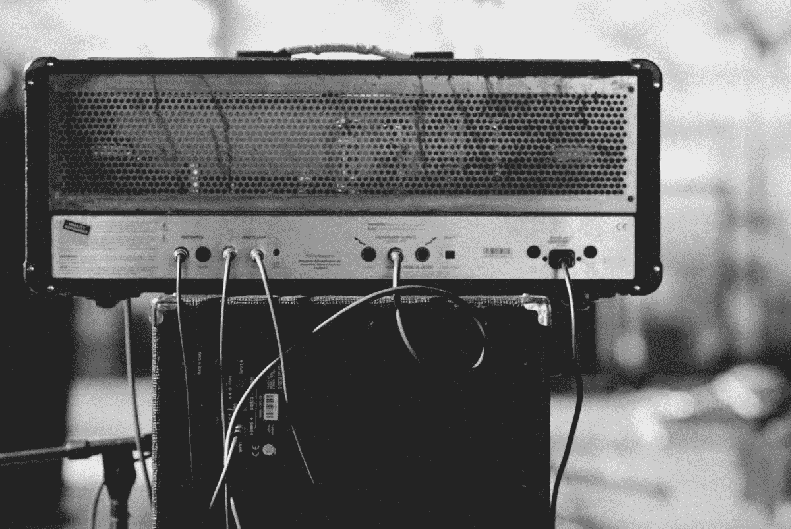

# 你会如何改变音乐营销的世界？你想吗？

> 原文：<https://medium.datadriveninvestor.com/how-would-you-change-the-world-of-music-marketing-would-you-want-to-4b7cd533f84?source=collection_archive---------8----------------------->

Photo by [Kai Oberhäuser](https://unsplash.com/@memoryonsounds?utm_source=unsplash&utm_medium=referral&utm_content=creditCopyText) on [Unsplash](https://unsplash.com/search/photos/rock-band?utm_source=unsplash&utm_medium=referral&utm_content=creditCopyText)

## 如果我可以选择，我会让音乐营销变得更实惠。

成本有两种形式:金钱和时间。

哪个成本让你抓狂？哪个成本更容易获得？

是钱吗？你能向你的配偶证明你偶尔需要花时间推销你的乐队吗？也许是传单？也许是代理人？也许是另一个乐队成员，或者更多的录音设备？

 [## 金融科技初创公司正在扰乱世界各地的银行业-数据驱动的投资者

### 传统的实体银行从未真正从金融危机后遭受的重大挫折中恢复过来…

www.datadriveninvestor.com](https://www.datadriveninvestor.com/2018/10/20/fintech-startups-are-disrupting-the-banking-industry-around-the-world/) 

花时间远离你的音乐，同时不断地营销是令人沮丧的吗？

为了维持正常的生活成本，你必须做几份工作？

我认为没有一个音乐家不会面对这类问题，除非他们足够幸运，可以避免担心。在今天的世界上，有成千上万的梦想家朝着充满挑战的未来一步一步地前进……除非所有的印章都到位，手边有一个标签。否则，我们在希望和希望梦想成真中挣扎，或者我们简单地屈服于现实，在酒店的酒吧里演奏，直到我们离开这个世界。

这是你吗？我真的不知道。我确实觉得“是”的可能性更大。如果这是真的，那我们能做什么？我们如何在这样的压力下成长，在我们的未来建立我们的创造性努力？

在我们的流媒体世界里，音乐家们在工作室度过大量时间后，还能继续获得微薄的报酬吗？在一个转向现场表演来维持生计的世界里。

有一点是肯定的，趋势会发生，并演变成机遇。

*约翰·科尔，*创始人/首席开发者[Muezbiz.com](https://muezbiz.com)

通过向邻居代表支付会员发行音乐的份额，努力将音乐出版业从边缘拯救回来。

[Muezbiz](https://www.muezbiz.com)是一个创业公司。”给你的音乐界公告钉上。发现你家乡的一切音乐，以及家乡的任何地方*“从当地的某个人那里购买按地区过滤的感兴趣的媒体。*

*所有加入的新成员都被转发到圣达菲民间/美国对话社交时间表，以了解网站如何运作。可以通过顶部成员名称下的首选项菜单随时更改默认值。*

更多流浪:

[*muezin…我们今天所知的网络世界会发生变化吗*？](https://medium.com/datadriveninvestor/muezzin-will-we-change-the-online-world-as-we-have-come-to-know-it-772a863df17b)

[*诚实带来美味的蛋糕*](https://medium.com/datadriveninvestor/honesty-inspires-a-fabulous-cake-31318848eede)

[*区域数字内容代表能赚钱吗？绝对的。*](https://medium.com/datadriveninvestor/can-regional-digital-content-reps-make-money-absolutely-5df3460e9b20)

[*启用愿景，鼓励可能性*](https://medium.com/datadriveninvestor/enabling-visions-encouraging-possibility-2171356fd2d7)

[*音乐营销:启用“口碑”*](https://medium.com/@john_cole/music-marketing-enabling-word-of-mouth-7f3451c845da)