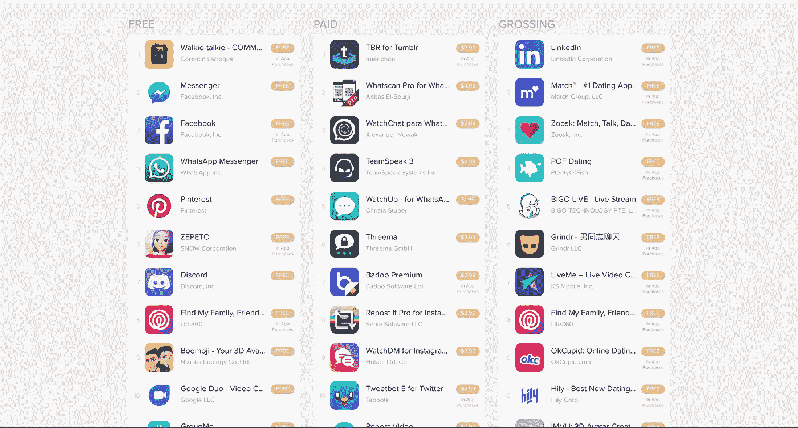
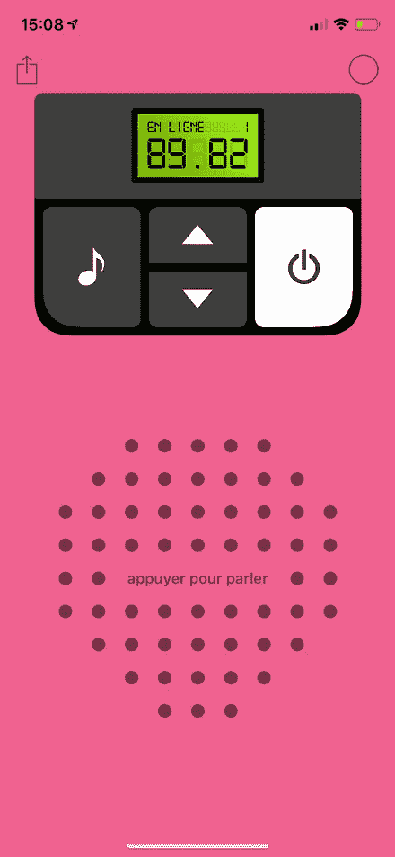
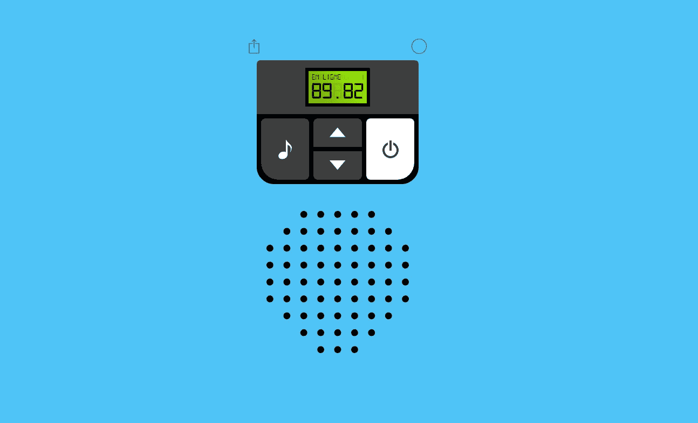
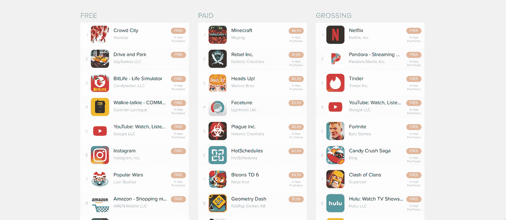
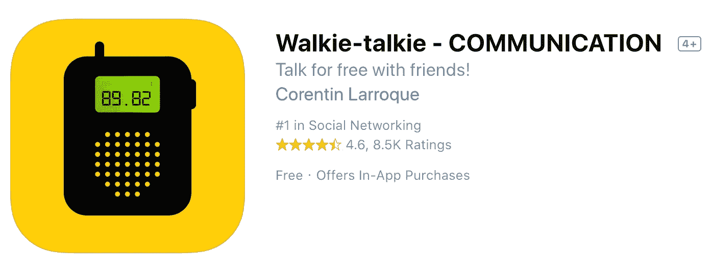

# 如何成为美国应用商店的第一名(用你周末开发的应用)

> 原文：<https://medium.datadriveninvestor.com/how-you-can-hit-1-in-the-u-s-app-store-with-an-app-you-built-over-the-weekend-317d467d8596?source=collection_archive---------6----------------------->

怎么可能呢？！

在 2018 年 12 月 12 日，我们的应用程序 Walkie-Talkie 在美国应用程序商店中名列榜首，在美国排名第 **#1** 社交网络应用程序，以及第 **#4** 整体应用程序。

很快，我们被问我们是如何做到的人淹没了…我们的简单应用程序只是让你和你的朋友交流…我们在周末为了娱乐而开发的…击败了 Instagram、Snapchat 和社交网络世界中其他 800 磅重的大猩猩。

如果我们完全诚实，运气发挥了很大的作用。

但是我们也做了大量的前期工作，帮助我们获得了好运。如果没有这些前期工作，我们永远也不可能以足够快的速度构建我们的应用程序，从而击败竞争对手，成为世界第一的对讲机应用程序。

让我们快速看一下我们是如何做到的，以及你如何能够主宰排名，并使它看起来很容易。

App Store categorie Social Network US

**我们如何在周末打造我们排名第一的应用**

步话机是由科伦丁·拉罗克和我——瓦伦丁·马丁——制造的。我们在 [Voxeet](https://www.voxeet.com/) 工作，在那里我们开发基于 WebRTC 的实时通信 API。借助 Voxeet 的 API，您可以快速轻松地将原生实时视频和音频通话功能集成到您的移动、网络或桌面应用中，而无需任何插件或附件。

我们为我们的产品感到非常自豪，所以当我们看到 Instagram 即将发布对讲机功能时，我们决定在周末尝试使用我们自己的工具创建一个更好的对讲机应用程序，只是为了好玩。

对讲机就是这样诞生的！因为我们已经做了很多工作来开发 Voxeet 的核心 API，所以使用它们来创建一个简单的 iOS 和 Web 应用程序非常容易，而且完全免费，非常容易使用。

一旦我们完成了我们的对讲机应用程序，我们所要做的就是设置它，以便有最好的机会在应用程序商店大卖。

**我们如何在 App Store 中最大化 Walkie-Talkie 的存在**

从技术角度来看，我们知道我们已经建立了世界上最好的对讲机应用程序。但我们也知道这不足以确保在 App Store 中的高排名。

因为在 App Store 的对讲机应用程序排名中接近榜首对我们来说非常重要，所以我们搜索了互联网，以了解商店是如何管理其排名的。

以下是我们学到的关键要点，将对你的应用排名产生最大影响:

*   保持简单。做一个简单的应用，用户可以瞬间理解。
*   保持易取性。让您的 UX 易于每个年龄段的人使用。
*   关键词物质。使用第三方网站为你的应用列表找到最佳关键词(我们使用了 [App Annie](https://www.appannie.com/en/) )。
*   在你的应用名称中也使用关键词。起初，我们将我们的应用程序命名为“**对讲机**”，它做得很好。但是经过进一步的研究，我们将应用程序的名称更新为“**对讲机——通信**”，我们立即获得了更多的下载，因为用户开始更容易找到我们
*   鼓励用户系统地评价你的应用。定义一个指示用户“快乐”的使用场景，并在用户完成该场景后要求用户进行评级。(例如:在他们打开应用程序 X 次之后，或者在他们看到 Y 个屏幕之后，或者在他们成功完成应用程序内的一个操作之后。)

通过将这些因素落实到位，我们知道我们尽了一切努力来帮助步话机取得成功。但是我们不知道我们的前期工作会花我们多长时间！

[https://walkie-talkie.io/89.82](https://walkie-talkie.io/89.82) (iOS left, Web right)

**当你的应用(出乎意料地)起飞时是什么感觉**

我们在 2018 年 10 月 17 日推出了 Walkie-talkie，它很快获得了大约**2000**条评论，平均评价 **4.7** 颗星。

我们觉得这太棒了！

对讲机工作得很好，我们的用户喜欢它，它在排行榜上表现很好。这些是我们用一个周末做的有趣的小应用程序的一些伟大成果。我们还能要求什么呢？

嗯……显然要多得多。

在我们推出 Walkie-talkie 几周后，我们查看了我们的分析，发现大量用户刚刚下载了我们的应用程序。

以下是我们对这一下载潮的反应的精确记录，按顺序排列:

*   “什么他妈的…？!"
*   "好吧，好吧，谁在尝试 DDoS 我们的服务器？"
*   “我们如何阻止这个黑客？”
*   “等等……我们赶紧查一下这些用户是不是真的(以防万一)。”
*   “……搞什么鬼？！？！？！用户是真实的……”
*   “哇，太神奇了！！！!"

用户的大量涌入让我们欣喜若狂，原因有两个。

首先——谁不想开发一款热门应用呢？

其次——尽管用户突然涌入，我们在 Voxeet 的服务器仍然正常运行！我们的后端开发人员进行了一些修改，以满足我们庞大的新用户群，但除此之外，这个意想不到的压力测试证明了我们的开发人员和架构实际上是多么稳固。

**你准备好打造你的头号应用了吗？**

12 个小时后，我们运行了 **100，000** 用户(大部分在美国)。

我们很快就点击了大约 **10，000 条**评论，同时保持了我们的 **4.7** 平均评分。

然后……就发生了。

我们查看了美国的 App Store，发现我们在排名第**第**第**第四，在**社交类排名第**第一。**

App Store Overall US

这对我们来说是难以置信的。我们开发对讲机的乐趣，在我们的空闲时间，只是因为我们认为有些人可能会喜欢使用它。现在我们在这里，坐在美国应用商店的顶端。

回顾过去，很明显，运气和好时机是我们成功的重要因素。

但同样清楚的是，如果我们的应用没有部署 Voxeet 工具提供的清晰声音和坚如磐石的稳定性，它就永远不会取得任何成功。如果您正在寻求将音频和/或视频功能添加到您的应用程序中，并且该应用程序已被证明能够在现实世界中大规模运行，那么请随时联系我们，我们将为您牵线搭桥！

说到这里，我们还有一件事要说。

**感谢**所有留下评论的用户。您的建设性批评帮助我们改进了我们的应用程序，并进一步推动它，您的善意评论让我们微笑。我们用爱建造了对讲机，我们很高兴它能娱乐全世界的人们！

[42.42](http://walkie-talkie.io/42.42) 稍后再聊！😇( [iOS](https://itunes.apple.com/us/app/walkie-talkie-communication/id1438005314) 和 [Web](http://walkie-talkie.io) )

[科伦丁](https://www.linkedin.com/in/corentin-larroque-70874a85)和[瓦伦丁](https://www.linkedin.com/in/valentin-martin-0896a3111/)。