# 基于人力资源的 ML 项目，员工辞职预测

> 原文：<https://medium.datadriveninvestor.com/hr-based-ml-project-employee-resign-prediction-4fecfee5f294?source=collection_archive---------0----------------------->

[](http://www.track.datadriveninvestor.com/1B9E)

# 内容

> 1.介绍
> 
> 2.数据审查
> 
> 3.数据预处理
> 
> 4.数据探索
> 
> 5.建立分类模型
> 
> 6.结果

# 1.介绍

**问题陈述:**一家名为 XYZ 的大公司，在任何给定的时间点都雇佣了大约 4000 名员工。然而，每年大约有 15%的员工离开公司，需要人才市场上的人才库来替代。管理层认为这种人员流失水平(员工离职，要么是自己离职，要么是因为被解雇)对公司不利，原因如下-

1.  前员工的项目被延迟，这使得很难满足时间要求，导致消费者和合作伙伴的声誉受损
2.  为了招募新的人才，必须维持一个相当大的部门
3.  通常情况下，新员工必须接受工作培训和/或给他们时间来适应公司

[](https://www.datadriveninvestor.com/2019/03/03/editors-pick-5-machine-learning-books/) [## DDI 编辑推荐:5 本机器学习书籍，让你从新手变成数据驱动专家…

### 机器学习行业的蓬勃发展重新引起了人们对人工智能的兴趣

www.datadriveninvestor.com](https://www.datadriveninvestor.com/2019/03/03/editors-pick-5-machine-learning-books/) 

因此，管理层与人力资源分析公司签订了合同，以了解他们应该关注哪些因素，从而抑制人员流失。换句话说，他们想知道他们应该对工作场所做出什么改变，才能让大部分员工留下来。此外，他们想知道这些变量中哪一个是最重要的，需要立即解决。

既然你是公司的明星分析师之一，这个项目就交给你了。

**案例研究的目标**你需要使用逻辑回归对流失概率进行建模。由此获得的结果将被管理层用来了解他们应该对工作场所做出什么样的改变，以便让他们的大多数员工留下来。

*出自:*[*https://www.kaggle.com/vjchoudhary7/hr-analytics-case-study*](https://www.kaggle.com/vjchoudhary7/hr-analytics-case-study)

# 2.数据审查

本案例研究中使用的人力资源分析数据集来自 Kaggle。开始时，我们有三个不同的数据框架与同一个案例相关。然后用最好的方式把它们融合在一起。在项目开始时，我们将有一个清晰且唯一的数据框架来研究。我们在数据集上有 29 个变量和 4410 个观察值。

*数据集见:*[*https://www.kaggle.com/vjchoudhary7/hr-analytics-case-study*](https://www.kaggle.com/vjchoudhary7/hr-analytics-case-study)

## 变量和解释

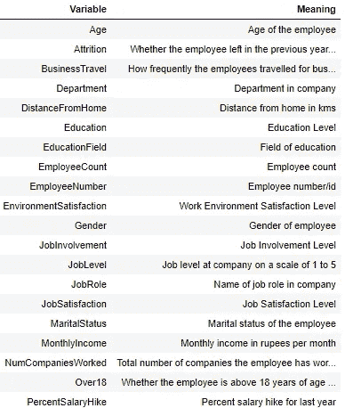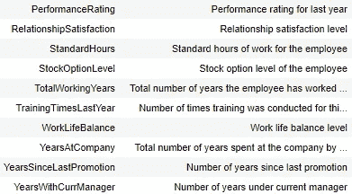

# 3.数据预处理

**在本章**中，我们组合了**‘一般 _ 数据’，【员工 _ 调查 _ 数据’**和**‘经理 _ 调查 _ 数据’**。所有这些都包括公司人力资源部门收集的重要信息。

# 4.数据探索

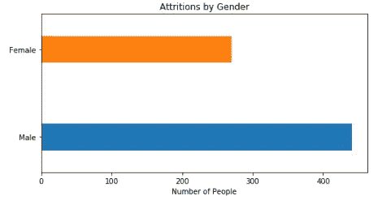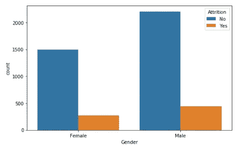

***离职的男女比例大致相同。在这里我们可以看到，性别本身并不是一个指标。我们最初的假设是，这与性别无关。***

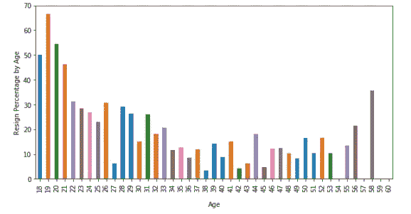

***18 岁到 21 岁之间的员工辞职比例严重偏高。***

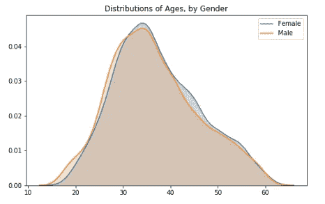

***性别间年龄分布均衡。***


我们没有发现离职员工的年龄和性别之间有任何关联。

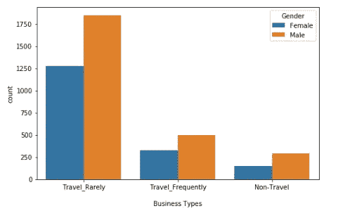

```
Travel Types Percentages: 
 ----------------------------------------
Travel Rarely per.: 70.95 %
Travel Frequently per.: 18.84 %
Non Travel per.: 10.2 %Resign Ratios by Travel Frequency: 
 ----------------------------------------
Travel Rarely per.: 14.96 %
Travel Frequently per.: 24.91 %
Non Travel per.: 8.0 %
```

***在这里，我们看到了一些值得注意的事情，辞职比例最大的属于经常出差的员工。***

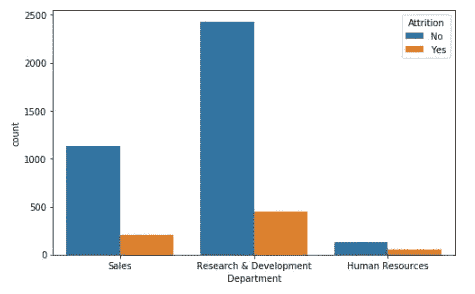

```
Resign Ratios by Departments 
 ----------------------------------------
Research & Development    15.71
Sales                     15.02
Human Resources           30.16Number of Young Employees of Depts.:Research & Development    90
Sales                     30
Human Resources            3
Name: Department, dtype: int64
----------------------------------------
Number of Resigned Young Employees of Depts.:Research & Development    51
Sales                     12
Human Resources            3
Name: Department, dtype: int64
----------------------------------------
Resign Percentage of Young Employees by Departments:Research & Development     57.0
Sales                      40.0
Human Resources           100.0
Name: Department, dtype: float64
```

人力资源部的辞职比例最高。R & D 和销售部门几乎一样。对于年轻员工来说，人力资源部似乎不是一个理想的工作场所。但据我们所知，只有 3 名年轻员工工作。因此，从这些信息中可能得不到最好的结果。顺便说一句，人力资源部的员工相对于其他人来说工资很低。这可能是从人力资源部门辞职的一个重要原因。

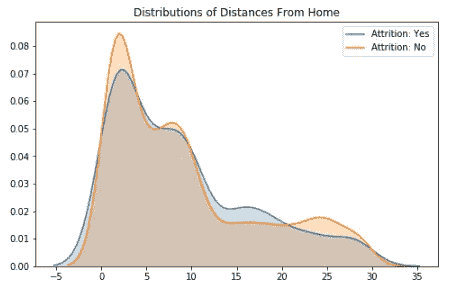

***在这里，看不出磨损和离家的距离之间的相关性。***

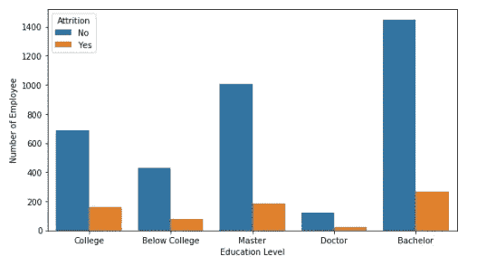

```
Resing Ratios (%) by Education Level
 ---------------------------------------- 
Bachelor         15.56
Master           15.58
College          18.79
Below College    15.29
Doctor           14.58
```

对于所有教育水平的人来说，辞职的比例都差不多，只有大学的比例略有不同，但不会相差太多。

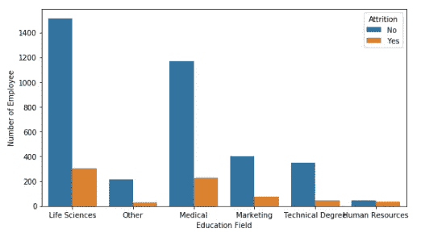

```
Resing Ratios (%) by Education Field
 ---------------------------------------- 
Human Resources     41.0
Life Sciences       17.0
Marketing           16.0
Medical             16.0
Other               12.0
Technical Degree    11.0
```

***人力资源再次拥有最高比率。应该有问题！***

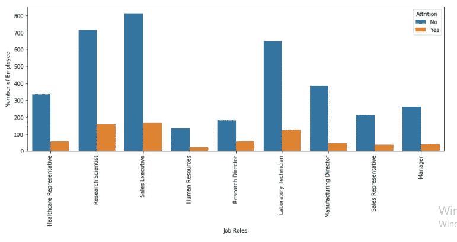

```
Resign Ratios (%) by Job Role
 ---------------------------------------- 
Healthcare Representative    15.0
Human Resources              13.0
Laboratory Technician        16.0
Manager                      14.0
Manufacturing Director       11.0
Research Director            24.0
Research Scientist           18.0
Sales Executive              17.0
Sales Representative         14.0
```

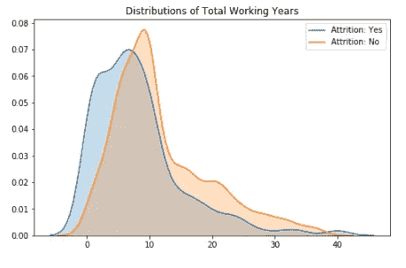

***总工作年限越少的员工离职的可能性越大。***

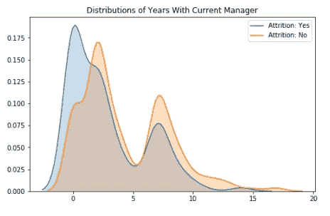

这里出现了同样的想法，年轻的、新的和没有经验的员工的辞职比例最高。

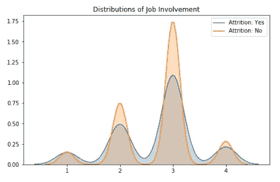

***这里可以看出，第三份工作是不能轻易放弃的。***

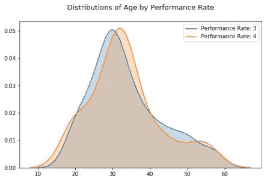

***大部分离职的员工绩效率都比别人低。但是年龄和表现率之间没有一致性。***

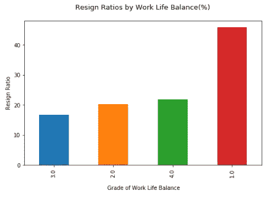

工作与生活平衡度最低的员工辞职的可能性非常高，约为 45%。

# 初步结论:

1.  辞职率是 16%。
2.  性别之间的退出率是平衡的。
3.  性别之间的年龄分布是平衡的。
4.  男女之间的年龄分布是平衡的。
5.  大多数公司很少出差。
6.  人力资源部的辞职率比其他部门高得多。
7.  辞职率主要与教育程度无关。
8.  人力资源领域受过教育的员工更有可能辞职。
9.  研究主管的辞职率高得惊人。
10.  单身者倾向于放弃。
11.  人力资源工资越来越低。
12.  频繁换工作的员工倾向于辞职。
13.  在这家公司，男女之间不存在收入不平等。
14.  缺乏经验的员工倾向于辞职。
15.  在公司工作年限低的员工倾向于辞职。
16.  第一份工作的员工倾向于辞职。
17.  绩效率较低的员工倾向于辞职。
18.  最佳表现率出现在 17-34 岁之间。
19.  环境和工作满意度低的员工倾向于离职。
20.  工作生活平衡度低的员工更倾向于辞职。

# 5.建筑分类模型

## 得到假人

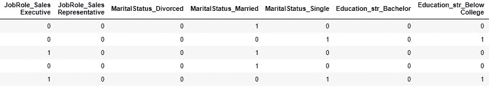

## 特征重要性

要素重要性为数据的每个要素提供一个分数，分数越高，要素对输出变量越重要或越相关。

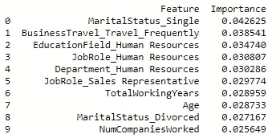

## 绩效结果

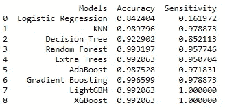

## 逐步添加重要特性的 XGBoost

我设置了一个变量数量较少的新模型，以测试根据重要性排序逐个添加特征会获得多大的准确性和灵敏度。

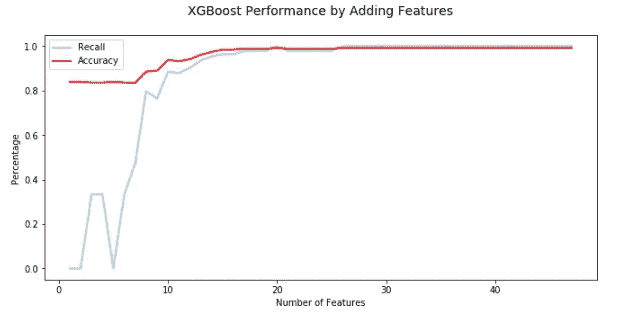

# 6.结果

在这个项目的第一部分，我们不费吹灰之力就做了一次大扫除。我们将目标变量放在中心位置，并对其周围的数据进行了探索。对于这个项目来说，这种探索实际上是不必要的，但是获得关于数据的直觉是很好的。

在那一部分，我们已经有了一些关于特征的结论。在初步结论部分，我们已经清楚地表达了我们的结论。在建立模型之后，我们已经看到许多结论覆盖了我们从 XGBoost 算法中得到的特征重要性结果。

*   年龄
*   婚姻状况
*   旅行频率
*   人力资源
*   工作年限、经验或与现任经理的关系等。
*   满意度(工作、环境)
*   研究主管的情况

在构建模型部分，我们研究了 9 种算法，包括集成方法、逻辑回归、K-最近邻、决策树、随机森林、额外树、adaboost、梯度增强、Lightgbm 和 XGboost。在这个过程中，我们使用 GridSearchCV 来调整许多算法的参数，或者对一些算法使用交叉验证和手动参数调整。然后，所有模型都在新的训练和测试集上进行测试，并测量性能以确保没有过度拟合。

对于模型的准确性和敏感性，我们可以说，他们大多工作得很好。上面给出了数字。在项目的最后，我们实际上已经研究了简单的优化。我们测量了 XGBoost 模型在添加一个新特性时的性能提升，并且每次添加都会得到一个新的模型性能。我们在这里已经看到，如果我们只使用一半的功能，我们会得到相同的结果。这意味着，它可以比完整的模型花费更短的时间。

## ML 代码: