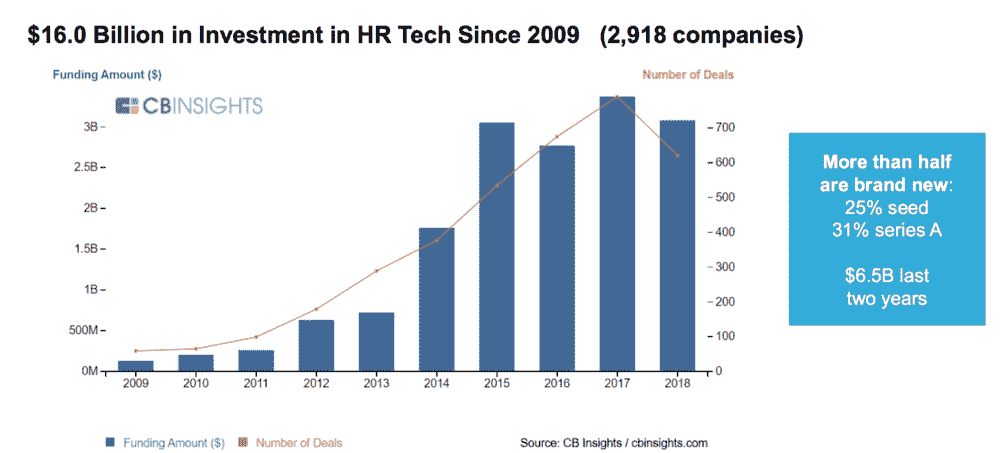

# 人力资源技术——三大创业趋势

> 原文：<https://medium.datadriveninvestor.com/hr-tech-3-major-startups-trends-d2e6181f1de?source=collection_archive---------8----------------------->

自公司成立以来，受政策、经济和文化的影响，人力资源发生了巨大的变化。现在正在发生的变化主要是由技术驱动的，而且是大规模的——初创公司非常处于前沿。尽管 2018 年出现了低迷，这可能是暂时的，但创业公司和风险投资的数量几乎一直在线性增长:

这篇文章将剖析三个主要趋势和代表它们的主要创业公司。

**1)数据和分析——人力资源的“钱球”**

如果数据是新的石油，那么它现在润滑就业的车轮就不足为奇了。从招聘到绩效评估，分析正越来越多地推动决策，而这些决策往往是主观的，容易出现重大差异。[牛顿](http://newton.ai/)扫描你的简历，给出潜在雇主的建议，然后帮你轻松申请相关职位。 [Rocket](http://getrocket.ai/) 提供了类似的价值，只不过更侧重于雇主，帮助他们确定候选人，与他们接触，并完成聘用。Eightfold 具有类似的价值主张，并增加了其他功能，例如集中所有人员数据，包括应用程序跟踪系统、简历和电子表格。这些公司和许多其他初创公司正在重塑招聘的含义，即一种算法辅助的匹配，可以节省候选人和雇主的时间和金钱。

**2)好处——雇主和员工提高工作满意度的技术工具**

说到好处，考虑到人们的需求和期望千差万别，一个标准肯定不适合所有人。例如，考虑一下一个 24 岁的单身男性和一个 57 岁的三个孩子的母亲可能在寻找什么。即使对于最成熟的公司来说，细分劳动力和满足不同的需求也是一项挑战，但现在我们有越来越多的工具来使这一过程更加无缝。以医疗保健为例——大多数美国白领都是通过他们的雇主获得医疗保健的，他们很少是驾驭一个极其复杂系统的专家。[集体健康](https://collectivehealth.com/)是解决方案的一部分，为自保雇主管理员工健康计划提供了一个基于云的平台。 [Jiff](https://www.jiff.com/about-us/) 现在是 Castlight Health 的一部分，帮助识别哪些员工有哪种健康行为，并相应地瞄准福利/奖励。人们越来越重视回馈，认为这是他们职业身份的一部分，而 [Benevity](https://www.benevity.com/) 满足了这一需求，帮助大小公司的员工向非营利组织捐款，并获得企业匹配。

**3)分布式劳动力——新兴世界正在崛起**

这个世界确实变得越来越扁平了——你可以从像 TaskRabbit 和 Upwork 这样多样化的公司中找到优秀的人才。还有很多专注于垂直领域的解决方案，比如面向设计师的 [99designs](https://99designs.com/) 。但围绕管理分布式劳动力的老问题，从有凝聚力的文化到确保高质量，正处于这些对话的前沿。以尼日利亚为中心的安德拉专注于非洲的顶尖技术人才。来自印度的聊天机器人为蓝领工人提供在职培训。这些努力和许多其他努力正在统一全球劳动力，但随着全球竞争力而来的是社会动荡，因为当地人可能无法获得他们原本会填补的工作。创业公司如何帮助改善这些不可避免的后果仍然是一个挑战。

如果你从这篇文章中发现了什么，给个赞吧。有什么想法，请评论。

这些是专注于实践见解的短文(我称之为 GL；dr —良好的长度；确实读过)。如果它们能让人们对某个话题产生足够的兴趣，从而进行更深入的探索，我会感到非常兴奋。我在三星的创新部门 [*NEXT*](http://samsungnext.com/) *工作，专注于深度科技领域软件和服务的早期风险投资，这里表达的所有观点都是我自己的。*