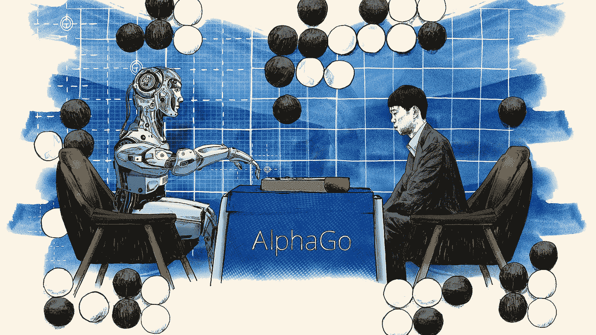
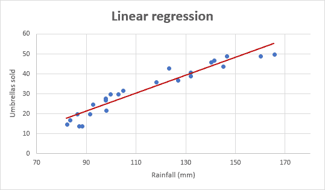
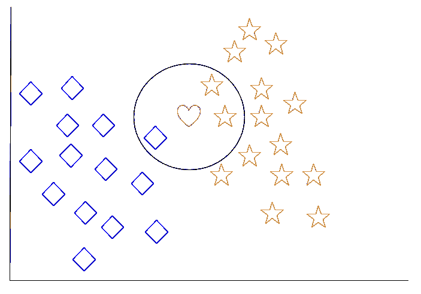
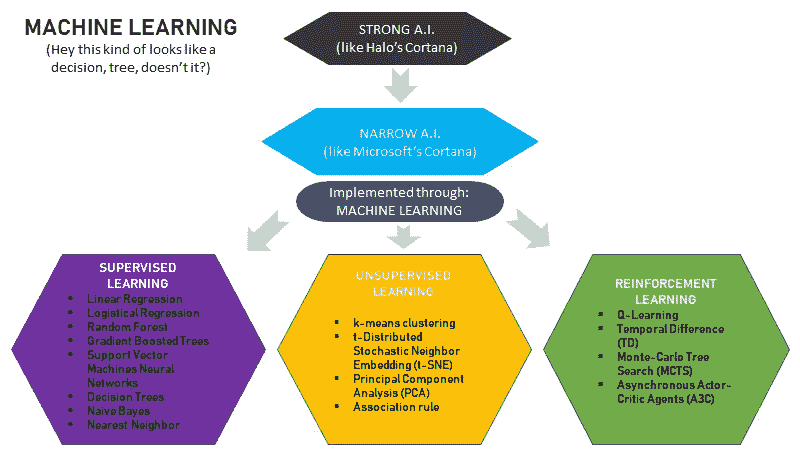

# 了解机器如何学习

> 原文：<https://medium.datadriveninvestor.com/https-medium-com-bdov-learn-how-machines-learn-7ea94e85e7b7?source=collection_archive---------8----------------------->

Source: [https://gameranx.com/features/id/75511/article/nier-automata-wallpapers-in-ultra-hd-4k/](https://gameranx.com/features/id/75511/article/nier-automata-wallpapers-in-ultra-hd-4k/)

人工智能(A.I .)的概念甚至实现绝不是最近的发明，但无论如何，它是一个现代现象。尽责的机器激增了各种形式的流行娱乐，今天为日常软件和技术提供动力的人工智能的实现预示着先进图像处理、无人驾驶汽车等令人兴奋的未来。

人工智能是如何工作的？软件如何能够解释、作用和预测人类行为？很简单，机器是如何学习的？

在这篇文章中，我提供了一个人工智能世界的初学者指南。更具体地说，我介绍了它的实现方法，机器学习。我给出了机器学习的概述和它的方法的例子。最后，我列出了学习更多内容和开始机器学习的资源。

# **人工智能——两种类型**

人工智能的概念对许多人来说相对熟悉，但流行的表述实际上是误导。实际上，存在两种不同类型的人工智能——强人工智能和窄人工智能。

## [*强*](https://www.techopedia.com/definition/31622/strong-artificial-intelligence-strong-ai)*——像光环的 CORTANA*

Source: [https://animefeet.blogspot.com/2014/03/cortana.html](https://animefeet.blogspot.com/2014/03/cortana.html)

强人工智能模仿人脑。这个术语严格来说是一种理论——强人工智能从未真正实现过。然而，强大的人工智能可能是最常见的熟悉，因为流行的娱乐。

《光晕》*视频游戏系列中 Master Chief 的合作伙伴 Cortana 就是这样一个代表——一个虚拟的智能软件，具有人类逻辑、情感和自我意识的全部范围。如果你不熟悉 Cortana，想想你最喜欢的科幻媒介——星球大战*中的友好机器人*，HBO* 的*西部世界*中的自主机器人；可能性是无穷的——你可以认为自己熟悉强人工智能的代表。

## [窄](https://www.techopedia.com/definition/32874/narrow-artificial-intelligence-narrow-ai)——更像微软的 CORTANA

Source: [https://telecomtalk.info/microsoft-windows-10-cortana-release-india-november-10/145182/](https://telecomtalk.info/microsoft-windows-10-cortana-release-india-november-10/145182/)

事实上，现代技术只能实现狭义的人工智能——特定人类认知能力的特定实现。今天存在的任何现有软件或程序实际上都是狭义人工智能的实现。

真正的 Cortana 就是这样一个例子，微软的 Windows 助手程序也是以同样的*光环*人物命名的。微软的 Cortana 提供单一的智能功能——它接收 Windows 用户的命令，并协助该用户执行操作系统的特定功能。然而，在 Cortana 之外，脸书的面部标签、网飞的推荐系统和谷歌的语音转文本只是现代狭义人工智能实现的一小部分。你现在正在阅读这篇文章的设备包括许多狭窄的人工智能功能。

请注意，在上面的每个示例中，都有一个常量格式。面部标记接收输入、照片，并识别该照片中的任何面部。推荐系统查看单个数据块、播放和搜索的媒体信息，以做出推荐。语音到文本接收一个输入，有声单词，并输出它们的文本格式。这种输入-输出、信息分类格式形成了狭义人工智能(机器学习)背后的方法基础。

# 机器学习——我们如何“制造”人工智能。

你可以像思考烹饪一样思考机器学习。当夜晚来临，你饿了，你就有了一个目标——吃晚饭。最初，这个目标太模糊了，所以你必须明确它。晚餐想吃什么？假设你决定吃意大利面。

很好，所以你已经有了一个由多种选择和晚餐组成的目标，并选择实现它的一个特定的、狭窄的实现——意大利面。现在，你需要着手实际获取意大利面。你打算怎么做？你需要一个方法。为了做饭，我们使用烹饪的方法。

机器学习之于人工智能，就像烹饪之于膳食。就像我们不会把烹饪*描述为*饭菜一样，机器学习也不能把*描述为*人工智能。相反，机器学习是我们用来建造人工智能的方法。

一般来说，机器学习是利用现有数据做决策的过程。更具体地说，机器学习是使用统计分析获取数据并产生特定的相应输出的模型训练。

机器学习的目标是生产*模型。*当着手建立一个模型时，首先要提供一个统计算法的初始数据。该数据被称为*训练数据*，并且提供该数据的过程被称为*拟合*模型。一旦模型符合训练数据，它就可以根据已知的信息对未来数据进行预测。

当机器学习产生对人类相关和有用的模型时，它就成功了。有四种重要的机器学习类型:

## 有人监督——比如学习语言

Source: [https://www.educationworld.com/teachers/language-learning-programs-are-getting-smarter](https://www.educationworld.com/teachers/language-learning-programs-are-getting-smarter)

监督学习依赖于标记的，或分类的信息。当输入给用监督学习训练的模型时，它被赋予一组特定的、定义的质量。随着模型建立起一个包含这些合格数据的数据库，它能够根据已经获得的信息对未来的输入进行分类——这种预测分析被称为*回归*。

这种方法与人类对语言的理解没有太大的不同。每种语言都有自己的语音和拼写。当我们从不同的语言中学习单词时，我们学会了发现这些差异。然后，在听到新单词时，我们可以利用我们已知的词汇来修饰这个单词。我们并不总是正确的——例如，我们可能会把一个我们不认识的葡萄牙语单词误认为是西班牙语。然而，在犯了那个错误之后，我们从那时起就知道那个错误的单词是葡萄牙语——换句话说，该信息被分类并添加到我们的“语言”数据库中。

这个类比体现了监督学习背后的理念——模型提供的信息越多，它知道的信息就越多，它就能更好地限定和预测未来的输入。

## 无人监管——就像组装拼图一样

Source: [http://rnrcoffeecafe.com/blog/?p=404](http://rnrcoffeecafe.com/blog/?p=404)

与监督学习相比，正如你可能猜到的，非监督学习依赖于未标记的数据。无监督的模型被提供了一个完整的未分类信息数据集，并带有寻找模式的简单指令，称为*聚类*。

把无监督学习模型想象成一个拼图游戏。当你开始玩拼图游戏时，你把盒子里的所有东西都倒出来。最初，这只是一大堆无法辨认的碎片。要组装拼图，您需要根据特定的特征(边缘碎片、角落碎片、匹配的形状或颜色)构建碎片组，帮助您将它们连接在一起。关注特征以创建聚类类似于无监督学习模型中的*维度缩减*，即过滤掉不相关数据的技术。

值得注意的是，无监督学习的目标不是完成拼图所必需的，而是简单地确定允许对每块拼图进行分类的模式。这个想法是，这样的聚类揭示了分析给定数据集的有用见解。

## 半监督——就像听起来那样

半监督机器学习结合了监督和非监督学习的方法。这对于 web 内容分类以及图像和语音分析等应用程序非常有用，在这些应用程序中，大量数据需要在分类之前进行聚类。

## **强化——像玩电子游戏一样**

Source: [http://www.nintendolife.com/news/2015/08/mario_history_super_mario_world_-_1991](http://www.nintendolife.com/news/2015/08/mario_history_super_mario_world_-_1991)

强化学习致力于创建自我维持的模型，这些模型通过与给定数据集的大量交互来改进。模型利用了一种本质上类似于试一试的*探索/开发*技术。对于模特执行的每一个动作，它都会收到一个相应的*正*或*负的奖励信号*。这个奖励信号被记录下来，这样下次模型与数据交互时，它就知道哪些动作比其他动作更可取。

强化学习最好理解为视频游戏。比方说你在玩一款*超级马里奥*之类的平台化游戏。当你第一次完成一个关卡时，你对布局并不熟悉。可能需要一些时间来弄清楚如何进行，马里奥甚至可能因不合时宜的摔倒或撞击而死亡。

第二次玩那个关卡，就已经接触到布局了。你可能仍然会犯错或者死去，但是你可能会更快地完成它。第三次，甚至更快。到第 20 次时，你已经相当快地完成了这一关。到第 100 次的时候，你已经飞起来了——你确切地知道该期待什么，该做什么。类似地，强化模型基于许多失败的先前迭代来学习与给定数据集交互的最佳方式。

视频游戏可视化不仅仅是一个有用的类比——强化学习模型在视频游戏中直接用于不可玩角色的行为。它们也被用来创建智能棋盘游戏系统，例如著名的 AlphaGo 计算机程序。

Note that AlphaGo is not **actually* a humanoid-shaped robot. Although that would be incredibly awesome. Source:* [https://www.ft.com/content/cada14c4-d366-11e6-b06b-680c49b4b4c0](https://www.ft.com/content/cada14c4-d366-11e6-b06b-680c49b4b4c0)

# 算法——配方

既然我已经介绍了什么是机器学习以及四种重要的类型，那么让我们深入研究训练上述模型背后的实际细节。

请允许我重新介绍一下我的烹饪比喻。回想一下，我们从一个广泛的、一般的目标开始——吃晚餐——然后再具体到一个特定的方法——煮意大利面。在这一点上，我们还没有完全准备好做意大利面。仅仅知道我们需要烹饪是不够的。要真正烹饪意大利面，我们需要一份食谱。

在机器学习中，菜谱可以被认为是*算法*。数据科学家使用从统计学和数学中提取的算法来实现机器学习模型。有许多算法(我们在这里谈论的是统计学术界的整体)，每天都有新的算法产生，但以下是一些与机器学习方法最相关的算法。

## 线性回归——这会影响它吗？

*   **类型**:监督型
*   **目标**:相关性

Source: [https://www.ablebits.com/office-addins-blog/2018/08/01/linear-regression-analysis-excel/](https://www.ablebits.com/office-addins-blog/2018/08/01/linear-regression-analysis-excel/)

线性回归试图确定变量之间的相关性。线性回归模型接收信息或自变量，并确定该信息与特定分类或因变量的相关程度。相关性可以在单个自变量和因变量(简单线性回归)或多个变量(多元线性回归)之间进行计算。

每个独立变量都有一个权重，权重越大的变量表示特定分类的预测值越大。一旦变量之间建立了显著的相关性，经过线性回归训练的模型就可以根据这些加权特征对未来的输入做出预测。

你有没有想过两件事是如何联系在一起的？例如，花在学习上的时间会如何影响考试成绩？或者一天喝多少杯咖啡会影响警觉程度？这种因果问题形成了大量的研究，并且非常适合用线性回归进行测试，从而使其成为最常见和最相关的算法之一。

## k-最近邻—如果它看起来和闻起来都像…

*   **类型**:有人监督
*   **目标**:分类

Source: [https://www.digitalocean.com/community/tutorials/an-introduction-to-machine-learning](https://www.digitalocean.com/community/tutorials/an-introduction-to-machine-learning)

k-最近邻(k-NN)算法基于与现有信息的相似性对输入进行分类。当 k-NN 模型接收到数据时，它会根据数据与其周围的数据或其“邻居”的匹配程度对每个数据进行分组

k-NN 中的“k”是一个变量，表示分类所基于的邻居的数量。例如，在 1-NN 方法中，基于单个最接近的相邻数据对数据进行分类。在 5-NN 方法中，数据基于其五个最近的邻居进行分类-分类是根据这五个邻居的多数特征进行的(请注意，由于分类基于多数规则，因此奇数编号的方法是首选)。

把 k-NN 方法想象成一张地图。如果你试图确定一个国家位于地球的哪个半球，你可以看看它的邻国。例如，使用 1-NN 方法，您可以确定美国位于北半球，因为其最近的邻居之一墨西哥也位于北半球。

然而，请注意，这种 1-NN 方法并不总是有效的。例如，同样位于西北半球的委内瑞拉与(大部分)位于西南半球的巴西接壤。因此，对于这个模型，我们可能希望将 k 变量提高到 3-通过将委内瑞拉不仅与巴西进行比较，还与它的邻国哥伦比亚和圭亚那进行比较，您可以成功地确定它存在于西北半球。

## 决策树——如果这个那么那个

*   **类型**:监督式
*   **目标**:预测/分类

Source: [https://www.codementor.io/benjamincohen/intro-to-machine-learning-nlp-with-python-and-weka-argnk39jr](https://www.codementor.io/benjamincohen/intro-to-machine-learning-nlp-with-python-and-weka-argnk39jr)

决策树是另一种监督学习算法，它基于级联的条件集来确定输入的值。决策树算法获取数据集，并根据相关属性将其拆分为不同的路径。

第一个属性测试代表一棵树的*基*，每个级联路径代表*分支*。每一个可能的最终结果，或者预测的底部点，被称为*叶*。

建立了属性测试树之后，决策树模型可以接受任何输入，并通过在路径中运行来预测其值。例如，在上面的例子中，模型接收一个初始输入，展望，然后可以声明展望将导致一个潮湿，阴天，或大风天。

## 深度学习——虚拟突触

*   **类型**:半监督式
*   **目标**:预测/分类

Source: [http://www.wildml.com/2015/09/implementing-a-neural-network-from-scratch/](http://www.wildml.com/2015/09/implementing-a-neural-network-from-scratch/)

目前机器学习中的热点技术，也是我们最接近(尽管仍然很遥远)的强人工智能，深度学习算法模仿人脑的神经元系统来转换输入。

就像人类大脑在神经元之间发送电信号以执行特定动作一样，深度学习网络由许多不同层的处理单元组成。输入从第一层开始，由每个后续层修改，直到最后被处理和执行。

这种数据转换模型可以处理复杂的输入，因此处于语音和图像识别等机器学习技术的前沿。以语音处理为例。还记得线性回归中的语言识别示例吗？神经网络可以由几层这样的模型组成——一层识别语言，一层解释单词，一层将单词相互联系起来，等等。—在最终理解所表达的语句并执行相应的动作之前。

## 机器学习图:

# 偏见——机器只是人类的创造

机器学习方法正在产生令人难以置信的技术，预示着一个充满可能性的成熟未来，也许有一天，成功实现强大的人工智能。

尽管如此，随着机器学习领域的发展，注意到它目前的缺点是很重要的——特别是偏见。研究证明，偏见在机器学习算法的当前实现中持续存在。例如，2014 年对 LinkedIn 的一项调查显示，推荐工作的算法[比男性](https://www.theguardian.com/technology/2015/jul/08/women-less-likely-ads-high-paid-jobs-google-study)更不太可能向女性广告高薪工作。在 2017 年进行的另一项关于用于对美国囚犯进行分类的风险评估计划的研究中，发现[黑人被告被错误地标记为白人被告再次犯罪的可能性的两倍](https://www.propublica.org/article/machine-bias-risk-assessments-in-criminal-sentencing)。

有了先进的机器学习方法，人们很容易忘记人工智能不是客观的——它是由人类产生的。展望未来，软件开发和机器学习领域增加代表性和雇用多样化的劳动力至关重要。最近的 [2018 Stack Overflow 开发者调查](https://insights.stackoverflow.com/survey/2018/#demographics)显示，当前的软件开发行业在人口统计学上高度倾斜，约 93%为男性，74%为白人或欧洲血统，93%为异性恋。

减少机器学习中的偏见是一个复杂的问题，它源于人类漫长的歧视历史，但始于劳动力中的适当代表性。

# 入门指南

那么，如何才能入门机器学习呢？首先，你需要扎实的数学基础。

Source: [https://towardsdatascience.com/the-mathematics-of-machine-learning-894f046c568](https://towardsdatascience.com/the-mathematics-of-machine-learning-894f046c568)

机器学习方法是真正的统计和数学方法。以下是开始熟悉线性代数和基本统计算法的一些资源:

*   [机器学习的数学](https://towardsdatascience.com/the-mathematics-of-machine-learning-894f046c568)
*   [线性代数简介](https://machinelearningmastery.com/gentle-introduction-linear-algebra/)
*   [Python 中机器学习的搭便车指南](https://medium.freecodecamp.org/the-hitchhikers-guide-to-machine-learning-algorithms-in-python-bfad66adb378)
*   [该用哪种机器学习算法？](https://blogs.sas.com/content/subconsciousmusings/2017/04/12/machine-learning-algorithm-use/)

当你开始熟悉机器学习背后的统计学和数学时，你需要决定使用哪种编程语言。以下是[目前机器学习中最流行的四种语言](https://www.ibm.com/developerworks/community/blogs/jfp/entry/What_Language_Is_Best_For_Machine_Learning_And_Data_Science?lang=en)，从多到少依次为:

1.  python——一种多功能的编程语言，提供多种机器学习包，包括 [TensorFlow](https://www.tensorflow.org/) 、 [scikit-learn](https://scikit-learn.org/stable/) 和 [pandas](https://pandas.pydata.org/) 。
2.  Java —常用于企业编程和前端桌面应用；不建议初学程序员使用。
3.  R —主要用于统计计算，尤其是在学术界。
4.  c++——游戏或机器人应用的最佳选择。

最后，这里有一些资源，可以实际开始使用机器学习算法进行编码:

*   [Udemy—机器学习 A-Z](https://www.udemy.com/machinelearning/)
*   [Coursera —斯坦福机器学习](https://www.coursera.org/learn/machine-learning)
*   [Kaggle 机器学习教程](https://www.kaggle.com/learn/machine-learning)
*   更详细的列表:[入门的最佳机器学习资源](https://machinelearningmastery.com/best-machine-learning-resources-for-getting-started/)

现在，出去改变世界吧！只是，当你帮助我们更接近强人工智能的实现时，请尽量避免一种*西部世界*类型的情况，好吗？😅

Source: [http://oohlo.com/2018/05/03/hbos-discover-westworld-site-is-glitching-with-clues-and-what-can-we-glean-from-the-virtu-e-fortuna-trailer/](http://oohlo.com/2018/05/03/hbos-discover-westworld-site-is-glitching-with-clues-and-what-can-we-glean-from-the-virtu-e-fortuna-trailer/)

参考资料:

 [## 什么是强人工智能(强 AI)？-来自 Techopedia 的定义

### 强人工智能强 AI 定义——强人工智能(强 AI)是一种人工…

www.techopedia.com](https://www.techopedia.com/definition/31622/strong-artificial-intelligence-strong-ai)  [## 什么是狭义人工智能(狭义 AI)？-来自 Techopedia 的定义

### 狭义人工智能狭义人工智能定义-狭义人工智能(狭义人工智能)是一种特定类型的…

www.techopedia.com](https://www.techopedia.com/definition/32874/narrow-artificial-intelligence-narrow-ai)  [## 机器学习介绍|数字海洋

### 机器学习是人工智能的一个子领域。机器学习的目标通常是理解…

www.digitalocean.com](https://www.digitalocean.com/community/tutorials/an-introduction-to-machine-learning#approaches)  [## 模型是如何工作的

### 编辑描述

www.kaggle.com](https://www.kaggle.com/dansbecker/how-models-work)  [## 机器学习算法:你应该知道的 4 种类型

### 有 4 种类型的机器学习算法可以满足商业和技术领域的需求。找出哪个…

theappsolutions.com](https://theappsolutions.com/blog/development/machine-learning-algorithm-types/)  [## AlphaGo |深度思维

### 专家们将这篇论文描述为“在复杂领域走向纯粹强化学习的重要一步”。我们做了…

deepmind.com](https://deepmind.com/research/alphago/)  [## Python 中机器学习的搭便车指南

### 包含实现代码、教学视频等

medium.freecodecamp.org](https://medium.freecodecamp.org/the-hitchhikers-guide-to-machine-learning-algorithms-in-python-bfad66adb378)  [## 研究显示，女性不太可能在谷歌上看到高薪职位的广告

### 对公司广告系统的自动测试和分析显示，男性求职者会看到更多的…

www.theguardian.com](https://www.theguardian.com/technology/2015/jul/08/women-less-likely-ads-high-paid-jobs-google-study)  [## 机器偏差- ProPublica

### 全国各地都有用来预测未来罪犯的软件。而且对黑人有偏见。

www.propublica.org](https://www.propublica.org/article/machine-bias-risk-assessments-in-criminal-sentencing)  [## 2018 年堆栈溢出开发者调查

### 每年，我们都会询问开发人员社区从他们最喜欢的技术到他们的工作偏好…

insights.stackoverflow.com](https://insights.stackoverflow.com/survey/2018/#demographics)  [## 机器学习最流行的语言是...(最好保密的是优化)

### 一个人应该学习什么编程语言才能获得机器学习或数据科学的工作？这就是银弹…

www.ibm.com](https://www.ibm.com/developerworks/community/blogs/jfp/entry/What_Language_Is_Best_For_Machine_Learning_And_Data_Science?lang=en) 