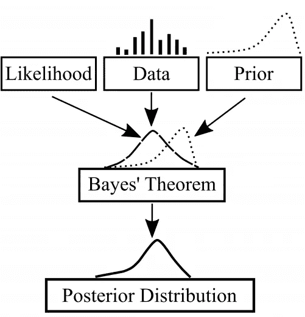
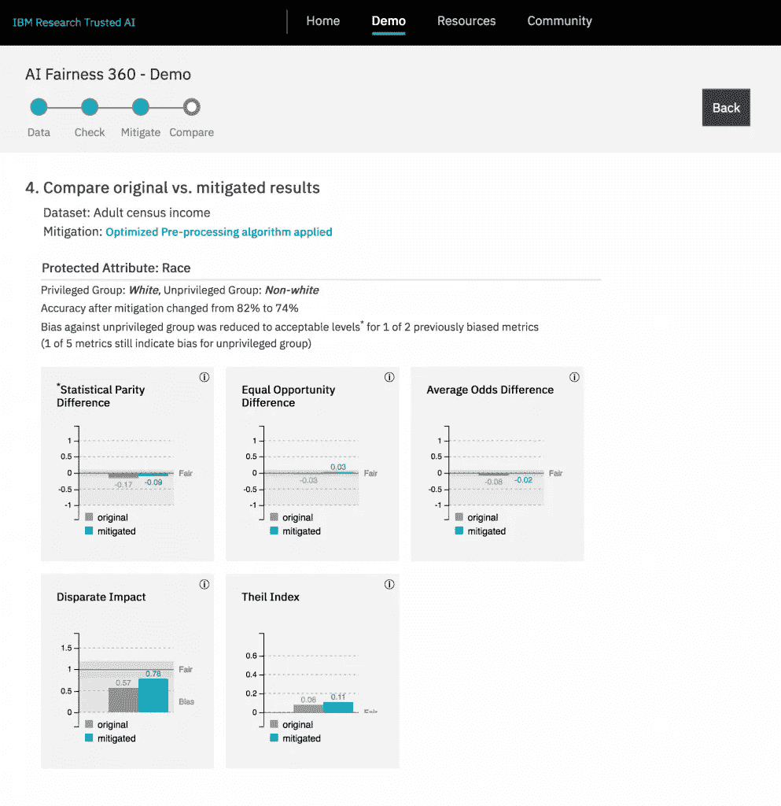

# 人工智能与伦理:权力越大，责任越大

> 原文：<https://medium.datadriveninvestor.com/https-medium-com-charlottemurray-ai-ethics-with-great-power-comes-great-responsibility-2f537fd6a8f8?source=collection_archive---------1----------------------->

*“With great power comes great responsibility” — Uncle Ben, Spiderman*

人工智能(AI)和机器学习正在彻底改变整个行业和社会。它们的功能嵌入到我们的日常生活中，并且它们的应用正在扩展。他们决策的结果现在影响着生活，随之而来的是巨大的风险。为了让这些技术继续对社会产生积极影响，它们需要遵守人类的道德和原则。技术的好坏取决于它的创造者，因此在该领域工作的每个人都有责任为人工智能创造一个反映我们价值观的道德框架。这从向内看和反思我们自己的信念开始。

从年轻时起，人们、文化、教育、宗教、媒体和政治就塑造了我们对世界的看法和信念。这些经历产生了信息，我们的大脑将这些信息联系起来并进行分类，以便理解所有的事情。这些类别有时会形成刻板印象，引发对性别、年龄和种族等不反映现实的特征的认知联想。这对社会有破坏性的影响。问题是，这个过程是即时的、自动的，而且常常不是我们意识到正在发生的事情。大多数人会反驳无意中进入意识的歧视性想法，但是考虑到行为很大程度上是由*无意识*思维决定的，积极的意图是不够的。

人工智能的相对客观性有助于抵消人类的主观性，迄今已被证明对科学、健康、技术和金融等领域具有革命性意义。因此，*权力越大，责任越大*，在计算和技术方面如此强大的进步存在重大风险，必须在公众消费之前减轻这些风险。为了确保 AI 不会造成伤害，我们必须谨慎行事。我们不能将我们的道德责任外包给机器。我们需要保护我们的道德标准，并将它们纳入一个框架，该框架指导人工智能在社会中的设计、实施和效用。

> …鉴于行为在很大程度上是由潜意识决定的，积极的意图是不够的。

# **道德框架**

这份名为 [*伦理上一致的设计*](https://ethicsinaction.ieee.org/) 的综合报告旨在向创造人工智能的组织提供信息、技能和支持，让他们认识到伦理在赋予人类力量的技术中的重要性。该文件由数百名不同学科的不同思想领袖创建，概述了人工智能决策应该坚持的一些关键道德原则。

这些原则中的每一个对一个真正的“道德人工智能”都很重要，这篇文章提出这些原则实际上是相互联系的，并且依赖于 3 个更广泛的原则:

1.  **可理解性**:技术过程是透明的，可解释的。
2.  **准确性**:输出代表真实的程度。
3.  **公平**:决策公正，不考虑敏感数据。

人工智能的'[可理解性'](https://publications.parliament.uk/pa/ld201719/ldselect/ldai/100/100.pdf)由英国政府创造，为他们的决策结果创造责任。了解如何和为什么作出决定，使用户能够了解他们是否受到剥削，从而了解人权是否受到侵犯。揭开不透明系统的盖子对于建立其计算方法的准确性是必要的，只有通过准确的洞察力，社会才能开始信任其在决策过程中的地位。理解见解的准确性及其对人权的影响对于确保产出的公平性和促进积极福祉至关重要。

# **1。清晰度**

今天的算法决定了我们的许多事情——谁被雇用，谁被解雇，谁获得抵押贷款，谁是危险的罪犯——这可以使可能是困难的决定变得简单。知道*如何*和*为什么*做出这些决定并不简单。组织历来隐藏在“黑箱”系统后面，防止对他们的方法进行审查，指责复杂性和知识产权保护的保密性。然而，[几起高调的案件](https://www.propublica.org/article/machine-bias-risk-assessments-in-criminal-sentencing)质疑了黑盒决定的有效性，这点燃了对“可理解的”人工智能系统的需求——那些技术上透明和可解释的系统。

> “当算法影响人权、公共价值或公共决策时，我们需要监督和透明度”——欧洲议会议员 Marietje Schaake。

揭开黑箱系统的盖子对于检查和审查人工智能输出的有效性是必要的，但多层神经网络的复杂性使得审计极其困难。然而，这些决定对人们生活的重要性要求机器学习框架从输入到输出都是可解释的，这是从设计阶段开始考虑的一个重要因素。国防部认为，无法解释人工智能系统的内部工作限制了它们的有效性。为了克服这些限制，他们目前正在开发[可解释的人工智能程序](https://www.darpa.mil/program/explainable-artificial-intelligence) (XAI)。它的目的是产生机器学习技术，可以解释他们的方法，同时保持他们的预测能力和代码的知识产权。

XAI Concept

> “当人们乘坐飞机时，他们不需要确切地知道飞机是如何工作的才能感到安全。他们只需要知道飞机遵守某些航空安全规定”。——转述一下我最近在一次谈话中听到的一个有趣的对比例子，她来自 Gemserv 的隐私和数据保护主管 Ivana Bartoletti，也是 Women Leading in AI Network 的联合创始人。

你不应该成为一个数据科学家来理解人工智能的逻辑。这些信息需要以不同的形式提供给各类用户，从学者到普通大众。当用户能够理解产出是如何产生的以及为什么产生时，他们就更容易相信产出的准确性和公平性。

并非所有的解决方案都必须是技术性的。像 GDPR 这样的法规也引入了一些关于自动决策而无需任何人工参与的条款，包括[要求披露何时以及如何使用这一流程](https://ico.org.uk/for-organisations/guide-to-data-protection/guide-to-the-general-data-protection-regulation-gdpr/individual-rights/rights-related-to-automated-decision-making-including-profiling/)。组织必须为任何自动人工智能决策提供数据、逻辑/规则和审计线索，并让用户知道谁做出了决策——机器还是人。不负责任的机器时代因此结束了。问责制的负担已经转移到人工智能的创造者身上，以确保技术进步不会以人类伦理和价值观为代价。

# **2。精确度**

智能有助于确定算法的准确性。人工智能和机器学习彻底改变了处理大量数据的速度、效率和价格。这些技术的力量和能力无所不能，从在识别[肺癌类型](http://www.ultromics.com/technology/)和[心脏病](http://www.optellum.com/)方面胜过医生，写[科幻电影](https://www.youtube.com/watch?time_continue=4&v=LY7x2Ihqjmc)，甚至[击败《危险边缘》节目的两名最佳选手](https://www.techrepublic.com/article/ibm-watson-the-inside-story-of-how-the-jeopardy-winning-supercomputer-was-born-and-what-it-wants-to-do-next/)。但是，人工智能也犯了严重的错误。2015 年，谷歌照片在包含黑人的图片上自动创建了“大猩猩”标签。2016 年，优步在三藩市测试了[自动驾驶](https://mobile.nytimes.com/2017/02/24/technology/anthony-levandowski-waymo-uber-google-lawsuit.html)汽车，这些汽车闯了六个红灯，其中一个在繁忙的人行横道上。不同的研究人员[利用患者的历史医疗记录训练了一种算法来识别未来自杀风险的早期迹象](https://ajp.psychiatryonline.org/doi/full/10.1176/appi.ajp.2016.16010077)，但这种方法充斥着假阳性。对于自杀预防，人们不一定认为假阳性是有害的，但在医学和犯罪学等领域，假阳性可以改变生活。

Google Photos mishap

提高机器学习算法准确性的第一步较少依赖于统计技术本身，而更多地依赖于过程。人工智能和机器学习的目标是协助人类，而不是取代人类。它在专业、高风险环境中的应用应该只是帮助专家做决策，而不是取代他们。在实现真正可理解的人工智能系统之前，它们的输出应该只用于促进对话，而专家仍然是最终的决策者。在将这些见解应用到影响人们的建议之前，人类仍然有责任确保这些技术的输出是有效的。

在管理人工智能在决策中的作用时，我们也应该检查和测试它们的输出。这从监控进入模型的数据开始——“垃圾进，垃圾出”。在人工智能进入公共消费领域之前，组织很少意识到高质量输入数据的重要性。必须采取安全措施，在允许进入数据模型之前评估数据质量和适当性，尤其是在开发、测试和训练算法的早期阶段。这一过程的责任负担正逐渐从人转移到机器，但直到这些方法被证明对坏的、棘手的数据是可靠的，才完全转移。

> 人工智能和机器学习的目标是协助人类，而不是取代人类。

或者，算法可以被构建为意识到它们自身对其准确性的不确定性。理解不确定性使得基于错误决策的风险做出理性决策成为可能。像*适当的评分规则*这样的统计方法鼓励预测者诚实(即诚实对待他们的不确定性)以最大化预期结果。类似地，*贝叶斯推理*是一种方法，通过这种方法，当算法接收到支持或反对假设的新信息时，它的不确定性会更新。因此，让机器学习意识到并批判数据及其自身决策的可能性是可以实现的，但主动实施这些技术的责任仍然在技术专家身上。一旦人工智能已经在人类消费中，准确性往往被判断为临时的，但不准确的决策对人类生活和伦理的严重影响使得这些技术必须在实际应用之前的设计阶段就被纳入。

*Bayesian inference*

人工智能和机器学习使我们能够比以往任何时候都更准确地产生见解，但人类不应完全脱离决策循环。在假新闻和错误信息的时代，科学的严谨性继续是发现的核心，同时我们继续建立在事实和真相的基础上，这是至关重要的。只有通过严格的测试并将准确性置于设计原则的核心，人类才会信任人工智能，这对于社会接受其实用性和洞察力至关重要。

# **3。公平性**

准确的洞察力对公平决策至关重要。关于什么是真正的“公平”决策有很多争论，但简单地说，它是在决策中平等、公正地对待所有群体/变量，不受性别、种族或宗教等特征的影响。真正的公平始于代表各种特征、象征、信仰和想法的数据，这些数据会影响算法的训练方式，从而影响机器学习模型的决策方式。不幸的是，算法和用于训练它们的数据是由人生成的，而人不可避免地会有固有的偏见。当微软在 Twitter 上发布了一个名为 [Tay 的机器人时，他们付出了惨痛的代价，这个机器人变成了一个种族主义者、性别歧视者、反语义暴君](https://www.theguardian.com/technology/2016/mar/24/tay-microsofts-ai-chatbot-gets-a-crash-course-in-racism-from-twitter)，要求所有女权主义者“在地狱中燃烧”。机器人本身是公正的，但 Twitter 用户生成的训练数据不是。

除了有偏见的训练数据，每个算法背后都有一个具有个人信念的个体，这些信念构成了机器学习决策的基础，称为“算法偏见”。对微软来说，Tay 的实验是一个不幸的学习曲线，除了负面宣传之外没有严重的后果，但在其他情况下，算法偏见导致了不道德、不公平的待遇。

> 算法和用于训练它们的数据是由人生成的，人不可避免地会有固有的偏见。

卡内基·梅隆大学的研究人员显示，谷歌广告承诺帮助求职者应聘薪酬超过 20 万美元的职位，男性明显多于女性。2016 年，用于评判国际选美选手的机器学习算法对那些皮肤黝黑的人抱有负面偏见[。](https://www.theguardian.com/technology/2016/sep/08/artificial-intelligence-beauty-contest-doesnt-like-black-people)这些灾难首先是由有偏见的训练数据引起的——项目之间的关联强度反映了刻板印象而不是现实。第二，用于分析训练数据的算法没有针对这些偏见进行调整，并且还包含了它们自己的偏见，这些偏见使这些刻板印象永久化。正如最近关于面部识别软件的[争议所表明的，有偏见的训练数据集影响了技术处理不同数据和用户的能力，从而限制了他们公平客观地做出反应的能力。](https://www.nytimes.com/2018/02/09/technology/facial-recognition-race-artificial-intelligence.html?smid=tw-share)

MIT Media Lab researcher Joy Buolamwini demonstrating how AI facial recognition works significantly better for white faces than black faces.

用于训练机器的数据集必须经过精心策划，以反映不同的特征、信仰、文化和价值观，这样所做的任何决定都可以代表整个群体，而不仅仅是其中的一部分。困难在于数据是从以前的决策中“标记”出来的，这通常反映了不必要的偏见和少数民族的代表性不足。因此，人工智能可以学会反映偏见，并在自己的决策中反映出来，从而延续和复制历史偏见。

同样，机器学习中的“特征工程”涉及数据转换以促进建模，强调某些特征和变量。它被编程为关注的变量对机器学习过程中下游做出的数据、区分和分类有重大影响。如果群体被过度简化或错误分类，这就有从最终决策中去除细微但重要的特征和区别的风险。

数据和算法只是问题的一半。人工智能和机器学习的应用已经扩展到必须遵守一套道德和社会规范的环境，这些规范因国家、文化和职业而异。在医疗环境中应用的人工智能与在保险环境中应用的人工智能遵循不同的道德标准——性别可以决定你的汽车保险费率，但不能决定你获得医疗保健的机会——但教会人工智能如何在每种可能的情况下采取行动是非常复杂的，并且总是随着道德的发展而变化。创造一个能够意识到并符合人类自己并不总是遵守的道德规范的人工智能是一项挑战，但保护个人福祉和人权对于这些技术的使用来说至关重要。

在人工智能本身变得真正公平之前，机器学习过程必须以可追溯和透明的方式从头到尾进行调节和纠正，以实现其公平性。近年来，已经创建了类似于[歧视感知数据挖掘(DADM)](https://www.researchgate.net/publication/314866887_Discrimination-aware_data_mining_a_survey) 和[机器学习中的公平、问责和透明(FATML)](http://www.fatml.org/) 的方法和组织，以改善机器学习的不必要的歧视效应，并促进“公平感知”数据挖掘方法。最近的一篇[论文](http://journals.sagepub.com/doi/pdf/10.1177/2053951717743530)强调，公平的概念是多方面的，可以根据具体情况以多种方式进行衡量，但是任何“公平”的衡量都关键取决于对敏感/受保护特征与数据的其他特征之间的相关性的了解。像 IBM 的 [AI Fairness 360](http://aif360.mybluemix.net/?cm_mc_uid=81224069824315501493241&cm_mc_sid_50200000=52811171550149324136) 这样的开源工具可以帮助实现这一点，但 GDPR 使得访问这些数据具有挑战性，而且往往是不可能的，因此组织*需要*学习如何在不知道数据附带的受保护特征的情况下识别数据中的偏见。最强有力的防御形式是，让一个多元化的团队亲自审查数据和算法，他们会感受到偏见。

AI Fairness 360 demo

多样性长期以来被誉为创新和金融成功的关键，但它对于创造和调节“公平”的人工智能系统也是必要的。多种多样的背景自然会产生多种多样的观点，揭示隐藏的偏见，并就如何从流程中消除偏见提供更深入、更具创造性的见解。该团队还应该来自一系列学科，包括心理学家、伦理学家和社会学家，以了解人工智能运作的社会和文化背景。

那些受算法决策影响的人也可以通过一个使他们能够报告歧视性人工智能决策的过程来参与促进公平。在美国，教师的奖金、加薪和就业状况是由一个算法“增值模型”决定的，该模型在被反复抱怨其决策的透明度、准确性和公平性后被[广泛废除。通过努力确保人工智能决策的接受者，无论他们的背景如何，都被公平地作为个人和平等者对待，人工智能可以保护和增进个人和社会的福祉。](https://www.bloomberg.com/view/articles/2017-05-15/don-t-grade-teachers-with-a-bad-algorithm)

# **最终想法**

人工智能和机器学习要对人类产生可持续的积极影响，它们必须遵循人类自己遵守的同样的伦理道德和原则。自主系统的巨大力量和能力已经逐渐消除了人类参与决策过程各个阶段的需要，但是*巨大的力量带来巨大的责任*。人工智能和机器学习的应用环境不断扩大，这意味着它们需要遵守一系列复杂的、充满价值的原则。这些技术的最终目标是为人类服务；而不是相反，因此构建它们的社区有责任和义务不断地安装知识，并遵守不断发展的道德原则及其应用的环境。

只有通过**可理解性**、**准确性**和**公平性**人类才能利用力量并减轻人工智能和机器学习继续发展的风险——人工智能中的技术债务不得导致社会中的道德债务。

*想聊天？
领英:*[*https://www.linkedin.com/in/charlotte-murray-0753a7a3/*](https://www.linkedin.com/in/charlotte-murray-0753a7a3/) *推特:@charlcmurray*