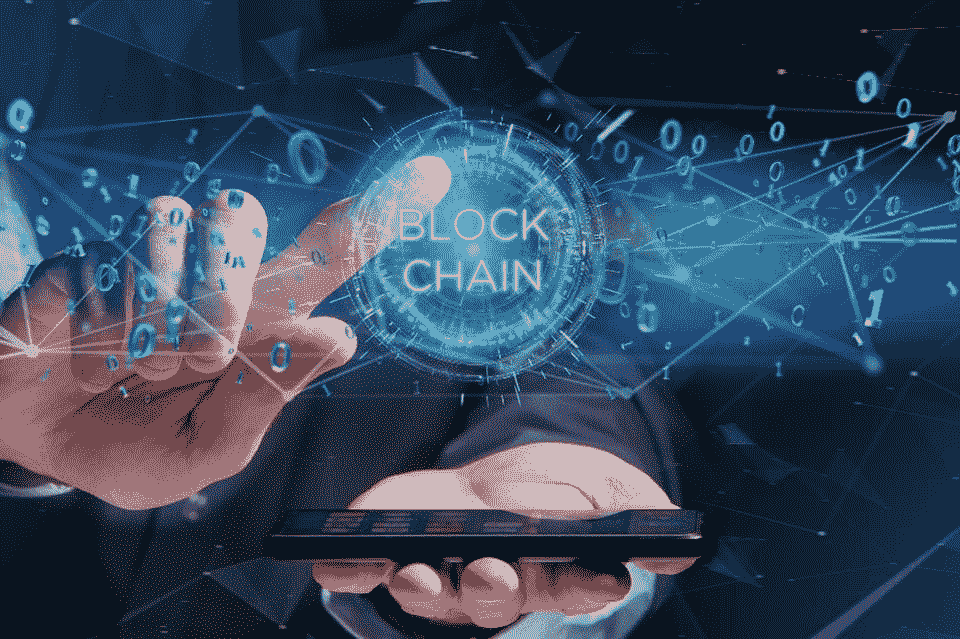
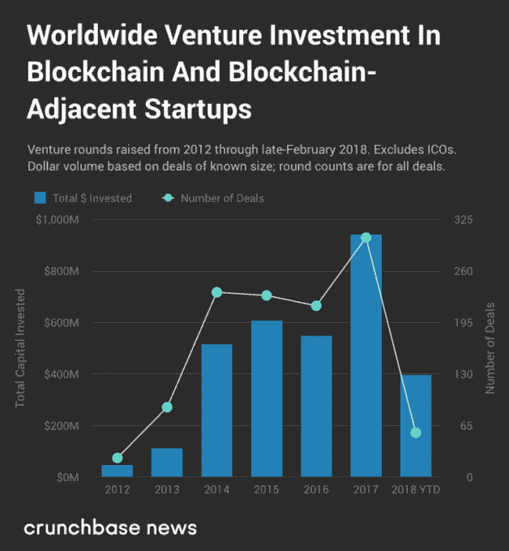
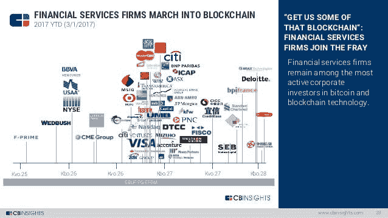

# 投资区块链项目——好的、坏的和天真的投资者提示

> 原文：<https://medium.datadriveninvestor.com/https-medium-com-datadriveninvestor-blockchain-projects-the-good-the-bad-and-the-naive-investor-498bec2a855?source=collection_archive---------8----------------------->

*观点是我自己的，不应被视为财务建议。本文仅反映我个人的想法和观点*

经常有人问我，在区块链项目的早期投资方面，我的经验法则是什么？有公式吗？一些清单或公式之类的？大的投资团队看什么？

Image by Shutterstock

区块链仍然是一项发展中的技术，虽然分散一切一度是一个很好的宣传短语，但我们作为一个行业，在我们谈论大规模采用或改变用户日常应用程序的操作方式之前，我们需要专注于构建安全、稳定、可扩展的用户友好工具。是的，去中心化的优步或 Airbnb 可能是一条出路，但不是现在，不是在目前的情况下。想一想，让数百万用户使用这些应用程序需要多长时间，才能让他们切换或“升级”到新版本的应用程序，这需要在无缝操作的情况下完成，而不影响他们操作移动/网络应用程序的习惯。

 [## 数据驱动投资的兴起——数据驱动投资者

### 当 JCPenney 报告其 2015 年 2Q 的财务结果时，市场感到非常震惊。美国零售巨头…

www.datadriveninvestor.com](https://www.datadriveninvestor.com/2019/02/28/the-rise-of-data-driven-investing/) 

对技术的信任不会在一夜之间发生，它需要时间，通常需要几次尝试，以及学习提高和满足您的客户和一般市场的需求。用户并不总是知道他们想要什么，但是一旦他们习惯了改善特定需求的解决方案，他们就知道他们不想要什么了。

Image by Crunchbase News

区块链——*我们可以争论什么是区块链，但我将把它留给另一篇文章，*作为一个技术，技术概念将继续存在，在正确的领域和公司实施才是正确的方向。机构、私营公司和学术界越来越关注了解这项技术以及它如何创新各种行业，虽然有些人可能会认为“加密不是区块链”，但我将主要关注区块链的项目，这些项目不一定发行本地令牌。
优秀的区块链项目仍然存在，他们努力研究、构建产品和创新空间，尽管许多加密项目使许多私人投资者对即将到来的 ICO/IEO 保持警惕和怀疑，但传统投资资金通过机构或风投仍在投资优秀的区块链项目。

Image by CB Insights

让我们先弄清楚一些事情，现在我们是后 ICO 热潮时代(感谢 crypto lord)，拥有一份 pdf 版本的白皮书和 A-list advisors 不再有用(以前也不应该有)，融资回到了创业初期的水平。我会关注那些对问题有解决方案的项目，要么是对已有解决方案的扩展，但做得更好、更快、更便宜，要么是解决尚未解决的问题的全新解决方案。
出于尽职调查目的的许多问题在此简单介绍如下:

# **你为什么需要区块链？-**

这是我经常问的第一个问题。你也应该如此。不要只说“这就像‘概念 123’但是在区块链上！”一旦你改变了最初的想法，只是为了炒作你的投资者或董事会成员。*我并不是说你不应该转向基于区块链的解决方案，无论如何——如果这最适合你的技术，并且能够证明为什么在这种情况下存储数据而不是在一组安全的数据库上，那就去做吧。但是要有一个理由，一个深思熟虑的，研究过的理由。

# **给我看看数字-**

虽然拥有一个社区很重要，但实际使用是至关重要的。
社交媒体上的大型支持社区很棒，但让我们来谈谈你已经签署的客户协议。让我们来谈谈与拥有活跃和庞大用户群的公司/项目的合作，这将从你的产品中受益。先说实现和用法。如果你的主题是“构建 XYZ 的去中心化版本”,展示引导团队以那种特定方式构建你的 MVP 的研究和结论，展示代码行(或其中的一些),你通过“去中心化”来改进最初概念的哪些缺陷？

# **大 T-**

*你的团队-* 从创始人到实际成员，你的团队成员都是谁？
他们过去的经历是怎样的？他们带来了什么？团队的结构是怎样的？团队有多大？队伍坐在哪里？
团队的愿景是什么？为了公司？
我发现在评审项目时，观察团队成员，了解他们是谁，他们给团队带来了什么，以及团队是如何运作的非常重要。

# 投资者-

*Angles，VC 的，你的爸爸妈妈-*
你的投资人名单很重要，不管是大的知名 VC，你自己的积蓄还是另一种形式的资金支持，这都是一个很大的资质。
你的顾问和投资者有多活跃？他们指导并支持项目吗？它们有助于联系有用的行业参与者或潜在客户吗？
他们中谁比较活跃，为什么？谁亲力亲为，更新频繁，谁是沉默的投资者，为什么？

# **隐私和安全**

隐私和干净数据不仅仅是堆积在你的垃圾邮件文件夹中的恼人的电子邮件标题。我们生活在一个数据几乎变得稀缺的世界。我们存储、上传、交易和使用自己(和他人)数据的方式决定了今天的一切，而且只会越来越多。公司如何管理这两个问题？他们如何确保数据安全并防范未来风险？

# 建造，建造，建造

公司的商业模式是什么？你会惊讶有多少次项目没有可行或可持续的商业计划。你不能通过直接跳到最终产品来建立一个公司，这需要时间，计划，思考，首先弄清楚所有的本质细节。为不同的情况做好准备，并有应对可能发生的事情的解决方案。

# 沟通

我坚信你可以从创始人和投资人的交流中学到很多东西。第一印象和第一判断很重要，但不要忽视持续的沟通是一个关键因素。

— — — — — — — — — — — — — — — — — — — — — — — — — — — — — -

如免责声明中所述，这些标准是我个人的标准。
就像打造一个好的产品一样，一个好的投资评估需要时间，风险投资者和投资者有各种方法来评估他们是否应该投资一个项目，这个过程是漫长而复杂的，必须彻底完成。
这些基本概念是以一种概括的方式提出的，作为一个例子和思考的食粮。