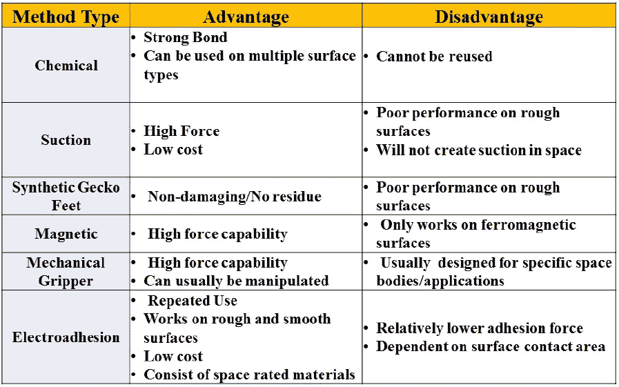
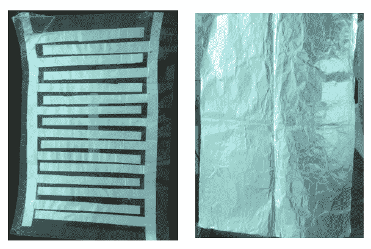
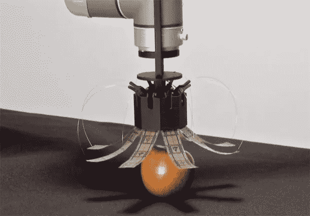
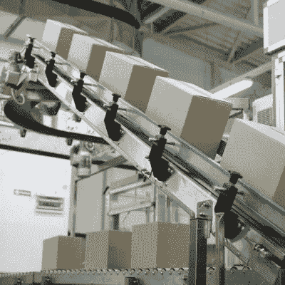
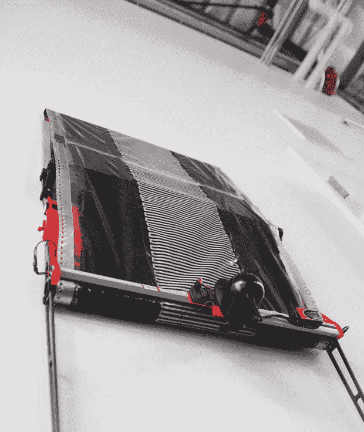

# 静电吸附:让爬壁机器人成为现实！

> 原文：<https://medium.datadriveninvestor.com/https-medium-com-datadriveninvestor-electrostatic-adhesion-wall-climbing-robots-6be4c9ed772b?source=collection_archive---------4----------------------->

做个实验！拿一个气球，试着把它挂在墙上。很明显，气球粘不住了。现在拿同一个气球在毛巾上摩擦。现在再试着把它挂在附近的墙上。这一次，气球神奇地粘在了墙上。

> **这到底是怎么回事！**

当你用毛巾摩擦气球时，由于摩擦力，电荷从毛巾转移到气球上。由于气球是绝缘体，电荷不能移动并停留在那里。

当这个带电的气球靠近墙壁时，会在墙壁上感应出一个大小相等方向相反的电荷。定律*‘异性电荷相互吸引’*开始发挥作用，气球附着在墙上。

这种停留在绝缘体表面的电荷被称为**静电荷**，他们的研究被称为**静电学**。

而这种基于静电原理的物体间粘附的整体现象被称为**静电粘附**或简称为**电粘附。**

Tesla Coil: Demonstrating Electrostatic Force

# 电粘附现象的基础:

希腊人首先考虑了静电现象。他们观察到，当两片羊毛摩擦在一起时，像羽毛这样轻的物体会被吸引向它们。

后来，在十八世纪晚期，一位法国科学家试图理解电场的力量。他发现同性电荷相斥，异性电荷相吸，也就是**库仑定律。**

这个定律为静电粘附的概念提供了基础。如果我们能在一个表面上产生足够的静电荷，那么我们就能把任何物体附着在这个表面上。

# **不同粘合技术的比较:**

到目前为止，已经采用了几种粘合技术，每种技术都有其优点和缺点。这些技术中的一些包括化学粘附、吸盘、合成壁虎脚、磁性和机械夹具。

下表给出了不同粘合技术的简要比较。

[Advantages/Disadvantages of Various Adhesion Techniques](https://commons.erau.edu/cgi/viewcontent.cgi?article=1243&context=edt)

静电粘附的主要优点是它能在几乎任何粗糙或光滑的表面、导体或绝缘体等上提供粘附力，这使它优于其他技术。

# **电焊盘及其类型:**

为了给电粘附现象带来活力，研究人员和科学家已经开发了几种电粘附垫。这些垫根据它们的应用具有不同的形状和尺寸。

电粘合垫分为两种类型:***单极*** 和 ***双极*** *。*

Pad Designs: Bipolar(left) and Unipolar(right)

**单极**垫由一片层压有电介质的电极组成。这些易于制造和使用，但是它们的粘合力相对弱于双极垫。

**双极**垫由两个相互电绝缘的电极组成。这些电极以不同的方式排列；同心圆、方螺旋、梳状结构等。而研究人员发现梳子的排列是最有效的。

# **电焊垫的工作原理:**

焊盘的工作原理是电容器模型。焊盘由导体(铝等)组成。)，其充当电极，层压有一层电介质(聚酯薄膜、环氧树脂等)。).然后，基板(要附着的物体)充当电容器的第二极板。

衬垫由高压 DC 电源供电。通电后，静电电荷开始在粘合垫上积累。要附着的物体被带到衬垫附近。物体由于静电感应而被极化，并因此被粘附到垫上。

# **电粘附的材料处理应用:**

电粘合垫广泛用于工业中的材料处理应用。这些工业从微型元件工业到重工业都有。

## **微夹钳:**

[Grabit Robotic Gripper](https://spectrum.ieee.org/automaton/robotics/robotics-hardware/electrostatic-robot-grippers)

小型微米级夹具广泛用于半导体和光学行业。这是因为这些垫具有非常有用的特征，即它们不会以任何方式影响物体。

该特征在半导体和光学工业中非常有益，因为这些工业处理非常敏感的元件。电子传感器和光学透镜等。因此，通过微夹钳可以安全地处理。

## **倾斜输送带:**

从微型工业转移到重工业，电粘垫同样有用。它们被用于工业，如水泥和化肥工业等。在这种情况下，物料将在更高的高度上输送到更长的距离。

那里使用的**传送系统**只能倾斜到特定的角度。一旦仰角增加，材料就不能再向上移动。

[Grabit Technology’s Conveyor System](https://grabitinc.com/productivity-solutions/)

此外，如果高度很高，那么传送带也会在水平方向上移动相当长的距离。因此，占据了更大的面积，这不是理想的情况。

在这种情况下，粘合垫将取代传送带系统的皮带。现在，当皮带通电时，材料就会附着在上面。这使得该行业能够提高海拔，从而减少水平占地面积。因此，节省了大量空间并使系统整体更有效。

# 采用电粘附的爬壁机器人；

[SRI International’s Wall Climbing Robot](https://spectrum.ieee.org/automaton/robotics/robotics-hardware/electrostatic-robot-grippers)

所有攀爬机器人一直是研究人员的热门话题。已经实现了几种技术来实现绝对爬壁机器人。这些包括吸盘、磁性夹子、壁虎脚等。

这些技术都有其局限性，因此无法实现这一目的。例如，吸盘和壁虎脚只能在光滑的表面上工作，而磁性夹子只能在铁磁性表面上工作。

与此同时，电粘附技术胜过所有其他技术。它适用于所有表面，无论粗糙还是光滑，导体还是绝缘体等。因此，能够攀爬任何种类的墙壁，无论是木制，玻璃或金属。

这是机器人领域的一个了不起的发现。爬壁机器人在一般工业、安全、军事和各种其他领域具有巨大的价值。

它们可用于工业中的材料运输，以及检查人工参与不可能或非常困难的区域。还有，在大商场里，它们可以有各种用途。

然而，它们最重要的应用是在军事领域，用于安全目的、监控敌方控制的区域、监视以及军事行动中。

# **结论:**

电胶技术确实给工业和军事应用带来了许多机会。然而，它们仍在研究中，在现实生活中的应用还有待观察。

研究人员和科学家正在努力根据它们的各种应用来优化这些垫。要将这些应用引入市场，他们还有很多工作要做。

虽然我们不能说它们在实现最佳电粘合技术方面有多接近。有一件事是肯定的，根据今天科学进步的速度，这不会需要很长时间。

# 参考资料:

1.  [Saravia，Walter，“用于空间应用的本体感受电附着垫的设计、制造和测试”(2015)。](https://commons.erau.edu/cgi/viewcontent.cgi?article=1243&context=edt)
2.  [郭等 2016 年 J. Phys. D: Appl. Phys. 49 415304](http://iopscience.iop.org/article/10.1088/0022-3727/49/41/415304/meta)
3.  [郭等 2016J . phys . D:appl . phys . 49 035303](http://iopscience.iop.org/article/10.1088/0022-3727/49/3/035303/meta)