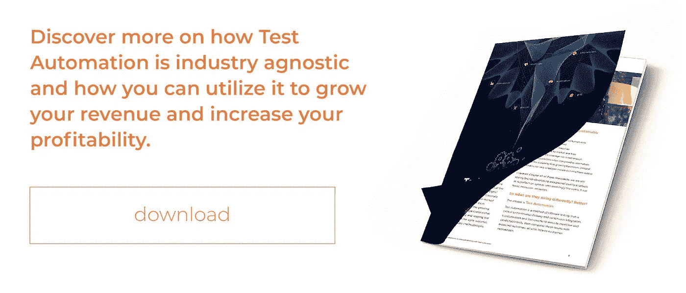
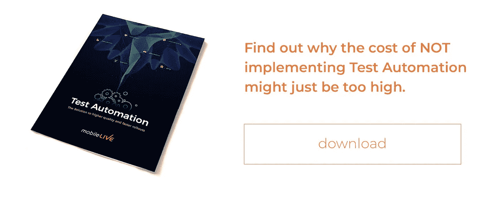

# 阻止测试自动化的高成本借口

> 原文：<https://medium.datadriveninvestor.com/https-medium-com-mobileliveinc-the-high-cost-excuses-preventing-test-automation-d922c2259f01?source=collection_archive---------7----------------------->

我女儿最近问我是否愿意带她去玩具店。经过漫长的一天，我刚从办公室回到家，我想做的就是躺在沙发上看电视放松一下。我告诉她我不能去，理由是我“太累了”，但我很乐意明天带她去。她不情愿地接受了我的回答，然后继续做自己的事，很可能会向我妻子提出同样的问题。

这是一个借口的例子，伪装成一个理由。我没有真正的理由阻止我带她；我只是用我累作为借口。幸运的是，我的借口的后果几乎不存在；我女儿只等了一天就得到她想要的东西。遗憾的是，我们制造的许多借口却不是这样，尤其是在商业领域，大多数机会都不像我女儿那样持久。

 [## 不管准备好了没有，革命就在我们面前——数据驱动的投资者

### “对于技术如何影响我们的生活和重塑经济，我们必须形成全面的全球共识……

www.datadriveninvestor.com](https://www.datadriveninvestor.com/2019/02/12/ready-or-not-the-revolution-is-upon-us/) 

今天，我们将看看公司为他们为什么还没有实现测试自动化而制造的一些最常见的借口。虽然这些借口可能听起来很熟悉，或者在你自己的组织中也有回响，但主要的收获不是借口本身，而是你因制造借口而错过的好处。

***“测试自动化的成本太高了！”***

在商界，我听到的不做事的第一个借口是费用。然而，有趣的是，不承担上述费用通常会带来自身的成本；通常是更高的。

在[测试自动化](https://perspectives.mobilelive.ca/blog/why-test-automation)的情况下；我经常听到测试经理声称实现的成本太高了。这是可以理解的，毕竟，乍一看，投资自动化似乎成本过高——尤其是对于较小的组织。然而，当正确地实现和使用时，测试自动化通常会通过减少劳动力，缩短上市时间，以及通过允许您的团队关注更关键的计划，如客户需求和产品功能和改进，来获得回报。

尽管任何形式的测试成本都是昂贵的，但是在软件开发阶段使用自动化进行更彻底、更有效的测试，总比以后发现和修复问题花费的要少。

***“我真的不需要测试自动化。”***

也许测试自动化的成本对您来说不是问题。也许，你认为你的企业不会从这样的计划中获益——这是一个公平的观点。如果没有足够的理由，你为什么要花费任何成本呢？

但是让我问你，[客户体验](https://perspectives.mobilelive.ca/blog/digital-customer-experience)和他们对你品牌的认知对你来说重要吗？如果您的组织不仅能够生产更好的产品，而且能够更快地将它们推向市场，您的组织会从中受益吗？如果您能够在不牺牲增长和盈利能力的情况下降低企业的运营支出，情况会怎样？如何确保您可以重复和准确地运行测试，以帮助确保最高质量的产品？

如果您对以上问题中的任何一个回答是肯定的，那么您肯定需要测试自动化，这不仅会让您的客户高兴，还会提高您的操作灵活性。

***“我不认为测试自动化会在我的行业中起作用。”***

在我得到的关于为什么一个组织不愿意采用测试自动化的所有借口中，“我不认为它在我的行业中行得通”无疑是最容易反驳的。

谈到测试自动化，事实上，它是行业不可知的。这意味着它可以成功地在任何重复的和可预测的测试环境中实现，不管是什么行业。我个人参与了电信、银行以及医疗保健中成功的测试自动化实施，然而，从制造、保险和其他金融服务、媒体、娱乐以及汽车，成功且有利可图的测试自动化实施的例子比比皆是。

***“手动测试比较好。”***

以我的经验来看，教条地忠于任何一种做事方法都是不好的做法，尤其是当情况合适时，更好的选择会出现。

事实上，当涉及到测试时，根本就没有“比另一个更好”，只是在方法和应用上有所不同。手动测试无疑有它的位置，比如一次性测试或需要人工观察的测试，然而，当涉及到耗时、乏味、重复或任务关键的测试时；测试自动化不仅可以帮助品牌更快地开发高质量的软件，还可以让他们大规模地开发，而且只需要很少的成本。一般来说，最好的测试策略是利用手工和自动测试，并找到一个适合您的业务的合适的媒介。

我告诉女儿，我不能带她去玩具店的原因是我累了，这是我炫耀的借口。这样做的理由是没有重大后果。然而，到目前为止，应该清楚的是，许多不采用测试自动化的借口并不是无后果的，你越早开始接受它们是什么，借口，而不是理由，你就越早能够对测试自动化是否适合你做出准确的评估。

*最初发布:*[*https://perspectives . mobile live . ca/blog/test-automation-excuses*](https://perspectives.mobilelive.ca/blog/test-automation-excuses)