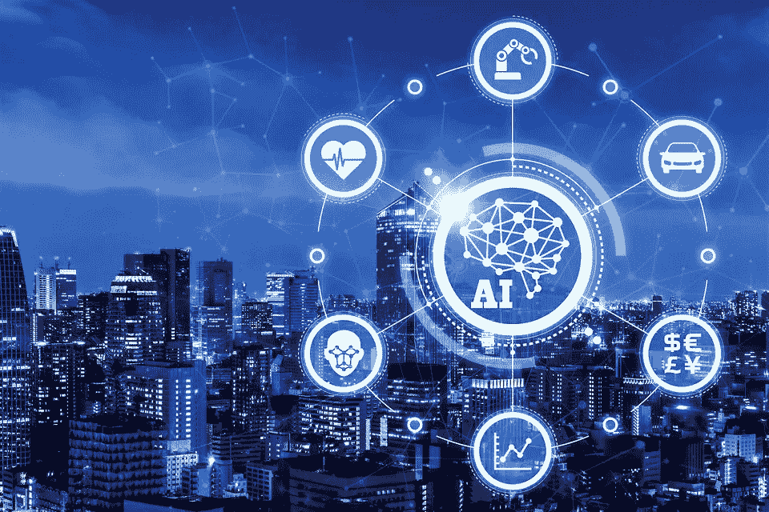

# 人工智能是好的，但要投资于人

> 原文：<https://medium.datadriveninvestor.com/https-medium-com-nelson-lee-a-i-is-good-but-invest-in-people-f6cf50c92541?source=collection_archive---------3----------------------->

作者:尼尔森·李

每部关于人工智能的好莱坞电影的开头都包含一个可怕的画面:一个自我学习的程序，变得足够聪明，可以超越人类。好莱坞并不以其对技术的精确表现而闻名，其电影也很少被物理定律所束缚。那么，在人工智能是什么的问题上，我们都被误导了吗？本质上，人工智能只是机器学习。这个术语包括人类知识——“智能”部分——和人类编写的自我学习代码，“人工地”

> 它只是一台局限于人类输入的知识量的计算机，它的好处超过了它固有的缺陷和不人道的特征。

人工智能的先驱希尔伯特·西蒙之前就提出过人工智能的内在风险。他在 1965 年大胆预言“二十年内，机器将能做任何人能做的工作”。然而，正是对人工智能的缺乏了解，刺激了特斯拉首席执行官埃隆·马斯克对人工智能的警告——五十年前模仿的同样的警告。面对现实吧，人工智能永远不会达到在好莱坞电影中目睹或被媒体夸大的人类接管能力。它只是一台局限于人类输入的知识量的计算机，它的好处超过了它固有的缺陷和不人道的特征。

点击诱饵标题和媒体对增加收视率的需求劫持了人工智能的主题..它在这个问题上灌输了广泛的恐惧，也误导了公众。如今，媒体的唯一目的是创造利润，而不是在关键问题上告知公众。因此，人工智能被描绘成即将到来的厄运，一颗定时炸弹。以 2017 年 7 月 31 日 **The Independent** 发表的标题为例:“FACEBOOK 的人工智能机器人在开始用自己的语言与对方交谈后关闭。”这个标题暗示了脸书的人工智能已经达到了创造语言的智能水平。脸书这个项目的最初目标是互相协商球和玩具，就像学龄前儿童交换玩具一样。当项目因代理人用他们的语言“交谈”而脱轨时，据称项目被关闭了。代理人创造了他们的英语速记。决不是一种新的“语言”形成了。他们用常用词交流，比如“我”、“我”和“五”这个词，并且仍然遵循语法英语惯例。媒体攻击该项目，而不是陶醉于新发现的知识，即有办法使沟通更有效。脸书的程序员为谈判代理预设了许多准则。然而，并没有对所使用的语言加以限制。虽然**独立报**在文章中准确地报道了脸书事件，但他们的标题误导了通常只看标题的公众。这确实表明，媒体要么忽视要么不理解程序员控制着人工智能和机器学习。整个机器学习领域都有人类设定的限制和规则，以确保该程序不会给脸书等公司带来可预防的风险和问题。人工智能无非是一台拥有不可思议的处理能力的计算机。人类需要教会它如何思考，分析什么是必要的，以及它能够提供的解决方案的范围。

可以理解的是，媒体确实夸大了所有对人工智能的怀疑。人工智能带来的最大风险是它增加错误的能力，以及计算机程序员对计算机如何学习缺乏理解。2015 年 7 月 1 日的一篇商业内幕文章显示，谷歌在同一年通过其照片算法错误地将两名非洲裔美国人标记为大猩猩。谷歌立即发表道歉，并禁用了其将灵长类动物归类为大猩猩或猴子的算法。谷歌处理这个问题的方式显示了机器学习带来的最大危害:“黑箱”现象。“黑盒”是人工智能程序中机器学习发生的比喻性“盒子”。唯一的问题？几乎不可能破译“盒子”里面发生了什么。一行一行地通读代码需要大量的计算机程序员和人力资源，程序每秒钟要写几百万行新代码。由于技术或财务限制，谷歌的程序员无法进入“黑匣子”并指出问题，因此与灵长类动物相关的词汇被禁止。直到今天，这个问题还没有得到解决。现代计算机的处理速度进一步加剧了这个问题。戈登·摩尔发明的计算机编程定律摩尔定律表明，计算机的整体处理速度每年都会翻一番。因此，计算机的能力、存储和处理能力呈指数增长。假设，一个计算机程序在 2000 年编码 2000 行代码需要一秒钟，现在在 2018 年只需要大约 4/100000 秒。每一秒钟，都有天文数字的代码被处理、吸收并转化为新知识。即使是由谷歌的编码人员或计算机本身造成的一个小的、无意的错误，也可能在系统内呈指数级增长。因为人工智能只是一台电脑，它吸收了我们教的东西。即使是一个小错误也可能对程序造成严重破坏，因为它把问题变成了数百万个问题。

Copyright @THINKSTOCKPHOTO

尽管如此，人工智能将为人类创造新的机会。随着技术进步以前所未有的方式发展，它将刺激社会互动和交流方式的变化。近年来人工智能的快速发展与 90 年代末的互联网有关。很难想象像百视达这样的公司，1995 年公布的利润超过 4 . 5 亿美元，仅仅 20 年后就破产了。在互联网出现之初，预测像亚马逊或网飞这样有实力和规模的公司也是不可想象的。自从互联网出现以来，美国普通消费者的生活质量显著提高。人工智能可能会跟随改善公众生活的趋势。现代人工智能的好处是前所未有的，让人无法想象未来的社会会是什么样子。人工智能未来的不确定性是它最有益的部分。这项技术一旦投入使用，就永远不会停止。人工智能需要一家新公司，类似于谷歌或脸书对互联网的影响，为公众创造和提供用户友好的平台。通过这些平台，每个人都可以获得人工智能的力量，并在生活中使用它。它将改善机器人领域，大幅防止生命损失，或改变医药领域的景观，人工智能可以学习如何对抗疾病和制造新药。像互联网一样，人工智能的世界是无限的。

> 自从互联网出现以来，美国普通消费者的生活质量显著提高。人工智能可能会跟随改善公众生活的趋势。

虽然人工智能没有上限，但我们需要对其增长速度保持谨慎。人工智能的发展必须放缓，以便让各行业有充足的时间来帮助面临失业风险的劳动力向新职业过渡。需要有法规来确保公司在人工智能方面不会走极其危险的捷径。从误差放大可以看出，即使是最轻微的错误也会冒犯许多人，或者对许多人造成有害的伤害。还必须从互联网的快速扩张中吸取教训。开发人工智能的公司应该提供非营利项目，帮助因人工智能而失业的人。这些项目将教那些工作处于危险中的人获得寻找新工作所需的技能，或者帮助他们开始一条新的职业道路。社会项目是必要的，因为收入不平等已经在过去的技术革命中撕裂了社会。同样的模式正在显现。主要表现在发达的西方国家，我们正在远离自由价值观。过度地，人们和国家被吸引到专制的、强人国家，以在现在发生的“第四次工业革命”中提供稳定。

像工业革命或者工厂自动化的使用，人们都很害怕。人工智能将在未来创造一个动荡的十年，因为世界各地恐慌的人们害怕失去工作，害怕他们的孩子有更少的机会。那些与人工智能直接相关的人:投资者、股东和高管将爬到顶端，并在富人和穷人之间形成更大的鸿沟。政府在这个时候需要保持敏捷和警惕，防止社会动荡。

人工智能的问题很棘手；必须走一条好的道路，以确保每个人都得到这条道路带来的好处。尽管存在不确定性，但人们应该对人工智能保持开放的心态。需要理解的是，一个人必须经受住风险，才能享受人工智能将带来的好处。就在去年，加拿大政府在人工智能技术上投资了 1.25 亿加元。我不建议这样做，因为最终，政府应该投资于人，而不是技术。