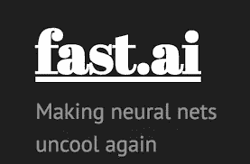
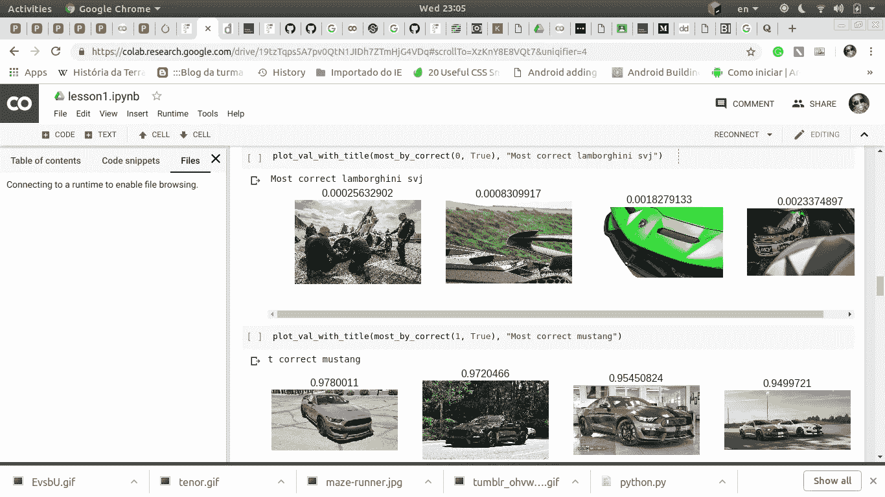

# 零到英雄(AI 大师)

> 原文：<https://medium.datadriveninvestor.com/https-medium-com-prince-canuma-zero-to-hero-master-ai-76d2fb7df105?source=collection_archive---------14----------------------->

一本关于如何在 2019 年入门并成为人工智能专家的指南。

**世界不再相同，据** [**BBC**](https://www.google.com/url?sa=t&source=web&rct=j&url=https://www.bbc.com/news/amp/world-us-canada-42170100&ved=2ahUKEwiK6tXapeLfAhVKPrwKHUYvCXkQFjAAegQIBBAB&usg=AOvVaw3uIEHkrZHKOs-GP6I8mAhN&ampcf=1) **报道，到 2030 年，人工智能和机器人自动化将在多个行业中占据 8 亿个工作岗位。**

女士们，先生们，我们正处于变化的时代，机器无处不在，现在已经成为我们生活中必不可少的一部分，从你在亚马逊上得到的建议，你在输入信息时得到的拼写检查，到现在自动驾驶的汽车。

不仅如此，公司似乎喜欢将多余的工作自动化以节省成本的想法——这给我们留下了什么？

不必惊慌，我已经制定了一个 3 个月的计划，让你从零到英雄，掌握智能算法的浪潮，通常被称为人工智能。如果你有信念和纪律，你将会为你的国家甚至人类面临的一些问题创造出惊人的创新解决方案。

在这个计划中，我会给你一些我曾经学得更快更聪明的小技巧。

> “你所需要的只是计划、路线图和朝着目的地前进的勇气。”——[夜莺伯爵](https://www.brainyquote.com/quotes/earl_nightingale_159044)

# 什么是 AI，为什么要知道？

[credits](https://66.media.tumblr.com/e2c26e4b8bb70f4425a680f925ed9521/tumblr_ohvwvdOtBo1vfmsbyo3_500.gif)

**AI** (人工智能)是人类创造的所有智能，它使机器能够完成需要某种智能水平的人类活动，如准确解释外部数据，从这些数据中学习，并使用这些学习通过灵活的适应来实现特定的目标和任务。这可以通过使机器能够感知环境并采取行动来扩大其成功实现目标的机会(强化学习是人工智能的一个子领域)。

也就是说，有一个故事引起了前所未有的反响，关于一个孩子做了一些前所未见的事情。

我们不时听到年轻人做出惊人之举的故事。

这个所谓有天赋的年轻人中的一个曾经教过我一些让我震惊的事情，并且完全改变了我的生活。让我想知道…

阿布是一个阿富汗的高中生，他打开了世界上数百万人的想象之门，带着他惊人的好奇心，他坐下来研究一种新技术，单枪匹马地创造出一些需要公司数百万美元和庞大团队的东西。

他创建了一个应用程序，使用机器学习(人工智能的一个子领域)从乳房 x 光片中诊断乳腺癌。

**谷歌**对这款应用印象深刻，以至于该公司在**首席执行官**桑德尔·皮帅 2017 年 [I/O 开发者大会](http://www.businessinsider.com/everything-google-announced-at-io-2017-5)的开幕主题演讲中展示了这款应用，甚至邀请阿布亲自出席会议。谷歌播放的一段视频讲述了他的故事。

当阿布 15 岁还是一名高一新生时，他坐在电脑前，谷歌了一个他不知道的术语:“机器学习。”正如他发现的那样，机器学习是一种训练计算机寻找模式并做出预测的技术。阿布被机器学习的潜力迷住了。

因此，当他在编程入门课上接到一个任务，要做一个展示技术如何解决问题的项目时，他想用机器学习来做一些真正能帮助人们的事情。他雄心勃勃的想法是诊断乳腺癌。

“其他人都在制作日历，”他说。

> "为了不可替代，一个人必须永远与众不同."— [可可·香奈儿](https://www.brainyquote.com/quotes/coco_chanel_382612?src=t_be_different)

他的老师不赞成这个想法，不想让他追求那么崇高的目标。但他还是这么做了，花了几个小时自学如何编码，看 YouTube 视频来学习一种流行的谷歌机器学习技术【Tensorflow。

然后他成功搭建了 app。它是否有一天真的会被医生使用还有待观察。但他的工作让他获得了谷歌的关注，这可不是小事。

> “努力，善良，神奇的事情就会发生。”— [柯南·奥布莱恩](https://www.brainyquote.com/search_results?q=amazing+things)

# 你怎么做到的？

> **另一篇来自** [**福布斯**](https://www.google.com/amp/s/www.forbes.com/sites/amitchowdhry/2018/09/18/artificial-intelligence-to-create-58-million-new-jobs-by-2022-says-report/amp/) **的文章称，人工智能和工作场所的机器人自动化预计将创造 1.33 亿个新角色，但到 2022 年将导致 7500 万个工作岗位被取代。**

因此，从长远来看，它创造的就业机会要比获取的多。

互联网是地球上最伟大的老师，我们必须感谢那些想出这个主意并努力给我们留下这个神奇工具的人——更像是瑞士刀片。

然而，就像每一种工具一样，你需要知道如何正确地使用它，以获得最佳效果。

> "对知识的投资回报最大。"本杰明·富兰克林

你的第一个半月开始于:

# 1.[斯坦福大学机器学习认证(Coursera)](https://click.linksynergy.com/deeplink?id=vedj0cWlu2Y&mid=40328&u1=ddml&murl=https%3A%2F%2Fwww.coursera.org%2Flearn%2Fmachine-learning)

给你一个建议，如果你是一个初学者，没有比这个课程更好的地方了，我鼓励你参加，你以后会感谢我的。

这是整个互联网上机器学习评分最高的课程。该项目由 Coursera 的联合创始人、斯坦福大学教授 T4·吴恩达创建，已经被全球超过 167.8 万名学生&专业人士接受，他们给了该项目高达 4.9 分的平均评分(满分 5 分)。

该课程涵盖的主题包括监督学习、最佳实践以及人工智能和人工智能的创新，同时你还会遇到大量的案例研究和应用。

本课程包括认证。

**时长:整个课程约 55 小时。**

# 2. [Fast.ai](http://fast.ai)

[credits](https://encrypted-tbn0.gstatic.com/images?q=tbn:ANd9GcQoABtaONOg7RK6aZRxQ2cq5sDgBaYREwC7dslYFlqW4E_3s3rq4g)

所有伟大的数据科学家和研究人员都会谈论这门课程，尤其是他们为这门课程编写的开源库，这门课程取得了巨大的成功。这门课程为你提供了一种实践方法，你将从一开始就学会如何做事。唯一的先决条件是了解 python 编程语言。

在过去的两周里，我一直在学习这门课程，到目前为止，我一直在更新和增长知识。第一周的作业是我用自己的数据集创建了一个图像分类器，我的模型达到了 95%的准确率(只需要调整一些东西就可以达到 99.9%)。

I create a classifier to distinguish Mustangs from Lamborghinis( CAR FAN!!!)

你也可以制作自己的视频，如果你仔细观看视频课程，这很容易。

本课程中还有更多内容。

本课程不包括在线认证，但你学到的东西太多了，所以这并不重要，除非你很有钱，想去美国参加认证和人情味的面对面课程，你也可以这样做。

**时长** : **大约** **20 个小时的视频，编程作业时间取决于你的开发进度。**

# 花时间了解更多信息的奖励

# 3.[Deep Learning . ai(Coursera)深度学习认证](https://www.coursera.org/specializations/deep-learning?ranMID=40328&ranEAID=vedj0cWlu2Y&ranSiteID=vedj0cWlu2Y-oY.uLVAYT8C8T0AuomDzdA&siteID=vedj0cWlu2Y-oY.uLVAYT8C8T0AuomDzdA&utm_content=10&utm_medium=partners&utm_source=linkshare&utm_campaign=vedj0cWlu2Y)

作为深度学习领域最著名的讲师之一，吴恩达为您带来了与作为行业合作伙伴的**斯坦福大学教授和 nvidia |深度学习研究所**联合开发的这门特殊课程。吴恩达是 Coursera 的联合创始人，过去曾领导过**谷歌大脑项目和百度**人工智能团队。

在这个跨越 5 门课程、历时几周的项目中，他将教你关于深度学习的**基础，如何构建神经网络，以及如何构建机器学习项目**。最重要的是，你将开始围绕医疗保健、音乐生成和自然语言处理等其他行业领域进行实时案例研究。来自全球各地的 110，000 多名学生已经报名参加了这个项目。毫无疑问，这是最好的深度学习课程。

**持续时间:约 3 个月**

> **提示**:我们将练习速度学习，以 1.5 到 2 倍的速度观看视频(感谢 [Siraj Raval](https://twitter.com/sirajraval?lang=en) )

这就是你开始学习人工智能的方法。

# 结束语…

到 2030 年，人工智能机器人自动化将取代多个行业的 8 亿份工作，你打算怎么办？

感谢您的阅读。如果你有任何想法，评论或批评，请在下面评论。

在推特上关注我的 [**卡努玛王子**](https://twitter.com/CanumaGdt) **，**，这样你就可以随时了解人工智能领域的最新动态**。**

如果你喜欢它并与之相关，请给我一点掌声👏👏 👏(+50)和**分享给你的朋友**。