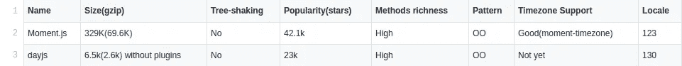

# 为什么要选择 Day.js 而不是 Moment.js？

> 原文：<https://medium.datadriveninvestor.com/https-medium-com-sabesan96-why-you-should-choose-day-js-instead-of-moment-js-9cf7bb274bbd?source=collection_archive---------0----------------------->

## 比较


Photo by [Icons8 team](https://unsplash.com/@icons8?utm_source=unsplash&utm_medium=referral&utm_content=creditCopyText) on [Unsplash](https://unsplash.com/s/photos/time?utm_source=unsplash&utm_medium=referral&utm_content=creditCopyText)

目前，在 Sysco 实验室实习期间，我正在做一个需要 Javascript 框架和库的项目。我的导师兼团队负责人 Nadun Indunil 建议我为 Moment.js 寻找一个替代品，因为它无法处理树抖动，导致了大量的包大小和性能问题。因此，我研究并偶然发现了 Day.js 用于开发。这里我想描述一下如何使用 Day.js，使用 Day.js 的好处是什么，为什么要忽略 Moment.js，这是我第 22 篇关于 Medium 的文章。

javascript 有很多日期库，比如 Moment.js、Luxon、date-fns、Day.js 等。不过虽然上面的库都是可行的，但是这里我只比较 Moment.js 和 Day.js，到了这篇文章的最后，你会意识到我为什么选择了它们。

# Moment.js

## 版本 2.24.0

Moment.js 是一个 Javascript 库，有助于与日期和时间域进行交互。如果您正在处理时间和日期域，大多数人会建议 Moment.js，因为 Moment.js 是 Node.js 和 vanilla JavaScript 中最古老、最知名的日期和时间相关库。更多信息，请查看他们的[官方文档页面。](https://momentjs.com/docs/)


# 天天网

## 版本:1.8.14

Day.js 是 Moment.js. Day 的缩小版。Js 声称拥有 Moment.js 的[相同 API](https://github.com/iamkun/dayjs/blob/dev/docs/en/API-reference.md) ，并将其文件大小减少 97%。没错，其中 Moment.js 全缩小文件总重量为 67，9Kb，DayJS 缩小文件只有 2Kb。这太疯狂了，然而他们支持国际化、插件和其他一切。


下面我将在以下类别下比较 Moment.js 和 Day.js。名称、大小(gzip)、树抖动、流行度(星级)、方法丰富度、模式、时区支持和地区



# 为什么我们忽略 Moment.js

*   它高度基于面向对象的 API，这导致了它不能与树抖动一起工作，从而导致了巨大的包大小和性能问题。
*   由于 OOP APIs 和非纯函数而易变，导致 bug:[https://github . com/moment/moment/blob/develop/src/test/moment/add _ subtract . js # L244-L286](https://github.com/moment/moment/blob/develop/src/test/moment/add_subtract.js#L244-L286)

# 比较代码

## 通过 npm 安装

在您的计算机命令提示符或终端中，您需要在您的工作目录中运行这些命令。

```
*//Moment.js*
**npm install moment***// Day.js*
**npm install dayjs --save**
```

## 从语法上分析

*   **字符串+日期格式**

在字符串+日期格式中，它返回使用给定格式字符串从日期字符串解析的日期。

```
*// Moment.js*
**moment('10-06-1996', 'MM-DD-YYYY');**
*// output => "1995-12-24T13:00:00.000Z"**// dayjs*
**dayjs('10-06-1996');**
*// output => "1996-10-06T13:00:00.000Z"*
```

*   **字符串+时间格式**

在字符串+时间格式中，它返回使用给定格式字符串从日期字符串解析的日期。对于字符串+时间格式，day.js 需要 customParseFormat 插件。

```
*// Moment.js*
**moment('2019-10-06 4:30', 'YYYY-MM-DD HH:mm');**
*// output => "2019-10-06T17:30:00.000Z"**// dayjs requires customParseFormat plugin*
**dayjs('2019-10-06 4:30', 'YYYY-MM-DD HH:mm');**
*// output => "2019-10-06T17:30:00.000Z"*
```

当您在 dayjs 中使用 customParseFormat 插件时，您应该在代码顶部添加以下代码片段。

```
**import customParseFormat from 'dayjs/plugin/customParseFormat';
dayjs.extend(customParseFormat);**
```

*   **字符串+格式+区域设置**

在 String + Format + locale 格式中，它使用给定的格式字符串和区域设置返回从 String 解析的日期。

```
*// Moment.js*
**moment('2019 mars', 'YYYY MMM', 'fr');**
*// => "2019-02-29T13:00:00.000Z"**// dayjs requires customParseFormat plugin* **dayjs('2019 mars', 'YYYY MMM', 'fr');**
*// => "2019-02-29T13:00:00.000Z"*
```

当您在 dayjs 中使用 customParseFormat 插件时，您应该在代码顶部添加以下代码片段。

```
**import customParseFormat from 'dayjs/plugin/customParseFormat';
import 'dayjs/locale/fr';
dayjs.extend(customParseFormat);**
```


Photo by [Thorn Yang](https://unsplash.com/@thorn) on [Unsplash](https://unsplash.com/s/photos/time?utm_source=unsplash&utm_medium=referral&utm_content=creditCopyText)

## 获取+设置

*   **毫秒/秒/分/小时**

我们使用下面这些函数来 ***获取*** 给定日期的毫秒/秒/分/小时。

```
*// Moment.js*
**moment().seconds();**
*//output => 58*
**moment().hours();**
*// output => 18**// dayjs*
**dayjs().second();**
*// output => 58*
**dayjs().hour();**
*// output => 18*
```

在上述方法的性能测试中，Moment.js 用了 ***1500.703ms*** 而*dayjs*只用了 ***494.234ms.*****

**我们使用下面的函数来 ***设置*** 给定日期的毫秒/秒/分/小时。**

```
***// Moment.js*
**moment().seconds(30);**
*// output => "2019-10-06T09:12:30.695Z"*
**moment().hours(13);**
*// output => "2019-10-06T03:12:49.695Z"**// dayjs*
**dayjs().set('second', 30);**
*// output => "2019-10-06T09:12:30.695Z"*
**dayjs().set('hour', 13);**
*// output => "2019-10-06T03:12:49.695Z"***
```

**在上述方法的性能测试中，Moment.js 耗时 ***1689.744ms，*** 和*day . js*耗时 ***2037.603ms*** 。****

*   ****月份日期****

**在库的第一行下面查找以获得一个月中的某一天，在库的第二行设置一个月中的某一天。**

```
***// Moment.js*
**moment().date();**
*// output => 4*
**moment().date(6);**
*// output => "2019-10-06T09:12:49.695Z"**// dayjs*
**dayjs().date();**
*// output => 4*
**dayjs().set('date', 6);**
*// output => "2019-10-06T09:12:49.695Z"***
```

**在上述方法的性能测试中，Moment.js 耗时 ***1381.669ms，*** 和*day js*耗时 ***1218.025ms*** 。****

*   ****星期几****

**在库的第一行下面查找以获得星期几，在库的第二行设置星期几。**

```
***// Moment.js*
**moment().day();**
*// output => 0 (friday)*
**moment().day(-14);**
*// output => "2019-09-26T09:12:49.695Z"**// dayjs*
**dayjs().day();**
*// output => 0 (friday)*
**dayjs().set('day', -14);**
*// output => "2019-09-26T09:12:49.695Z"***
```

**在上述方法的性能测试中，Moment.js 耗时 **1919.404ms，**和*day js*耗时 **1229.475ms** 。****

*   ****一年中的某一天****

**在库的第一行下面查找以获得一年中的某一天，在库的第二行设置一年中的某一天。**

```
***// Moment.js*
**moment().dayOfYear();**
*// output => 277*
**moment().dayOfYear(277);**
*// output => "2019-10-04T09:12:49.695Z"**// dayjs requires dayOfYear plugin*
**dayjs().dayOfYear();**
*// output => 277*
**dayjs().dayOfYear(277);**
*// output => "2019-10-04T09:12:49.695Z"***
```

**当你在 dayjs 中使用 dayofYear 插件时，你应该在你的代码顶部添加下面的代码片段。**

```
****import dayOfYear from 'dayjs/plugin/dayOfYear';
dayjs.extend(dayOfYear);****
```

*   ****一年中的第几周****

**在库的第一行下面查找以获得一年中的星期，在库的第二行设置一年中的星期。**

```
***// Moment.js*
**moment().week();**
*// output => 40*
**moment().week(41);**
*// output => "2019-10-11T09:12:49.695Z"**// dayjs requires weekOfYear plugin*
**dayjs().week();**
*// output=> 40*
**dayjs().week(41);**
*// output => "2019-10-11T09:12:49.695Z"***
```

**当你在 dayjs 中使用 weekofYear 插件时，你应该在你的代码顶部添加下面的代码片段。**

```
****import weekOfYear from 'dayjs/plugin/weekOfYear';
dayjs.extend(weekOfYear);****
```

*   ****一个月中的天数****

**我们使用下面的函数来获得当月的天数。**

```
***// Moment.js*
**moment('2020-02', 'YYYY-MM').daysInMonth();**
*// output => 29**// dayjs*
**dayjs('2020-02').daysInMonth();**
*// output => 29***
```

**在上述方法的性能测试中，Moment.js 用了 **4415.065ms，**和*dayjs*只用了*1922.774 ms。*****

*   ***一年中的周数***

***根据 ISO 周数，我们使用下面的函数来获得今年的周数。我们使用下面的函数来获得当月的天数。***

```
****// Moment.js*
**moment().isoWeeksInYear();**
*// output => 52**// dayjs requires isoWeeksInYear plugin* **dayjs().isoWeeksInYear();**
*// output => 52****
```

**当您在 dayjs 中使用 isoWeeksInYear 插件时，您应该在代码顶部添加以下代码片段。**

```
****import isoWeeksInYear from 'dayjs/plugin/isoWeeksInYear';
dayjs.extend(isoWeeksInYear);****
```

*   ****给定日期的最大值&最小值****

**在库的第一行下面返回给定日期的最大值(最遥远的将来),在库的第二行下面返回给定日期的最小值(最遥远的将来)。**

```
****const array = [
  new Date(1996, 10, 06),
  new Date(1994, 6, 18),
  new Date(1993, 5, 25),
  new Date(1959, 10, 4),
];***// Moment.js*
**moment.max(array.map(a => moment(a)));**
*// output => "1996-11-06T13:00:00.000Z"* **moment.min(array.map(a => moment(a)));** *// output => "1959-11-04T13:00:00.000Z"**// dayjs requires minMax plugin* **dayjs.max(array.map(a => dayjs(a)));**
*// output => "1996-11-06T13:00:00.000Z"* **dayjs.min(array.map(a => dayjs(a)));** *// output => "1959-11-04T13:00:00.000Z"***
```

**当你在 dayjs 中使用 minMax 插件时，你应该在你的代码顶部添加下面的代码片段。**

```
****import minMax from 'dayjs/plugin/minMax';
dayjs.extend(minMax);****
```

****

**Photo by [Djim Loic](https://unsplash.com/@loic?utm_source=unsplash&utm_medium=referral&utm_content=creditCopyText) on [Unsplash](https://unsplash.com/s/photos/time?utm_source=unsplash&utm_medium=referral&utm_content=creditCopyText)**

## **操作**

*   ****加&减****

**下面写的第一行用于给定日期加上指定的天数，第二行用于从给定日期减去指定的天数。**

```
***// Moment.js*
**moment().add(7, 'days');**
*// output => "2019-10-13T09:12:49.695Z"* **moment().subtract(7, 'days');**
*// output => "2019-09-29T09:12:49.695Z"**// dayjs*
**dayjs().add(7, 'day');** *// output => "2019-10-13T09:12:49.695Z"* **dayjs().subtract(7, 'day');**
*// output => "2019-09-29T09:12:49.695Z"***
```

**在 add 方法的性能测试中，Moment.js 耗时 ***1309.485ms，*** 和*day js*耗时 ***1911.881ms*** 。在减法方法的性能测试中，Moment.js 耗时 ***1278.384ms，*** 和*dayjs*耗时 ***1772.593ms*** 。******

*   ****时间开始&时间结束****

**库的第一行返回给定日期的时间单位的开始，库的第二行返回给定日期的时间单位的结束。**

```
***// Moment.js*
**moment().startOf('month');**
*// output => "2019-09-31T14:00:00.000Z"*
**moment().endOf('day');**
*// output => "2019-10-04T13:59:59.999Z"**// dayjs*
**dayjs().startOf('month');**
*// output => "2019-09-31T14:00:00.000Z"*
**dayjs().endOf('day');**
*// output => "2019-10-04T13:59:59.999Z"***
```

**在启动时间方法的性能测试中，Moment.js 用了 ***1078.948ms，*** 和*dayjs*用了 ***765.358ms*** 。在时间结束方法的性能测试中，Moment.js 耗时 **1241.304ms，**和*day js*耗时 **914.425ms** 。******

****

**Photo by [Kevin Ku](https://unsplash.com/@ikukevk?utm_source=unsplash&utm_medium=referral&utm_content=creditCopyText) on [Unsplash](https://unsplash.com/s/photos/time?utm_source=unsplash&utm_medium=referral&utm_content=creditCopyText)**

## **显示**

*   ****格式****

**我们使用下面的函数来返回给定格式的格式化日期字符串。**

```
***// Moment.js* **moment().format('dddd, MMMM Do YYYY, h:mm:ss A');** *// output => "Friday, October 4th 2019, 7:12:49 PM"* **moment().format('ddd, hA');** *// output => "Fri, 7PM"**// dayjs* **dayjs().format('dddd, MMMM D YYYY, h:mm:ss A');** *// output => "Friday, October 4th 2019, 7:12:49 PM"* **dayjs().format('ddd, hA');** *// output => "Fri, 7PM"
// dayjs requires advancedFormat plugin to support more format tokens* **dayjs().format('dddd, MMMM Do YYYY, h:mm:ss A');** *// output => "Friday, October 4th 2019, 7:12:49 PM"***
```

**在 dayjs 中使用 advancedFormat 插件时，应该在代码顶部添加下面的代码片段。**

```
****import advancedFormat from 'dayjs/plugin/customParseFormat';
dayjs.extend(advancedFormat);****
```

*   ****从现在起的时间****

**我们使用下面的函数来返回从现在开始的时间。下面 dayjs 中使用的相对时间插件的舍入方法不同于 moment.js 和 date-fns，请小心使用。从 1970 年 1 月 1 日 00:00:00 UTC 开始以毫秒为单位的时间倒计时。**

```
***// Moment.js* **moment(1568751159000).fromNow();** *// output => "14 days ago"**// dayjs requires relativeTime plugin* **dayjs(1536484369695).fromNow();** // *output* => "*15 days ago*"**
```

**当你在 dayjs 中使用 relativeTime 插件时，你应该在你的代码顶部添加下面的代码片段。**

```
****import relativeTime from ‘dayjs/plugin/relativeTime’;
dayjs.extend(relativeTime);****
```

*   ****从 x 开始的时间****

**我们使用下面的函数从 x 返回时间。**

```
***// Moment.js* **moment([2019, 10, 04]).to(moment([2019, 10, 06]));** *// output => "in 2 days"**// dayjs requires relativeTime plugin* **dayjs('2019-10-04').to(dayjs('2019-10-06'));** *// output => "in 2 days"***
```

**当你在 dayjs 中使用 relativeTime 插件时，你应该在你的代码顶部添加下面的代码片段。**

```
****import relativeTime from ‘dayjs/plugin/relativeTime’;
dayjs.extend(relativeTime);****
```

*   ****差异****

**我们使用下面的函数来获取给定日期之间的时间单位。**

```
***// Moment.js* **moment([2019, 10, 04]).diff(moment([2019, 10, 06]));** *// output => -172800000* **moment([2019, 10, 04]).diff(moment([2019, 10, 06]), 'days');** *// output => -2**// dayjs* **dayjs('2019-10-04').diff(dayjs('2019-10-06'), 'milliseconds');** *// output => -172800000* **dayjs('2019-10-04').diff(dayjs('2019-10-06'), 'days');** *// output => -2***
```

****

**Photo by [Markus Spiske](https://unsplash.com/@markusspiske?utm_source=unsplash&utm_medium=referral&utm_content=creditCopyText) on [Unsplash](https://unsplash.com/s/photos/display-time?utm_source=unsplash&utm_medium=referral&utm_content=creditCopyText)**

## **询问**

**下面给出的所有查询函数都将返回一个布尔值。**

*   ****在**之前**

**我们使用下面的函数来检查一个日期是否在另一个日期之前。**

```
***// Moment.js* **moment(‘2019–10–04’).isBefore(‘2019–10–06’);** *// output => true**// dayjs* **dayjs(‘2019–10–04’).isBefore(‘2019–10–06’);** *// output => true***
```

*   ****同****

**我们使用下面的函数来检查一个日期是否与另一个日期相同。**

```
***// Moment.js* **moment(‘2019–10–04’).isSame(‘2019–10–06’);** *// output => false* **moment(‘2019–10–04’).isSame(‘2019–10–04’);** *// output => true* **moment(‘2019–10–04’).isSame(‘2019–10–06’, ‘month’);** *// output => true**// dayjs* **dayjs(‘2019–10–04’).isSame(‘2019–10–06’);** *// output => false* **dayjs(‘2019–10–04’).isSame(‘2019–10–04’);** *// output => true* **dayjs(‘2019–10–04’).isSame(‘2019–10–06’, ‘month’);** *// output => true***
```

*   ****在**之后**

**我们使用下面的函数来检查一个日期是否在另一个日期之后。**

```
***// Moment.js* **moment(‘2019–10–06’).isAfter(‘2019–10–04’);** *// output => true**// dayjs* **dayjs(‘2019–10–06’).isAfter(‘2019–10–04’);** *// output => true***
```

*   ****在**之间**

**我们使用下面的函数来检查一个日期是否在两个日期之间。**

```
***// Moment.js* **moment(‘2019–10–05’).isBetween(‘2019–10–04’, ‘2019–10–06’);** *// output => true**// dayjs requires isBetween plugin* **dayjs(‘2019–10–05’).isBetween(‘2010–10–04’, ‘2010–10–06’);** *// output => true***
```

**当你在 dayjs 中使用 isBetween 插件时，你应该在你的代码顶部添加下面的代码片段。**

```
****import isBetween from ‘dayjs/plugin/isBetween’;
dayjs.extend(isBetween);****
```

*   ****是闰年****

**我们使用下面的函数来检查一年是否是闰年。**

```
***// Moment.js* **moment([2020]).isLeapYear();** *// output => true**// dayjs requires isLeapYear plugin* **dayjs(‘2020–01–01’).isLeapYear();** *// output => true***
```

**当你在 dayjs 中使用 isLeep 插件时，你应该在你的代码顶部添加下面的代码片段。**

```
****import isLeapYear from ‘dayjs/plugin/isLeapYear’;
dayjs.extend(isLeapYear);****
```

*   ****是日期****

**我们使用下面的函数来检查一个变量是否是本地 js 日期对象。**

```
***// Moment.js* **moment.isDate(new Date());** *// output => true**// dayjs* **dayjs(new Date()).isValid();** // *output* => true**
```

****

**Photo by [Caspar Camille Rubin](https://unsplash.com/@casparrubin?utm_source=unsplash&utm_medium=referral&utm_content=creditCopyText) on [Unsplash](https://unsplash.com/s/photos/query?utm_source=unsplash&utm_medium=referral&utm_content=creditCopyText)**

# **结论**

**Moment.js 和 Day.js 在功能上都很有效，但在性能上，Day.js 比 Moment.js 更好。我们可以说 Day.js 是一个缩小的 Moment.js。尝试 Day.js 并对本文做出回应，并继续关注我的真实实现示例。**

*****感谢您阅读至此。如果你喜欢这篇文章，请分享、评论并发表👏几次(最多 50 次)。。。也许会对某个人有帮助。*****

*****关注我的*** [***推特***](https://twitter.com/TheSabesan) ***和 Medium 如果你对未来更深入、更翔实的类似文章感兴趣的话！*****