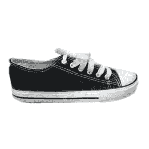
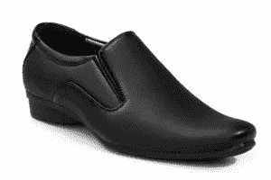
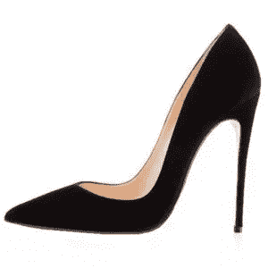
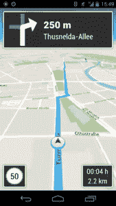
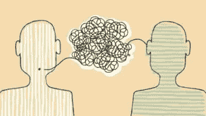
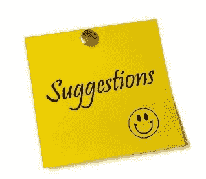
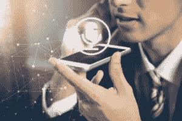

# 机器学习中的人类偏见

> 原文：<https://medium.datadriveninvestor.com/human-biases-in-machine-learning-92dd04793572?source=collection_archive---------4----------------------->

# 机器学习中的人类偏见

所以我们先举个例子来了解一下什么是人类偏见:-
看完这行字闭上眼睛，想想一只鞋是什么样子的……..
好的，停下来，让我看看一只鞋
有人想象过这个吗？

还是这个？

还是这个？？

我们不知道为什么，但我们每个人都偏爱一只鞋，而不是另一只。
想象一下，你正在教计算机识别一只鞋，而无意中你让它偏向一只鞋，然后是另一只。
机器学习中的偏见就是这样产生的。

 [## DDI 编辑推荐:5 本让你从新手变成专家的机器学习书籍|数据驱动…

### 机器学习行业的蓬勃发展重新引起了人们对人工智能的兴趣

www.datadriveninvestor.com](https://www.datadriveninvestor.com/2019/03/03/editors-pick-5-machine-learning-books/) 

**现在机器学习在日常生活中帮助我们:-**
1。)它给我们导航，告诉我们如何从一个地方到达另一个地方。

2.)它给我们翻译。

3.)它给我们建议。

4.)甚至理解我们对它说的话。

在传统的编程中，程序员编写代码来解决这些问题，但是通过机器学习，我们教会计算机解决这些问题，并通过数据进行学习。

这并不是说，如果某样东西是基于数据，它就是中立的，我们人类的偏见也有很多机会提取这些数据。
完全消除人类的偏见**是不可能的**。
所以我们人类的偏见在许多方面成为了我们创造的技术的一部分。

**交互偏差**
正如最近的游戏中所做的，许多人被要求为计算机画一只鞋，大多数人画第一个图像，并让计算机有偏差地识别第三只鞋的图像。

**潜在偏见**
例如，如果我们正在训练计算机如何从一位过去的物理学家的图像中识别出一位物理学家的长相，由于大多数过去的物理学家都是男性，这使得计算机在识别女性物理学家时存在偏见。

**选择偏差**
它是基于你用来训练模型的数据的选择。
例如，你正在训练一个模型来检测人脸，你必须拍摄全球各地的人的照片，否则模型会偏向一个人。