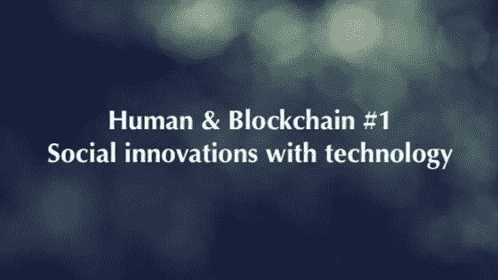

# 人类和区块链#1:技术的社会创新

> 原文：<https://medium.datadriveninvestor.com/human-blockchain-1-social-innovations-with-technology-8e4c9114041d?source=collection_archive---------29----------------------->

加密狂潮让人们关注最新的分布式账本技术，但也让机会主义者和骗子关注，这危及了整个空间的声誉。在对区块链的[众筹进行了为期一年的实验后，人们不应该只是留下一堆没有公用设施的代币，而是应该尝试考虑如何以更积极的方式利用这种提高效率、最小化成本和增强透明度的技术——推动社会影响。它不应该仅仅是一个宣传，而是一个坚实的工具，在各个方面促进创新，以提高人类的生活质量。](https://www.ethereum.org/crowdsale) [BlockImpact](https://blockimpact.tech/) 将推出为期一年的“人类&区块链系列”选集，以人道主义的方式描绘分布式账本技术(DLT)如何为每个部分、每个人和每个地方带来巨大的社会影响。今年， [BlockImpact](https://blockimpact.tech/) 将在文章中讨论区块链可以创新各个方面，如慈善事业，教育，民主，能源和财政援助。

当然，我们是从整体景观出发的！

# 慈善和援助

区块链能够为慈善领域做出的有益贡献是，在整个捐赠过程中逐步启动透明的跟踪流程。多亏了最新的技术，[我们可以识别出哪些捐赠者、接受者和中介参与了整个过程](https://cointelegraph.com/explained/blockchain-in-charity-explained)。与此同时，建立在区块链上的智能合同层能够设置可编程的条件，以避免资金在到达[之前被支付，对参与慈善交易的人进行适当和广泛的 KYC 过程](https://home.kpmg/xx/en/home/insights/2018/02/blockchain-kyc-utility-fs.html)。这无疑带来了整个过程的透明性、安全性、完整性和成本降低。越来越多的用例将在接下来的文章中涉及。

# 教育

保持简单，想象一下分散的分类账作为一个不变的数据库工作。在教育领域，[得益于区块链技术，从出勤到付款的所有学生记录都可以清晰地制作出来。最重要的是，没有不可逆的账本，学生资格很容易被可能伪造或撒谎的人篡改。在没有第三方验证的情况下，区块链技术使人们能够对学生的多个高等教育机构进行尽职调查，这可以防止黑客破坏和更改机构数据库中的个人信息。](https://www.forbes.com/sites/tomvanderark/2018/08/20/26-ways-blockchain-will-transform-ok-may-improve-education/)

# 活力

能源是我们应该研究的另一个角度，如何在实际应用中放大区块链的潜力。特别是，分布式账本可以提高[现有框架的效率，包括实用程序和应用程序](https://www.pwc.com/gx/en/industries/energy-utilities-resources/publications/opportunity-for-energy-producers.html)。一个基于区块链的分散式能源平台有望在数据控制和点对点能源交易方面为消费者[提供更多自由。由于智能合同协议，该技术可以让人们绕过传统金融机构，处理更高效的交易，同时实现能源市场的货币化和民主化，同时提高透明度和信任度。](https://www.powerengineeringint.com/articles/2018/12/scientists-say-blockchain-delivering-on-energy-promises.html)

# 民主、治理和身份

此外，在区块链技术的帮助下，零知识证明能够方便在社会福利系统中的重复验证，这[避免了在没有政府机构的传输和监控的情况下验证敏感数据](https://news.coinsquare.com/fr/government/blockchain-government-data/)。最终，我们预计区块链技术将被用于简化和民主化政府数据库的后勤工作。与此同时，为了降低政治或经济制度带来的不确定性，我们更倾向于依赖技术——让可编程程序唱歌。我们现在可以确保投票结果得到透明和合法的处理。

# 跨境支付和小额信贷

跨境支付和小额信贷是金融和区块链世界之间全球超过 20 亿无银行账户人群的先决条件。金融普惠的机会是巨大的。利用分散式分类账、降低交易结算成本和时间、[最大限度地降低基础设施需求和集成数字身份](http://pubdocs.worldbank.org/en/710961476811913780/Session-5C-Pani-Baruri-Blockchain-Financial-Inclusion-Pani.pdf)是这项技术为第三世界国家的人们解除银行束缚所提供的。这只是一个关于分布式账本技术和社会影响如何结合的总选集。

在接下来的文章中，BlockImpact 将从慈善事业、捐赠和慈善事业的角度出发，寻找它们的协同作用！下周见！

⋯

中文版:[https://block impact . tech/2019/01/15/% E3 % 80% 8A % E4 % BA % BA % E8 % 88% 87% E5 % 8C % BA % E5 % 9D % 97% E9 % 93% BE-1% E3 % 80% 8B % EF % BC % 9A % E4 % BB % A5 % E7 % A7 % 91% E6 % 8A % 80% E5 % 88% 9B % E9 % 80% A0 % E7](https://blockimpact.tech/2019/01/15/%E3%80%8A%E4%BA%BA%E8%88%87%E5%8C%BA%E5%9D%97%E9%93%BE-1%E3%80%8B%EF%BC%9A%E4%BB%A5%E7%A7%91%E6%8A%80%E5%88%9B%E9%80%A0%E7%A4%BE%E4%BC%9A%E5%85%B1%E8%9E%8D/)