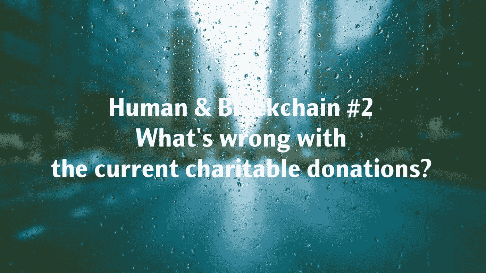
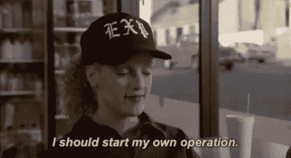

# 人类&区块链#2:现在的慈善捐赠怎么了？

> 原文：<https://medium.datadriveninvestor.com/human-blockchain-2-whats-wrong-with-current-charitable-donations-18acca2e8347?source=collection_archive---------22----------------------->

每当向慈善机构捐款时，我们大多数人通常会期望你的钱几乎全部用于实现某些社会目标，这可以成为让世界变得更好的催化剂。然而，近年来世界各地关于慈善欺诈的头条新闻打破了我们的泡沫。

作为一个负责任和聪明的公民，我们确实需要一个工具来监测和研究我们的艾滋病去了哪里。作为一个分布式账本，区块链具有帮助确保捐赠安全和透明的潜力，这可能会理想地解决慈善组织当前的问题，并在无信任技术的基础上建立社会信任。今天，让我们在本文中首先关注捐赠者和慈善机构面临的困境。

# 信任危机

这些年来，慈善事业因许多“骗局”而臭名昭著，因为一些著名的慈善机构和基金会被报道丢失了大量捐款。2013 年，中国红十字会被揭露，当地艺术家为建设艺术学校和四川地震灾后重建工作捐赠的价值超过 8000 万元的资金被[秘密用于其他项目](https://www.bbc.com/news/world-asia-china-22334567)。2018 年的[乐施会丑闻](https://www.ft.com/topics/organisations/Oxfam)动摇了富裕捐赠者对大型慈善机构的信心，特别是由于他们在该领域缺乏透明度。

我们明白，我们对这些中央慈善机构的信任正在消退。这种情况甚至会导致组织内部资金链的失衡和紧张，因为组织的运作离不开人们的爱心捐赠。因此，一些捐助者选择绕过慈善机构，直接向受援者提供援助，这需要更多的时间和努力。同时，作为个人，他/她在艾滋病方面不依赖中介的力量在传统的慈善事业中是非常有限的。仅由个人或少数群体做出的努力缩小了捐助者援助的范围，减少了受援者的数量。这场信任危机的最大受害者是急需资金帮助重建家园、打破壁垒、追求自己理想的受助群体。

由于各种技术和成本原因，目前的慈善机构很难透明地披露这些善款以及它们是如何使用的。这些组织很容易违反规定滥用资金，而且无法跟踪或追溯。即使在网络平台上记录了金钱的趋势和用途，仍然难以防止欺诈，因为记录可以在未经允许的情况下被涂改和修改。自从众筹平台出现以来，慈善已经成为所有人都可以参与的事情。但很多平台对受助人提交的资料审核不够严格。识别捐赠者的个人信息和捐赠项目需要花费大量的时间和精力。只能靠亲戚朋友担保转发。它的力量还是很微薄的。这些痛点让人们很难重拾对慈善事业的信心。

然而，去中心化的区块链技术将每一笔交易都分布在多个用户的账户节点下，这赋予了捐赠者“监督权”，使账户更加公平、透明。

# 运营成本高

这显示了扣除获得捐款的成本后剩下的私人捐款的百分比。所有 100 家慈善机构的平均值是 89%，这意味着筹集 1 美元需要花费 11 美分。

捐赠流程从进入机构的中央账户开始，然后由机构处理操作。这样资金就层层发放到受助人手中，这种多层次的操作无疑增加了成本。这些致命且低效的过程不仅消耗大量的人力，而且耗费时间。区块链上的交易可以点对点进行。您可以直接向指定的人或机构捐款，无需多家银行和机构的中介支持，这将有效降低服务费。

在区块链技术的底层，引入了智能合约，以便在捐赠之前可以规范资金的使用规则，并可以专用资金。公众捐赠的资金会在智能合约规则下直接流向符合捐赠条件的事件或人。不会出现信息不清、不公开、擅自挪用、贪污等违法行为。区块链技术还可以简化流程，降低慈善事业的运营成本。

# 多方面的需求

今天，各种慈善机构都有不同的接受者群体和目的。慈善逐渐成为社会的时尚和潮流，而越来越多的公司正在开展创造性的企业社会责任项目，以提高他们的声誉，并接触到更多的普通人。人们倾向于更频繁地欣赏和参与这些慈善活动。

[蚂蚁森林](http://chinaplus.cri.cn/mychina/life/35/20171027/44853.html)由[支付宝](https://www.alipay.com/)推广。用户通过步行、公共交通、网上购物等方式减少碳排放。这些动作被记录下来，用来种一棵虚拟的树，会被非营利组织“买”走，在某个地方种一棵实体的树。据估计，用户种植的树木数量超过 5500 万棵。由于这个市场很大，选择很多，很难形成统一管理。选择接受帮助的人通常仅限于几个知名慈善机构的捐赠者。在这种情况下，有必要为慈善家建立一个整合的平台，为他们提供更多的选择。

现在我们已经指出了慈善机构面临的大多数障碍。在下一篇文章中，“人类和区块链”将涵盖分布式账本技术试图应对现实中慈善和艾滋病问题的方式。

⋯

网址:[https://block impact . tech](https://blockimpact.tech/?p=395)/