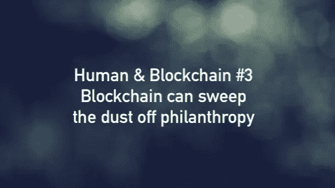

# 人类和区块链#3:区块链可以扫除慈善事业的灰尘

> 原文：<https://medium.datadriveninvestor.com/human-blockchain-3-blockchain-can-sweep-the-dust-off-philanthropy-f65beece2bab?source=collection_archive---------24----------------------->

慈善领域普遍存在各种痛点。据估计，这些非营利机构在全球价值 2 万亿美元(T1 ),不时被卷入一些臭名昭著的头条新闻(T2 )( T3 ),如资金滥用、低效率和误导性支出。显然，我们现在需要一个解决方案，分布式 ledger 是候选方案之一。

# 为什么我们需要分布式分类账

**提高透明度。**得益于分布式账本技术，捐赠者交易的透明度将得到提升——我们现在可以通过一个简单的区块链浏览器(如 [Etherscan](https://etherscan.io/) )来跟踪资金的使用方式和地点。与加密到加密的传输类似，重要的交易信息，如交易散列、收据状态、时间戳，甚至汽油费都可以在一个网页上获得，完美地实现了真正的开放。因此，区块链不可逆转和不可擦除的属性为非营利组织和捐助者提供了可追踪的捐助跟踪责任。

**减少官僚作风和成本。我们知道，通过传统捐赠程序[涉及一长串中间人，比如官方机构、金融机构，甚至票据交换所](https://www.ocregister.com/2014/02/24/are-you-donating-your-car-to-charity-or-for-profit-middlemen/)。如果我们直接通过分布式账本来执行援助，慈善机构将无需其他第三方立即以成本的一小部分来收集资金。这大概有助于打破政府、企业和公民之间的官僚主义，并通过不可信的技术建立信任。与此同时，智能合同使捐赠者能够在没有达到捐赠目标或其他预定条件的情况下自动收回资金。**

**在物理和数字之间架起桥梁。**数字支付时代已经过去了近五年，这确实极大地促进了物理和数字世界的融合，更不用说慈善事业了。然而，为了促进有形或无形资产的所有权，集成分布式分类帐技术应该是在捐赠流程中表示[识别流程](https://www.ibm.com/blockchain/solutions/identity)的先决条件。此后，令牌化的资产，尤其是资产支持的稳定硬币将在整个数字捐赠机制中发挥重要作用。

# 现在是什么

通过区块链捐赠不再是一个梦想，而是实实在在的。

**是否涉及个人？是的。**

[菠萝基金](https://cryptobriefing.com/pineapple-fund-shuts-down-55m-in-btc/)成立于 2017 年，由一位匿名捐赠者运营，向全球 60 家慈善机构捐赠了 5104 BTC——价值超过 5500 万美元。菠萝基金支持的一部分基金会有点传统。其中一个重要的受益者是[水项目](https://thewaterproject.org/)，该项目旨在为撒哈拉以南非洲地区的人们提供安全、清洁的饮用水。

**是否涉及自发的慈善项目？是的。**

个人并不孤独，但只有我们齐心协力才能做出有意义的事情。由于 2017 年的秘密宣传，各种以社会影响为导向的令牌项目已经建立，其目标是为其领域内的慈善机构服务。例如,[清水硬币](http://www.cleanwatercoin.org/)就是作为一种在公众中筹集资金的工具而设立的。与[CharityWater.org](https://www.charitywater.org/)合作，净水币正在令牌网络中建立一个独特的功能，因此每个矿工或用户都将帮助拯救世界各地的生命——每个交易所将把 0.1%的交易所分配给慈善钱包，情况是这样的:每当用户开采 100 个净水币并请求从采矿池中支付时，1%的净水币资金将被发送到大众慈善钱包，其余的将被发送到用户的钱包。

**真的涉及传统非营利组织吗？是啊！**

美国最大的捐助者咨询基金 Fidelity Charitable 在其年度报告中表示，这家全球慈善机构在 2017 年收到了来自 169 个不同捐助者的价值近 7000 万美元的加密捐款。

2017 年另一个有希望的慈善加密实验是[联合国(UN)利用以太坊区块链为叙利亚难民执行了第一笔官方加密交易](https://www.coindesk.com/united-nations-sends-aid-to-10000-syrian-refugees-using-ethereum-blockchain)。联合国世界粮食计划署发起的项目向约旦的 10 000 多名叙利亚难民提供了基于加密货币的食品券，这些食品券可以在真实市场上兑换。该计划带来的最大好处是消除了整个生态系统中包括金融机构在内的中间人，同时增强了受益人的隐私和账户对账的效率。此外，联合国开发计划署(UNDP)和区块链慈善基金会(BCF)宣布建立战略合作伙伴关系，以实现将区块链技术用于社会公益的共同目标。BCF 是由顶级加密货币交易所币安和马耳他总统信托基金会[共同创立的非营利组织，BCF 向 UNDP 第 73 届联合国大会捐赠了 100 万美元。](http://www.asia-pacific.undp.org/content/rbap/en/home/presscenter/pressreleases/2018/blockchain-charity-foundation-and-undp-announce-partnership-to-e.html)

除了联合国，我们了解到越来越多的传统非营利组织，如[红十字会和救助儿童会，目前通过比特币支付门户网站接受加密货币——bit give、BitPay、区块链慈善基金会和 BitHope。特别是 BitGive 的慈善活动，到目前为止已经筹集了几千英镑，这个数额接近普通的众筹努力。](https://medium.com/@pauljlamb/crypto-philanthropy-how-bitcoin-and-blockchain-are-disrupting-the-philanthropic-sector-80716dc7cb68)[引用 BitGi](https://www.forbes.com/sites/rebeccacampbell1/2018/12/05/bitgive-launches-bitcoin-donation-platform-givetrack-1-0-supports-four-new-non-profits/) ve 创始人兼执行董事 Connie Gallippi 的话来说，区块链让人们能够在全球范围内无国界地转移资金，比旧的方式要高效得多——同时通过向公众提供资金的透明路径，以及 BitGive 的比特币捐赠平台——give track 也有同样的雄心。

# 下一步是什么

个人、慈善项目以及现在的非营利机构。似乎分布式账本技术的潜力将在未来几年得到放大，从慈善的角度来看，这可以作为社会影响的催化剂。当然，我们不仅要考虑产生的每一个机会，还要不断思考障碍和瓶颈。在即将到来的“人类与区块链#4”中， [BlockImpact](https://blockimpact.tech/) 将阐明这场社会和技术革命中目前的障碍，并展示我们预期的未来蓝图。