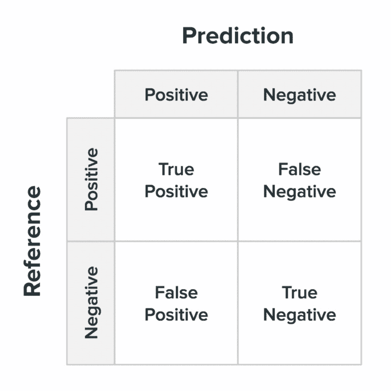
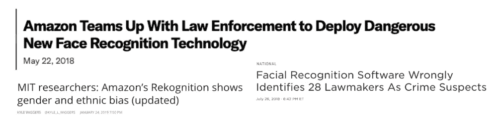
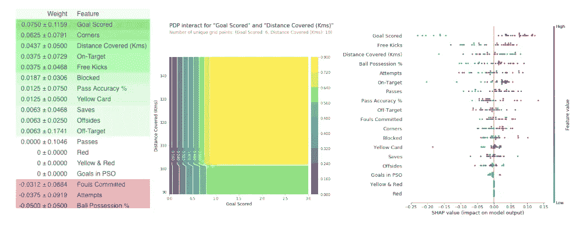
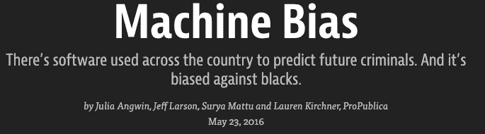

# 以人为中心的可解释机器学习

> 原文：<https://medium.datadriveninvestor.com/human-centric-interpretable-machine-learning-5efae9ebd551?source=collection_archive---------4----------------------->

## 我的关于机器学习可解释性的文章汇编。

Source: [Human-Centered Machine Learning by Jess Holbrook](https://medium.com/google-design/human-centered-machine-learning-a770d10562cd)

你有没有想过，为什么你的一封重要邮件被标记为垃圾邮件，为什么 Spotify 一直推荐一首特定的歌曲，或者为什么你在网飞上被推荐一部恐怖片？

 [## DDI 编辑推荐:5 本机器学习书籍，让你从新手变成数据驱动专家…

### 机器学习行业的蓬勃发展重新引起了人们对人工智能的兴趣

www.datadriveninvestor.com](https://www.datadriveninvestor.com/2019/03/03/editors-pick-5-machine-learning-books/) 

嗯，偶尔我们可能会想知道这些是如何工作的，但由于这对我们的生活没有如此直接的影响，我们学会了接受算法为我们做出的选择。然而，**当机器学习模型用于直接影响人类群体的任务时，可解释性问题变得至关重要**如下所示:

或者这样:

这里还有一个:

[Source](https://epaper.timesgroup.com/Olive/ODN/TimesOfIndia/#)

因此，很明显，当最大似然算法用于人类环境时，能够解释它们的结果变得更加重要。

# #可解释性是用可理解的术语向人类解释的能力

## [可解释机器学习](https://towardsdatascience.com/interpretable-machine-learning-1dec0f2f3e6b?source=friends_link&sk=784990a990726c4f1ef82e7d6a359630)

Techniques for extracting insights from ML models

可解释性意味着从任何机器学习模型中提取人类可以理解的见解。机器学习模型被许多人贴上了“黑箱”的标签。这意味着，尽管我们可以从中获得准确的预测，但我们无法清楚地解释或识别这些预测背后的逻辑。

通过这篇文章，我提出了一些有助于从模型中提取洞察力的技术:

[**1。排列重要性**](https://medium.com/p/1dec0f2f3e6b#52e6)

**2。** [**部分依赖情节**](https://towardsdatascience.com/interpretable-machine-learning-1dec0f2f3e6b#b793)

[**3。SHAP 价值观**](https://medium.com/p/1dec0f2f3e6b#dbca)

[**4。SHAP 价值观的高级用途**](https://medium.com/p/1dec0f2f3e6b#438b)

[**5。石灰**](https://arxiv.org/pdf/1602.04938.pdf)

# #可解释性是满足道德问题和培养信任所必需的

## [你的机器学习模型有偏差吗？](https://towardsdatascience.com/is-your-machine-learning-model-biased-94f9ee176b67?source=friends_link&sk=7ab6f63c928f26c3407b940e1fe73043)

[https://www.propublica.org/article/machine-bias-risk-assessments-in-criminal-sentencing](https://www.propublica.org/article/machine-bias-risk-assessments-in-criminal-sentencing)

一篇关于衡量模型公平性和决定最佳公平性度量的文章。机器学习已经在许多应用和领域证明了它的实力。然而，机器学习模型的工业应用的关键障碍之一是确定用于训练模型的原始输入数据是否包含歧视性偏见。这是一个重要的问题，可能有伦理和道德的含义。然而，对此并没有单一的解决方案。对于模型的输出影响人们的情况，将公平置于利润之前是明智的。

# #功能属性之外的可解释性

## [TCAV(用概念激活向量进行测试)](https://towardsdatascience.com/tcav-interpretability-beyond-feature-attribution-79b4d3610b4d)

大多数机器学习模型被设计成操作**低级特征**，比如图片中的边缘和线条，或者说单个像素的颜色。这与人类更熟悉的**高级概念**非常不同，比如斑马身上的条纹。用概念激活向量(TCAV)进行测试是来自谷歌人工智能团队的一项新的可解释性倡议。概念激活向量(CAV)根据人类友好的概念提供了对神经网络内部状态的解释。TCAV 使用方向导数来量化用户定义的概念对分类结果的重要程度，例如，“斑马”的预测对条纹的存在有多敏感。

# #每个人都可以理解

## [使用“假设工具”调查机器学习模型。](https://towardsdatascience.com/using-what-if-tool-to-investigate-machine-learning-models-913c7d4118f?source=friends_link&sk=366a27847df42e34ed12b75d0072ab08)

Capabilities of What-If Tool

[**假设分析工具**](https://pair-code.github.io/what-if-tool) 是一款交互式可视化工具，旨在研究机器学习模型。缩写为 WIT，它使人们能够检查、评估和比较机器学习模型，从而能够理解分类或回归模型。由于其用户友好的界面和对复杂编码的较少依赖，每个人，无论是开发人员、产品经理、研究人员还是学生，都可以出于自己的目的使用它。

该工具的目的是为人们提供一种简单、直观和强大的方法，仅通过可视化界面在一组数据上使用经过训练的 ML 模型，而无需编码。

# #建模前的可解释性

## [用 Google 的 FACETS 可视化机器学习数据集。](https://towardsdatascience.com/visualising-machine-learning-datasets-with-googles-facets-462d923251b3?source=friends_link&sk=f16fe74f4a452500529bfdfb2bc67ccc)

FACETS in action

如今，EDA 扮演着重要的角色，因为从探索性数据分析(EDA)中获得的见解被用于战略业务决策。EDA 有助于展示数据的重要方面，并使我们能够从不同的角度理解我们的数据。EDA 允许用户发现异常值，了解输入变量之间的关系，并识别潜在的数据质量问题，甚至在模型构建过程之前。

Facets 是 Google 在 [**对**](https://ai.google/research/teams/brain/pair) **(人+ AI 研究)**倡议下发布的开源可视化工具。这个工具帮助我们理解和分析机器学习数据集。Facets 由两个可视化部分组成— **Facets Overview** 和 **Facets Dive，**这两个部分都有助于挖掘数据并提供很好的洞察力，而不需要用户做太多工作。

# 结论

机器学习是一种非常强大的工具，正越来越多地以多方面的方式使用。因此，我们必须负责任地使用它。如今，机器学习模型越来越多地被用于做出影响人们生活的决策。有了这种权力，就有责任确保模型预测是公平的，没有歧视。正如桑德尔·皮帅所说，“仅仅知道一个模型是否有效是不够的，我们需要知道它是如何工作的。”