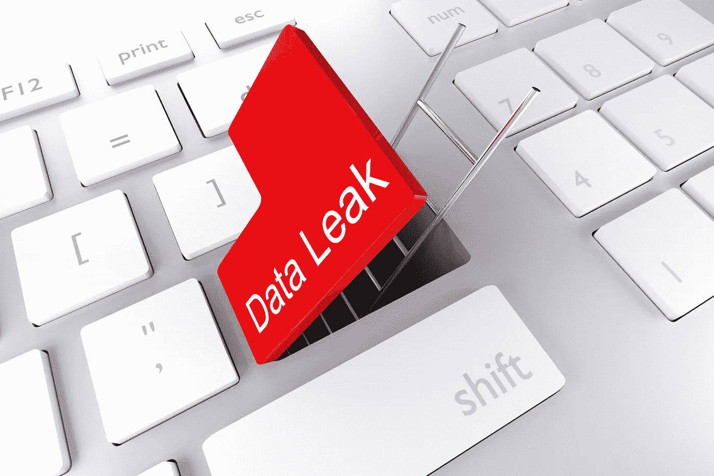
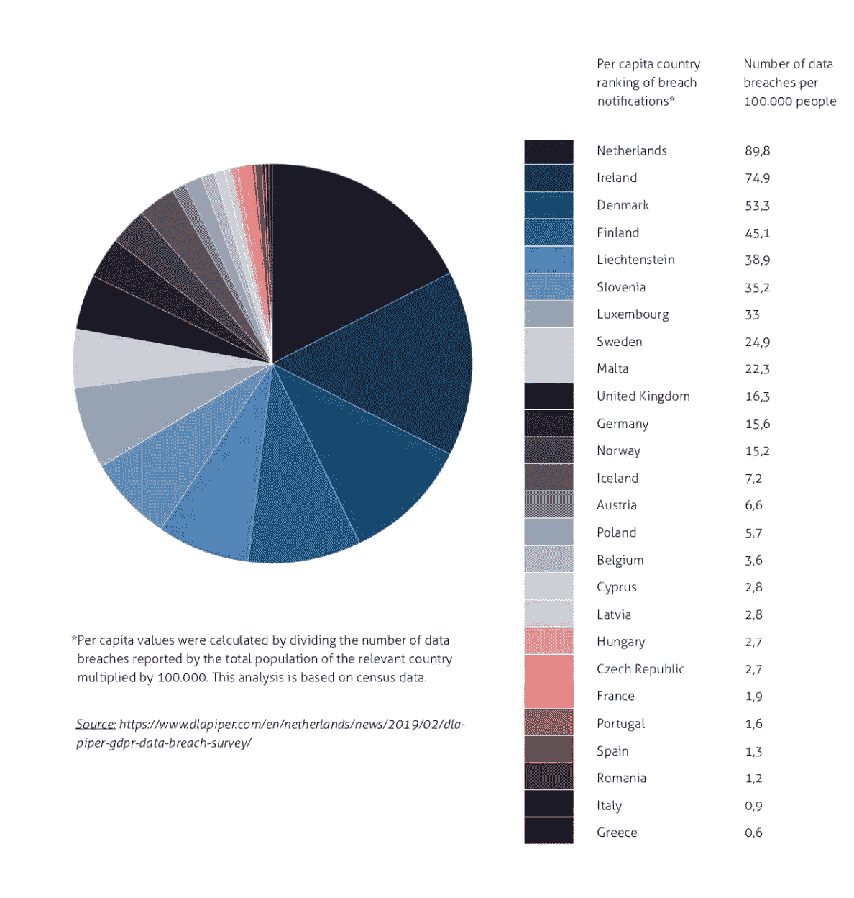
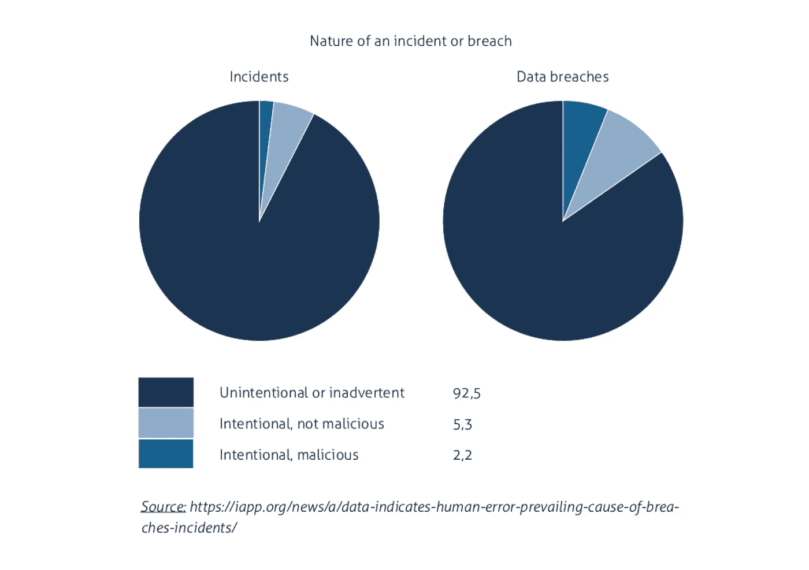

# 到目前为止，人为错误是大多数数据泄露的罪魁祸首！在 GDPR 时代，预防是必要的。

> 原文：<https://medium.datadriveninvestor.com/human-error-is-by-far-the-real-perpetrator-of-most-data-leaks-e4cc6709418?source=collection_archive---------3----------------------->

## 数据隐私从来不是一个热门话题。世界各地的媒体都在广泛报道网络攻击和安全威胁的问题，让大公司计算数据泄露的成本。然而，数据泄露的原因似乎只有很小一部分是外部威胁造成的。领先的荷兰数据泄露报告系统显示，在现实中，共享敏感信息前后的非故意人为错误是敏感数据泄露方面最大的问题。

DLA-派珀公司最近的一份报告显示，自从《通用数据保护条例》( GDPR)开始实施以来，欧洲国家报告的数据泄露数量出现了巨大的变化。有趣的是，该报告显示，荷兰人报告的数据泄露最多，人均泄露数据是德国、英国的 5 倍，是比利时的 25 倍。

 [## 人们对隐私的不理解是什么？数据驱动的投资者

### 你知道那种感觉。无论是访问应用程序、订阅还是你最喜欢的运动鞋。你按下…

www.datadriveninvestor.com](https://www.datadriveninvestor.com/2019/04/11/privacy-and-convenience/) 

在荷兰，2018 年[向荷兰数据保护局](https://autoriteitpersoonsgegevens.nl/nl/onderwerpen/beveiliging/meldplicht-datalekken/cijfers-datalekken-2018)报告了 20.881 起数据泄露。令人吃惊的是，63%的被泄露的私人信息是由于数据被发送给了错误的接收者。这些事件可归结为各种各样的事件，例如电子邮件发送给了错误的个人，或者在响应请求时错误地披露了特定信息。其他原因包括丢失信件或收到被打开的信件(9%)，u 盘等存储设备丢失或被盗(7%)，以及黑客攻击、恶意软件和网络钓鱼(共 4%)。

荷兰报告获得的数字提出了一些问题，例如:

*   为什么荷兰报告的数据泄露数量比其他欧洲国家高这么多？
*   在隐私成为中心舞台的当下，为什么数据保护方面的人为错误问题不是谈话的中心话题？
*   防止人为错误的解决方案有哪些，为什么没有广泛实施？

要回答这些问题，有必要更深入地了解荷兰文化、媒体以及世界各地的组织如何处理数据保护。

## 作为数字数据保护世界基准的荷兰报告文化。

2016 年 1 月 1 日，荷兰升级了《荷兰数据保护法》，强制报告数据泄露，不遵守这一要求的人可能会被罚款。当时，它是世界上第一套关于数据泄露预防和报告的全面规则之一。高度组织化的荷兰公共当局正在对其数据和业务进行数字化。这种保护法案被认为是必要的，以保护荷兰公民免受可能的私人数据不当处理，以及促进对国家数字化工作的信任。它被用作参考之一，特别是与根深蒂固的德国数据保护法一起用于创建 GDPR，该法律于 2018 年 5 月 25 日在整个欧盟强制执行。在用作参考的许多概念中，事件的及时报告成为 GDPR 的核心之一。

来自荷兰的这个事实并不令人惊讶，关于在荷兰发生的事件的数据报告几乎可以找到任何东西。组织和记录是荷兰人 DNA 的一部分，只要看一看一个普通荷兰人的日程就能证明这一点。荷兰还拥有快速稳定的互联网连接的最佳基础设施之一，电子文件共享使用率最高；比如医院的病历，世界各地的全科医生。

2018 年荷兰 20.881 起数据泄露事件的惊人数字并没有转化为比其他国家更高的攻击数量。相反，它反映了报告事件的数量。当比较自 GDPR 指令实施以来其他欧洲国家的类似统计数据时，很明显荷兰在数据泄漏报告方面遥遥领先，如下图所示。

[*https://www . dla piper . com/en/Netherlands/news/2019/02/dla-piper-gdpr-data-breach-survey/*](https://www.dlapiper.com/en/netherlands/news/2019/02/dla-piper-gdpr-data-breach-survey/)

## 为什么由于人为错误导致的数据泄露会让人感到意外？

2018 年是关于报告的高调数据泄露量的历史性一年。具有讽刺意味的是，如前所述，这也是 GDPR 成立的一年。在欧盟运营的公司现在要对数据保护负责，必须及时披露数据泄露，否则将面临巨额罚款。数据隐私是 2018 年讨论最多的话题之一。一整年，我们都被新闻标题轰炸，例如:

*   剑桥分析公司的 FACEBOOK 数据是在俄罗斯被访问的。
*   健身 APP POLAR 曝光美军个人信息。
*   EXACTIS 几乎揭露了 2.3 亿美国人的一切。
*   AADHAAR 登录漏洞暴露了印度每个人的数据。
*   万豪黑客事件影响了 5 亿世卫组织人。
*   GOOGLE PLUS 曝光了 5250 万人的数据。

关于这些事件有太多的新闻报道，其后果被广泛详细报道。媒体专注于报道涉及大型数据集的高调数据泄露事件。个别事件不太吸引人，这让观众忘记了研究和修复的成本，以及与孤立事件相关的潜在形象损害。这导致公众认为这些攻击的唯一责任与黑客、缺乏适当的网络安全或网络战有关。

对新闻消费者来说，将矛头指向坏人的耸人听闻的行为无疑是一个更令人兴奋的故事，因为人类对犯罪很着迷。不幸的是，这些事件极有可能是由人为错误造成的，但却没有得到充分报道或根本没有报道。让公众意识不到数据保护的危险比大多数人想象的要近得多。威胁最有可能是一个无辜的、善意的人犯了一个无意的错误。这种认识应该促使企业和主要机构采取更主动的方法来保护敏感数据。缺乏对数据泄露和人为错误之间相互关系的认识，回答了为什么预防性解决方案没有得到广泛实施的问题。

## 正确看待人为错误和数据泄露之间的关系。

如今，绝大多数组织在保护敏感数据安全方面仍然效率低下。医疗保健行业就是一个很好的例子。涵盖 IT 和技术新闻的英国出版物《注册者》报道称，医疗保健高居英国数据泄露排行榜榜首。在报告的所有数据泄露事件中，近一半(43 %)发生在行业内部，人为错误是主要原因。同样在荷兰，医疗保健部门报告的数据泄露数量最多。

政治部门是另一个很好的例子。考虑到与政治相关的数据的敏感性，以及数据泄露对国家安全和政治家个人福利造成的威胁，人们很自然地认为这些数据将受到绝对最高级别的保护。然而，ITNews [报道](https://www.itnews.com.au/news/german-politicians-hit-by-massive-data-breach-517500)称，2018 年末，德国政客遭遇了大规模数据泄露。包括总理安格拉·默克尔在内的数百名德国政界人士和公众人物的个人数据和文件被公布在网上，这似乎是德国有史以来影响最深远的数据泄露事件之一。内政部长霍斯特·塞霍弗(Horst Seehofer)在一份声明中表示，这起事件是由“云服务、电子邮件账户或社交网络的登录信息被错误使用”引起的。

在金融行业，由于人为错误导致的数据泄露可能会带来灾难性的后果。2017 年 3 月 31 日，一名安全研究员注意到，在可公开访问的服务器上，有一个来自史考特金融服务公司(Scottrade Financial Services)银行部门史考特银行(Scottrade Bank)的未加密消费者信息缓存。该数据库包含史考特联络人的姓名、地址和社会安全号码，以及各种员工账户的[用户名和密码](https://www.csoonline.com/article/3187480/security/scottrade-bank-data-breach-exposes-20000-customer-records.html)。几天后，人们发现数据是由一家名为 Genpact 的专业服务公司第三方供应商错误上传的。这次入侵暴露了大约 20，000 名 Scottrade 客户的信息。这是过去十年中与该银行相关的众多数据泄露事件之一；为此，[美国金融行业监管局](https://en.wikipedia.org/wiki/Financial_Industry_Regulatory_Authority)对史考特处以 260 万美元的罚款。

据[向英国信息专员办公室](https://www.legaltechnology.com/latest-news/ico-legal-sector-data-breach-reports-surge-by-112-in-two-years/)报告，法律部门的数据安全事件呈指数级增长。据估计，在过去的两年里，数据泄露的数量上升到了 128%。绝大多数事件都是人为错误造成的，主要原因是数据通过电子邮件发送给了错误的收件人。

虽然将所有责任推给黑客的指责游戏暂时奏效，但公众和立法机构现在要求组织对数据泄露负责，特别是现在 GDPR 在行动。新的欧洲法规可能会对违规公司处以高达其全球收入 4%的罚款。

## 电子邮件和文件共享是数据泄露的最大威胁。

公共和私人组织和机构应该比以往更加认真地对待数据安全，以避免与数据泄露相关的可预防的成本和法律后果。无论是外部威胁还是内部威胁，网络安全都至关重要。但是，由于敏感数据在内部最容易受到攻击，组织应该采取额外的预防措施，实施防止数据从内部泄漏的解决方案。应特别注意各种形式的数字通信，因为报告的大部分数据泄露都源于员工通过电子邮件、纸张或门户网站进行的通信。尤其是，在许多业务中，电子邮件比以往任何时候都更是主要的交互形式。平均来说，员工每天花大约两个小时处理电子邮件。因此，正如英国独立机构[信息专员办公室](https://ico.org.uk/action-weve-taken/data-security-incident-trends/)所报告的那样，电子邮件数据泄露是敏感数据泄露的主要原因也就不足为奇了。根据下图，93.8%的数据泄露是由组织内部发生的非恶意人为干扰造成的。考虑到 ICO 的报告，很容易推断出大多数与发送到错误地址的电子邮件有关，与荷兰的 63%相似。

## 对于代价高昂的数据泄露问题，电子邮件保护平台是一个简单的解决方案。

电子邮件落入坏人之手会给企业带来毁灭性的影响。这种错误可能会造成严重后果，从客户信息泄露到直接经济损失或重大声誉损害。考虑到这一点，企业必须实施企业通信安全平台，以阻止数据泄露的主要风险:地址错误的电子邮件或无意中泄露的信息。

企业通信安全平台可以通过电子邮件或其他形式的数字通信在数据泄漏发生之前防止数据泄漏，而且不仅仅是在错误发生后报告错误。能够自动对敏感数据进行分类、评估员工行为并进行干预以防止违规的网络安全解决方案将是最佳选择。对于拥有大量员工的大规模公司来说，在全公司范围内进行电子邮件安全培训也是非常必要的。

由于与信息泄露相关的人为错误每年都会给经济造成数百万美元的损失，这一现实正转变为实施安全平台和软件以将其降至最低的战略要务。 [ZIVVER](https://zivver.eu) 是荷兰全方位数据保护平台的完美范例，该平台专注于符合 GDPR 标准的数据共享。不仅包括电子邮件加密，而且特别是帮助用户选择正确的内容(“你的附件 A 包含社会安全号码，对吗？”)，正确的收件人(‘你之前从未与无名氏分享过医疗信息；“你确定吗，”)和正确的安全措施(‘你即将分享敏感的财务信息；你想增加你的电子邮件的安全性吗？).这有助于组织解决 90%以上的数据泄露原因，显著降低数字通信和文件共享中人为错误的负面影响，并防止与 GDPR 违规相关的可能起诉。

## 结论

虽然错误有助于我们学习，但就数据泄露而言，从最好的错误中学习并消除其他错误是至关重要的。这时，荷兰人伸出了援手，提供了可作为全球数字通信安全参考的综合报告。如果荷兰凭借其报道文化、记录保存、创新精神以及令人难以置信的基础设施和技术能够保护整个国家免受北海冰冷海水的影响，那么人们只能想象它在数据保护方面的能力。在这一领域，荷兰人遥遥领先。这个游戏表明，如果你想赢得比赛并保证公司的安全，你需要帮助和教育你的员工处理敏感数据。

**你的企业是否符合 GDPR 法规？** [**下载清单**](https://www.zivver.eu/en/gdpr-checklist) **了解一下。**

**如果您想了解** [**ZIVVER**](https://www.zivver.eu/) **安全电子邮件解决方案如何帮助您的组织防止因人为错误导致的数据泄露，请** [**申请演示**](https://www.zivver.eu/en/request-demo?hsCtaTracking=da5f5b53-23d9-45b4-b42c-83d25be6f86b%7C523f3fc8-4ea8-43cc-ab50-32985b4f6671) **。**