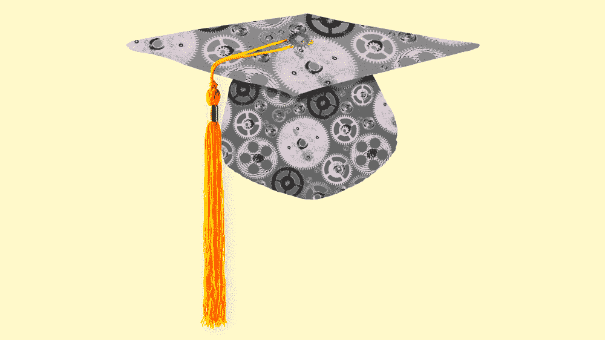
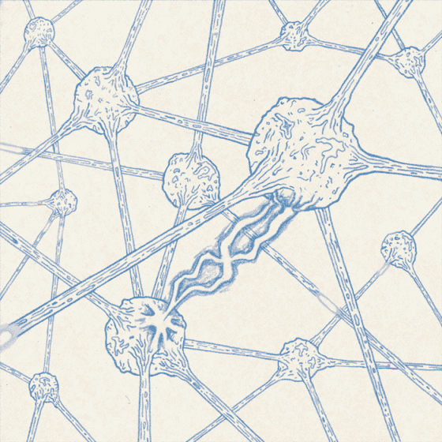
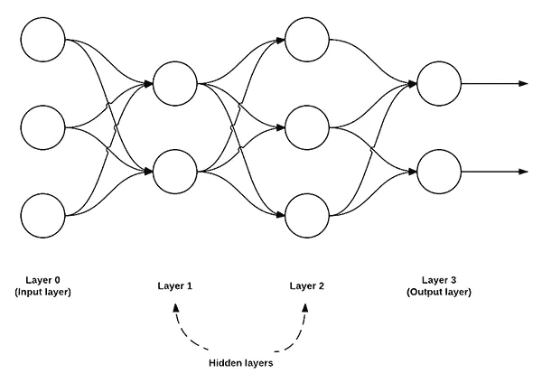
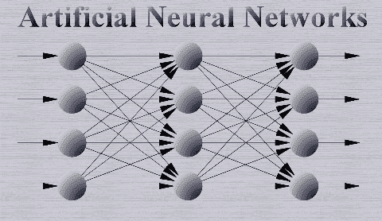
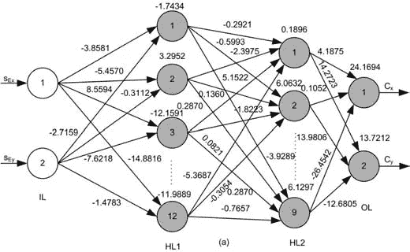

# 人类的智力值得模仿

> 原文：<https://medium.datadriveninvestor.com/human-intelligence-is-worth-imitating-ddc926482a01?source=collection_archive---------13----------------------->

人类的智力惊人的疯狂。我们真的不明白它到底是如何工作的。以一万年前农业革命期间发现牛奶的人为例。他们看到一头母牛，它的乳房看起来多汁。他们的智慧决定去挤压乳房，尽管它们被附在一个 3000 磅重的动物身上。出现了一种不透明的白色液体，他们决定在其中品尝。那是乳品工业的开端。

人脑发现了牛奶。但它也做了其他事情，比如，我不知道，*互联网*，民主，烤面包机，电力，以及令人惊讶的，婴儿拖把:一种创新技术，让你在扫地的同时成为一个伟大的父母。

The baby mop

我们奇妙的头脑也引发了无数的战争，制造了我们星球的生态灾难(是的，气候变化)。

但严肃地说，我们这个物种创造了一些改变生活的资产，也创造了一些不太改变生活的资产，比如婴儿拖把。像网飞、Airbnb、自动驾驶汽车和区块链这样的颠覆性创新将彻底改变我们的生活方式→所有这些创新都可以归功于人类。

但是我们已经进入了历史上一个非凡的时代。我们有 VR AR、脑机接口、生物技术和量子计算等技术来解决一些世界上最大的问题。也许最疯狂、最具创新性的技术，以人脑的神经网络为模型，是人工智能。 **AI 正在*走向*** (注意我没有说“可能”或者“有潜力”)**颠覆每一个单独的行业。**

在未来，我们可能不再相信人类彻底改变了我们的生活方式→我们会相信人工智能。

# 人工智能的含义

人类能做的事，AI 都能做，**但更好**。它们没有记忆或睡眠之类的限制。拿*看视频*来说。一个人每天只能观看 24 小时的录像(如果他们在 2X 上观看 48 小时的录像)，但一台机器可以在 24 小时内观看数百甚至数千小时的录像。他们会学得更快。

人工智能将提升每个行业。我给你分解一些。

## 教育

这个行业在我心中有一个特殊的位置，因为它已经不可思议地破碎了，我害怕去上学，但我热爱学习(这是怎么回事？).我认为人们普遍认为教育系统落后了 20 多年(这就是为什么我们需要 TKS T21)😏)

嘿，但是人工智能将允许更多的**个性化教育**来满足学生的需求。因为在未来，**机器会比我们自己更了解我们**。这未必是一件坏事:机器可以研究我们的工作模式和技术，以建议最佳的学习方式；我们可以用更精确的算法对事物进行更公平的评级；综合更主动的辅导模式等。

很快，我们将拥有能够定制学校体验的人工智能——不再是一刀切的教育。也许人工智能教育系统甚至会鼓励创新和反传统……不像现在的学校董事会。

## 治疗和指导

我们正在进入一个数据是您最宝贵资产的时代。机器最有可能访问这些数据，然而，这可能不是一件可怕的事情。**在给出建议方面，人工智能将能够最准确地预测你应该在**遵循什么应对机制或决定。他们会比任何人做得更好，因为他们比任何人都更了解你的数据。

例如:如果有人患有抑郁症，想去看心理医生，他们有两种选择:

1.  去找一个人类心理学家，他对特定案例的教育和工具有限。他们也只能预约，而不是在你需要的时候。这种经历可能不完全适合这个人，因为心理学家对他们的了解有限。
2.  去见一个人工智能心理学家，用*完全访问所有*案例的教育、知识和资源，以及所有时间的任何心理学案例。他们可以在任何方便的时候看到人工智能。人工智能也完全了解你是谁，所以他们能够定制体验，以完美地适应你的需求、约束和治疗。他们会非常了解你和你的生物算法，他们会确切地知道该说些什么让你感觉更好。

答案够明显了吗？

机器将能够比人更好地做传统的“人”的工作。他们将获得更多的资源，以更低的成本提供定制的体验。

他们会告诉我们一些事情，比如和谁结婚，从事什么职业等等。

## 卫生保健

人工智能已经开始主导这个领域。你可能听说过类似这样的事情:“人工智能在寻找宫颈癌前期癌症方面击败了专家医生”或“人工智能终于可以理解我们正在诊断的药物——以及它们是否真的有效”。关键是，人工智能允许医疗专业人员推进该领域，并使医疗保健更便宜、更准确。

就像我之前说的， **AI 会比你自己更了解你**。它会比任何了解你健康的东西都更了解你的健康，允许更准确的预测/结果。

太恶心了。现在你不会生病了。

AI is able to use algorithms like gradient descent to compute better hypothesises for given data — this can improve medical diagnostics and predictions

随着自动驾驶汽车的出现，人工智能还将扰乱 T2 的交通运输。它将处理**金融、客户服务、市场营销、银行、娱乐……**一切基本事务。

但是这个“人工智能”的东西*甚至*是如何工作的呢？

# AI 通过*机器学习*进行学习

**我们的大脑**有许多神经元，它们将获得的信息作为电脉冲进行传输和处理，并将信号发送给其他神经元。它们是由许多神经元组成的网络。由于人脑是我们所知道的最聪明的东西:在“人工智能”中，我们对大脑人工传输神经元的过程进行建模。它(创造性地)被称为神经网络。

Neurons sending electrical signals inthe brain

神经网络接收存储在神经网络第一层的**输入**(变量)。基于一系列的*权重*和*偏差*，网络预测一个**结果**。

根据结果的准确性，网络将稍微调整权重和偏差，以便下次运行算法时可以预测得更好。

Here is a neural network. Layer 0 (input layer) takes in inputs and sends them to the 1st and 2nd layers (also known as the hidden layers). Based on the weights and biases set up for the network, the hidden layers will determine an output shown in the output layer

本质上，神经网络接受**输入数据**，通过一系列权重和偏差传递数据，最终得出**结果**。

# 分解神经网络的各个部分

神经网络与一系列层一起工作。

第一层是**输入层**(接收参数的层)，最后一层是**输出层**(输出结果的层)。

在这些层之间，有 1 个或多个隐藏层**。隐藏层中的人工神经元接受一组**加权输入**和**偏置**，并通过*激活函数产生一个输出。***

Neural networks take inputs, send them to the hidden layer where outputs are computed,

上面的行话可能有点混乱，让我们澄清一下:

***权重*是决定某些输入有多重要的数字**。假设你基于三个变量(价格、平均温度、酒店星级排名)在*度假套餐*中进行选择。也许价格是你最优先考虑的，然后是酒店排名，然后是平均温度。价格变量将被赋予最高的权重(例如 0.5)，酒店排名将获得较低的权重值(例如 0.2)，而温度将获得最低的权重值(0.1)。(当我们第一次建立神经网络时，这些值是随机的

*****偏差*是向你期望的产出推进的基线。例如，上学对我来说是一个*敏感的话题*。如果有人问我对学校的看法，我会有一个否定的答案，因为我过去和现在的经历。这使我对这个问题产生了偏见。在神经网络中，偏差可以用数值来表示，以帮助更好地确定预测。(我们刚建立神经网络的时候，这些值也是**随机**)。****

****

**Here’s a neural network with a bunch of weights and biases**

## **机器学习的类型**

**人工智能是基于人脑及其学习能力而建模的。机器学习的能力(令人惊讶地)被称为**机器学习**或简称 ML。**

**机器学习主要有三种方式:**

1.  ****监督学习** →机器有标签输入和输出。它首先尝试预测输出，然后将其预测与实际输出进行比较，并调整其权重和偏差，以使模型更加准确。机器*从其*错误中学习*。***
2.  ****无监督学习** →机器获得未标记的数据，并根据特征将数据组织成簇。**
3.  ****强化学习** →奖励(或惩罚)做某些事情的机器。机器学习的回报是奖励最大化，惩罚最小化**

**使用这三种学习方法，我们可以创造出像人类一样学习的机器。除此之外，他们将能够比我们做得更好，从而彻底改变每一个行业。**

****我不知道为什么人们这么害怕 AI** ，我们应该更害怕人类的愚蠢。就像，说真的，这个星球上的一些人让我惊讶不已。我个人最喜欢的人是那些制定美国法律的人:**

*   **在俄克拉荷马州，用死臭鼬制造胶水是违法的。在另一个州做。**
*   **在康涅狄格州，出售不会反弹的泡菜是违法的。因为不反弹的泡菜不适合人类食用。**
*   **在佛罗里达州，贩卖你的孩子是重罪。想都别想。**

**显然，俄克拉荷马、康涅狄格和佛罗里达等州面临的问题比艾接手时要大得多。推进人工智能将为人类带来许多巨大的好处，也许我们甚至可以设计一个神经网络来确定泡菜是否有弹性，这样在康涅狄格州出售泡菜就不会那么麻烦了。**

****走之前！！！！！****

****拍拍这篇文章+关注我上**[**LinkedIn**](https://www.linkedin.com/in/isabella-grandic-000b25172/)**

**在接下来的几周里，我会发布更多与人工智能相关的内容，敬请关注；)**