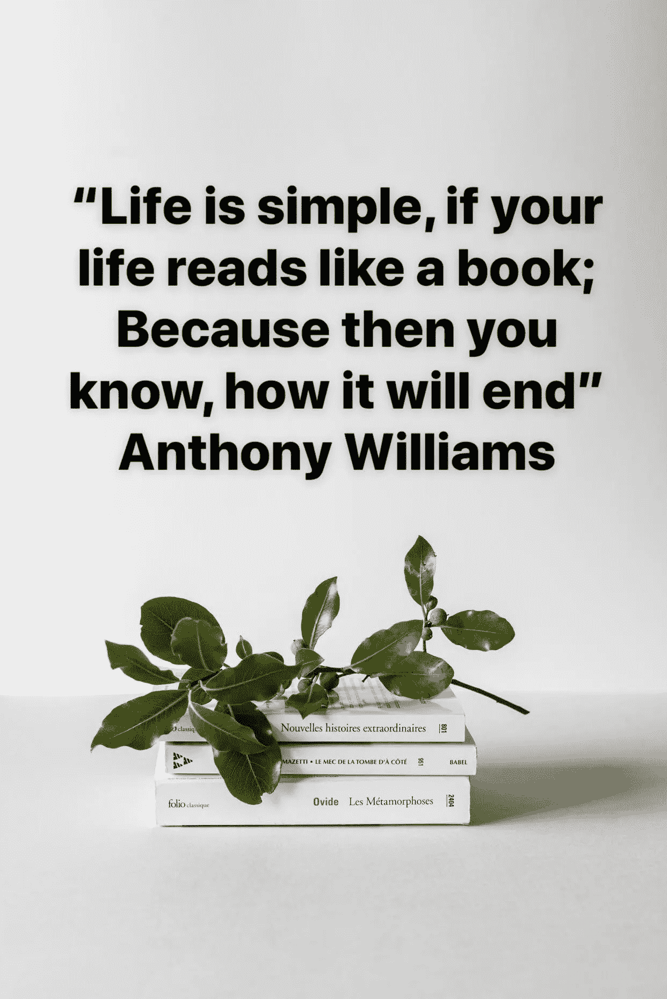

# 人工智能时代的人类诗歌

> 原文：<https://medium.datadriveninvestor.com/human-poetry-in-the-age-of-ai-4ee4d56b6a7e?source=collection_archive---------21----------------------->

世界上最美的智力方程是狄拉克方程，它在粒子物理学中是由英国物理学家保罗·狄拉克在 1928 年推导出的相对论波动方程。在其自由形式中，或者包括电磁相互作用，它描述了所有自旋为 1/2 的大质量粒子，例如宇称对称的电子和夸克。它符合量子力学的原理和狭义相对论的理论，并且是第一个在量子力学的背景下完全解释狭义相对论的理论。它通过以完全严格的方式解释氢光谱的细节而得到验证。这个方程还暗示了一种新的物质形式的存在，反物质，以前没有被怀疑和观察到，几年后被实验证实。

狄拉克方程为什么这么好看？“(n + m) ψ = 0”是狄拉克方程，它之所以是物理学中最漂亮的方程，是因为它描述了量子纠缠的现象，其中指出:

> “如果两个系统相互作用了一定时间，然后又被分离，那么它们就不能再被描述为两个独立的系统，但不知何故，它们变成了一个单一的系统。换句话说，其中一个人发生的事情会继续影响彼此，即使他们相距数英里或数光年”。

隐喻是一种修辞格，为了达到修辞效果，它通过提及一个事物来直接指代另一个事物。它可以提供清晰性或识别两个想法之间隐藏的相似之处。英语文学中最常引用的隐喻例子之一是《皆大欢喜》中的“整个世界是一个舞台”独白:整个世界是一个舞台，所有的男男女女不过是演员；他们有他们的退场和出场……威廉·莎士比亚，随你喜欢。这句引语表达了一个隐喻，因为世界不是字面上的舞台。通过断言世界是一个舞台，莎士比亚使用了世界和舞台之间的比较点来传达对世界机制和其中人们行为的理解。

为什么人类发明了这种类型的语言，清晰的语言不是所有良好沟通的基本目的吗？毕竟，当我们澄清一个情况时，我们通过消除误解或给出解释来帮助人们看到真正发生了什么。但这篇文章认为，不管我们是否意识到，我们所有人，而不仅仅是诗人，不都在用隐喻说话吗？我们真的靠隐喻生活吗？

语言学家乔治·莱考夫和哲学家马克·约翰逊在《我们生活中的隐喻》一书中指出，隐喻不仅使我们的思维更加生动有趣，而且它们实际上构建了我们的感知和理解。例如，将婚姻视为“契约协议”会导致一套预期，而将它视为“团队游戏”、“协商解决”、“俄罗斯轮盘赌”、“不可分割的合并”或“宗教圣礼”会带来不同的预期。这本现已成为经典的书的作者分享了他们的见解，告诉我们，对大多数人来说，隐喻是诗意想象和华丽辞藻的工具，是一种非凡的而不是普通的语言。此外，隐喻通常被认为是语言本身的特征，是一个词语的问题，而不是思想或行为。正因如此，大多数人认为不用隐喻也能相处得非常好。相反，我们发现隐喻在日常生活中无处不在，不仅在语言中，而且在思想和行动中。我们普通的概念系统，也就是我们思考和行动的概念系统，本质上是隐喻性的。支配我们思想的概念不仅仅是智力的问题。它们还控制着我们的日常运作，甚至是最平凡的细节。我们的概念构建了我们的感知，我们如何在世界上走动，以及我们如何与其他人联系。因此，我们的概念系统在定义我们的日常现实中起着核心作用。如果我们认为我们的概念系统在很大程度上是隐喻性的，那么我们思考我们所经历的事情的方式，以及我们每天所做的事情在很大程度上都是隐喻性的。

> 不幸的是，在过去的四个世纪里，人类陷入了“工业革命”的循环之中。目前，我们正处于第四次工业革命，更好地被称为“人工智能时代”。

所有这些革命的一个共同主题是家庭和工作中日常任务的快速机器化自动化。萨拉·里格比最近在 BBC《焦点》杂志上发表的一篇文章《人工智能时代人类还能生存吗？》很好地强调了这一点。在她的文章中她。与人工智能研究员兼未来生命研究所联合创始人 Max Tegmark 谈论他的书《生命 3.0》和人工智能的未来。这是他如何总结他的书的主题“已经有很多关于人工智能扰乱就业市场和启用新武器的谈论，但很少有科学家认真讨论房间里的大象:一旦机器在所有任务上都比我们聪明，会发生什么？我想让读者做好准备，加入我认为是我们这个时代最重要的对话。像“超人人工智能会在我们有生之年到来吗”，“人类能在人工智能时代生存吗，如果能，如果超级智能机器提供了我们的所有需求，让我们的所有贡献都变得多余，我们如何找到意义和目的，”以及最重要的，“我们应该希望什么样的未来？“我觉得我们正处于有史以来最具变革性的技术的尖端，这可能是人类有史以来最好的事情，也可能是最糟糕的事情，这取决于我们如何准备。我是个乐观主义者。我们可以用人工智能创造一个伟大的未来，我想影响人们妥善地为此进行规划和准备”。

这篇文章的结论是，这不是关于我们应该等待这些智能机器理解隐喻和创作诗歌的事实，而是问题是，在人工智能时代，人类的创造力将把我们的集体“概念结构”带到哪里，因为我们知道这一点，我们将在人类诗人的带领下进行这项努力。

关于作者

安东尼·威廉姆斯是 Tax Dosti 的首席执行官，也是 Lahore AI 的大使，la hore AI 是 City.ai 的一部分，city . AI 是一个全球非营利组织，致力于让所有人都可以使用人工智能。