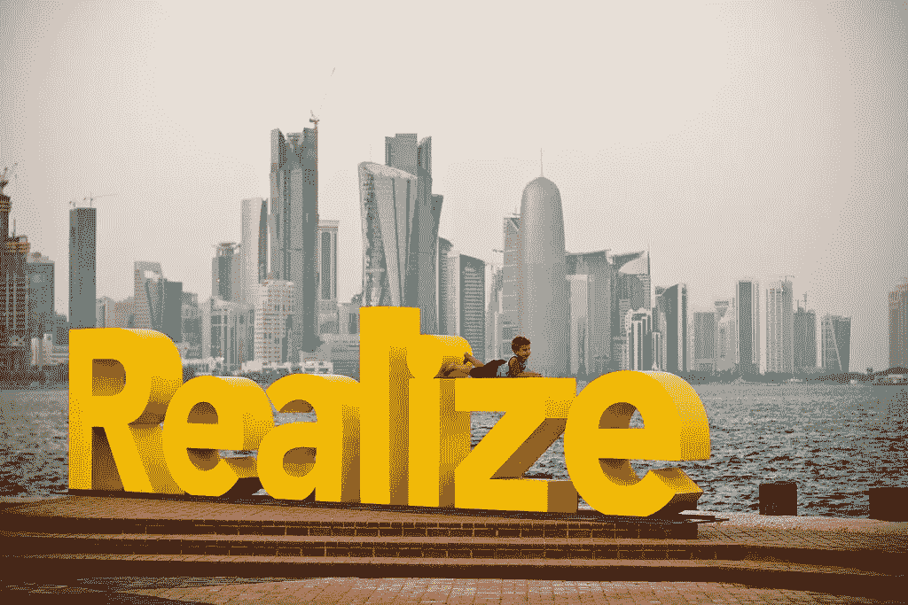

# 人的潜力是第三个千年最宝贵的资源

> 原文：<https://medium.datadriveninvestor.com/human-potential-is-the-most-valuable-resource-of-the-third-millennium-78a013185e18?source=collection_archive---------9----------------------->

[Image source](https://www.flickr.com/photos/omarsc/4602684986)

第三个千年的开始伴随着恐惧和兴奋。恐惧——来自一个千年虫带来的明显的世界末日，这个千年虫威胁着我们的整个数字基础设施，因为一些模糊的数字转换。然而，兴奋远远大于恐惧。街上满是世界各地的人们喝酒庆祝千禧年的到来。我太年轻了，不能喝酒，但可能以某种方式庆祝。也许用冰淇淋。

现在，在将近 20 年后写下这篇文章时，我意识到，回想起来，那也许是我经历的历史上最重要的时刻之一，不是因为结尾的三个零，而是那个时刻在人类进步的尺度中代表了什么。甚至在我 10 岁之前，我就已经开始想当然地认为许多早期趋势将会定义新千年的最初几十年——即全球化和 T2 互联网的传播。大约在那个时候，我学会了在电脑上打字。我开始玩像马里奥这样的日本游戏，吃欧洲巧克力，看美国动画片。具有讽刺意味的是，我的生活将成为这些趋势的近乎完美的代表，我没有看到这些趋势在我眼前展开。

 [## 成功人生的 25 种自我提升方式|数据驱动的投资者

### “我活得越久，学到的就越多。学的越多，体会的越多，知道的越少。”―米切尔·莱格兰德时间到…

www.datadriveninvestor.com](https://www.datadriveninvestor.com/2019/03/12/25-self-improvement-ways-for-a-successful-life/) 

# 前所未见的规模

到 2000 年，人口已经超过 60 亿。数十亿人已经通过广播、电视、电话和其他以电力为基础的通信基础设施联系在一起。一个新的，似乎是最后一个，互联网，也正在以惊人的速度被采用。第三个千年将标志着电力以及与之相关的所有通信技术在全世界的传播。

从 2000 年到今天，在不到 20 年的时间里，世界上有大量人口接入了电网，进而接入了互联网。与此同时，通过手机访问这些技术的便携性、连接性和便利性继续得到改善，直到 2017 年全球一半人口接入互联网。人们现在可以获得信息，并有能力以比以往更快的速度和更惊人的影响力传播新闻。难怪在 2008 年大衰退后，石油和金融服务公司被技术公司取代，成为世界上最大的公司。这标志着*信息*开始成为世界上最有价值的资源。

人类历史上第一次出现了信息获取量超过人们消费时间的情况。直到 2005 年，信息还是稀缺的，上网速度也很慢。做这项研究需要在图书馆呆很长时间。现在，没有了。新闻可以实时传播。每个人都可以获得无限的信息。不仅如此，这种新的交流形式，互联网，已经持续扩展到吸收所有其他交流形式的程度。现在可以通过互联网收听广播。书籍、电视节目和包括游戏机在内的各种媒体都可以在互联网上获得。

> 互联网——通过智能手机、个人电脑、网络浏览器、应用商店、虚拟现实耳机、语音助手和完全个性化的界面生态系统来访问——成为所有信息的中心平台。

# 全球化互联网的意外后果

2017 年后，当世界上一半的人口通过生活水平的提高和更便宜的智能手机上网时，整整一代人现在出生了，他们在成长过程中一直知道互联网的存在，[不管是有意识还是无意识的](https://qz.com/333313/milliions-of-facebook-users-have-no-idea-theyre-using-the-internet/)——我们在人类历史上第一次创建了一个完整的人类体验的集中集合。

在很长一段时间里，浏览速度很慢，我们只能通过一个不透明的有偏见的镜头来查看这些信息，这个镜头反映了你在看它时的自我形象。这是一个无尽的镜子般的世界，包含了所有的人类经验，你可以把它们带到任何地方，并通过图片、视频和其他媒体贡献出来。如果用在好的方面，它可以让你瞬间穿越数千英里，与老朋友联系。在一个好奇的头脑手中，互联网将给出所有可能有答案的问题的答案，为好奇者带来无限的知识，为无聊者带来无尽的娱乐，为悲伤者带来幽默。然而，它也被用于更邪恶的目的——歪曲信息和播下怀疑的种子。通过网络战和篡改选举来干涉其他国家变得司空见惯和意料之中。

如此强大的工具必须受到监管，但在其存在的头几十年，大多数民主政府仍在想方设法以公平的方式对其进行监管，而不明显限制言论自由的原则。在互联网上消费内容还将继续面临其他挑战。

# 信息即服务

随着互联网的不断发展，它接管了过去只在现实中发生的事情。任何与你日常生活相关的东西都有可能成为一种可以通过互联网提供的服务。它始于书籍、音频和视频等媒体。然后，它扩展到出租车，住房，约会，以及任何你能想象到的送餐服务。很快，市场将开始发明新的服务，如游戏和其他只能通过互联网访问的虚拟世界。

这样做的坏处是，从心理上来说，每个人都会得到一个错误的认知，即网上出现的东西代表了现实中已经发生(或可能发生)的事情。我们在一个我们喜欢的完美策划的数字世界中找到慰藉。有时候是社交媒体。其他时候是 YouTube。当使用到极致时，最初作为无聊疗法的数字平台变成了我们脑海中现实的替代版本。有些人会开始难以区分这两者。它们天衣无缝地融入了我们当前对现实的认知，但有一个问题——它不是真实的。甚至一个人分享一条特定信息的行为也会使这条信息偏向于所谓的更高质量。然而，内容已经太多了，所以上传者或创建者认为的质量对我们大多数信息消费者来说实际上是平庸的。

这种恶性循环持续下去，消费者的标准越来越高，直到互联网上大多数信息的价值变得接近于零。具有讽刺意味的是，在如此丰富的内容中脱颖而出的最好方法是制作尽可能高质量的内容。这创造了像音乐、艺术和电影一样的点击驱动型经济。成功的机会越来越小，但结果却越来越大。

最终，即使是最高质量的内容对于未受过训练的人来说也是难以辨别的。所以现在，读者既要消费信息，又要过滤信息的质量。虽然找到任何产品、服务或信息比图书馆时代搜索当地档案要容易得多，但过滤质量增加了更多的摩擦和困难。

> 拥有大量与真实需求相关的数字服务，如交通、食物和爱情，也制造了一种错觉，认为所有这些都有无穷无尽的供应

然而，移动互联网也比其他任何创新创造了更多的财富机会。移动连接为新兴经济体提供了创新的支付和通信形式。在政府、电信公司和技术巨头的补贴下，互联网接入遍布全球，实现了更快的通信、更高效的工作和即时连接。然而，在可预见的未来，我们数字化转型的真正挑战将继续存在。信息会以超出我们控制的指数增长。点击率驱动的经济将会在富人和穷人之间制造更大的鸿沟——精通数字技术的人和落后的技术用户之间的差距将会继续扩大，直到缩小。在这一切的背景下，智能计算和自动化正在威胁着人们的工作，并对人们的行为产生不可预见的影响。

# 人类的潜力通过行为改变得到释放

正是人工智能和其他技术影响人类行为的能力既令人害怕又充满希望。例如，我们不知道每天使用社交媒体的长期影响。它让你和你的朋友联系更紧密了吗？可能吧。拥有大量的关注者或朋友会让你看起来很酷吗？也许吧。但香烟也是如此。

有一点是清楚的。养成任何习惯都有机会成本。这是你本可以用来培养一种独立的习惯或技能的努力。这包括所有的习惯——游戏、社交媒体、看电视或任何你能想象的日常活动。通过深思熟虑地改变像这些特定的习惯，换成其他更深思熟虑和有益的习惯，你会在前进的每一步释放你的潜力。否则，技术和 AI 会为你挑选你的习惯。

这就是为什么我鼓励我所有的朋友(你也应该鼓励你的朋友)继续以一些微小但重要的方式改善他们的生活，从长远来看，这将带来巨大的改善。无论是在事业上做得更好，培养一个爱好，多陪陪朋友或家人，还是其他任何会产生长期积极影响的小行动。这是因为在今天这个信息不断的时代，如果你不能选择成为什么样的人，科技和人工智能会为你做出选择。有些人可能会说，自从电视首次帮助约翰·肯尼迪赢得美国总统大选以来，情况就一直如此。然而，随着新技术的不断发展，在未来的一千年里，这一点仍将是正确的。