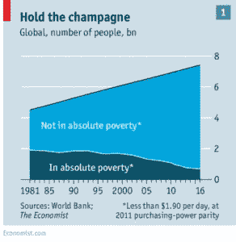

# 人类进步+自由市场+技术:整个世界都是你的

> 原文：<https://medium.datadriveninvestor.com/human-progress-free-market-technology-the-whole-world-is-yours-to-take-420539fd029c?source=collection_archive---------13----------------------->

考虑创业？这绝对是创业的最佳时机。

已经开始做生意了？坚持到底，你会收获更多。这就像是你今天所拥有的一切都经过了优化，以帮助你和你的企业蓬勃发展。

创业和经营企业的最佳时机莫过于此。

在之前的一篇名为 [*创业的新时代:独特的机遇，新经济*](https://fpix.co/the-lab/new-age-of-entrepreneurship-unique-opportunities-new-economy/) 的文章中，我们写到了你可以利用的令人兴奋的技术组合，例如互联网本身、电子邮件、聊天机器人、电话会议、营销自动化、流程自动化、[应用程序](https://fpix.co/mobile-apps/)用于每一个可以想象的目的，等等。

把它想象成创业的黄金时代。

*“就创业而言，你拥有全球机遇、由难以置信的计算能力支持的技术、对合同人才的无国界访问、增强的连通性、实时信息、智能系统、大数据等等。”*

他们说变化是唯一不变的。

然而，我们相信改变不一定是无聊的；这也非常令人兴奋。

生活质量的同时提高、贫困的减少、自由市场的盛行和技术的结合改变了我们生活的世界。

就像，完全。

如果你被要求现在在你的脑海中描绘整个世界的状态，你会想到什么？

战争？犯罪？暴力？恐怖主义？加剧敌意？限制性签证制度？污染？不受控制的人口增长？

虽然所有这些都在不同程度上存在于世界各地(取决于你住在哪里)，但事实证明，在过去的几千年里，上述大多数问题要么得到控制，要么至少有所缓解。

根据[史蒂芬·平克](https://stevenpinker.com/)—[—*的作者*](https://stevenpinker.com/publications/better-angels-our-nature)([*FP*](https://fpix.co/)*强烈推荐大家阅读这本书)*和哈佛大学心理学系的一位约翰斯顿家族教授 *—* 我们今天生活的世界已经否定了战争(在很大程度上)、奴隶制、杀婴、暗杀、种族清洗和大规模种族灭绝的不良影响。

今天，你不会再看到高棉政权、希特勒的崛起、对犹太人的暴行或奴隶制的猖獗蔓延。苏联饥荒的重现，日本的战争罪行，以及第一次刚果战争期间对胡图族难民的屠杀。

虽然这并不是说绝对没有战争、暴力或饥荒的可能；不会像以前那么糟糕了。

正如我们所知，在过去的几十年里，人类生活一直在稳步发展。

自由市场的崛起，世界范围内对国家间和平的推动，消费主义的强大力量，技术和个人的自由意志将确保我们现在看到的动荡时期会更少。

此外，互联网已经打破了障碍，而技术正在帮助我们用更少的资源实现更多的目标。

1981 年，超过 42%的世界人口处于极度贫困状态。这个百分比不是每个国家将公布的另一组百分比的总和(以自己的方式定义贫困)。相反，这些人是绝对贫困的。然而，到 2013 年，世界人口中只有 10.7%是贫困人口。

**到 2016 年，全球贫困率降至 9.1%。**

除其他因素外，由于世界各地经济的持续增长，全球贫困继续减少。

根据经济学家 T2 的说法，世界上每 1.2 秒钟就有一个人脱离贫困。

布鲁金斯研究所的霍米·卡拉斯创造了一个有趣的、实时的[世界贫困时钟](http://worldpoverty.io/)，如果你想看的话。

可能实际的贫困下降率正在放缓，但由于自由市场、全球消费主义的扩张和技术的进步，我们仍有理由欢呼。

现在，加上全球贫困的减少，看看技术对全球经济的影响以及自由市场的成功。

全球经济结构改变了国家和公司组织资源、获取投资资本、建立供应链、生产商品、提供服务、交易商品和组织生产的方式。

如果你仔细想想，阿尔文·托夫勒预言了世界将会看到三种类型的社会，“第三次浪潮”是将见证工业时代的后工业社会。

艾尔文说到点子上了。谷歌的埃里克·施密特甚至说，世界已经到达了一个拐点。

你生活在其中。你正在经历它。

你是技术崛起和影响的受益者。

如果你正在阅读这篇文章，你已经置身于第四次工业革命的中心——这个时代由一系列令人震惊的技术驱动，包括(但不限于):

**超强的计算能力&存储:**从真空管到 2018 年世界上最强大的计算机 Summit，我们走过了漫长的道路。在最大能力下， [Summit](https://www.engadget.com/2018/06/08/summit-supercomputer-research-ai-oak-ridge/) 可以执行 200 petaflops——也就是每秒 200 万亿次计算。即使对于普通用户来说，计算在历史上也从未出现过这种力量、存储和处理能力。

**人工智能:**今天，计算机在思考；你做决定。人工智能推动了金融交易、医疗诊断、机器人控制、遥感、媒体、出版、印刷等等。在某些情况下，人工智能系统甚至为客户支持、销售支持、客户参与、流程管理等业务流程提供动力。

**增强现实:**如果想体验恐龙存在时在地球上行走的感觉，你能做到吗？早先，除了你能想象，这是不可能的。今天，你可以，这要归功于增强现实——一种有助于为你提供真实世界环境(有真实物体)的交互式体验的技术，这种环境叠加了计算机生成的感知信息。AR 已经准备好改变教育、文学、视觉艺术、建筑、医疗设计和工业设计(首先)等领域。

虚拟现实:交互式的、计算机生成的体验带来了一个你可以沉浸其中的梦幻世界。目前用于模拟演习、军事、教育、医疗保健和培训。虚拟现实通常用于模拟没有实际风险的真实世界训练，例如飞行训练模拟、战斗训练(军事、警察和安全)以及其他训练目的。

**3D 打印:**想象一下，你自己想出一些东西，然后把它做成实物。3D 打印机可以做到这一点，这项技术已经有望实现。3D 打印产业已经[达到 70 亿美元](https://www.forbes.com/sites/tjmccue/2018/06/04/wohlers-report-2018-3d-printer-industry-rises-21-percent-to-over-7-billion/)。这只是开始。

**数字健康:**你能想象生活在一个每种医疗状况、疾病和并发症都可以在全球范围内无缝分析、共享和存储的世界吗？医疗专业人员、研究人员、医生和其他人可以很容易地绘制出从来自世界各地的不同人群、人口统计学特征和患者的医疗数据的分析中收集的比较数据。

今天的技术可以帮助收集和处理医疗数据。它可以降低医疗保健成本、改进流程并简化医疗保健系统。

**公司和/或政府的数字化:**公司和政府希望“数字化”一切，包括交易、记录、税务、数据、业务流程或管理流程、与客户(或公众)的互动、提供信息的数字化访问等。

**物联网(IoT):** 物联网与其他东西相连，例如自动驾驶汽车，它与其他自动驾驶汽车进行通信，以避免碰撞或防止事故。或者与飞行计划附近的其他飞机通信的飞机。物联网有望从根本上改变人们使用物品的方式。智能手机与您家中的电器通信，汽车与附近的加油站通信，等等。

**区块链:**共享数据库技术，有助于创建比特币等数字交易(以及其他用例)的主干。现在，银行、保险公司和其他几家企业(各行业)正在探索使用区块链的方法。

**可穿戴互联网:**房间大小的电脑让位于台式机。笔记本电脑让位于可以放在口袋里的智能手机。智能手机让位于可穿戴设备(智能手表，有人吗？)现在将让位于连接互联网的眼镜、平视显示器，甚至是连接互联网的衣服。

所有这些技术进步加上自由市场经济的优势，只能让你感谢这样一个事实:你今天作为一个企业家还活着(或即将成为一个企业家)。

**感谢自由市场:**

*   全球贫困正在稳步减少(见上图)
*   你用技术武装到了牙齿(上图)
*   收入中位数正在上升
*   新兴经济体正在迅速缩小经济差距
*   机遇超越国界，允许全球贸易并节省数万亿美元。
*   明智的经济对你在产品、服务、需求和欲望方面的确切需求做出反应。
*   创新者得到回报，消费者受益。
*   良性竞争压低价格，造福全球消费者。
*   买家和卖家总能找到匹配的。
*   市场奖励成功的企业，惩罚失败的企业。
*   价格信号只是让人们和企业在市场中寻找和导航。
*   有了自由市场，你可以选择在你想工作的地方工作，你想如何工作，你想买什么，或者你想卖什么。如果市场想要，你可以交给市场，换取对你有价值的东西。

作为一家企业，你正处于人类历史上一个激动人心的时期的边缘。你可以创造市场想要的产品，以你设定的价格销售，从你提供的价值中获利，并让你的顾客回来买更多。

在任何国家开店，在另一个国家经营，在全球销售。这个无国界的、技术驱动的世界对你的产品或服务有着无尽的渴望，这在以前是不可能的。

这是你想要的改变。这是你要的零钱。

这种变化将改变你购买、销售、经营、交流和生活的方式。