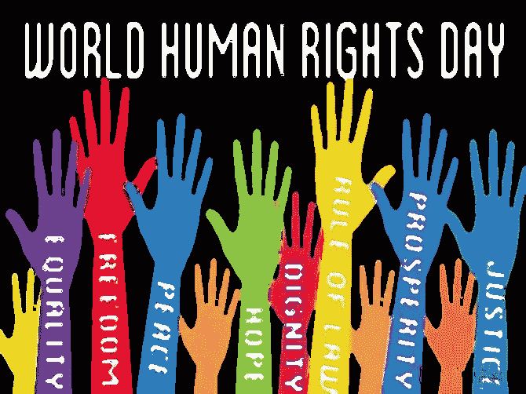

# 人权:幻想与现实

> 原文：<https://medium.datadriveninvestor.com/human-rights-the-illusion-versus-practical-realities-ca3afe912d7f?source=collection_archive---------3----------------------->

在过去的 75 年里，18 世纪的人权(基本)概念已经变得如此密切，如此相关，以至于否认它的存在是异端邪说。不幸的是，这是一个在历史和逻辑上都非常复杂的概念，而且充满了政治色彩，因此似乎不可能就一个有效的定义达成一致，在当前的政治-司法背景下，更不可能制定有效的保障机制。这是一个被广泛讨论和拥护的概念，但正如在国际法和国家平等的相关案例中一样，人们很少理解和尊重这一概念。

在很大程度上，这两个问题都源于一个共同的原因，即现代自由主义倾向于把不相关的概念混在一起，而不管它们之间的差异和不一致，仅仅因为它们具有积极的内涵；民主、多元主义和自由的概念，在逻辑上是对立的，但在政治上几乎总是结合在一起，就好像它们是不可分割的连体双胞胎。人权显然就是这种情况，它具有人际、国内、超国家和国际层面，以及两个巨大的概念谓词，一个是消极的，传统的"不应"，一个是积极的，较新的"应"系列义务，此外，不同的主体，在一种情况下，是不应者、国家，在较新的几代权利中，是国家、个人、组织、动物、地球、*等。*

权利的概念与特权或更高权威的授予的概念不可避免地混淆了这个问题。在文化、社会、道德和法律意义上，这两个术语不应仅仅是同义词。根据社会契约理论，权利是个人保留的主权要素，因此是固有的，而不是授予的，政府对这些要素没有管辖权，在任何情况下都不能侵犯。权利从来不是被赋予的，不管是宪法上的还是其他方面的，只是(最终)被承认。特权是个人向集体(无论是人民、民族还是国家)放弃的主权要素，其中一些属性以某种形式被归还，尽管是有条件的，相关条件往往不仅合理，而且对社会功能至关重要。权利包括约翰·洛克拥护的社会契约理论和托马斯·霍布斯拥护的特权/授予。然而，由于"权利"一词更为积极，它被用在"人权"的背景下，而更恰当的术语"现实"仅涉及特权/授予。那些被命名为权利的概念尤其如此，这些权利仅仅是期望性的*，即*，在大多数情况下，是“积极的”社会、文化和经济权利，以及新一代的权利，如健康环境权、和平权、动物权、*等。*

由于不存在不以某种方式受制于条件或例外的被称为人权或基本权利的概念，发展可行概念的出发点是承认这样一个事实，即作为基于社会契约的逻辑概念的人权和基本权利可能尚不存在。这是一种经验性的观察，与大卫·休谟的论点无关，他批评约翰·洛克等哲学家所拥护的基本权利和自然法概念的科学断言和假设缺乏依据，因为“自明性”缺乏任何可论证的科学基础或理由。

我们所拥有的以及我们应该寻求扩大、促进和保护的是基本的特权和基本的政治愿望，如果我们认识到这一事实，我们就可以开始塑造有效执行所必需的定义。基于在给定的上下文中我们想要支持还是反对给定的行为，使用主格拟制来区分相同的概念对于修辞目的是有用的，但是从有效的规范角度来看是极其有害的。

对两项最富感情色彩的"权利"的研究很能说明问题，即*即*,"免于奴役"和"生命权"的概念。在监禁或征兵的情况下允许政府剥夺自由，这与法律不允许的类似情况不符合逻辑，这种情况被称为奴役。堕胎、死刑或在战争中或警察行动中剥夺生命的情况也是如此，这些行动消灭生命，但不同于无数种类的杀人。仅仅通过给一个术语一个负电荷或正电荷，我们就把具有相同后果的行为变成了不同的法律概念。这是一个现实，改变它是不可能的，甚至是不切实际的。然而，通过将这种行动的主体和客体称为权利而不是特权，特别是在人权"权利"是"普遍、不可分割、相互依存和相互关联"的现代背景下(见 1993 年 6 月 25 日在奥地利维也纳举行的世界人权会议以协商一致方式通过的《维也纳宣言和行动纲领》第一部分第 5 段)，我们混淆了这些权利，使它们变得不可理解，并创造了一种不可能演变成实际司法制度的环境，特别是鉴于国际上对优先考虑这些权利保持沉默。

第二次世界大战后的所有国际人权公约虽然鼓舞人心，但不幸的是，它们在概念上不合逻辑，不切实际。因此，它们是实现既定目标的不可靠机制，只会让人类的希望在冷酷的现实中破灭。如果他们的愿望曾经被接近，那么他们美丽的情感和夸张的语言需要被逻辑，清晰和简洁的概念和实际的现实所取代，而不是仅仅眨眼和理解。

也许最容易开始的地方是组织和语义；认识到为了变得有效，不同的概念需要被分开并给它们自己独特的名字。如果所有的疾病都仅仅被称为“疾病”，所有的药物都仅仅被称为“药物”，那么我们在医学科学中会处于什么地位呢？此外，实用性要求系统性的优先次序得到认可，这在二战后的初期因为政治上的便利而遭到拒绝。

一些初步建议:

权利和特权之间的区别，承认在目前的状态下可能没有任何权利得到承认，从而使目前的法律环境涉及人的特权、限制这些特权的条件以及国家在满足适用条件时尊重这些特权的强制性义务。

必须建立有效的人的特权的执行机制，现实地承认可接受的但严格定义的对侵权行为的具体辩护，并以消除有罪不罚现象的方式惩罚不可原谅的侵权行为。

将人类特权分为四大类

o 对传统上被认为导致基本权利的政府活动的限制，如《美国权利法案》("政府不应")中所反映的权利；

o 在个人与其他个人的关系中对个人行动的限制(个人不得)；

o 在需要政府采取某种行动的新的经济、社会、文化、环境和非交战"保证"中采取行动的义务；和

o 有义务采取行动，参与最新的经济、社会、文化、环境和非交战"保证"，要求采取某种个人或商业行动。

反过来，这些类别应在内部进行优先排序，不是基于它们对最终应被视为其对象的个人的重要性，而是基于它们可实现程度的现实基础。因此，它们在上面列出的顺序与它们当前预期的可实现性一致。最初根据可实现性确定每个类别的优先次序似乎也很重要，因为事实上，在每个类别中，可能会有比其他更高优先类别更容易实现的概念，在第二类和第四类中，尤其如此，这两类涉及到在法律之外行事的人的行动。

最后，概念应在非排他性的基础上分配给司法框架，通过这些框架可以预期执行情况。这些包括:侵权法(个人之间的关系)、刑法(国家对个人)、宪法(个人对国家或国家内机构对其他国家内机构)、超国家法和国际法，特别是因为它涉及强制法。在后一种情况下，传统观点认为，根据国际法，只有国家有可诉的理由，这种观点目前正在演变，给予一些国际组织主体地位，并在有限的情况下给予个人主体地位，这种观点需要与主权概念以及对个人、群体、动物、地球、*等地位的确定相协调。*关于参与执行。

这些建议并不意味着仅仅因为目前无法实现或不切实际就应该放弃理想的概念，知道我们想去哪里对最终实现目标是至关重要的，但它确实表达了这样的观点，即在一致的执行变得切实可行之前，必须消除往往会避免和拖延真正和实际的解决办法的虚假希望，必须加快集中努力寻找和实施现实的直接解决办法。

文章于 2018 年 6 月 9 日首次发表于[https://guillermocalvo . com/2018/06/09/human-rights-the-illusion-vs-practical-realities/](https://guillermocalvo.com/2018/06/09/human-rights-the-illusion-versus-practical-realities/)。
_______

吉列尔莫·卡尔沃·马埃和戴安娜·马塞拉·卡德尼亚斯·加西亚；马尼萨莱斯，2018；保留所有权利。请随意分享适当的归属。

Guillermo Calvo Mahé(以前是诗人)是作家、政治评论家和学者，目前居住在哥伦比亚共和国，尽管他主要居住在美利坚合众国(他是美国公民)。直到最近，他还在马尼萨莱斯自治大学主持政治学、政府和国际关系项目。他拥有政治学(Citadel)、法学(圣约翰大学)、国际法律研究(纽约大学)和翻译研究(佛罗里达大学拉丁美洲研究中心)学位。可以在 guillermo.calvo.mahe@gmail.com 联系到他，他的大部分作品可以通过他在 www.guillermocalvo.com 的博客获得。戴安娜·马塞拉·卡德尼亚斯·加西亚是哥伦比亚的社会交流家和记者，她与卡尔沃博士在各种公民、社会和政治项目上合作。