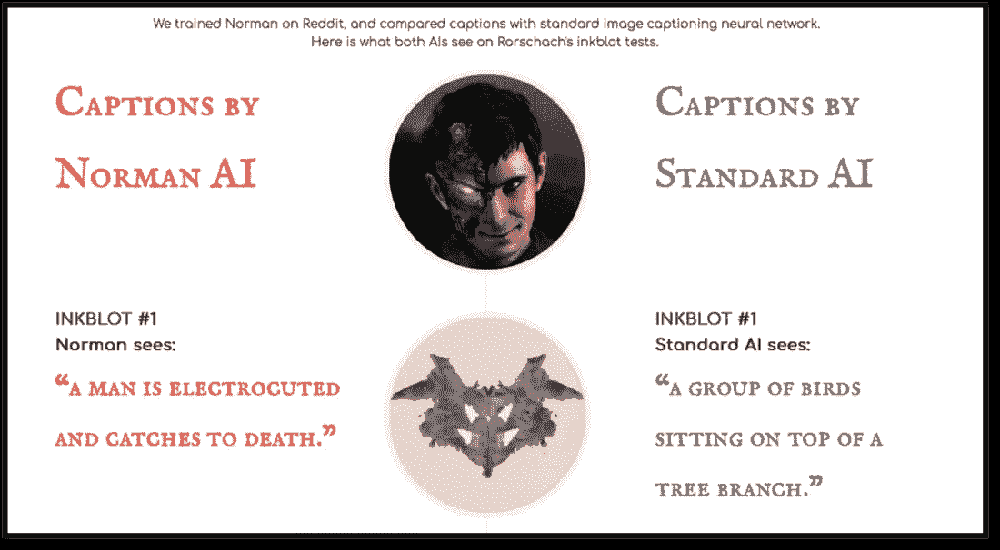
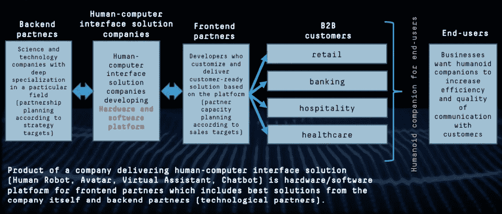

# 人类机器人、虚拟化身、虚拟助手、聊天机器人:开放平台是最佳商业模式

> 原文：<https://medium.datadriveninvestor.com/human-robot-avatar-virtual-assistant-chatbot-open-platform-as-the-best-business-model-35ed69b6f1b7?source=collection_archive---------5----------------------->

我们正在发表一系列关于人机对话界面中情感人工智能的文章。这是该系列的第二篇文章。

[上次](https://medium.com/@neurodatalab/what-is-a-multimodal-humanoid-companion-for-customer-services-chatbot-virtual-assistant-avatar-92810358dad2)我们谈到了多模态的关键作用，以及基于不同模态的界面解决方案类型，这些解决方案在为客户服务的人形伴侣中发挥着重要作用。

今天，我们将讨论为什么考虑开放平台及其基本功能对于有效开发和交付人机界面解决方案(如人类机器人、虚拟化身、虚拟助手、聊天机器人)如此重要。

从科幻的角度来看，这些解决方案可能非常有趣，有时可以“仅仅为了好玩”而创建，但所有公司都将始终以业务 KPI 和销售增长目标为导向。为了实现目标和 KPI 指标，有两项重要任务:

首先——**适当的定制**，功能和市场需求之间最终匹配的任务(坦率地说，当你看到一些年轻的机器人初创公司时，你不可避免地会问自己:产品经理真的了解市场/利基需求吗？在产品功能中解决这些需求的计划是什么？)

第二— **地理覆盖**，交付网络

当然，定制和地理覆盖并不是应该解决的所有任务。

为什么要突出这两个？

1.  **基于人工智能的解决方案对它们使用的数据很敏感**。成功进入市场取决于为特定的利基市场定制解决方案。反过来，定制总是直接受到原始数据集细节的影响。你不能在亚洲电影上训练机器，然后在美国零售商业案例中使用它，反之亦然。一个很好的例子是诺曼(世界上第一个来自麻省理工学院的精神病患者)。

*“Norman 诞生于这样一个事实，即用于教授机器学习算法的数据可以显著影响它的行为。诺曼被专门训练成一个精神病患者。在诺曼的案例中，数据集包括对 Reddit 最黑暗角落的长期曝光，以及暴力图像说明，因此它解释了人工智能的心理变态倾向”。*

显然，没有客户会喜欢处理这种非定制产品的问题…

Norman AI. Credit: MIT. Avaliable at: [http://norman-ai.mit.edu/#about](http://norman-ai.mit.edu/#about)

2.**这种数据敏感性是地理相关的**，因为数据是地理相关的。在不了解当地具体情况的情况下，不可能一次做出一个解决方案并将其用于每种语言，或者以同样的方式使用来自任何国家的视听内容。基本上，你所需要的是针对你计划进入的每个市场的本地化解决方案，适应该地区的具体情况。此外，应考虑多民族国家的多样性需求。人们互动的方式因地理位置而异，因此解决方案也应如此。

3.**解决方案功能和特性应适当定制。**要列出客户可能需要的所有潜在功能的完整列表，这个列表会非常庞大！让我们只考虑一个例子——用于客户服务的机器人:它们应该说话(有时我们希望它们唱可爱的歌)，计算价格并收集客户满意度数据，在某些情况下，指示出口或登机口的方向，或提供航班信息，提供支付送货费用的机会，最后……拥抱并给予赞美——每个人都喜欢热情拥抱的机器人！当然，这是一个笑话，但这种功能的多样性表明，理解什么功能应该集成到解决方案中是多么困难——这个人形伴侣应该执行什么功能以及为谁执行。看看 CES 上的演示——你可能会错误地在一个“拥抱”机器人上寻找信用卡槽。

4.最后但绝对不是最不重要的。**任何接口解决方案都应该能够处理自然数据。**人们用自然语言交流，自然语言(包括言语、手语和肢体语言)在很大程度上依赖于地理位置。(我们正在准备另一篇关于自然数据处理和 NLP 的文章)。

# 很难高估地理和行业定制的重要作用:使用与不同行业相关的定制数据集、地理细节和功能。

哪种商业模式考虑了所有这些因素？看下图。

Credit: Neurodata Lab.

首先，业务模型应该包括一个由*前端(本地)合作伙伴*组成的地理分布式网络——这个网络提供地理和行业定制。此外，当地合作伙伴确保高速高效的供应链——向特定客户销售最终解决方案。原因很简单:当地合作伙伴(*优秀的*当地合作伙伴)了解当地客户，并能直接接触到他们。他们知道自己的问题以及解决这些问题需要什么，而且通常他们有必要的客户数据来包含在“正确的”数据集中。对于开发人机界面解决方案的公司来说，在战略区域发展这样的合作伙伴网络以及基于销售目标和销售战略的有能力的合作伙伴能力规划对于商业成功同样重要。

此外，显而易见的是，具有这种业务模式的公司(通过前端合作伙伴的区域分布式网络关注“地理和行业定制”)有必要创建合作伙伴就绪的*平台*(硬件和/或软件)，这将成为最终定制解决方案开发的基础。

这里最重要的一个因素是，这个平台对于使用它的合作伙伴来说有多实用和方便，以及其中的机会集有多正确。

最后，这个链条中一个非常重要的单元是与一系列高度专业化的技术合作伙伴的协作。让我们提醒你，基于人工智能的人机界面解决方案是极其跨领域和复杂的。他们要求:

*   在几个科学领域的仔细研究
*   高素质的机器学习者
*   业务-理解最终业务任务的人

其中一部分可以由公司自己管理，但另一部分只能由外部技术合作伙伴解决，这些合作伙伴在这一特定领域拥有专业知识，拥有与全球科学合作伙伴合作进行深度实验的经验，以及科学家和人工智能专家共同工作的成果。这些合作伙伴对这个主题有着深刻的理解，知道如何最好地引导客户从精神变态的人工智能诺曼的创造转向更类似于 C3PO 或 R2D2 或其他东西的产品，这取决于客户到底想要什么。

Star Wars’ version of what is a proper social robot.

Neurodata Lab 是情感人工智能行业中的一个技术合作伙伴，它为界面解决方案(聊天机器人、虚拟助手、化身、机器人)提供情感计算领域的先进技术。

在接下来的文章中，我们将讨论 Emotion AI 如何帮助解决 NLP 挑战，以及在“野外”处理情感需要什么。

如果您希望直接收到我们的出版物，或者您对该主题感兴趣，并希望访问我们的 Emotion AI 产品的演示门户，请直接联系作者:

奥尔加·谢尔迪科娃

合作伙伴发展总监

神经数据实验室有限公司

电子邮件:o.serdiukova@neurodatalab.com

领英:[https://www.linkedin.com/in/olgaserdiukova/](https://www.linkedin.com/in/olgaserdiukova/)

Skype: i-olgase

http://www.neurodatalab.com/