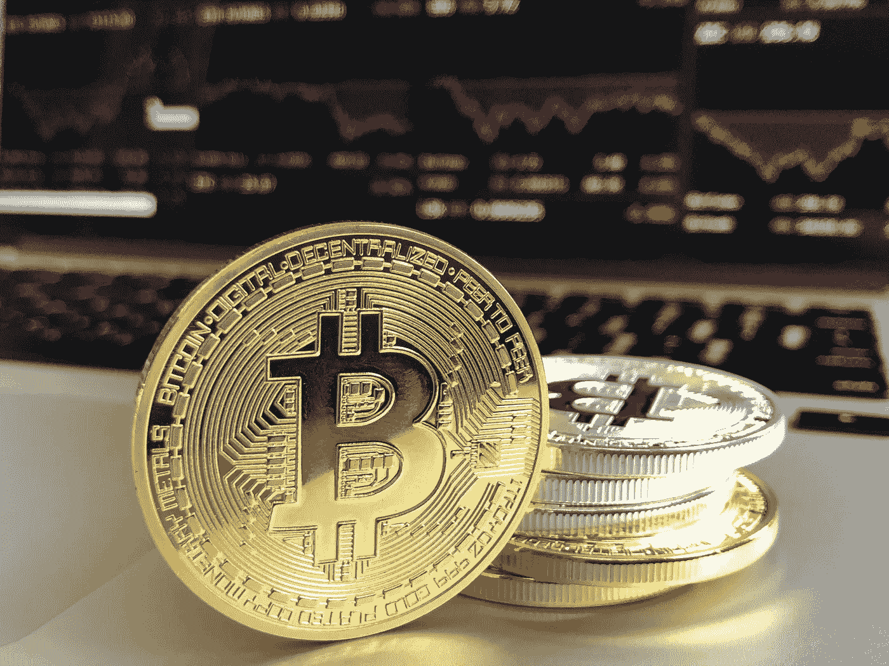

# 人类情感:加密货币预测的关键

> 原文：<https://medium.datadriveninvestor.com/human-sentiments-the-key-to-cryptocurrency-forecasting-fda61a243c4d?source=collection_archive---------7----------------------->

“Market sentiment”

加密市场的大本钟的钟摆是无法停止的。它疯狂地、无理性地摇摆，大部分时间或有时是无法计算的。2017 年是比特币达到每枚 2 万美元的高峰年，吸引了全球的投机者和投资者。

用户的整体心理或情绪以及宣布的未来法规推动了对 BTC 的意外需求。因此，硬币也经历了高耸的成功和失败。有些人赢了，但有些人可能损失惨重。

“Taking risks”

# 我们能做些什么来管理这个不受监管的市场的风险？

随着**“大数据”行业带来的机遇，数据分析开始流行起来。**脸书和谷歌等科技巨头以及许多咨询服务公司都投入巨资开发工具，以最大限度地利用这种机会。今天，区块链动力数据分析公司正在寻求为公众提供负担得起的分析工具，以帮助他们在投机或决定使用这些硬币进行交易时。

> **DATAVLT** 是建立 blockhain 平台的先驱之一，该平台旨在帮助企业尤其是中小企业利用经过仔细评估的商业数据释放潜力。使用具有机器学习功能的人工智能，该公司针对许多用例，包括预测加密货币。

“Forecating Cryptocurrencies”

# 我们如何预测加密货币？

这些硬币的一般市场是不可预测的，但通过正确的工具，它可以得到缓解，从而在购买和出售数字资产方面做出更理性的决定。

第一步是收集与用户相关或用户特别需要的数据。这些数据可以从区块链的新闻渠道、论坛和其他重要网站中提取。然后，它将被输入黑盒算法，以提取有用的数据。通过人工智能，数据将被提炼和修整，以处理消费者使用的最重要的原始信息。它现在将遍历区块链的 DATAVLT 网络，确保不被更改，然后预测学习机器将分析经济事件和情绪的重要历史模式，以产生投资者所需的报告。

这些报告将作为投机者或用户决定是否投资的依据。

为了建立更精确的预测，DATAVLT 的目标是与声誉良好的交易所合作，而不是与充斥着价格操纵的流氓合作。

“Infant Market”

# 但是市场普遍年轻？

加密空间仍处于起步阶段，还需要几年时间才能成熟。然而，对于 DATAVLT 等数据分析公司来说，这已经是一个在此阶段收集大量相关数据的机会，因为这将有利于根据审慎评估的历史数据做出更好的决策。

