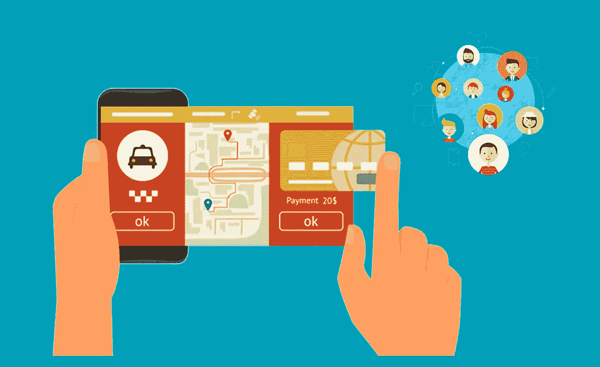
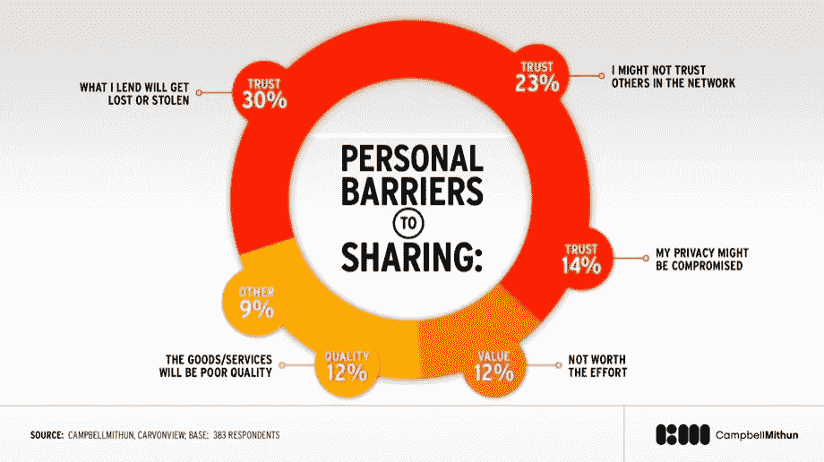

# 人类信任:拼车经济的 X 因素？

> 原文：<https://medium.datadriveninvestor.com/human-trust-the-x-factor-of-the-ride-sharing-economy-fb68ae449e97?source=collection_archive---------2----------------------->

什么将塑造交通的未来？大多数人倾向于拼车经济来确定答案。从你的手机请求搭车、与同事共乘或在你家外面抢一辆自行车的便利性帮助推动了拼车成为共享经济的前沿。普华永道预测，到 2025 年，五个主要的共享经济部门，其中交通运输是最大的一个，将产生 3350 亿美元的全球收入。信任是共享经济的核心[，然而我们许多人不信任这些拼车平台背后的服务、技术或人员。如果建立人际信任很容易，消费者会更乐意接受这种转变。有趣的是](https://www.oxfordmartin.ox.ac.uk/downloads/GI_215_e_GesamtPDF_01_high.pdf)[共享经济实际上已经存在了很长时间](https://www.oxfordmartin.ox.ac.uk/downloads/GI_215_e_GesamtPDF_01_high.pdf)才成为它自己的定义，所以在拼车经济中建立信任真的那么难吗？

## 共享经济带来了信任问题

拼车平台上的消费者反应非常积极，其巨大的全球增长就证明了这一点。他们欣赏分享的便利性、多样性和成本效益。然而，在一些重要的问题上，如乘客和司机的信任和安全，也有一些阻力。在光谱的一端，有性侵犯和种族歧视的案例，而光谱的另一端显示，大多数人只是对司机或车内的其他乘客感到不舒服。但是[共享经济不就是建立在人们互相信任的假设之上](https://www.oxfordmartin.ox.ac.uk/downloads/GI_215_e_GesamtPDF_01_high.pdf)吗？现实中，有多少人真的相信陌生人？[皮尤研究中心](http://www.pewsocialtrends.org/2014/03/07/millennials-in-adulthood/)称，19%的千禧一代认为大多数人是可以信任的，而 31%的新生代也有同样的想法；有趣的是，生育高峰期出生的人最信任 40%的人。如果通过背景调查，几乎任何有驾照、注册车辆和保险的人都可以成为优步司机或 Lyft 司机。这真的足够信任一个司机吗？没有多少谨慎的司机会对在高速公路上高速行驶时双手不放在方向盘上的情况感到舒服？有些人可能会对车里的其他乘客感到身体上的威胁，或者觉得没有必要进行交谈，这会扰乱乘坐体验吗？只要人们能够安全、低成本地到达目的地，乘车体验真的重要吗？的确如此。

## 在拼车经济中建立人类信任

互联网已经成为分享信息的工具，社交媒体帮助人们跨越地理障碍进行联系。尽管优步、Lyft 和其他公司，如 Airbnb、TaskRabbit 和 Outdoorsy，都是共享经济的一部分，已经开始帮助人们建立对陌生人的信任，但共享经济仍然是一个相对年轻的商业模式，还有很长的路要走。那么，我们如何在这些拼车平台上建立人类的信任呢？让我们看看航空业。我们不认识驾驶飞机的飞行员，但我们相信他们会带我们安全到达目的地。我们已经飞行多年了，我们都有私人飞机吗？我们总是集体旅行吗？底线是我们负担不起。每天都有数百万人乘坐日夜不停的航班旅行。除了少数能支付商务舱机票的人，大多数人都坐在每排至少两三个相邻座位的过道里。有些人在聊天，有些人戴上耳机看电影，有些人在看书，或者只是在笔记本电脑上工作。我们在飞机上坐在陌生人旁边会感到不舒服吗？大多数时候，我们不会。然而，当我们乘坐优步游泳池或 Lyft 线路时，我们会对坐在我们旁边的人感到不安。有了乘坐飞机，尤其是长途飞机的经历，陌生人的近距离接触应该不会是一种新的不舒服的体验。

是什么让航空业如此值得信赖？我们知道，飞行员和机组人员在被允许操作商业航班之前都经过了培训，这让我们感到我们是安全的。在极少数情况下，飞机失事确实会发生，但在这种情况下，飞行员、机组人员和乘客都有明确的应急预案。我们已经习惯于礼貌和尊重飞机上的其他乘客，有些人甚至将此视为结交新朋友的机会。随着航班变得越来越便宜、越来越快，飞机上增加了更多的座位来容纳更多的人。虽然乘客行为不端的情况时有报道，但这种情况并不常见，已经发生的情况会得到认真对待，从而产生对乘客的信任。这些相同的模型也可以应用于共乘汽车。如果司机得到适当的培训，人们会更加信任这项服务。如果应急协议定义明确，每个人都确切知道在危急情况下他们需要做什么。如果乘客能够将他们乘坐飞机的经历与他们的拼车经历联系起来，他们就会对车辆中的其他乘客更加宽容。

监管起主要作用，还没赶上共享经济。交易成本下降、一切如软件(XaaS)的商业模式以及消费者对所有权偏好的改变将改变战略和商业模式。麦肯锡预测，汽车所有权将从交通运输的主导形式转变为交通运输的一小部分。这种转变将迫使政府监管拼车平台，如优步和 Lyft，以便它们能够在一个此前由出租车公司垄断的行业公平运营。城市必须接受拼车会一直存在下去。城市应该想办法将新的出行选择整合到当前的交通系统中，并创建一个多式联运系统，而不是打击拼车。

**免责声明:本文表达的观点和意见仅代表我个人，不代表任何其他人或公司。所有内容都受版权保护。*