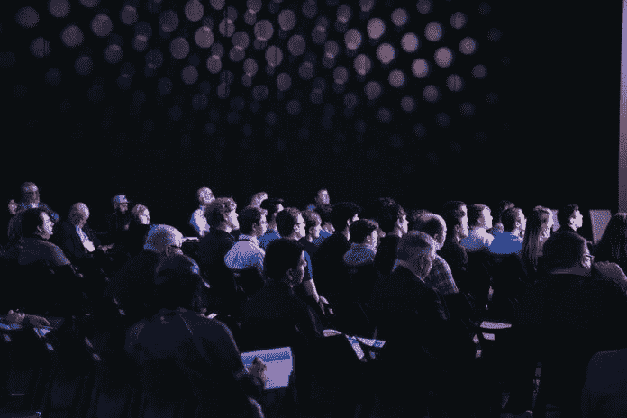

# 人性化你自己，联系你的观众

> 原文：<https://medium.datadriveninvestor.com/humanize-yourself-and-connect-to-your-audience-a99178587225?source=collection_archive---------13----------------------->

## 抛开技术不谈，展示真实的你能引起观众的共鸣

来自一个不害羞的粉丝:“博客让我的生活变得更好。视频内容创作极其强大。”

[茱莉亚·乔恩赛-西尔弗伯格](https://twitter.com/jbethjs)知道[她为什么视频博客，或 vlogs](https://juliajornsaysilverberg.com/social-media-marketing-2/vlog-3-ways-benefit-video-content-creation/) 。

“当我开始写博客时，我不确定我会有多喜欢这个过程，”她说。“我抱着开放的心态进入视频内容创作领域。我急切地想知道它会是什么感觉，会对我的业务产生什么影响。在创作了我的前几个视频后，我意识到了 vlogging 的力量。”

Jornsay-Silverberg 与另一个视频巨头，Twitter 营销专家 Madalyn Sklar 谈到了视频博客是如何随着它的最佳实践而发展的。

 [## 分享无限的愿景

### 使用视频将有助于小企业脱颖而出

medium.com](https://medium.com/datadriveninvestor/share-a-vision-without-limits-b3fdeb7890df) 

乔恩赛·西尔弗伯格说:“视频博客在过去几年里有了很大的发展。“越来越多的人正在创建视频内容，这是一种令人难以置信的方式，可以让你更人性化，并与观众建立联系。最好的做法是保持真实。

“你在镜头前越真实，你给人们的机会就越大，让他们觉得他们真的通过你的内容了解了你，”她说。“没有比这更强大的了。我喜欢用视频在社交媒体上与人们建立更紧密的联系。”

# 关键提前准备

像其他做得好的工作一样，成功不仅仅源于一时兴起。

“提前做好准备非常重要，”Jornsay-Silverberg 说。"如果你想看起来更专业，那就不能再是跑龙套了."

迈向专业触摸第一步就在眼前。正如约恩赛-西尔弗伯格指出的，“每个人都有一台相机，因为他们有自己的智能手机。”

如果你有一个关于你想写什么的好主意，试试吧。不要期待完美。只要你从某个地方开始，通过练习你会变得更好。

 [## 视频创造了令人感动的差异

### 图像会留下不可磨灭的印象

medium.com](https://medium.com/datadriveninvestor/video-creates-a-moving-difference-ec43f8dd16f9) 

“我最大的建议是不要被工具和技术所困扰，”乔恩赛-西尔弗伯格说。“刚开始写视频博客时，先决定你想出名的主题，然后开始围绕这个主题创作内容。展现真实的自己，开始*。*

“比起你使用的特定相机，人们会更关心你,”她说。“不要太担心你是否有合适的设备。你的 iPhone 足够入门了。另外，音频非常重要。每个博客都需要一个麦克风。”

Sklar 强调说，“我们的手机都有令人惊叹的摄像头，音质也不错。”

三个好的 vlogging 工具是一个通用的脚本——至少精通这个主题——一部智能手机和一个能给你反馈的人。

# 视觉上的声音

Jornsay-Silverberg 创建 vlog 内容的三大工具是 iPhone 或 DSLR 相机，以及麦克风和三脚架。

“当你写博客时，你需要一个麦克风，因为你的音频质量非常重要，”她说。“如果人们听不到你的声音，他们就不会从你的视频中获得价值。如果他们听不到你的声音，他们肯定不会订阅。

“你需要一个三脚架来保持相机稳定，”约恩赛-西尔弗伯格说。“不要让你的观众晕头转向。”

 [## 直播激发人类瞬间

### 错误会发生，让真实的你展现出来

medium.com](https://medium.com/datadriveninvestor/live-streaming-inspires-human-moments-d8043cf4efb1) 

不需要高质量的闪亮产品。

“生活方式 vlog 内容可能更加原始和粗糙。更少的编辑，”约恩赛-西尔弗伯格说。“如果你想成为某方面的专业专家，你需要更高的素质。正常的演出应该包括良好的灯光和音响。

“然而，我最喜欢电影中的大场面，”她说。"我决定，为什么不把它们放在我自己的博客里呢？"

主题会吸引最初的观众到视频博客，但是是个性锁定了他们。

“我发现人们看我的 T2 博客更多的是因为个性而不是内容，”乔恩赛·西尔弗伯格说。“人们正在收听*我*。他们可以很容易地从别人那里得到我分享的建议，但我提供内容的方式让他们产生了共鸣。

“为了让你的内容被看到，不要害怕通过你的其他社交媒体渠道推广它，”她说。“你的 Twitter 观众可能不知道你有一个 YouTube 频道，所以，在你的社交网络上谈论它。”

另一个好处是与他人联系。

“让更多人发现你的视频内容的方法是合作，”Jornsay-Silverberg 说。“与其他视频博客作者见面，一起制作视频。这是扩大受众的好方法。”

# “真实的你”会带来回报

vlog 也要求自然，而不是表演。

“做你自己，”约恩赛-西尔弗伯格说。“从长远来看，这是值得的，因为你会有一些追随者，他们真的觉得自己了解真正的你。”

许多视频博客想创建 YouTube 频道。同样，这需要准备。

 [## 日程安排者让社交媒体保持正轨

### 利用生产力工具优化您的发布

medium.com](https://medium.com/datadriveninvestor/schedulers-keep-social-media-on-track-8f5813729d94) 

“第一步是考虑你的主题和频率，”约恩赛-西尔弗伯格说。“如果你想被搜索到，你的视频的缩略图和标题必须非常醒目。别忘了 YouTube 是第二大搜索引擎。

“我建议在开始发布之前，为你的 YouTube 频道制作至少三到五个视频，”她说。“在你的发布中保持一致，对于培养忠实的读者和看起来像一个合法的博客写手至关重要。”

一致性意味着制定一个时间表并坚持执行。

“我每周三都会在我的 YouTube 频道上发布一段新视频，”约恩赛-西尔弗伯格说。“现在，在接下来的五个星期三，我有五个视频‘在排队’。这让我保持一致，永远不会觉得我需要“匆忙”创作一个视频。

“很难看到你的视频只有很少的浏览量——相信我，我也是这样，”她说。“这就是为什么你必须保持一致。不要为视图创建内容。创建它是因为你*需要*去做。”

# 质量仍然占主导地位

Sklar 想知道一致性和频率是否仍然是成功的 vlog 的关键，或者 vlog 世界是否已经变得更加注重质量。

“这真是一个很好的问题，我很难回答，”约恩赛-西尔弗伯格说。“我相信一致性和频率是至关重要的，因为这将使人们回到你的 YouTube 频道。

“也就是说，你需要有高质量的视频，”她说。“YouTube 的内容太多了，如果你不通过视频提供价值——以灵感、娱乐或教育的形式——就很难获得浏览量。”

 [## 不断的满足需要每天的磨砺

### 在录制第一个场景之前要有一个策略

medium.com](https://medium.com/datadriveninvestor/constant-content-demands-a-daily-grind-498b2a9353b1) 

这让她重新认识到需要在一致的内容(每天、每周或每月都有视频)和优质内容之间找到平衡。

似乎创建一个 YouTube 频道的挑战还不够，雄心勃勃的企业家们想要更多。

“如果你在不同的频道上讨论不同的话题，多个 YouTube 频道真的很有效，”乔恩赛-西尔弗伯格说。“这就是为什么我为我的 [#socialmerk](https://twitter.com/search?f=tweets&vertical=default&q=%23socialmerk&src=typd) 激情项目开设了一个 YouTube 频道。

“因为我在我的主要 YouTube 频道上[谈论了很多关于社交媒体的话题，所以我和我的朋友开了另一个频道，因为我们想讨论心理健康，”她说。"两个不同的话题需要两个不同的 YouTube 频道."](https://www.youtube.com/jbethjs)

Jornsay-Silverberg 和 Sklar 在脸书的一个直播视频上继续他们的视频聊天。

**关于作者**

吉姆·卡扎曼是[拉戈金融服务公司](http://largofinancialservices.com)的经理，曾在空军和联邦政府的公共事务部门工作。你可以在[推特](https://twitter.com/JKatzaman)、[脸书](https://www.facebook.com/jim.katzaman)和 [LinkedIn](https://www.linkedin.com/in/jim-katzaman-33641b21/) 上和他联系。

*原载于 2019 年 4 月 9 日*[*www.datadriveninvestor.com*](http://bit.ly/2G08Vwp)*。*