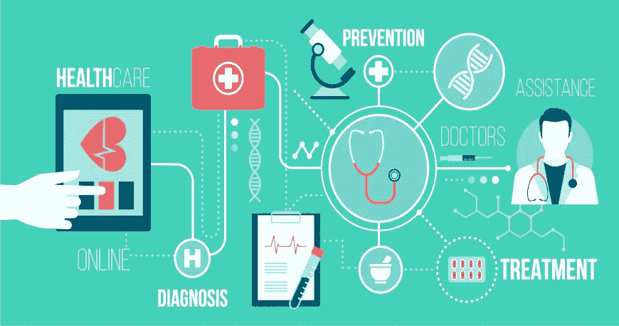

# 人类和人工智能携手实现更好的医疗保健

> 原文：<https://medium.datadriveninvestor.com/humans-and-ai-hand-in-hand-for-better-healthcare-1cb61f489f12?source=collection_archive---------9----------------------->

人工智能结合机器学习在医疗保健领域首次亮相，这些技术的快速采用引发了对许多半真半假和想象中的反乌托邦的质疑，给医学技术的未来带来了困难。

我相信人工智能将改变医疗保健领域的工作方式。无论是为癫痫发作或败血症等疾病提供早期预警，还是在个性化医疗保健方面，通知你一周内的高卡路里摄入量，人工智能都可以通过对多个数据集的密集分析来实现这些目标。

纵观人工智能的历史，医学一直是一个热门话题，在 20 世纪 90 年代，人们从基础开始努力实现自动诊断。这些努力产生了一些有趣的结果，但没有得到医学界的认可。最初的观察表明，相信基于系统的决定是至关重要的，而医学界对此也有不同意见。

随着当前全球场景中人工智能和技术领域的进步，利用人工智能进行临床决策支持、风险评分和早期预警是医疗保健领域最有前途的发展领域之一。通过利用新一代的工具和系统，使临床医生更了解细微差别，更有效地提供护理，更有可能提前解决问题，我强烈认为人工智能将开创一个临床质量和患者护理令人兴奋的突破的新时代。

我认为，尽管人工智能仍被认为处于初级阶段，但它将扰乱医疗保健系统的工作方式，与患者建立联系，并在可预见的未来提高整体患者管理效率。我认为将在 2019 年产生影响的几个应用是:

1.  **个性化语音助手:**我们经常在 Siri 或 Alexa 上整理和完成家里的日常任务。我认为人工智能将通过引入基于医疗保健的虚拟语音助手，在医疗保健领域进行类似的过渡，这将帮助提供商自动化和优先化日常流程，使其对老年人和行动不便者更加友好。
2.  **机器人辅助手术:**人工智能将征服的另一个领域是机器人手术。允许一种人工智能辅助机器人分析术前医疗记录的数据，并在手术过程中实时指导外科医生的仪器，将大大减少手术错误和并发症。
3.  **医学成像和研究:**人工智能在医疗保健领域的最大潜力是分析&医学图像的自动化，在该领域具有巨大的研究发展潜力&。人工智能可以在短时间内高速处理和筛选大量数据，这是人类不可能做到的。我能想到的一个实时应用是减少药物剂量误差。

医疗成像占医疗保健数据的近 90%,医院定期存储数百万张数字图像和数据集。一些医疗保健 IT 巨头，如 GE，Philips Healthcare 和 Siemens Healthineers，正在开发专有的人工智能解决方案作为集成产品，而其他公司正在与供应商建立战略合作伙伴关系，以便利用开发和研究领域。

微软和谷歌等科技巨头也不想在人工智能潮流中失利。微软正在探索使用人工智能来检测特定疾病的早期预警信号，而谷歌发表了一篇关于人工智能模型的文章，该模型基于近 5000 万条数据来确定患者死亡的可能性。
此外，到 2023 年，医院预计每年将投资近 20 亿美元用于诊断医学成像的人工智能，因为它已被证明可以改善患者的疗效和医院的投资回报(ROI)。

总而言之，医疗保健技术中人工智能领域的进展只是冰山一角。医疗保健中的人工智能将在未来一年中彻底改变自己，带来许多令人兴奋的机会**。**人工智能的医学突破可能看起来很少，但它们可能一直在发生，导致一场进化，让我们看到一个更光明和先进的未来。