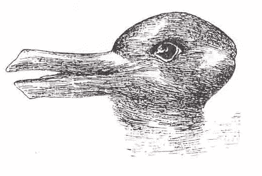
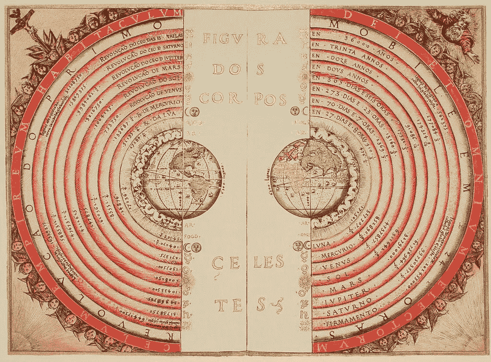
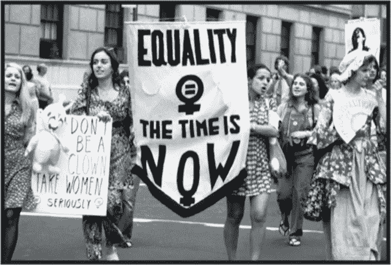

# 人类和范式转变:我们对我们的世界完全错了三次

> 原文：<https://medium.datadriveninvestor.com/humans-and-paradigm-shifts-3-times-we-were-completely-wrong-about-our-world-f01d95303be8?source=collection_archive---------0----------------------->

La scuola di Atene — Raffaello Sanzio

> 我们创造的世界是我们思考的过程。不改变我们的思维，就无法改变它。
> ***——爱因斯坦***

当你想让自己看起来很酷或者让自己的观点合法化时，引用爱因斯坦的话总是好的。主要是因为**阿尔伯特**通过其对*相对论*的研究及其证明原子存在的*数学模型，帮助我们改变了对现实的认知方式。*

然而..他并没有真正发现任何东西*(就像哥伦布没有发现美洲一样，但嘿，那是另外一个故事了)。原子一直都在那里，它们并不在乎我们是否知道它们的存在。他们漂浮着，移动着，兴奋着，带电着。*

事实上，爱因斯坦所做的“唯一”的事情，真的是打开了我们的眼界，带来了我们对世界的概念的范式转变。

范式转换这个概念最早是由物理学家、哲学家托马斯·库恩**(1922–1996)提出的。这一概念表明**

> **“科学学科的基本概念和实验实践的根本变化”**

****

**Kuhn used the duck-rabbit optical illusion, made famous by Wittgenstein, to demonstrate the way in which a paradigm shift could cause one to see the same information in an entirely different way.**

**虽然他的概念与实验进行的方式和科学运作的方式有关，**就本文而言，其含义将仅限于表明我们现实的潜在假设的根本转变** — *观念上的巨大转变，重大的* ***变化*** *。***

# **改变是关键词。**

**任何事物都在变化，变化是我们生活中唯一不变的。**

**概念、科学、研究、技术等方面的所有重大进步。是由于我们对世界的态度和概念发生了重大的范式转变。**

**尽管如此，人类天生抗拒改变。我们害怕不确定性，我们不喜欢与之相关的风险。此外，范式转变通常意味着**重新讨论我们社会的基本价值观，并可能承认我们一直以来都是错的**——*也就是说，我们把我们的世界建立在错误的假设之上。更令人不安的结论是，金字塔顶端的权力由于信息不对称和他们对信仰和态度的操纵而获得了他们的影响力。***

**如今，人类不断被要求质疑他们的信仰，并应对持续不断的创新:*事实上，我们所经历的变化的速度比过去快得多，而且看起来不会放缓。***

**活生生的变化很难:**从历史的角度来看，创新更容易被观察到。**一旦我们打破了目前对世界认知的界限，我们就会意识到**显而易见的事情**。从未来来看，无休止的斗争、战争、辩论和审查毫无意义。固执阻止不了变化，但认识到这一点需要时间。**

**这篇文章的主要目的是提供一个关于创新和变化的不同视角，并展示人类在生活中实现变化有多难。许多人为我们的社会变成现在这个样子而牺牲，现在许多人正在死去。我们不应该把变化视为理所当然，而应该把它视为达尔文式的进化过程。因此，我们不应该认为我们的现实是最终产品，而是它过去的下一步，同时意识到我们面前还有很长的路要走。**

**在这样做的时候，这篇文章提供了三个主要的例子，我们过去的盲目，过去的变化和范式的转变，强调了我们对我们的世界绝对错误的几种情况，以及改变我们的想法需要多长时间。**

**一旦我们改变了思考问题的方式，我们可能会意识到新的现实变成了“客观的”久而久之。**

# **1.地球是宇宙的中心**

****

***Figure of the heavenly bodies* — An illustration of the Ptolemaic geocentric system by Portuguese cosmographer and cartographer Bartolomeu Velho, 1568 (Bibliothèque Nationale, Paris)**

**许多世纪以来，人类相信一个地心说体系，即 T21 地球是宇宙的中心。在这个模型下，太阳、月亮、恒星和其他行星都围绕地球运行。这是许多古代文明主要采用的模式——*直到 17 世纪，通过哥白尼* *和* [*开普勒*](https://en.wikipedia.org/wiki/Johannes_Kepler) *的理论综合，这一观点才在西方文化中受到质疑。***

**这个模型由两个简单的观察结果支持:**

## **1)从地球上看，太阳似乎每天绕地球旋转一周；**

## **2)从地球上的观察者的角度来看，地球似乎不运动；它看起来是坚固的、稳定的、不动的；**

**多亏了望远镜的发明，伽利略·伽利雷的观察对地心说的一些原则提出了质疑。他、**哥白尼**和**佐丹奴**布鲁诺只是那些不愿意接受强加教义的人中的少数*(最著名的)*。在擂台的另一边，有一个危险的敌人:罗马天主教会，当时是物质世界和精神世界无可争议的统治者。他们不能允许对圣经的解释被科学主义践踏。**

**伽利略和布鲁诺最终被宣判为他们的思想而死。教会必须捍卫自己的权力，永远不能承认自己是错的——*直到他们最终不得不这样做，承认地心说模型是错的(仅在 1820 年左右)，日心说模型(太阳是宇宙的中心)是对的。***

# **2.汽车和马**

****

**Pyrmont Bridge, Sydney (1904)**

**快进到 19 世纪。汽车在慢慢发展，很少出现在街上。人们正在讨论这种新的交通工具是否会最终取代马。**

**几千年来，马一直是首选的交通工具。然而，当我们建造更大更复杂的城市时，它们成了一个问题。一些问题如下:**

*   **去除纽约街头平均每天 41 匹死马的简单方法**
*   **每天产生的 1200~公吨的粪肥需要重新安置的地方**
*   **一些地方来稳定在纽约州经营的 100，000 多匹马，以及喂养它们的食物**

**这是在纽约举行的 1898 年国际城市规划会议峰会上讨论的主要议题之一。《泰晤士报》预测，“50 年后，伦敦的每条街道都将被埋在 9 英尺深的粪肥之下”。这就是著名的“1894 年马粪大危机”。**

**尽管如此，没有人真的相信汽车可以取代马。这是当时最著名的——也是最盲目的——名言之一:**

> **[汽车]的危险是显而易见的。主要对利润感兴趣的人手中的汽油储备将构成一级火灾和爆炸危险。用汽油推动的不用马拉的马车可能达到每小时 14 英里甚至 20 英里的速度。这种类型的车辆在我们的街道和道路上疾驰，污染了空气，对我们的人民构成了威胁，即使军事和经济影响不是如此巨大，也需要立即采取立法行动……生产[汽油]的成本远远超出了私营企业的经济能力……此外，这种新力量的发展可能会取代对马的使用，这将破坏我们的农业
> ***——无马运输委员会的报告(1875)*****

**人们担心 50 年后纽约和伦敦可能会被马粪覆盖。**

**我们都知道结果如何..**

**虽然我们主要关注非技术发展，但我认为这是另一个有趣的例子，表明我们不愿意改变，以及事情如何可能与我们所认为的大相径庭。**

# **3.奴隶制和妇女权利**

****

**Slaves in a cotton field — 18th century**

**最大的，也可能是最黑暗的范式转变(不幸的是尚未完成)与我们对奴隶和女人的概念有关。我们都知道我们历史上最黑暗的一页；从 15 世纪到 19 世纪，超过 1000 万奴隶被驱逐出境。400 多年来，黑人被认为是劣等的，被系统地奴役，被残忍地对待。这是西方社会的观念；作为白人，我们相信自己更聪明，更值得活下去。不幸的是，即使在今天，这种信念仍然存在于世界的某些地方。**

**我们正在见证回归——它曾经离开过吗？种族主义和其他仇外意识形态。尽管如此，世界大部分地区已经见证了一个范式的转变，人们意识到这种有毒意识形态的错误，现在正试图抹去这样一段分裂的历史。远未完成，这就是我之前在**【活变】**概念中提到的。实施改变和明确的心态转变真的很难，但希望我们的后代会执行它，并有一天会谈论我们在肤色、性别或意识形态方面的分歧有多么盲目。**

****

**Women manifesting for equality — New York (1960s)**

**同样的话语也适用于我们对待女性的方式。历史上，妇女一直受制于*父权主义*和*忽视参与决策和政治生活*。在极端主义的沙特阿拉伯，这种情况依然存在，那里的妇女仍然被限制开车和从事其他日常工作。虽然现在平等的观念很普遍，但社会上仍有许多大男子主义的事例。那些已经经历了范式转变的人认为女性低人一等的概念有很大的缺陷，并认为平等是理所当然的；然而，他们往往低估了女性直到最近才获得与男性平等的地位。**例如，在瑞士，** [**女性直到 1971 年**](https://en.wikipedia.org/wiki/Voting_in_Switzerland)**——才被赋予选举权。****

# **精神食粮**

**改变我们的世界观非常容易。我们有缺陷的信念只能随着时间的流逝而实现。改变当前模式的道路漫长而曲折。虽然我们可能意识到我们的错误行为— *是以歧视同性恋者、妇女、黑人、吉普赛人或其他形式】*的形式——我们的世界不可能一天比一天改变，因为我们的社会结构支配着我们的社会。**

**这些只是我认为与构建我的论点相关的几个例子，但还有更多——如果你愿意，请在评论中提供一些，这样我可以在文章中整合它们。**

**希望，提供的几个能够突出创新和改变是多么困难。人类能够适应变化，我们的社会也是如此。尽管我们很想创新，但最好的创新者是时间，或者死亡。有效革新我们的社会并带来急需的变化的唯一方法是等待时间的流逝，等待新思想的传播，等待旧思想——以及这些思想的老实施者——的消亡。**

**点击订阅 DIntel [。](https://ddintel.datadriveninvestor.com/)**

**请访问我们的网站:[https://www.datadriveninvestor.com](https://www.datadriveninvestor.com/)**

**在这里加入我们的网络:[https://datadriveninvestor.com/collaborate](https://datadriveninvestor.com/collaborate)**