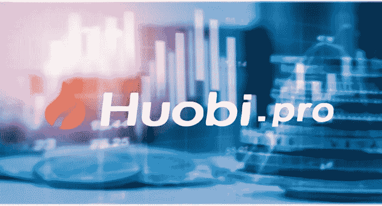
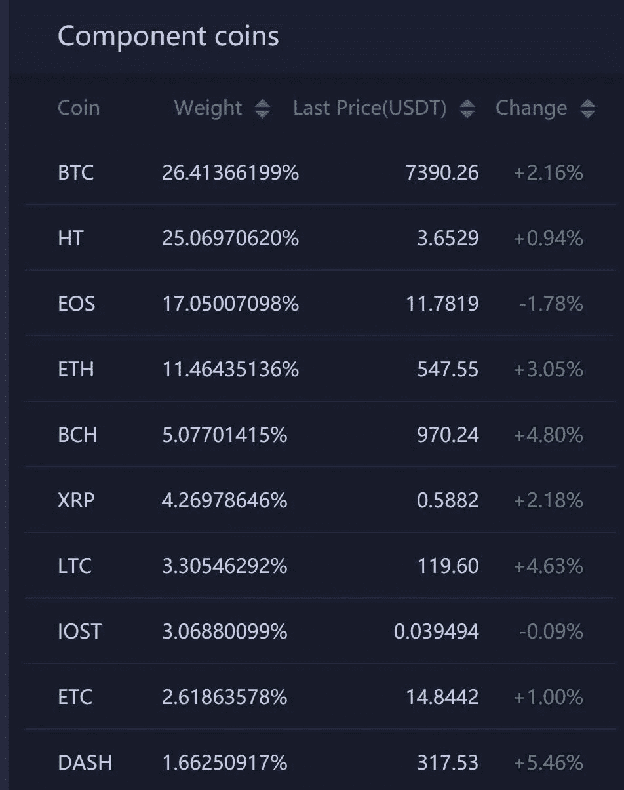
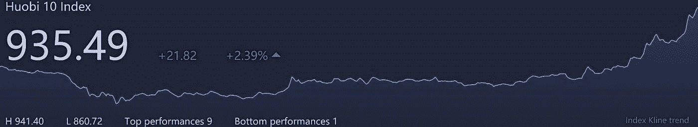

# 火币 10 给交易带来便利

> 原文：<https://medium.datadriveninvestor.com/huobi-10-brings-convenience-to-trading-4948a4b97306?source=collection_archive---------5----------------------->

火币网是全球领先的加密货币交易所之一。它在亚洲市场建立了稳固的立足点，这个基础通过在伦敦等地开设办事处帮助它扩大了在世界上的存在，伦敦是进入欧洲市场的门户。北美市场也是 Huobi 的目标，因为他们还计划在加拿大多伦多开设一家分公司。Huobi 在世界各地拥有数百万用户，他们通过托管在 Huobi 平台上的加密资产进行交易。

Huobi 平台的交易额超过 10 亿美元，这显示了 Huobi 在这一市场领域的实力。在世界领先的安全系统和 24 小时客户支持系统的支持下，加密货币和加密资产投资者可以在 Huobi 平台上享受安全、便捷和安全的投资和交易。Huobi 最近从 OKEx 挖走了一名高管，OKEx 也是加密货币交易领域的领导者，因为他们计划扩大他们的加密货币交易服务和产品。

# ***弥合传统交易所与加密交易所之间的鸿沟***

Huobi 偶尔会推出新功能，试图弥合传统交易所和加密货币交易所之间的差距。它们的组成可能不同，但有些方面是相同的。这些方面是火币正在为其已经成功的平台添加的内容。他们最新计划增加的是霍比指数。

人们一直在谈论推出比特币指数或加密指数，加密货币指数 30 和 Crix 等公司试图建立一个类似于道琼斯等传统市场的指数模型，但他们并没有真正很好地执行他们的计划。指数对投资者的重要性不容忽视。我们需要一个合适的指数，为加密投资者提供市场发展的大方向，而火币网似乎正处于满足这一需求的前沿。

Huobi 指数或 Huobi 10 将包含与 USDT 频繁交易的前十种硬币，这在可获得的流动性方面提供了交易所更准确的财务状况。投资者会从指数的表现知道仓位的火币。火币 10 包括比特币，将占总积分的 26%，火币令牌也将上市，占 25%，比特币现金，以太坊，长期资本，IOST，以太坊经典，XRP，EOS 和 Dash 完成火币 10。

这 10 个是根据其营业额选择的指数样本，这是根据 Huobi 团队的新闻稿，该新闻稿称，“*资产将根据其营业额排名…每个资产的顶级资产将被选为指数样本”**所指的类别是“硬币”、“平台”、“应用”和“真实资产令牌”。排名后从这些类别中产生的样本将根据上一个交易季度记录的日均交易量进行加权。*

# ***帮助加密资产市场发展***

*通过介绍火币 10:*

*   *Huobi 会让他们的平台对加密投资者更有利。*
*   *对于交易多种加密资产的加密货币投资者来说，他们会发现该指数非常方便。*
*   *Huobi 拥有 233 种不同的加密资产。每天跟踪他们中的 10 个人可能会很乏味，因此索引很方便。*
*   *投资者可以通过 Huobi 10 更快地了解 Huobi 交易所的财务状况，而不是跟踪单个加密资产。*

**

*为了增加这种便利，Huobi 将推出更多指数，让投资者更好地了解加密资产市场空间的每个细分市场。*

*火币网仍计划推出更多产品，因为它将在 2018 年 6 月 10 日之前发布基于指数的产品。Huobi 10 的发布和其他计划中的发布都试图通过参与类似于传统交易所的加密交易所来加快加密资产的市场采用。*

*一个成功的指数将开辟其他投资渠道，而这些渠道在加密领域还没有得到充分利用。比特币交易所交易基金或加密交易所交易基金将赋予加密货币投资一个新的维度。加密或比特币 ETF 将允许投资者分散其加密投资，同时支付比直接投资单个加密资产更低的费用。当 Huobi 10 等平台取得成功时，加密 ETF 的潜力可以得到充分发挥。*

# *精心设计的平台*

*从 2018 年 3 月至 5 月期间产生的业绩结果来看，Huobi 10 显示了未来增长的正确迹象。它的 Alpha 值与比特币的 Alpha 值相差无几，为-0.0028。火币 10 测试版基于 BTC 排名为 0.79。这些结果表明，Huobi 10 能够很好地维持 alpha 并抑制市场波动。*

*另一个表明 Huobi 合理规划其指数的原因是，在某项资产可能被摘牌的情况下，他们有一个应急计划。有时，市场可能会因为各种因素而变得残酷，这些因素可能会导致某项资产被摘牌。如果出现这种情况，Huobi 计划通过在问题得到解决时临时更换样品来解决这一问题。候选人的加密资产列表中排名最高的硬币将被选为替换样本。*

*火币被列为火币交易的十大货币之一，有助于提高其价值。通过这些精心策划的举措，火币网正在快速增长，很快它可能会与币安等市场领导者并驾齐驱，甚至超越它们。*

**

*火币 10 推出时有 1000 点的基数，它已经很活跃，这可以通过访问 [*【火币】*](https://www.huobi.br.com/en-us/topic/invited/?invite_code=da523) 或通过[*火币指数*](https://www.huobi.pro/huobi_index/) 看到，这已经让投资者对交易所有了更清晰的了解。*

*总之，推出 [*霍比指数*](https://www.huobi.pro/huobi_index/) 是一个雄心勃勃的举措，从长远来看肯定会有回报，从霍比执行他们想法的方式来看，霍比 10 将成为投资者的**参考。***

***如果你觉得这篇文章有用，并且想看我的其他作品，请点击[*这里*](https://medium.com/@salmanmiah) *关注我！*😎***