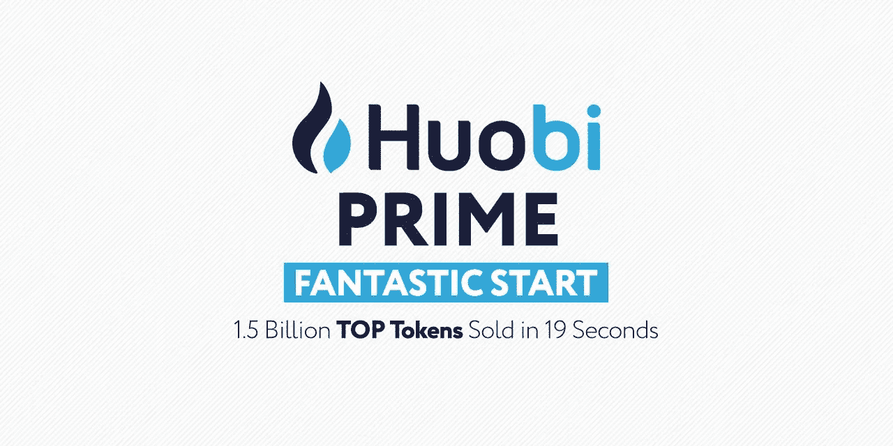
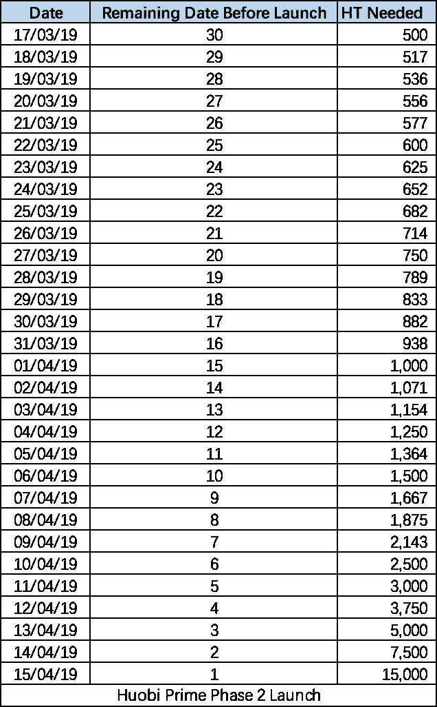

# 霍比素数；一个集成令牌列表解决方案成功持有其第一个令牌产品，即顶级网络

> 原文：<https://medium.datadriveninvestor.com/huobi-prime-an-integrated-token-listing-solution-successfully-holds-its-first-token-offering-the-5325c95761d4?source=collection_archive---------17----------------------->

## ***火币介绍火币质数；一个更简单、更有组织、更民主的流程，使交易者能够最大限度地在其交易所挂牌交易。“客户需求和用户需求是我们在 Huobi 所做的一切的首要目标。火币 Prime 在很大程度上是这种模式的延伸，”火币集团创始人兼首席执行官 Leon Li 表示。由于 Huobi 计划在 4 月 16 日举行其第二次 Prime token 上市，上市流程中的新优化已被引入，以提供更好的交易体验。***

在最近的过去，我们看到许多加密硬币从 2018 年底的历史低点反弹，标志着熊市趋势的改变。当前的市场趋势无意中刺激了一些加密影响者在社交媒体上释放看涨情绪。随着许多代币价格的市值回升，一个更积极但不太明显的趋势是，相对较新的项目，尤其是通过知名交易所平台推出的项目，即使在熊市的冬天也表现不错。这一方面可以归因于交易所平台的活跃社区提供的额外影响，其与上市代币的本地社区相结合，创造了支撑代币价格的需求和热情。

在 crypto 中，任何给定项目的社区情绪和信心水平都是由在一个好的交易所上市来驱动的，由于显而易见的原因，社区情绪通常反映在价格上。相对于交易者利用新项目快速赚钱的简单资本主义倾向，在 good exchange 上市实现了加密货币的基本目的；提供不受地理障碍的数字资产的民主访问。

 [## 总部设在瑞士的 ETP 进入加密交易市场-数据驱动的投资者

### 虽然金融市场几乎没有沉闷的时刻，特别是在引入…

www.datadriveninvestor.com](https://www.datadriveninvestor.com/2019/03/10/swiss-based-etp-enters-the-crypto-trading-market/) 

在此背景下，火币推出了火币 Prime，这是一个直接的 Prime 发售(DPO)平台，本质上解决了传统上市流程的三个关键挑战。

*   首先，它在这个过程中灌输了一种责任感。良性筛选过程确保只有有真实用例的知名项目才有机会上市。
*   这使得参与 ICO 的过程大大简化。第一方面，用户可以在代币上市时参与代币销售，这降低了参与代币销售的风险，只是因为您想要的项目在错误的时间上市，或者在对项目生态系统没有实际好处的较低层交易所上市。
*   该计划还通过两种方式保护项目免受不受监管的上市过程中常见的上市困境，即少数交易者可能自私地压低价格，以“甩开弱小的手”。这种情况会对项目产生负面影响，可能很难重新获得公众对其可行性的信任。火币通过分层推出实现上市过程的公平性。例如

> “为了缓解市场开盘时的极度波动，并降低对投资者造成不利影响的风险，我们还增加了一个分级价格限制期。”

火币 DPO 推出的第一个项目是 TOP Network 一个基于 DAG 的区块链平台项目，致力于为分散式开放式通信网络构建基础设施。从长远来看，我们来看看火币在评估火币 Prime 上市项目时考虑的参数背景下的 TOP Network 项目。

## ***a .强大的项目团队:***

在这方面，按照行业标准，TOP Network 拥有一支坚实的团队，在通信网络方面拥有扎实的经验。例如，首席执行官史蒂夫·魏和首席架构师开尔文·杨共同创建了一个电话和信息平台 **Dingtone** ,该平台现有用户估计超过 3500 万。 **Dingtone** 每年处理超过 100 亿分钟的 VoIP 通话，每天处理 100 万条消息。计划是将这个庞大的现有服务转移到顶级区块链，并使其成为一个分散的消息应用程序。**此外，耶鲁大学毕业生 CMO·诺亚·王**曾在包括普华永道在内的世界顶级金融机构担任过管理工作，并担任过斯达战略控股公司的美国地区主管。

这种教育质量和实际商业经验可以在所有团队成员中重复出现。

## ***b.*** ***一种渐进式的商业模式:***

对于 TOP Network，它始于他们的价值主张。TOP Network 将提供电子邮件、消息应用、VoIP 等通信软件之间的互操作性。想象一个场景，用户可以从 WhatsApp 给 Telegram 上的用户打电话，或者给 Gmail hangouts 上的办公室用户打电话。TOP Networks 产品的核心是通信中的隐私和安全，以及端到端加密，这是区块链网络提供的一个关键要素。TOP Network 还希望最大限度地利用运营分散网络的低成本，将用户使用网络进行通信的费用降至最低。火币网的张(Ross Zhang)***很快指出，这种渐进式的商业模式对于 TOP Network 在火币网上获得首发位置至关重要。***

此外，通信网络将提供 VPN 服务、CDN 服务、视频流、物联网数据共享和云存储服务。拥有一个标准通信协议还会带来生产时间和成本方面的好处。首先，TOP Network 提供了全栈云通信服务，使应用程序开发人员不必开发自己的通信栈。其次，应用程序中的互操作性将削减通信系统中的许多冗余，在通信系统中，为了与不同地理位置的不同人进行通信，你必须安装许多应用程序。

## ***c.*** ***令人印象深刻的资金后盾:***

TOP Network 得到了行业巨头 Fenbushi 和 Digital Horizon Capital (ADVC)以及其他行业知名风险投资公司的支持。你可以查看下面的图片，看看令人印象深刻的顶级网络金融支持者名单(按行业标准)。

## *d .社区的大力支持:*

在研究这篇文章时，我加入了 TOP Network 的在线渠道，很明显，TOP Network 与其用户和投资者社区保持着健康的关系，用户可以自由地与项目负责人就如何最好地实现项目愿景进行交流。

## ***e .名声稳固(无负面新闻或丑闻):***

在互联网上搜索后，没有出现任何关于 TOP Network 的重大消息，可能会对它产生负面影响。

## ***f .以前未在主要交易所上市*** *:*

顶网首次在火币交易所独家上市

魏说:“我们与火币网有着密切的合作，他们的专业精神、开放态度和对项目的友好态度赢得了我们的信任。”。“我们对 Huobi 的良好声誉和强大的品牌影响力印象深刻，我们很高兴在 Huobi Prime 上推出 TOP Network。”

# **即将推出火币 PRIME 的第二个项目**

继在火币网上成功推出 TOP Network 之后，火币网计划推出火币网小说《DPO》的第二个项目。以下是火币平台 TOP Network 首次发布的统计数据。

*   所有 15 亿枚顶级代币都被成功售出
*   平均而言，所有三轮大宗交易的交易处理时间为 6 秒
*   超过 130，000 人参加了这一过程，其中 3，500 人设法购买了代币。

4 月 16 日(GMT+8)启动的第二个 Prime 交易流程将进行一些重组，为所有用户提供更好的交易体验。首先，将实施 30 天 HT 持有规则作为参与令牌列表交易的要求(用户需要在之前的 30 天内保持至少 500HT 的账户余额才有资格)。其次，将根据火币网在第一次活动期间收到的反馈和建议，实施其他技术和管理优化。

第三，新列表[流程](https://blog.hbg.com/3-exciting-changes-on-the-way-for-huobi-prime/)发生了变化，因此:

*   Huobi 引入了一个渐进模型，将 HT 令牌的数量与持有天数相关联。这种模式可确保无论您购买 HT 的日期是哪一天，只要您帐户中每天持有的平均代币数量等于之前 30 天持有期所需的代币数量，您就可以参与 Prime 列表。为了便于说明，请看下图。

*   与之前的 20 分钟交易回合和 10 分钟休息相比，交易回合的时间跨度更短，交易回合和休息时间分别为 5 分钟和 5 分钟。
*   将会有一个特殊的第三轮，任何有资格进行 Huobi Prime 交易并下单的人都将至少获得一些他们想要的代币。

# **结论**

在我看来，顶级网络项目是基于未来的、平等的概念。目前，我们经常与限制性的集中式通信网络、昂贵的费率以及使用集中式通信系统带来的被监视的不祥预感作斗争。如果团队得到现有和不断增长的用户群的支持并承担交付任务，TOP Network 有潜力改变沟通游戏。

最值得注意的是，Huobi Prime 是关于公平竞争的，确保鲸鱼和小玩家享有平等的交易机会。以低于市场价的价格购买代币的机会强调了这一点。更不用说，通过 Huobi Prime 购买的硬币是实时交付的，一个用户可以立即用购买的代币开始与 HT (Huobi exchange 平台的原生代币)进行交易。)

另一个重要的方面是，在 Huobi Prime 上上市的项目都经过严格的审查，保护投资者免受不道德项目团队的陷阱，以快速获利。在更广的范围内，Huobi prime 的引入极大地提高了 Huobi 生态系统的效率和价值。这一价值无疑已经反映在火币的市场价格上，因为火币的价格已经从年初 0.9 美元的平均价格低点反弹了 3 倍(撰写本文时为 2.85 美元)。代币价格不仅仅是对火币生态系统整体价值主张中社区信念的指标；这也反映了随着新用户加入 Huobi 生态系统，享受 Huobi Prime 等革命性服务，生态系统增长的需求。

请务必点击此[链接，了解一下 Huobi Prime 及其改变游戏规则的令牌列表。](https://blog.hbg.com/huobi-primes-inaugural-launch-top-networks-top-price-jumps-over-500-2/)