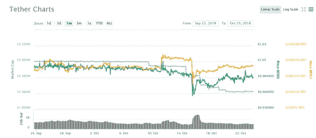
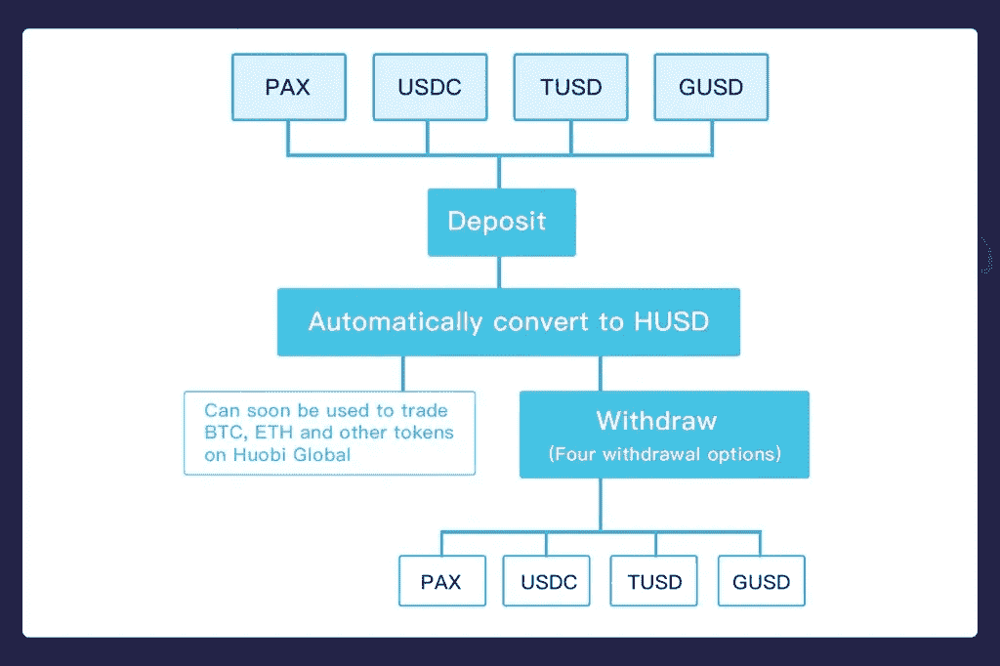

# HUSD:火币推出统一稳定的硬币解决方案

> 原文：<https://medium.datadriveninvestor.com/husd-huobi-rolls-out-unified-stable-coin-solution-e6e55383e788?source=collection_archive---------52----------------------->

Screenshot from The Dark Knight Rises

将 Tether 作为第一个稳定的硬币引入加密货币生态系统，旨在通过提供具有稳定价值的数字令牌来桥接加密货币世界和传统金融系统。stablecoins 背后的想法相当简单，即创造与美元挂钩的非易失性数字代币，并由银行账户中的菲亚特提供支持；因此，它们可以根据需求以 1:1 的比例兑换成美元。不出所料，Tether 的先发优势赋予了它在加密生态系统中独一无二的地位，*或许太重要了*；在今天的加密货币交易中，它与比特币和以太坊一起被用作基础货币之一。

从与 Bitfinex 及其银行母公司的关系，到其审计缺乏透明度，Tether 有着臭名昭著的争议历史。有一段时间，关于系绳的 FUD(恐惧、不确定性、怀疑)只是在下一个吸引市场注意力的大事件或市场运动之前才被强调。Tether 的黑暗历史中最近的一段插曲，即 Tether 的破产，将 Tether 带到了悬崖边缘，其价值跌至 0.84 美元，并在 Bitfinex 等一些交易所产生了溢价。市场对这一黑天鹅事件的反应是:交易员将他们的资金从 Tether(由于其价格稳定，是加密货币熊市中首选的基础货币)转移到比特币和其他加密货币，担心 Tether 即将崩溃，导致整个市场的价格暂时飙升。

Tether’s volatility between 14 and 18 of October.

大多数人采取不冷不热的“这也会过去，我们以前来过这里”的方法，每次泰瑟·FUD 出来，他们就出现在事情恢复正常的时候。然而，今天假新闻的力量比以往任何时候都强大，即使指控可能是不真实的，其损害也可能是严重的。尽管随着价格稳定回到正常水平，系绳上的烟雾正在“清除”,但这一次各行业利益相关者对房间里的大象做出了姗姗来迟的回应。最近，监管机构批准了 Gemini Dollar、Pax 和 True USD 等系绳替代品，这些替代品带来了更高的透明度和稳定性，也使之前被忽视的替代品(如 DAI)脱颖而出。

在一场团结协作的展示中，包括火币网、币安和 OKEX 在内的大多数顶级交易所都迅速列出了这些稳定货币，并将其作为多种加密货币的交易对提供。这表明了对客户安全第一的承诺，从而提高了贸易商的信心。

# 火币解决方案:HUSD

对于投资者来说，太多的选择可能有点难以下咽，这就是为什么火币 Pro 更进一步，为其用户 HUSD 提供了一个通用的稳定币解决方案。大多数投资者会对由全球领先的数字资产交易所火币国际(Huobi Global)支持的用户友好型 HUSD 感到满意。火币 Pro 一直以客户利益为重，采取了资产冷藏、火币安全备用金等措施。

# HUSD 模式

作为一名交易者，你可以存入最近上市的四只股票中的任何一只，它们是帕克斯、TUSD、USDC 和 GUSD。交易时，你不再需要在多个稳定的硬币中选择。同样，你也可以在交易活动结束后选择稳定的硬币。从长远来看，这也节省了成本。

根据官方发布的消息，HUSD 将分阶段推出:

*1。PAX、TUSD、USDC 和 GUSD 的存款服务将于 10 月 19 日 16:00(GMT+8)开始。*

*2。USDT/HUSD 交易对将于 10 月 22 日上午 10:00(GMT+8)在 Huobi Global 上市。*

*3。HUSD 在霍比 OTC 和霍比环球之间的转让服务将于 10 月 22 日上午 10:00(GMT+8)开始，HUSD 在霍比 OTC 的交易服务将于 10 月 23 日上午 10:00(GMT+8)开始。*

*4。Huobi Global 将在评估市场状况后，在另一个时间开始 BTC/HUSD 和瑞士联邦理工学院/HUSD 的交易。*

*5。火币 App 将支持 USDT/HUSD 的交易服务，HUSD 的存取款服务将在下一个 App 版本中提供。*

*6。Huobi Global 将在一到两周内启动 stablecoins 的取款服务。具体时间和日期将另行通知。*

自正式宣布 HUSD 启动以来，该消息得到了 Gemini USD、Pax 和 USDC 项目的广泛支持，他们也通过其官方 Twitter 平台传播了该消息。

对于这些即将推出的稳定币替代品的可靠性，问题仍然挥之不去，反向投资者和批评者指责集中式后门可以允许代币冻结，这违背了加密货币领域的精神；也许我们还没有脱离险境。作为旁观者，我意识到，随着未来金融工具的不断升温，稳定的银行之间的竞争正在加剧，我们将能够在回顾时确定这一关键时刻的影响。为了进一步强调这一点，我相信，当我们在几年后把这些点联系起来时，HUSD 对稳定资本的支持将发挥更重要的作用。这是否是解决困境的灵丹妙药还有待观察，然而，我相信这是一个新奇的时刻，看似孤立的一小步，对整个生态系统来说却是巨大的。

想了解更多关于 HUSD 发布的信息，你可以访问火币官方博客[这里](https://huobiblog.com/husd-a-new-stablecoin-solution/)

# 👉今天在火币 Pro 上开户[这里](https://bit.ly/2pSN3LO)或者[这里](https://https/www.huobi.com/?utm_source=GlobalWriters)

## 充分披露:本文无意作为投资建议。这只是我个人对火币的看法。你应该总是做自己的研究。火币环球奖励我写这篇文章，支持我通气自己的个人看法。