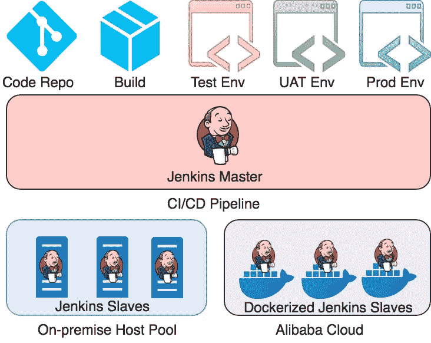

# 混合 CI/CD —在阿里云上托管 Dockerized Jenkins Slaves

> 原文：<https://medium.datadriveninvestor.com/hybrid-ci-cd-hosting-dockerized-jenkins-slaves-on-alibaba-cloud-caa8e0eab2d6?source=collection_archive---------8----------------------->

[](http://www.track.datadriveninvestor.com/1B9E)

*作者约翰华，* [*阿里云科技分享作者*](https://www.alibabacloud.com/campaign/techshare?spm=a2c41.13103428.0.0) *。*[*Tech Share*](https://www.alibabacloud.com/campaign/techshare?spm=a2c41.13103428.0.0)*是阿里云的激励计划，旨在鼓励在云社区内分享技术知识和最佳实践。*

本文分享了如何在阿里云上实现分布式和码头化的 Jenkins 从池，实现动态和并行 CI/CD 管道供应，以实现最佳的资源利用率、按需可扩展性和成本效益。

[](https://www.datadriveninvestor.com/2019/03/26/agile-management-the-good-the-bad-and-the-downright-ugly/) [## 敏捷管理:好的、坏的、丑陋的|数据驱动的投资者

### 公司不断重塑自己，以获得或保持竞争优势和市场份额。这是…

www.datadriveninvestor.com](https://www.datadriveninvestor.com/2019/03/26/agile-management-the-good-the-bad-and-the-downright-ugly/) 

# 什么是混合 CI/CD

混合 CI/CD 是一个分布式平台，它混合使用内部和公共云弹性计算资源来实现 CI/CD 目的。混合 CI/CD 基本上控制私有云和公共云之间的工作负载，以平衡需求和成本。

在高层次上，该架构如下图所示。



# 混合 CI/CD 的优势

# 可扩展性和灵活性

内部部署确实提供了一定程度的可扩展性，但这仍取决于每个数据中心，并且在很大程度上取决于其预算。通常，当一个系统消耗的资源超出预期时，所有其他系统都会受到影响。因此，如何设定预算的界限变得棘手。公共云服务将通过更大的云基础设施提供更大的可扩展性。考虑到 CI/CD 工作通常是孤立的、短暂的并且通常是无状态的。通过将 CI/CD 作业转移到公共云，它允许组织为核心服务保留可扩展性。

# 成本效率

公共云更有可能提供更经济的成本效益，因为集中管理的成本由每个用户分担。

# 安全性

与纯公共云解决方案相比，混合 CI/CD 保留了对安全需求的敏感性，因为您可以始终限制数据只能由适用的 CI/CD 作业访问。

# 为什么 Docker 主机作为构建奴隶

# 资源利用

Docker 会动态分配资源，这样你就可以有多个 Jenkins 从机并行运行。这将极大地增加 CI/CD 管道的吞吐量。

# 隔离

Docker 确保您的应用程序和资源被隔离。你可以简单地摧毁目标容器而不用担心詹金斯奴隶是否真的彻底清理干净了。

# 环境标准化

您可以简单地构建从标准映像继承的 CI/CD 环境。

# Jenkins 从属容器实现

从 Jenkins 主机到 Jenkins 从机使用两种类型的通信协议。它们是 Java Web Start(又名 JNLP)和 SSH。虽然 SSH 是在阻塞 I/O 下加密的，这限制了可扩展性，但它仍然是最常用的方法，因为它不太依赖于负载平衡器。所以在本文中，我们将只讨论 ssh 从设备的类型。

建议专门构建 Jenkikns 从属 docker 映像，因为环境可能因项目而异。https://github.com/jenkinsci/docker-ssh-slave 为我们提供了一个学习的好榜样。

```
DockerfileFROM openjdk:8-jdk
    LABEL MAINTAINER="Nicolas De Loof <nicolas.deloof@gmail.com>" ARG user=jenkins
    ARG group=jenkins
    ARG uid=1000
    ARG gid=1000
    ARG JENKINS_AGENT_HOME=/home/${user} ENV JENKINS_AGENT_HOME ${JENKINS_AGENT_HOME} RUN groupadd -g ${gid} ${group} \
        && useradd -d "${JENKINS_AGENT_HOME}" -u "${uid}" -g "${gid}" -m -s /bin/bash "${user}" # setup SSH server
    RUN apt-get update \
        && apt-get install --no-install-recommends -y openssh-server \
        && rm -rf /var/lib/apt/lists/*
    RUN sed -i /etc/ssh/sshd_config \
            -e 's/#PermitRootLogin.*/PermitRootLogin no/' \
            -e 's/#RSAAuthentication.*/RSAAuthentication yes/'  \
            -e 's/#PasswordAuthentication.*/PasswordAuthentication no/' \
            -e 's/#SyslogFacility.*/SyslogFacility AUTH/' \
            -e 's/#LogLevel.*/LogLevel INFO/' && \
        mkdir /var/run/sshd VOLUME "${JENKINS_AGENT_HOME}" "/tmp" "/run" "/var/run"
    WORKDIR "${JENKINS_AGENT_HOME}" COPY entrypoint.sh /usr/local/bin/entrypoint.sh EXPOSE 22 ENTRYPOINT ["entrypoint.sh"]
```

詹金斯奴隶`entrypoint.sh`

```
#!/bin/bash -ex write_key() {
        mkdir -p "${JENKINS_AGENT_HOME}/.ssh"
        echo "$1" > "${JENKINS_AGENT_HOME}/.ssh/authorized_keys"
        chown -Rf jenkins:jenkins "${JENKINS_AGENT_HOME}/.ssh"
        chmod 0700 -R "${JENKINS_AGENT_HOME}/.ssh"
    } if [[ $JENKINS_SLAVE_SSH_PUBKEY == ssh-* ]]; then
    write_key "${JENKINS_SLAVE_SSH_PUBKEY}"
    fi
    if [[ $# -gt 0 ]]; then
    if [[ $1 == ssh-* ]]; then
        write_key "$1"
        shift 1
    else
        exec "$@"
    fi
    fi # ensure variables passed to docker container are also exposed to ssh sessions
    env | grep _ >> /etc/environment ssh-keygen -A
    exec /usr/sbin/sshd -D -e "${@}"
```

# 詹金斯主配置

我们假设您之前已经设置了您的 Jenkins Master。你也可以参考下面的三部曲文章，在阿里云上建立一个新的:

*   [Jenkins 的 CI/CD—第 1 部分:在 Ubuntu 上安装 Jenkins](https://www.alibabacloud.com/blog/ci%2Fcd-with-jenkins---part-1%3A-install-jenkins-on-ubuntu_593717?spm=a2c41.13103428.0.0)
*   [Jenkins 的 CI/CD—第 2 部分:使用 Jenkins 进行持续集成](https://www.alibabacloud.com/blog/ci%2Fcd-with-jenkins---part-2%3A-use-jenkins-for-continuous-integration_593720?spm=a2c41.13103428.0.0)
*   [Jenkins 的 CI/CD—第 3 部分:使用 Jenkins 进行连续交付](https://www.alibabacloud.com/blog/ci%2Fcd-with-jenkins---part-3%3A-use-jenkins-for-continuous-delivery_593724?spm=a2c41.13103428.0.0)

然后进入詹金斯仪表板/管理詹金斯/管理插件，搜索“Docker 插件”并安装它

接下来，转到 Jenkins Dashboard/Manage Jenkins/Configure system，在 docker 下用您的 ECS 公共 ip 地址和 Docker 远程 API 的端口填写 Docker URL，默认端口为`2375`。有一个“测试连接”按钮，所以你可以尝试，看看是否连接成功。

然后选择“添加 docker 模板”并点击“Docker 模板”。并根据以下内容填写详细信息:

*   Docker 图像:jenkinsci/ssh-slave
*   远程文件系统根目录:/home/jenkins
*   标签:ssh-从
*   凭证:您为 ssh-slave 容器注入的公钥

当一切都设置好后，你可以点击“保存”按钮。

# 测试配置

转到“新项目”并创建一个名为“ssh-slave-test”的`freestyle`项目。

在“限制”下，键入您在从属模板中给定的标签名称。在本例中，它是“ssh-slave”。

在 Build 下选择 execute shell 选项，并键入如下所示的 echo 语句。

```
echo "hello {JOB_NAME}"
```

保存该作业并单击 build now，您应该得到以下输出。

```
hello ssh-slave-test
```

# 下一步是什么

一旦您完成了上面的一切，您就可以与您的代码库集成，并创建真实的 CI/CD 作业。您也可以根据自己的实际需求定制 docker 图像。

# 原始资料

[](https://www.alibabacloud.com/blog/hybrid-cicd---hosting-dockerized-jenkins-slaves-on-alibaba-cloud_594978?spm=a2c41.13103428.0.0) [## 阿里云上的混合 CI/CD 托管 Dockerized Jenkins Slaves

### 阿里巴巴 Clouder 2019 年 6 月 24 日 297 作者:John Hua，阿里云技术分享作者。技术股是阿里云的激励…

www.alibabacloud.com](https://www.alibabacloud.com/blog/hybrid-cicd---hosting-dockerized-jenkins-slaves-on-alibaba-cloud_594978?spm=a2c41.13103428.0.0)