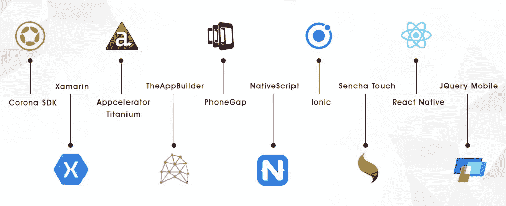
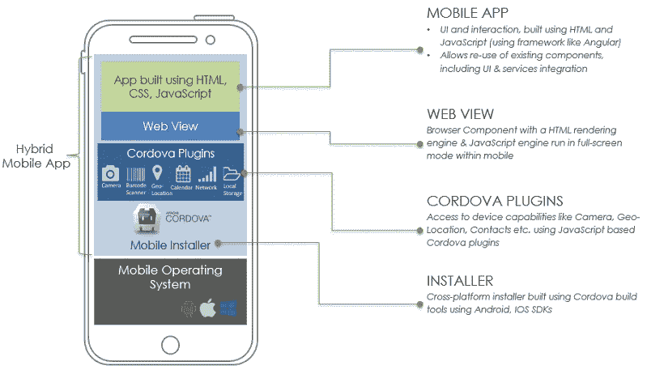

# 2019 年混合移动应用开发框架

> 原文：<https://medium.datadriveninvestor.com/hybrid-mobile-app-development-frameworks-for-2019-ac56b1e65f29?source=collection_archive---------0----------------------->

数字气球正以前所未有的速度膨胀。开发人员正专注于升级已部署的系统和使用的技术的现有水平。我们都见证了更多的创新概念，就像即将到来的智能手机和移动应用程序。甚至公司的范式也已经转变为实施创新的商业战略。大多数组织都打算使用移动应用程序，因为这是接触全球受众的快速通道。

然而，要使您的移动应用程序成功，必须选择正确的移动框架、技术和数据库。随着年龄和时间的增长，你可以看到 iOS 系统的 [**和安卓系统的**](https://www.volansoft.com/blog/android-apps-vs-ios-apps) 应用数量稳步上升。事实上，混合和跨平台应用程序开发也获得了发展势头，因此人们肯定会对用于这一重大转变的最佳框架给予信任。

 [## 2019 年移动应用开发之路|数据驱动的投资者

### 任何在移动应用程序开发行业工作的人，无论他们是专注于在伦敦开发 iOS 应用程序还是…

www.datadriveninvestor.com](https://www.datadriveninvestor.com/2019/01/15/the-path-of-mobile-app-development-in-2019/) 

通过考虑一段时间内的混合应用程序开发，我们已经看到了新框架的出现，这些框架保证了开发人员的生活变得轻松。但是，使用这些功能丰富且用户友好的框架并不像看起来那么容易。因此，为了帮助您为即将到来的混合开发项目选择合适的移动框架，我们列出了一些最佳框架

**1。Ionic —开源 HTML5 开发框架**

Ionic 是应用于移动应用程序开发的大量使用的平台之一。比知道是免费的更有趣的是。通常，客户端框架有助于通过融合 JavaScript、CSS3 和 HTML 来构建基于本机的应用。Ionic 框架为最新的移动设备提供帮助，并在最终投放市场之前为移动应用奠定坚实的基础。开源框架仅使用单一代码库，这意味着它能够为所有类型的便携式系统开发直观、响应迅速的应用程序。它最棒的一点是当你在这个 Ionic 框架上构建一个应用的时候；它将在所有移动设备上有效或流畅地工作。

**2。PhoneGap——一个跨平台的移动应用开发框架**

它也被称为 Apache Cordova，由 Adobe 拥有和采购。PhoneGap 是一个简单的混合和跨平台框架，目前市场份额为 22.29%，这使得它成为开发跨平台应用程序的首选框架之一。像所有其他方便的框架一样，PhoneGap 允许开发者在硬件上预览结果，从而在代码中应用必要的修改。可以在所有 Android 和 iOS 平台上运行；您还可以利用附加插件添加更多功能。

它需要一个直观的桌面来开发移动应用程序，然后为桌面上创建的应用程序提供服务，以连接移动设备。没有令人费解的文本命令。

**3。xam rin——程序员的最爱，顶级的跨平台工具**

Xamarin 由微软于 2011 年创立，是用于构建混合平台应用程序的最热门工具。开发者可以利用相同的代码来包含不同的操作系统，例如 Android、Windows、macOS、iOS 等等。拥有一个伟大的用户界面，它不仅可以帮助开发者开发本地应用，还可以控制应用提供最终的用户体验。除此之外，Xamarin 移动应用程序框架有助于生成高效、高性能的代码，这些代码可以访问所有本机 API。因此，我们可以说 Xamarin mobile framework 将会有一个光明的未来，因为他们正在缩小众多平台之间的差距，特别是在微软收购了它之后，现在已经免费了。

**4。react Native——iOS 和 Android 应用开发的首选跨平台解决方案**

这是另一个流行的跨平台框架，由脸书(社交媒体巨头)引入。虽然它是在大约三年前的 2013 年成立的，但它已经成为移动应用程序开发者的首选之一。与此同时， [**React Native**](https://www.volansoft.com/blog/react-native-a-desired-knowledge-for-app-development) 为 ide 和其他移动应用开发工具提供了充分的支持。为了在 iOS 和 Android 两个平台上创建本地应用，它被认为是一个最佳的 JavaScript 框架。除了代码的可重用性之外，它还允许你立即预览结果，并给出准备应用的部分，因此大大缩短了开发时间。它同时为你提供了测量仪器和照相机等功能。其呈现的结果可能是高质量的类似原生的程序。

**5。Corona SDK —在最短时间内创建兼容的跨平台应用**

Corona SDK 比其他移动应用程序开发平台快 10 倍，其中一个重要方面是它由 Lua 支持，Lua 是一种轻量级编程语言，提供了开发应用程序的速度、灵活性和易用性。Corona 有助于开发人员构建独立的代码库，在 Nook、iOS 和 Android 上运行得非常好。通过考虑它的功能，包括交互性和应用程序中令人愉快的图形内容。Corona SDK 应用程序开发也有助于在多个设备或系统上自动扩展内容。

**6。flutter——无缝创建出色的移动应用程序**

Flutter 旨在后台支持多种语言，无需替换 Swift、Java 和 Objective C 即可跨平台工作。此外，它的热重装功能，即 VI 和 CLI 编辑器，允许嵌套和组装小部件以建立 UI，可以应用滑块、按钮、开关、对话框、加载微调器、标签栏，而无需依赖 OM 和 OEM 小部件 web 视图。Flutter 最近登陆，2017 来自 Google 基于 Dart 的一种 [**面向对象编程语言**](https://www.volansoft.com/blog/flutter-1-0-new-exposure-to-application-development) ，开发者已经发现掌握它的技能相当容易。它还允许一个包装 web 视图和一个优秀的类似本机的用户界面。Flutter 在具有高级渲染马达的框架下渲染快速且可调节的小工具。谷歌广告、阿里巴巴电子商务和汉密尔顿音乐剧等。是在 Flutter 平台上开发的最顶级的网站。

**7。移动 Angular UI——Angular JS 和 Bootstrap 的完美结合**

移动角度用户界面需要许多交互因素，如覆盖，开关，侧边栏，从而为用户提供一个强大的移动体验。该框架包含各种好处，这使它成为现代 web 应用程序的最佳选择。作为一个跨浏览器兼容，移动 Angular UI 有效地处理适合每个浏览器的 JavaScript 代码。

**8。jQuery Mobile——简洁的跨浏览器 JavaScript 框架**

它可以通过携带几个插件来使用 JavaScript 库，如内容滑块、图像滑块、弹出框等。与其他 JavaScript 库相比，jQuery 更容易，因为它需要编写更少的代码来获得与其他库相同的特性。除此之外，jQuery 使网页更加简单、用户友好和具有交互性，因为它们对于所有搜索引擎来说都是完全可读的，并且在 SEO 方面进行了优化。

**9。英特尔 XDK —使用 HTML5 和 JavaScript 创建移动和平板电脑应用**

单一代码库，英特尔 XDK 允许开发人员为 iOS、Android、Windows、Amazon 和 Nook 构建移动应用。开发者更喜欢这个框架的主要原因是，它提供了一个拖放式的用户界面，因此可以很容易地构建界面。它带有应用程序调试和配置选项，因此在众多设备配置上的应用程序测试变得更加容易。

10。appcelerator Titanium——首屈一指的跨平台移动应用开发解决方案

如果您正在寻找一站式移动应用程序框架，那么 Appcelerator Titanium 是正确的选择。它包括独立的 API，使访问移动设备硬件相对可靠和顺利。Appcelerator Titanium 收购 UI 组件是为了向用户群提供良好的性能。与 Alloy 一起创建的移动应用程序有助于跨不同应用程序和平台的重用。

在考虑了众多因素后，即时间段、操作系统、预算等，这里是 2019 年混合移动应用框架的列表。此外，您还可以咨询专家，以便为您的 app 项目选择合适的框架。