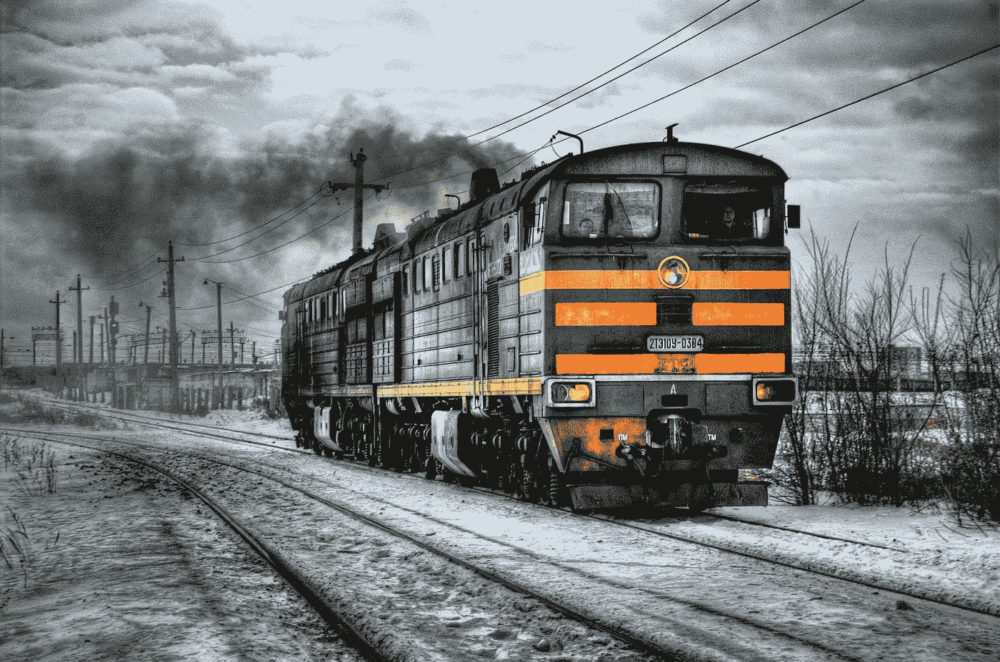
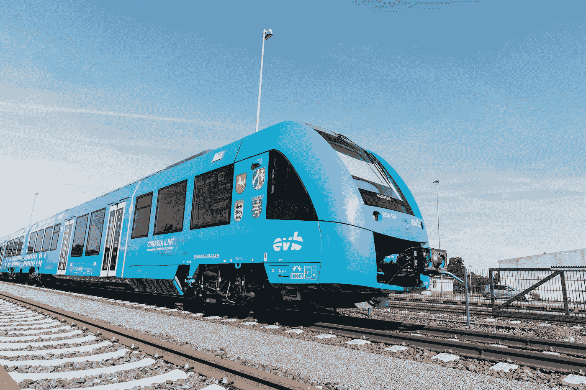

# 氢气可能会终结柴油火车

> 原文：<https://medium.datadriveninvestor.com/hydrogen-could-spell-the-end-for-diesel-trains-9c76d2eecc5d?source=collection_archive---------12----------------------->

在我所在的当地火车站，每辆停下来吐出乘客和微粒污染的火车上方的空气中，柴油烟柱闪烁着微光。在伦敦的马里波恩站——我通常的最终目的地——火车在旅程开始时加速引擎，喷出浓浓的黑烟，就像吸烟者在早上第一件事就是清理肺部。

吸入柴油烟雾是个坏消息。我花了很多时间研究柴油污染，为我即将出版的关于空气污染的书*净化空气。早在 20 世纪 80 年代，国际癌症研究机构(IARC)就将柴油废气列为可能的致癌物。到 2012 年，IARC 将柴油升级为“肯定”对人类致癌。柴油对运输运营商来说有很大的优势，因为与汽油相比，柴油相对便宜且高效。但是它产生的烟雾中 T4 颗粒物质(进入肺部和血液的微小颗粒)和二氧化氮的含量要高得多，二氧化氮是一种气体污染物，被认为在欧洲每年导致大约 75，000 人死亡。*

**

*当我们想到柴油时，我们往往会想到汽车，以及大众丑闻。然而，火车是排放大户。我们需要更多地从暴露程度而不是百分比的角度来考虑污染——从统计数据来看，工业工厂可能会比火车排放更多的污染物，但如果你每天乘坐两次柴油火车上下班，*那就是你呼吸的空气，而不是工厂的空气(除非你也在工厂工作——在这种情况下，我表示同情)。**

*目前英国大约 29%的火车使用柴油。英国政府计划在 2040 年前逐步淘汰纯柴油列车，以减少排放。但目前，只有 42%的网络实现了电气化——远低于其他欧洲国家，包括荷兰(76%)、意大利(71%)和西班牙(61%)——这意味着 2040 年的目标不太可能仅靠电气化来实现。同时，最近在英格兰北部、中部和威尔士提出的电气化计划已经全部被取消。*

*然而，氢火车是一种潜在的替代品。它们可以取代现有非电气化轨道上的柴油机车。2018 年末，[法德合作](https://singularityhub.com/2018/10/03/the-worlds-first-hydrogen-powered-commuter-train-is-now-in-service/#sm.001xf2w3t1acaf3mw4r1tw4l86wj3)见证了两辆由阿尔斯通制造的氢燃料列车在下萨克森州的一条线路上行驶，取代柴油。阿尔斯通已经接到订单，到 2021 年将在德国交付另外 14 列氢火车。*

*Alstom Coradia iLint — the world’s 1st hydrogen-powered train*

*从技术上来说，柴油火车可以转换成燃烧氢作为液体燃料。然而，没有人认真地提议将此作为前进的方向。取而代之的是，氢作为燃料电池为电池提供动力效果最好——就像混合动力汽车一样。*

*机械工程师协会关于[氢火车的未来](http://IMechE Hydrogen Trains.pdf)的一份报告解释说:“燃料电池的工作原理是确保带正电的氢离子穿过电解质到达阴极，从而在外部电路中提供电能。这个过程的排放物是水和热...氢气被视为英国电气化铁路网以外运行的列车的良好替代品。”*

**

*Alstom Coradia iLint © René Frampe*

*前英国交通大臣乔·约翰森,[曾呼吁氢火车](http://www.railtechnologymagazine.com/HS2/diesel-only-trains-should-be-phased-out-by-2040-says-rail-minister/193655)作为柴油火车的替代品，这意味着这是决策者非常关注的问题。*

*然而，这个故事有一个警告。目前，氢的生产是非常耗能的。事实上， [96%的氢气是使用化石燃料生产的](http://agronomy.emu.ee/vol10Spec1/p10s102.pdf)——所以它的绿色证书就没了。有一种危险是，氢火车也可能给政客们火上浇油，这些政客更喜欢向铁路公司施压，要求他们更换铁路车辆，而不是实施昂贵的电气化基础设施项目。*

*电气化铁路提供了我们所拥有的最节能、最快的列车服务。电动火车甚至可以在制动时保留大量能量，并将其重新输入电网。任何知道元素周期表的人都会告诉你，氢也不是一种高密度燃料——氢火车可能需要八倍于柴油火车油箱大小的燃料储存。*

*让氢成为主流燃料将是一个重大的基础设施挑战，但并非不可克服。机械工程师学会的工程负责人珍妮弗·巴克斯特博士建议:“在氢的生产地周围建立氢集群，这是一个与氢工业相关的企业的集合，有助于英国各地区的当地交通系统去碳化。在生产氢的工业附近运行的火车和公共汽车可以使用氢作为燃料，因为生产、储存和加油都在附近，从而降低燃料分配和运输成本。”还有可能通过可再生能源供电的电解产生氢气，作为储存间歇能量的一种方式(我在 2014 年为*卫报*写了这个[)。](https://www.theguardian.com/sustainable-business/renewable-energy-power-gas-storage-fossil-fuels)*

*人们希望政治家们不会选择效率较低、速度较慢的氢火车作为电气化的替代品。但是在电气化不可能很快实现的地区，它们*将会成为同样低效、缓慢、昂贵(哦，顺便说一下，是致命的)的内燃机车的受欢迎的替代品。通勤人数少的农村地区)。据《华尔街日报》[铁路工程师](https://www.railengineer.uk/2018/03/05/is-hydrogen-the-answer/)称，铁路部门对此也有兴趣:“虽然维珍列车车队组合只包括 15%的柴油车辆，但柴油占其总能源成本的 40%，这使其成本约为电力牵引的四倍。”**

*围绕氢的问题依然存在。但是从空气质量的角度来看——从暴露的角度来看——氢火车只能是一件好事。当我将来站在火车站时，我宁愿看空气中闪烁的水和热，而不是致癌颗粒。*