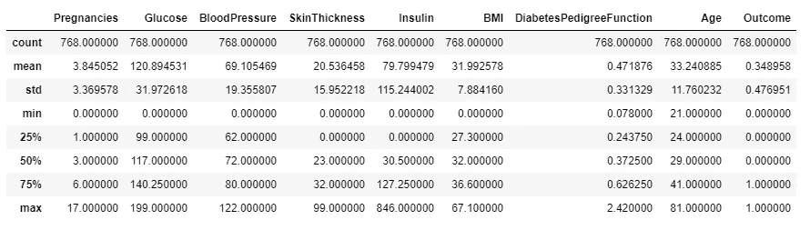
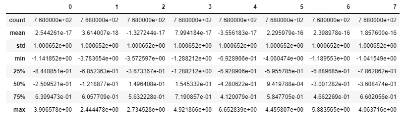
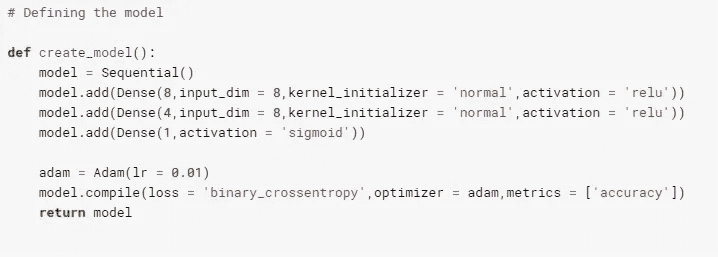
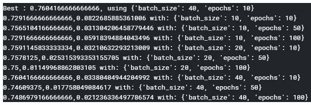
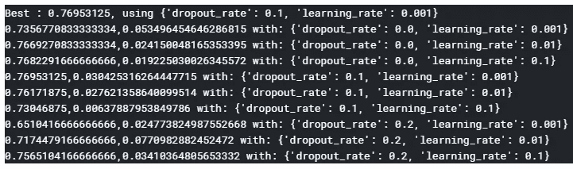
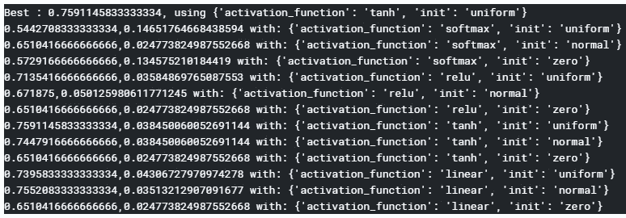
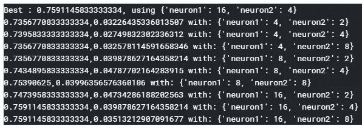
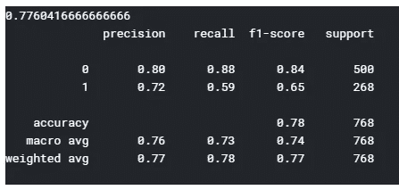

# Keras 中的神经网络糖尿病预测

> 原文：<https://medium.datadriveninvestor.com/hyperparameter-tuning-with-deep-learning-grid-search-8630aa45b2da?source=collection_archive---------0----------------------->

## 使用 GridSearchCV 进行超参数调整


这个机器学习项目是关于糖尿病预测的。我们将致力于 [kaggle pima 印第安人糖尿病](https://www.kaggle.com/uciml/pima-indians-diabetes-database)数据集。

导入必要的包。

```
**# Importing the necessary packages**import pandas as pd
import numpy as np
import keras
```

数据集被读入“df”数据帧。

```
**# Reading the file**df = pd.read_csv(‘/kaggle/input/pima-indians-diabetes-database/diabetes.csv’)
```

让我们理解数据帧“df”。

```
df.shape **# Shape of ‘df’**
```

大小为(768，9)，这表明有 768 个案例和 9 列。

```
df.columns **# Prints columns of ‘df’**
```

这些列是['妊娠'，'葡萄糖'，'血压'，'皮肤厚度'，'胰岛素'，'身体质量指数'，'糖尿病患者血糖功能'，'年龄'，'结果']

```
df.describe() **# Displays properties of each column**
```



所有列的 count = 768，这表明没有丢失值。“结果”的平均值为 0.35，这表明在给定的数据集中，“结果”= 0 的病例多于“结果”= 1 的病例。

数据帧“df”被转换为 numpy 数组“dataset”

```
dataset = df.values
```

“数据集”分为输入 X 和输出 y

```
X = dataset[:,0:8]
y = dataset[:,8].astype(‘int’)
```

## 标准化

可以观察到，各列的平均值差别很大。因此，数据集将被标准化，这样任何特征都不会被赋予不适当的权重。

```
**# Standardization**a = StandardScaler()
a.fit(X)
X_standardized = a.transform(X)
```

现在让我们看看“X _ 标准化”的均值和标准差。

```
pd.DataFrame(X_standardized).describe()
```



所有列的平均值约为 0，所有列的标准偏差约为 1。数据已经标准化了。

[](https://www.datadriveninvestor.com/2019/01/23/which-is-more-promising-data-science-or-software-engineering/) [## 数据科学和软件工程哪个更有前途？数据驱动的投资者

### 大约一个月前，当我坐在咖啡馆里为一个客户开发网站时，我发现了这个女人…

www.datadriveninvestor.com](https://www.datadriveninvestor.com/2019/01/23/which-is-more-promising-data-science-or-software-engineering/) 

## **超参数的调整:-批量大小和时期**

```
**# Importing the necessary packages**from sklearn.model_selection import GridSearchCV, KFold
from keras.models import Sequential
from keras.layers import Dense
from keras.wrappers.scikit_learn import KerasClassifier
from keras.optimizers import Adam
```

定义了神经结构和优化算法。该神经网络由 1 个输入层、2 个具有校正线性单位激活函数的隐含层和 1 个具有 sigmoid 激活函数的输出层组成。选择 Adams 优化作为神经网络模型的优化算法。



我们对两个超参数进行网格搜索:“批量大小”和“时期”。使用的交叉验证技术是 K-Fold，默认值 k = 3。计算准确度分数。

```
**# Create the model**model = KerasClassifier(build_fn = create_model,verbose = 0)**# Define the grid search parameters**batch_size = [10,20,40]
epochs = [10,50,100]**# Make a dictionary of the grid search parameters**param_grid = dict(batch_size = batch_size,epochs = epochs)**# Build and fit the GridSearchCV**grid = GridSearchCV(estimator = model,param_grid = param_grid,cv = KFold(),verbose = 10)
grid_result = grid.fit(X_standardized,y)
```

总结了结果。打印出最佳准确度分数和最佳超参数值。

```
**# Summarize the results**print(‘Best : {}, using {}’.format(grid_result.best_score_,grid_result.best_params_))
means = grid_result.cv_results_[‘mean_test_score’]
stds = grid_result.cv_results_[‘std_test_score’]
params = grid_result.cv_results_[‘params’]
for mean, stdev, param in zip(means, stds, params):
  print(‘{},{} with: {}’.format(mean, stdev, param))
```



对于“batch _ size”= 40 和“epochs”= 10，最佳准确度得分为 0.7604。所以我们选择‘batch _ size’= 40 和‘epochs’= 10，同时调优其他超参数。

## 超参数的调整:-学习率和辍学率

学习率在优化算法中起着重要的作用。如果学习率太大，算法可能会发散，从而无法找到局部最优解。如果学习率太小，算法可能需要多次迭代才能收敛，这导致高计算能力和时间。因此，我们需要一个学习率的最佳值，这个值既要足够小以使算法收敛，又要足够大以加快收敛过程。学习率有助于“早期停止”，这是一种正则化方法，只要测试集精度增加，就训练训练集。

放弃是一种正则化方法，可以降低模型的复杂性，从而防止过度拟合训练数据。通过删除一个激活单元，我们意味着从网络中临时删除它，连同它所有的输入和输出连接。辍学率可以取 0 到 1 之间的值。0 表示没有激活单元被剔除，1 表示所有激活单元都被剔除。



对于‘dropout _ rate’= 0.1 和‘learning _ rate’= 0.001，最佳准确度得分为 0.7695。所以我们选择‘dropout _ rate’= 0.1，选择‘learning _ rate’= 0.001，同时调优其他超参数。

## 超参数的调整:-激活函数和内核初始化器

激活函数向神经网络引入非线性属性，从而可以建立输入和输出之间的非线性复杂函数映射。如果我们不应用激活函数，那么输出将是输入的简单线性函数。

神经网络需要从一些权重开始，然后迭代地将它们更新为更好的值。内核初始化器决定用于初始化权重的统计分布或函数。



对于' activation_function' = tanh 和' kernel_initializer' = uniform，最好的准确度分数是 0.7591。所以我们在调优其他超参数时，选择' activation_function' = tanh 和' kernel_initializer' = uniform。

## 超参数的调整:-激活层中神经元的数量

数据的复杂性必须与模型的复杂性相匹配。激活层神经元的数量决定了模型的复杂度。激活层中神经元的数量越多，输入和输出之间的非线性复杂功能映射的程度越高。



对于第一层中的神经元数量= 16 和第二层中的神经元数量= 4，最佳准确度分数是 0.7591。

> **超参数的最优值如下:-**
> 批量= 40
> 历元= 10
> 辍学率= 0.1
> 学习率= 0.001
> 激活函数= tanh
> 内核初始化式=统一
> 第 1 层神经元数= 16
> 第 2 层神经元数= 4

## 具有最优超参数值的训练模型

使用前一节中找到的超参数的最佳值来训练该模型。



我们得到了 77.6%的准确率和 0.84 和 0.65 的 F1 分数。

通过一次取 2 个超参数来进行超参数优化。我们可能已经错过了最好的价值观。通过查找超参数的最佳值，可以进一步提高性能，这些值由下面的代码片段给出。注意:-这个过程计算量很大。

快乐阅读！快乐学习！