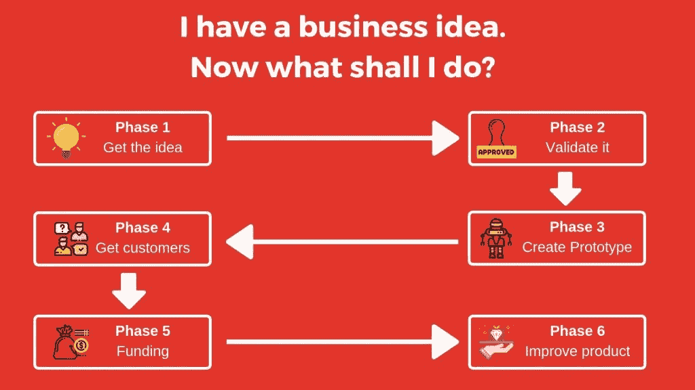

# 我有一个商业想法。现在我下一步该做什么？

> 原文：<https://medium.datadriveninvestor.com/i-am-a-power-user-of-quora-and-reddit-6afe56b7c6d6?source=collection_archive---------25----------------------->

我是 Quora 和 Reddit 的超级用户。我关注了很多关于企业家精神和创业的子话题。我看到这些问题“我有一个商业想法。现在我下一步该做什么？”一直都是。所以，我想我应该写一个 1100 字的故事，告诉你下一步该做什么。

Phases of a startup

你可以将创业之旅分为 6 个阶段，其中获得创意是第一阶段。如果你有了一个想法，很高兴知道你已经完成了第一阶段。还有 5 个阶段要走，其中第 2 阶段是最关键的。这是大多数企业家犯错误的地方。

我将逐一解释每个阶段。

# 1.第一阶段:了解想法

你已经有想法了。所以，你已经完成了这一步。

> 这个故事最初出现在《我创新》杂志上。

凤凰城大学最近的一项调查显示，20 多岁的年轻人中有 55%的人希望有一天能够创业。

他们调查了 1600 人。但是你看到 55%的人开始工作了吗？不。他们中的大多数人停留在第一阶段。他们发现很难找到这个想法。

很好，你已经过了第一阶段。让我们进入第二阶段。

如果你在寻找更多的想法，我已经创建了一个 [67 个商业想法的列表，花费不到 1000 美元](https://iinnovatemag.com/blog/techniques/small-business-ideas-that-needs-only-1000-to-start/)。

# 2.阶段 2:验证想法

你需要确保不管你的想法是什么，人们会用它来购买产品。人们不太可能买一支可以用作计算器的钢笔，因为现在我们每个人都有一部电话。

有两种方法可以证实你的想法。

# 2.1 直接询问潜在客户

当你想出一个主意时，你脑子里一定有一个目标顾客的名单。比如，这些人愿意购买你的产品。你可以直接接近他们，问他们是否会购买这种想法的产品。

如果他们在身体上不容易接近，那么你可以在 LinkedIn 和 Twitter 上添加他们，并询问他们。

在这个阶段询问至少 30-40 个人是个好主意。

*   如果 50%的人说“是”，那就接受这个想法。
*   如果只有 5-10%的人说“是”，要么放弃这个想法，要么调整这个想法。
*   如果 10%-50%的人说“是”，这就是危险区。你的产品要么成功，要么失败。你需要用另一种方法来验证你的想法。阅读第 2.2 节。

在询问他们是否会购买该产品的同时，你也应该询问他们希望该产品具备哪些功能。这会给你一个清单，列出你可以考虑添加到你的产品中的东西。

# 2.2 做市场调查

很有可能无论你要提供什么，市场上已经有了。可能会有一些差异，但产品或多或少是一样的。

收集该公司的数据，并检查其表现如何。如果公司表现一般或良好，你可以接受你的想法。如果表现不好，去公司的客户服务部门，看看客户怎么说。在那里你会知道出了什么问题。如果你看到人们不再需要这个产品，那么你就会有寻找新想法的热情。

# 3.阶段 3 —创建原型

许多第一次创业的人认为，一旦他们有了一个有效的想法，他们就可以去寻求资金。

> 风投不会资助创意。他们为增长提供资金。

你需要有一些东西来表明你的产品正在增长。但为此，你需要有一个产品。

你需要创建一个原型。最糟糕的是，你需要投入自己的资金来创建原型。如果你没有足够的钱，去找你的朋友和家人。

我建议你在开始构建原型之前，先阅读一下埃里克·里斯的《精益创业》。许多企业家在构建原型时投入了太多的资金，以至于他们没有钱来运营它。精益创业告诉你在创业时应该考虑什么。一些亮点是:

*   只做最可行的产品，这意味着它只是做它应该做的事情。
*   问题不应该是在原型中添加什么，而应该是从原型中删除什么。
*   如果你认为构建一个原型需要几个月的时间，那么你就没有正确地构建它。修剪特征。
*   它不应该吃掉你所有的钱。

[bctt tweet= "创业者需要记住，原型的唯一目标是验证想法。"]

# 4.第 4 阶段——获得客户

推出原型，并开始争取客户。你可以在产品搜索上找到早期用户。他们是愿意使用你的产品并测试它的人。

确保你提供了一个推荐计划，这样你的客户就可以带来更多的客户。Dropbox 做得很惊人。每当有人被推荐，他就会得到额外的 200MB。

如果你在获取客户方面面临很多挑战，你可以使用一些由 Gabriel 和 Justin 提出的[牵引](https://www.amazon.com/Traction-Startup-Achieve-Explosive-Customer-ebook/dp/B00ZE96ZWY/ref=sr_1_2?s=digital-text&ie=UTF8&qid=1537254314&sr=1-2&keywords=traction+book)的创新想法。AirBnB 爆炸式增长背后的最大原因之一是，他们接触了几乎所有的媒体公司，以获得特色。他们没有在任何付费广告上花费太多。

# 5.第 5 阶段—获得资金

进入这个阶段取决于你。如果你认为获得资金会让你快速成长，你可以去争取。如果你认为获得资金不会有太大影响，你可以跳过这个阶段。

一般服务型公司不会进入这个阶段。

如果你申请资助，大多数人会问的第一个问题是你的未知因素。

**u(t) = u(0)e(xt)**

u(t) =时间 t 的用户。“t”可以是 1 个月、1 年或任何时间段
u(0) =开始计算时的用户
x = x-因子
t =时间

让我们来解这道数学方程式。

假设您在 2019 年 2 月 21 日有 200 名客户。2019 年 1 月 21 日，您拥有 160 名客户。所以，这里 u(0)是 160，u(t)是 200。这里 t 可以是 1 个月。

将这些值代入等式:

200 = 160 *(e(x * 1))
e(x)= 1.25
log(1.25)= x
x = 0.09

因此，一个月的 x 因子是 0.09。越多越好。这个未知因素会给你带来资金。

如果 x 因子为负，公司就会失去客户。

> 只有当 x 因子为正时，企业家才应该寻求资金。

如果 x 因子非常小或为负，风投就不太可能提供资金。如果很低或者是负数，要搞清楚是什么原因。打电话给顾客，问他们为什么离开。

# 6.第 6 阶段—改进产品

现在，你知道你已经从你的客户那里得到了所有的数据，改进你的产品/服务。你知道他们想要什么，不想要什么。你可以去掉他们不想要的，开始做他们想要的。

所有成功的创业公司都会不断改进他们的产品。一个很好的例子是脸书。它每两周更新一次应用程序的新功能。

这是你有钱并且需要扩张的阶段。

这都是男人。确保充分利用以下优惠。

> 这个故事最初出现在《我创新》杂志上。

你也可以在推特上问我问题。简单地说，发微博给我，地址是 [@iinnovatemag](https://twitter.com/iinnovateMag) 。

