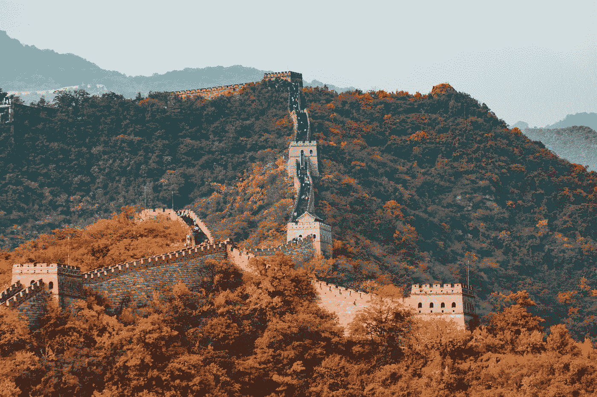

# I Am Getting Tired of the Chinese Government

> 原文：<https://medium.datadriveninvestor.com/i-am-getting-tired-of-the-chinese-government-f584e325cc38?source=collection_archive---------4----------------------->

China isn’t the only government I have a problem with.

Photo by [Hanson Lu](https://unsplash.com/@hansonluu?utm_source=medium&utm_medium=referral) on [Unsplash](https://unsplash.com?utm_source=medium&utm_medium=referral)

China has once again, behaved in a ridiculous fashion through its recent attacks on the NBA. To me, ‘thin-skin’ is one of the most unattractive qualities a person can have. People that are easily offended by others often focus so much attention on the behavior of others that they forget to pay attention to their own bad behavior. One such person is Trump. With Trump, his ‘thin-skin’ stems from the desire to silence the critics of his stupid policies. The government of the People’s Republic of China has ‘thin skin’ for the same reasons that Trump has ‘thin skin.’ For this story, I will refer to the ‘People’s Republic’ as China and the ‘Republic of China’ as Taiwan.

There are some that may say that China’s behavior is a ‘cultural issue’ and we should seek to understand China. Bull! Let’s look at some of the heinous acts committed by the Chinese government over the past several decades. The regime in China has been in power for seventy years. During this time, China has been in military conflicts with the following neighbors: the Soviet Union, Korea, Taiwan, Vietnam, Tibet, Myanmar, and India. See [this article](https://en.wikipedia.org/wiki/List_of_wars_involving_the_People%27s_Republic_of_China) from Wikipedia for more on China’s military campaigns against its neighbors. In the 1950s-1960s, China’s ‘[Great Leap Forward](https://en.wikipedia.org/wiki/Great_Leap_Forward#Famine_deaths)’ resulted in 30,000,000 to 60,000,000 deaths of the Chinese people. The [Cultural Revolution](https://en.wikipedia.org/wiki/Cultural_Revolution) of 1966–1976 resulted in millions more dead. In 1989, the Chinese government slaughtered thousands of peaceful pro-democracy demonstrators in [Tiananmen Square](https://en.wikipedia.org/wiki/1989_Tiananmen_Square_protests#Deaths_in_Tiananmen_Square_itself). The Tiananmen Square incident is why we should fear for the safety of the pro-democracy demonstrators in Hong Kong. These aren’t ‘cultural issues.’ These are moral issues that America should not tolerate. These are issues from the past. The question is, what is China doing now?

 [## Doing Business in China: How to optimize your operations | Data Driven Investor

### China is a popular business hub for both local and foreign companies. Setting a physical presence in a country that…

www.datadriveninvestor.com](https://www.datadriveninvestor.com/2019/03/17/doing-business-in-china-how-to-optimize-your-operations/) 

在过去的七十年里，中国政府几乎没有什么变化。中国允许经济改革促进了他们的经济发展。然而，中国在公民人权方面做得很少。现在，中国正在迫害数百万维吾尔穆斯林。这些人被拘留并被迫进入“再教育营”(监狱)。参见*外交关系委员会*关于中国对新疆维吾尔人的镇压。中国正在对其公民实施一种[社会信用体系](https://en.wikipedia.org/wiki/Social_Credit_System)。这种“社会信用体系”是进入一个技术驱动的极权国家的一个极其可怕的举动。中国的“社会信用体系”潜在地如此反乌托邦，以至于乔治·奥威尔(George Orwell)的《1984》看起来像一个“自由主义者的天堂”。

中国正在南中国海向其邻国展示实力，主要是越南和菲律宾。请看*外交关系委员会*关于中国在南中国海领土侵略的报道。中国继续威胁台湾，因为中国政府认为台湾是中国的一部分。充其量，这是一个非常站不住脚的说法，因为中国只在 1683 年至 1895 年统治过台湾。中国似乎不在乎台湾公民不想成为中国的一部分。见[中国是否计划在 2020 年武力拿下台湾？](https://www.scmp.com/comment/insight-opinion/article/2126541/china-planning-take-taiwan-force-2020)来自*南华早报*更多关于中国对台湾的计划。请注意,*南华早报*为阿里巴巴所有。阿里巴巴由马云创立。马云是中国共产党党员。

中国政府不关心劳工权利。这对于一个共产主义国家来说是令人惊讶的。我敢肯定，如果卡尔·马克思读到我的文章《美国与其他国家相比的收入不平等》，他一定会大吃一惊。我在这个故事的结尾添加了一个链接。下面是这个故事的摘录。

> 参见《纽约时报》的这篇文章，了解在中国组装苹果产品的工人的平均工资。每月 400 美元，美国工厂不可能在劳动力成本的基础上竞争。这些为苹果组装的工厂归富士康所有。深圳是其中一家富士康工厂的所在地。Numbeo.com 表示，不包括住房费用，深圳的月生活费为 515.39 美元。富士康为员工提供宿舍，因此住房成本不是问题。不过，富士康支付给员工的工资比生活成本低 115 美元。这就像是员工付钱给富士康在那里工作！关于深圳的生活成本数据，请参见来自 numbeo.com 的[链接](https://www.numbeo.com/cost-of-living/in/Shenzhen)。
> 
> 富士康的生活对员工来说并不轻松。这家公司不得不在宿舍下面安装网来捕捉企图自杀的人。工作条件很糟糕。参见《卫报》的[这篇文章](https://www.theguardian.com/technology/2017/jun/18/foxconn-life-death-forbidden-city-longhua-suicide-apple-iphone-brian-merchant-one-device-extract)。

当然，美国在向其他国家推行这样的政策之前，需要先理顺自己的劳工权利政策。

问题是，我们为什么要和这些暴徒做生意？答案很简单。中国有一个 14 亿消费者的市场来销售我们的产品，中国也为我们的消费者提供更便宜的产品。更重要的问题是，应该允许美国公司牺牲美国原则与中国做生意吗？像谷歌这样的公司应该被允许同意中国的审查政策作为在中国做生意的先决条件吗？同意这些审查政策就是同意参与压迫中国人民。不应允许美国公司参与中国的不良行为。支持与中国进行无限制自由贸易的人说，公司必须尊重他们做生意的国家的文化。事实是，其他文化中的压迫和迫害与我们文化中的压迫和迫害是一样的。事实是，中国的不良行为不是中国文化或中国人民，而是极权主义的中国政府。

世界上有许多政府应该受到压力来改变他们的行为。这些国家包括沙特阿拉伯、土耳其、俄罗斯、菲律宾、美国(特朗普治下)和以色列(内塔尼亚胡治下)。美国应该严格限制与任何不允许宗教自由和否认基本人权的国家的商业联系。美国和以色列与其他国家的区别在于新闻自由和言论自由。在美国和以色列，人们可以公开反对政府，而不用担心政府的报复。这些权利对于一个国家的公民能够迫使其政府向好的方面转变是至关重要的。这些权利正是像谷歌这样的公司通过与中国政府串通来剥夺中国人民的权利。自 2009 年以来，公众的抗议似乎阻止了谷歌同意中国的审查。关于谷歌试图在中国开展业务的更多信息，请看维基百科的这篇文章。

我们应该突然停止与中国的所有贸易吗？不要！如此重要的贸易关系的突然变化将给美国企业和美国人民带来巨大的痛苦。事实是，美国不应该允许与中国有如此大的贸易关系。如果不改变对本国人民的政策，中国就不应该获得“最惠国贸易地位”。中国必须更好地对待自己的人民，尊重美国的审查政策。

现在我们与中国处于重大关系中，我们该怎么办？首先，美国应该结束愚蠢的、计划不周的贸易战，这场战争是白宫的“稳定天才”把我们带入的。然后，美国应该开始一项渐进的多年计划，以理顺我们与中国的贸易关系。如果中国满足了美国在人权和劳工权利方面的要求，美国应该重新考虑这样的政策。显然，美国需要先解决自己的劳工权利和环境政策问题，然后才能要求其他国家做出改进。通过一个渐进的过程来处理这个问题，这将给美国企业时间来调整，同时也给中国政府时间来调整他们的政策。如果中国不能满足美国的需求，我们与中国的贸易关系最终会下降到只向中国提供人们生存所需的基本产品的水平，例如食品。

如果美国拒绝“做正确的事情”，我们将承受后果。中国人民会指责美国支持迫害他们的人，就像其他国家的人民指责美国支持他们国家的专制政权一样，例如伊朗(国王)和古巴(巴蒂斯塔和黑手党)。由于审查制度，人们将永远听不到美国方面的故事。

今天，我们允许中国通过与世界上最富有的国家——美国——的自由贸易变得富有。中国正在利用这些财富建立自己的 20 世纪前风格的殖民体系。中国称这个系统为“[一带一路](https://en.wikipedia.org/wiki/Belt_and_Road_Initiative#Accusations_of_neocolonialism)”如果我们现在不对中国人民表现出更多的关心，我们最终会失去对中国的不良行为做任何事情的能力。不如现在牺牲几块钱，做正确的事。

 [## 与其他国家相比，美国的收入不平等

### 其他国家的收入不平等对整个世界都是一种威胁。

medium.com](https://medium.com/swlh/income-inequality-in-america-compared-to-other-nations-c99b2e6c9fba)