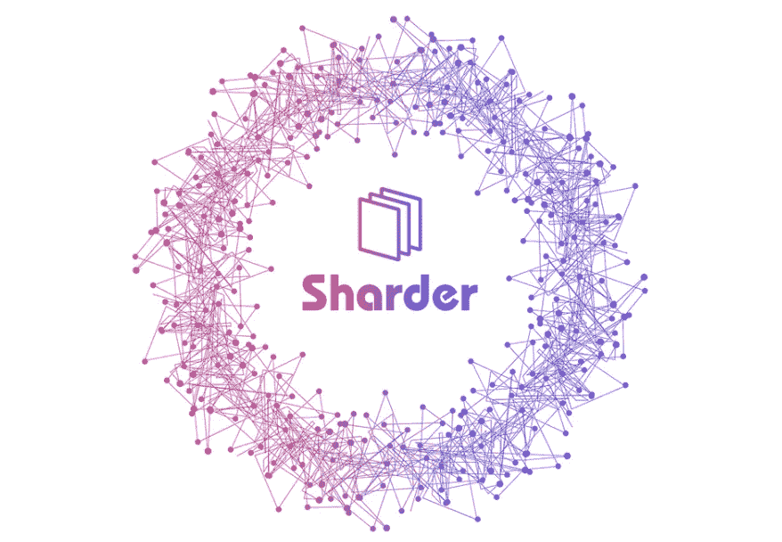
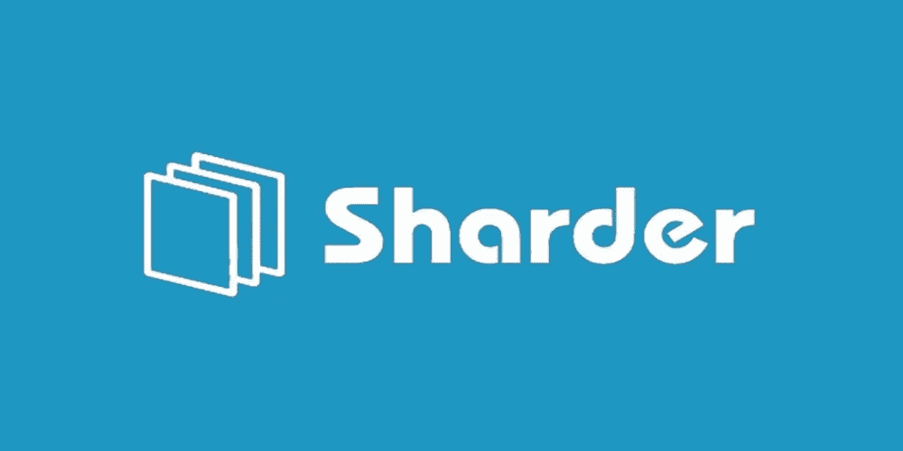
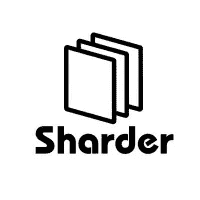
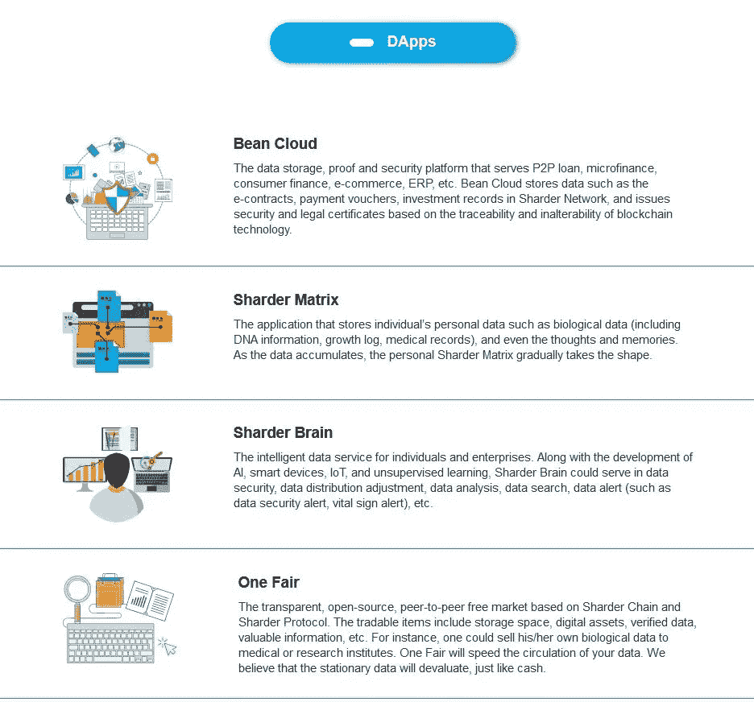
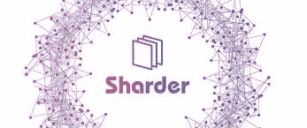

# Sharder-专利的保护者

> 原文：<https://medium.datadriveninvestor.com/i-am-now-become-sharder-the-protector-of-patents-474ca35419c1?source=collection_archive---------34----------------------->

**创新:勒索的故事**

纵观我们的物种历史，不同行业的许多天才创新者被他人利用了他们的智慧，吸走了他们的个人遗产。一个名叫尼古拉·特斯拉的伟人，一个才华横溢、性格古怪的天才，使现代电力系统和大众通信系统蓬勃发展。具有讽刺意味的是，尼古拉·特斯拉不为大众所知，神秘地隐藏在历史文本中。尼古拉·特斯拉的前任老板是托马斯·爱迪生，他是众所周知的电灯泡的发明者。托马斯·爱迪生的发明，如电灯泡和留声机，本身就是革命性的，但不是独一无二的，因为其他人已经在创造类似的发明。然而，尼古拉·特斯拉凭借其革命性的交流技术，在 19 世纪末至 20 世纪初极具破坏性。尼古拉·特斯拉从事大众传播系统研究多年，凭他自己的能力，他是无线电、电视和手机之父；他甚至曾经说过“当无线被完美地应用时，整个地球将被转换成一个巨大的大脑，事实上，所有的东西都是一个真实而有节奏的整体的粒子。不管距离有多远，我们都能够立即交流。让我们能够做到这一点的工具将会放在我们的背心口袋里。”我猜你会问，尼古拉·特斯拉和区块链有什么关系，这很简单。尼古拉·特斯拉之所以隐藏在历史的教条中，是因为一个主要原因，他的革命性技术被托马斯·爱迪生敲诈了。区块链可以防止这种情况发生，将他的专利和研究存储在一个不可篡改的实体中，他的信息将被永久存储并供所有人查看。当我们进入一个充满数据的新世界，需要一个不可篡改的解决方案来防止信息勒索时，区块链就是这个困境的答案。

**区块链:欺诈的破坏者，知识产权的守护者**

自从有了比特币的概念，区块链技术就被用来存储来自各行各业的各种类型的信息；区块链不仅仅是一项在全球范围内执行交叉支付的技术，它还是一个电子商务支付、全球支付、汇款、P2P 贷款、小额信贷、医疗保健、产权记录、投票、衍生品、众筹、债务、私人市场、股权、托管、赌博以及我认为最重要的四个方面的全球存储中心，即知识产权、所有权、版权保护和数字权利。想象一下，如果你愿意，一个知识产权和版权专利得到永久保护的世界，因为区块链技术的美丽，这个世界已经在这里了。2018 年 4 月 27 日，一位名为 Rhyu Gi-hyeok 的韩国开发商创造了历史，他用《板门店宣言》的韩文和英文记录创建了两个以太坊交易，该条约正式结束了朝鲜和韩国之间的敌对状态。这一声明被记录下来，永远不会被篡改，因为一种固有的抵抗技术的力量从未被黑客攻击过，这种创新就是区块链。当我们作为一个社会开始进入我们物种的计算机化表现时，区块链是版权专利和安全数据存储的答案。据“Raconteur.net”报道，“在保护专利、商标和许可证免受欺诈的斗争中，公司可能会占上风。解决方案似乎来自被大肆宣传但却鲜为人知的区块链技术。”区块链允许预先存在的各方在单个数据库上一起操作和工作。当一项交易或任何类型的记录被输入区块链时，它是否永远不能被世界上的任何其他人修改或更新。据 HGF 知识产权律师事务所的专利律师理查德·塔瑟姆说，“区块链的主要好处是它是分布式的、准确的和不可改变的。”在音乐产业中，区块链正被用来打击盗版，并且还被用来改进对来自特定艺术家的音乐分发以及他们所声称的收入的跟踪。有了 Limewire 和 Youtube 到 MP3 转换器这样的发明，从艺术家那里窃取音乐非常容易，然而，有了区块链，音乐家可以跟踪谁在使用他们的音乐，同时跟踪他们与音乐相关的收入流。英国知识产权局 2017 年的一份报告发现，2017 年第一季度，15%的英国互联网用户至少非法消费了一件商品，这是一个需要减少的惊人数字。

一位名叫伊莫金·希普的英国歌曲作者与一位竞争对手陷入了版权困境。伊莫金·希普是区块链专利领域的先驱，因为她独特的使用区块链的方法。2017 年，伊莫金·希普接受了《哈佛商业评论》的采访，并讨论了竞争对手如何被指控窃取她的版权，结果，她的竞争对手的音乐被从一个著名的发行网站上撤下。虽然西普女士说，最有可能是一个过于急切的机器人导致了谁在偷她的音乐，但她对区块链潜力的独特理解是通过她的在线平台菌丝体显示的。西普女士说，通过使用区块链技术来支付个人音乐的费用和版权，可以很容易地避免潜在的版权冲突，比如她不得不处理的事件。菌丝体是希普女士的在线平台，利用区块链澄清谁有权使用个人艺术家的音乐样本，权利和分发授权；她鼓励制作人、音乐家和唱片艺术家使用区块链作为防止盗版的一种方式。创新者、发明家、音乐家、网络开发者、作者、专利代理、版权公司、电影制片人以及其他许多人可以利用区块链技术作为一种提供个人所有权的防篡改证据的方式。然而，随着创新的不可避免的冲击，随着数据在我们的文明中不断增长，Sharder 等存储解决方案可以在每个区块链用于专利和版权的整体存储。Sharder 是一项创新技术，支持跨链数据存储解决方案，这意味着地球上任何现有的区块链都可以利用 Sharder 协议来辅助数据存储，如知识产权、专利和所有权！

**我现在变成了 Sharder:版权侵权、所有权和知识盗窃的解决方案**

随着人类踏上永无止境的贪得无厌的求知之旅，随着我们作为一个物种和一个人类大家庭继续成长，新的数据将会出现，需要存储在一个安全的目的地，不能被篡改。随着整个 21 世纪知识的增长，数据以前所未有的速度产生，我们已经看到了过去五年中数据产量的指数级增长。我们的意识为理解做好了准备；对知识的渴望永远不会熄灭，因此需要像 Sharder 协议这样的数据存储解决方案。Sharder 协议是一个不变的、不可篡改的沉睡巨人，它正从沉睡中被唤醒。Sharder 协议提供数据安全性；具体来说，Sharder 协议通过客户端终端、数据分片和分布式存储实现了数据的离线加密。Sharder 协议的创新技术还提供了一个凭证模型，该倡议 Sharder-UTXO 和 Sharder-Keypair 范例确保没有适当的凭证，存储中的数据和一般数据无法访问，这可以保护版权信息、知识产权和所有权信息，这是保护我们这一代人、过去几代人和未来几代人的聪明才智的必要条件。《沙尔德协议》促进透明、开源、没有任何垄断的点对点自由市场，体现了我们世界中存在的资本主义时代精神。自由市场创造包容性，包容性使参与成为可能，而参与创造了资本主义的、自由放任的自由市场范式，这让人想起亚当·斯密(Adam Smith)在《国富论》(The Wealth of Nations)中概述的市场经济资本主义的理想。

Sharder 协议是自由市场经济的体现，从宏观角度来看，这是数据存储领域的一个奇迹般的创新，所有企业和参与者都将有幸使用 Sharder 协议安全地存储他们的数据，并参与包容性的市场经济。Sharder 协议利用了人类历史上最重要的技术之一，区块链，它是一个跨链数据存储解决方案，适用于现有的每个区块链，甚至有自己的区块链！Sharder 协议不适合有限的范式，相反，Sharder 区块链是无限的，可以无限扩展到任何其他公共区块链和整个互联网！Sharder 协议和 Sharder 链很容易适应互联网的扩展，因为它将在几个世纪甚至几千年内继续不可避免地改变我们的社会和世界；互联网已经并将继续对我们的世界产生前所未有的影响。在不断变化的文明中，数据生产每天都在增长，拥有一个无限的、可扩展的存储解决方案是义不容辞的责任，而这个解决方案就在我们眼前，正准备从沉睡中醒来，这个项目就是 Sharder 协议。Sharder 协议不仅可以部署在所有公共区块链上，还可以部署在存储网络和个人节点上！当使用 Sharder 协议时，个人或组织的版权信息、知识产权和所有权是安全的。Sharder Chain 是一个商业公共链，包括数字资产、担保交易和运营支持系统以及其他各种其他公用事业，因为它拥有自己的独立区块链。Sharder 协议不仅为区块链和使用它的组织提供了廉价的存储解决方案，Sharder 网络可以在其平台上容纳无数的 Dapps，并且在其平台上已经存在四个 Dapps 这些平台包括 One Fair、Bean Cloud、Sharder Matrix 和 Sharder Brain！通过他们的跨链生态系统，Sharder Network 拥有巨大的潜力来彻底改变区块链和现有各方之间的数据交换！

尤其是 Bean Cloud 是一个独特的应用程序，使人们能够存储数据，也是一个安全平台，为金融部门提供服务，如小额金融、消费金融、电子合同和投资记录；所有这些服务都在名为 Bean Cloud 的不可变存储平台上！Bean Cloud 还提供法律证书和安全性，这是基于区块链技术的优点及其可追溯性和存储数据的不可变特性。豆云可以通过这个设计辅助知识产权和版权专利的安全！但它并没有停止，这个雄心勃勃的项目和我们如何存储数据的革命并不满足于仅仅一个应用程序，Sharder 的目标是永不满足，它的目标是不断渴望完美，成为我们星球上有史以来最好的数据存储解决方案！Sharder Matrix 使医院和政府机构等企业能够存储生物数据，包括 DNA 信息、医疗记录、生长日志以及令人难以置信的我们的记忆。记忆嵌入在我们的意识中，经受住了时间的考验，直到死亡将我们与这个世界分开，能够在一个应用程序上存储个人和集体的记忆是一个惊人的，令人难以置信的创新，只有 Sharder 协议才能创造。Sharder Brain 是 Sharder 生态系统中构建的第三个应用程序。随着人工智能变得有意识，并在未来作为有意识的生物与我们共存，申请专利和创造人工智能功能的企业将义不容辞地将他们有价值的创新和发明存储在一个系统上，该系统将成为 Sharder 协议。企业和公司可以使用这种数据服务；Sharder Brain 将作为人工智能发展和知识产权专利安全的先驱载入史册。Sharder Brain 还帮助开发物联网，并可用于数据分析和数据警报，如生命体征警报。想象一个可以拯救你生命的应用程序，这个应用程序被嵌入到一个协议中，这个协议将会把我们所知道的世界变得更好。One Fair 是基于 Sharder 协议创建的第四个 Dapp 它培育了一个自由放任、去中心化、民主化、透明的开源自由市场，个人和企业可以在其中交易存储空间、数字资产和经过验证的数据，如版权数据和已经过所有权验证的知识产权！随着我们的社会继续前进，数据生产将达到恒星根据 Khardashev 规模，人类将在未来五十年内成为第一级文明。一级文明将需要一个可靠、安全、适应性强、不受限制且不断增长的存储解决方案；Sharder 协议将会把这些不可估量的数据拥入怀中！

**意识的超越:关于人类知识及其与数据输出关系的讨论**

随着人类的创新不断蓬勃发展，随着人类的创造力开始超越意识，随着我们成为我们自己世界的上帝，我们的社会将不可避免地产生越来越多的数据。数据如此之多，以至于很难计算我们产生了多少数据，因为它的创建速度非常快。这本不可思议的书的作者劳拉·德纳第(Laura DeNardis)在一本名为《互联网治理的全球战争》的书中指出，“过去一周的技术进步超过了 1700 年之前的任何一个世纪。”其他研究人员声称，我们的社会在过去两天里产生的能量和数据比 2003 年之前所有的人文历史产生的能量和数据都多。根据 IBM 的数据，2012 年每天产生 2.5 额外字节，即 25 亿千兆字节，这已经是六年前的事了。随着第四次工业革命继续冲击工业的各个领域，找到大数据存储的解决方案是义不容辞的责任，而这个答案就是被称为 Sharder 协议的跨链存储解决方案！

**Sharder 协议:聪明头脑的保护者，专利的壁垒，一个跨链的数据存储解决方案的不变性和知识安全**

Sharder 协议使各行各业的组织、个人和公司能够将他们的信息和数据存储在被称为区块链的不可变账本上；Sharder 协议的美妙之处在于，它使不同的区块链(如 NEO、以太坊、比特币、莱特币、Dash、Monero、Cardano 等)能够使用 Sharder 协议存储它们的多余信息。Sharder 协议是保护知识产权、版权信息和所有权的基本答案。不可变的分类帐允许版权信息存储在区块链上，因此永远不会被篡改；当谈到数据存储的不变性时，即使是永恒也经不起时间的考验。Sharder 协议是行业的先驱，不，是多个行业的先驱，它是一个技术孤儿，使政府或任何希望在区块链上存储数据的实体能够这样做，并知道任何版权信息、所有权专利和知识产权都将通过其协议安全可靠地存储。谁知道呢，也许有一天，希普女士会通过她在区块链的平台菌丝体利用这个被称为 Sharder 协议的项目中的瑰宝；Sharder 协议的优点在于它是跨链的，可以在任何区块链内使用，而不仅仅是一个。正如我现在和将来所说的，保护和存储知识产权、个人专利和版权信息的必要性可以通过区块链上的这一革命性协议来利用，而这一数据存储解决方案的革命正是 Sharder 协议！如果尼古拉·特斯拉生活在 21 世纪，并在 120 年后成为我们当代世界的技术先驱，他的发明和专利就会受到区块链和数据存储解决方案 Sharder Protocol 的保护！！

*有兴趣了解加密货币和区块链技术吗？报名参加我在 Udemy 上的课程吧！*[*https://www . udemy . com/cryptocurrency-investment-a-初学者-指南/学习/v4/*](https://www.udemy.com/cryptocurrency-investment-a-beginners-guide/learn/v4/)

*免责声明:我拥有 Sharder Tokens，本文讨论的信息仅代表我个人的观点。一如既往地做你自己的研究。* *加密货币投资需要大量的风险，不要投资超过你能承受的损失！我不是金融顾问，也不对你的任何交易负责。我是 Sharder Token 的投资者，本文中的信息代表我自己的想法和观点。在投资任何东西之前，你都要做好自己的研究，这是义不容辞的责任！*

来源:[https://www.bbc.com/news/business-26383058](https://www.bbc.com/news/business-26383058)[https://coin telegraph . com/news/Korean-peace-treaty-goes-live-on-ether eum-区块链-forever](https://cointelegraph.com/news/korean-peace-treaty-goes-live-on-ethereum-blockchain-forever)[https://www . live science . com/46739-Tesla-vs-Edison-comparison . html](https://www.livescience.com/46739-tesla-vs-edison-comparison.html)[https://www . raconteur . net/business/protecting-patents-copyright-区块链](https://www.raconteur.net/business/protecting-patents-copyright-blockchain)

