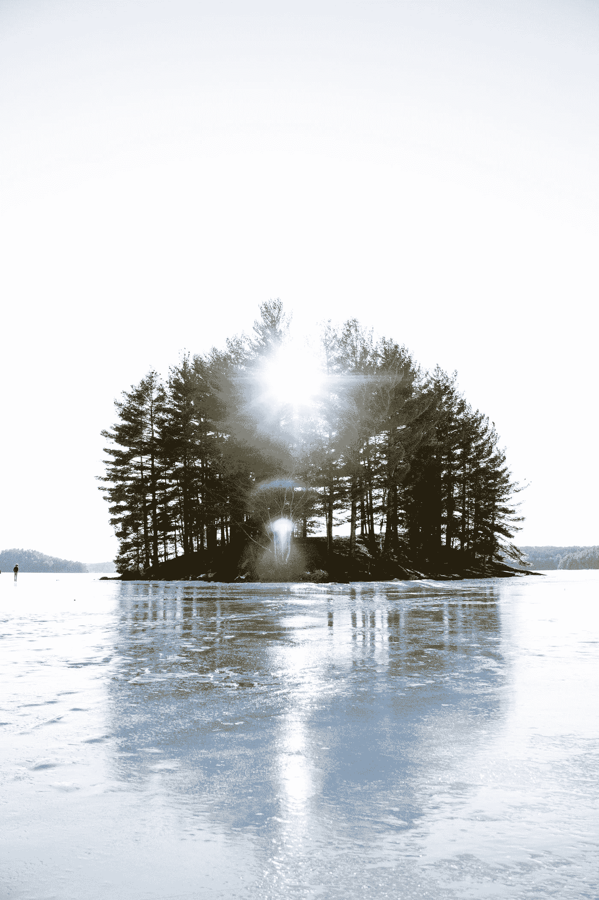

# 我成功了

> 原文：<https://medium.datadriveninvestor.com/i-am-successful-d69ddb340e8d?source=collection_archive---------12----------------------->

“island with sun ray during daytime” by [George Fennelly](https://unsplash.com/@georgefennelly?utm_source=medium&utm_medium=referral) on [Unsplash](https://unsplash.com?utm_source=medium&utm_medium=referral)

我不得不承认，最近我只把真正的成功和一个现实联系在一起。那就是财务自由。成功不仅仅取决于你的社会经济地位。

这并不是说钱不好，也不是说我现在想要过一种极简主义的生活。我不讨厌极简主义者。但这是对我成功的告诫，我已经成功了，而且我正在走向更大的成功。我对成功的定义不是单一的，它应该是多方面的。

有一天，我给自己写了一张纸条，上面写道:“写一张胜利清单，这样你就不会认为自己没有胜利。

我为追逐下一件大事而忽视已经完成的大事而感到内疚。有人称之为野心，有人称之为永不满足，有人认为两者都好，有人认为两者都不好。我认为他们既坏又好。我认为他们需要从两个角度得到同等的关注。我感谢我那令人难以置信的雄心勃勃的精神，但我也强迫自己放慢脚步，看看这种雄心迄今为止给我带来了什么。

我写过书，表演过音乐，和观众说过话，建立过一生/永恒的关系，我买得起咖啡，我读过伟大的书，我写过博客，主持过播客，创建过自己的网站，完成过大学学位…

我发誓要专注于我所拥有的，很多的东西，而不仅仅是我所缺少的，很少的东西。

有时候，每时每刻，你都要提醒自己，你并不差劲。尤其是你不差劲，因为你还没开过特斯拉，即使你开过，也不会开两辆。反正一次只能开一特斯拉，所以深呼吸。

> 这首先出现在 IAmMarkCraven.com 的[上](https://iammarkcraven.com/)