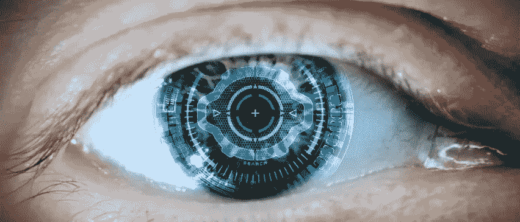

# 我，增强的

> 原文：<https://medium.datadriveninvestor.com/i-augmented-58f37cdaaf5d?source=collection_archive---------12----------------------->

I, Augmented

使用机器来提高我们的生活质量和工作效率一直是人类的天性。作为一个物种，我们将不断挑战极限，应用新知识创造新鲜、创新的想法。所有的技术都有创造和生产的潜力，然而我们人类从未站在如此激进的进化的尖端。

**人类的假肢飞跃**

今天，截肢者可以装上人造腿，让他们重获新生。假肢中的传感器和微处理器能够直接从大脑中获取神经脉冲，使用户能够进行全方位的运动。然而，这些控制论部分还不能将信息发送回大脑，提供一个人通常经历的触觉，但下一步的进展正在进行中。不可否认，这项技术正在改变那些需要它的人的生活，这种创新应该继续研究和发展，为许多人提供更好的生活质量。

**人类 2.0**

随着人类增强已经如此先进，很容易想象在不太遥远的将来进一步集成的人工部件的发展。对截肢者来说，合成器官可能不仅仅是今天的一线希望。很快，增强功能可能会作为一个升级目录推向大众，这将赋予以前只存在于漫画书中的能力。通过变焦功能改善视觉，或通过激光精度隔离特定声音并通过思维调节音量的听觉。手臂能够举起难以置信的重量，并能以以前认为不可能的速度奔跑。

未来可能会在人体上增加非拟人化的东西，比如连接到肩胛骨上的翅膀，使我们能够以更加个性化和互联的方式体验天空。肌肉的重新配置将很快让我们能够感知和感受外部骨骼的增强，将人和机器结合起来，让人类能够控制自己的进化道路。

**人工合成品的伦理**

对于站在增强技术前沿的大多数开发者来说，一个伟大的前景和愿景是为人体提供许多人认为是超自然的能力。像心灵感应和心灵遥感这样的事情可能会成为现实。神经技术可以通过映射在人脑中的思维过程来预测预期的话语或动作。利用无线电频率，可以想象我们有能力将我们的想法直接传达给远距离的目标接收者。

这种形式的技术心灵感应肯定会面临的挑战之一是如何克服对我们个人隐私的可能侵犯。任何像这样的系统都是基于一个直接与大脑互动的计算机界面，任何计算机系统都有被黑客攻击的可能。

如果这种合成/生物安排在任何方面都容易受到攻击，那么个人的个人安全和隐私将几乎不存在，从而使他们自己和他们所爱的人处于极大的风险之中。还有一个问题是，一个人是否可以用读取思想的技术将思想植入另一个人体内。

为了了解我们离这项技术有多近，据报道，加州大学伯克利分校的研究人员进行了一项实验，以可视化的方式构建参与者的思想。他们让志愿者观看电影预告片，然后，当他们连接到团队的设备上时，想起并记住这些预告片。实验实际上只从自愿的测试对象的思想中产生了可识别的、低分辨率的视频片段。

这与明天的梦想相去甚远。那么一个安全的系统有多安全呢？好吧，每一个设计某种形式的安全网络的人都会证明它的墙是牢不可破的，直到某个黑客将它们摧毁。如果硬盘上只有你的狗的照片或给当地议会的投诉信，这可能没什么大不了的。但是，当硬盘是你的思想、你的秘密欲望、激情和梦想时，那就完全是另外一回事了。

我们都自然有权拥有我们的思想这个私人圣地，而创造违反这一点的技术很可能成为我们希望取消的事情之一。

**武器 X**

人类历史上的所有技术发现要么是为军事应用而设想的，要么至少是以某种形式武器化了。增强力量、速度和灵活性的技术肯定会在军事工业联合体中隐藏很多年，然后才会向公众发布。

虽然我们可以理解这一技术的商业用途的积极和消极应用的潜力，但肯定它作为武器使用的结果只有一个，那就是毁灭。通过士兵的视觉锁定目标的自动弹药射击，从未错过一发子弹仅仅是从已经存在的技术上的一个进步。

阿帕奇直升机被许多人描述为“绝对死亡机器”，它跟踪飞行员的头部运动，锁定大约 150 公里外的目标，并配备大量导弹和 30 毫米自动加农炮。将这种致命的准确性应用到每个士兵身上，将有可能在很短的时间内彻底摧毁整个城市。

当这种人体增强技术向大众发布时，我们有可能让政府、恐怖组织或公司看到你所看到的，听到你所听到的，并随时记录这些信息。他们是否会这样做无关紧要。真正的问题是，我们应该给他们这样的权力吗？

**我的神仙**

永生仍然是所有大公司和开拓人类增强技术发展的创新个人的“圣杯”。我能把我的整个意识转换成数字形式安装到计算机系统上，作为机器中的幽灵永远活着吗？

新的研究可能会将这种永远活着的想法从虚构的幻想和恐怖小说中剥离出来，并将其牢牢植入我们现实的土壤中。大脑内部存在的信息存储在神经元之间的突触连接中。人类大脑中大约有 1000 亿个神经元，每个神经元，每个路径都必须被扫描，映射，然后以 0%的误差进行数字重建，以便不仅像生物大脑一样工作，还可能包含被扫描人的经历，思想和记忆。

事实上，这项研究背后的驱动力是获得对大脑的全面了解，但那些处于这一令人兴奋的新技术前沿的人，坦率地承认，它可能掌握着某种永生的关键。

2014 年，圆蠕虫的简单大脑被扫描，随后，一个数字化模拟被安装到一个简单的乐高机器人中。然后，机器开始在房间里四处移动，不需要任何人类的互动或干预，似乎是出于自己的自由意志。

在西雅图的艾伦研究所，科学家们成功地绘制并数字化重建了一立方毫米的老鼠大脑。尽管这看起来微不足道，但这个沙粒大小的啮齿动物大脑包含 10 万个神经元和超过 10 亿个突触。这是通过首先将大脑切片 25000 倍，薄至 40 纳米，这大约是人类头发厚度的五分之一。在这些切片中，需要拍摄数百万张图像。所以，这可能会让你对绘制一个人的地图的任务有一个概念。

也就是说，我们肯定正在朝着这一成就前进，一旦完成，我们也许最终能够回答一些关于意识的古老哲学问题，以及到底是什么让我们个人独一无二。

**人类的心态**

进化剥夺了人类这个星球上其他生物拥有的许多自然优势。一些海洋生物，包括一种特殊的海星，可以再生它们被切断的肢体。其他的，有可以像啃黄油一样啃骨头的尖牙和可以轻松攀爬垂直表面的爪子。对于人类来说，我们被赋予了如此美丽的心灵，能够进行创造性的思考，并愿意将这些想法变成现实。无论我们犯了什么样的错误，正是这种进化优势确保了我们这个物种作为这个星球上的主要生命形式存活了下来。否认在不久的将来人类生物系统中技术增强的现实，就像抵抗强大的海洋潮汐一样是徒劳的。我们只有警惕地意识到我们对梦想的探索中固有的危险，并继续努力将不可能变为现实，才能迎接这些变化的浪潮。

***克里斯托夫·罗珀写的***