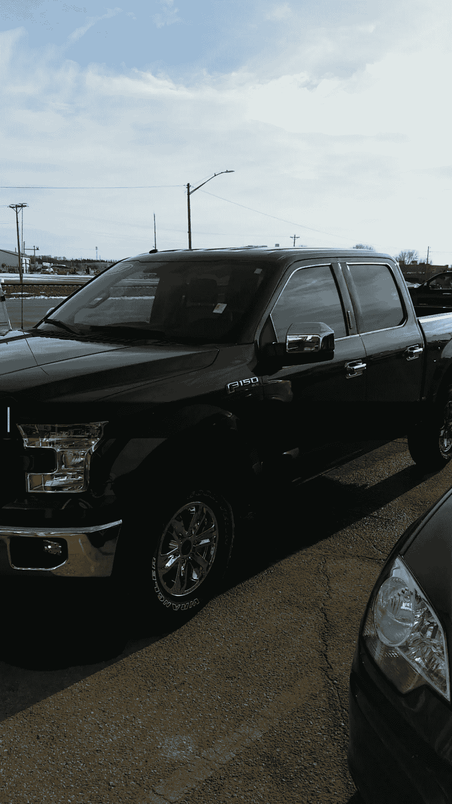

# 我买了一辆卡车:这是我学到的

> 原文：<https://medium.datadriveninvestor.com/i-bought-a-truck-heres-what-i-learned-5df6d08733e1?source=collection_archive---------1----------------------->

上周末，我买了一辆 2017 款福特 F150。对我来说，这是令人兴奋的一天，因为我真的很想要这辆卡车，这是我第一次“大男孩”购买。经过在经销店漫长的购买过程，以及我父亲的大量咨询，我很有型地走出了爱荷华州勒马斯经销店，并学到了一些非常重要的经验。

**保修，保修，保修**

我想确定我已经回答的第一个问题是汽车还有多少保修(如果有的话)。由于这是我人生中第一次购买大型汽车，我想确保我有所有我需要的必要信息。我需要解决的另一件重要的事情是我对这辆车的意图。我在购买过程中希望找到一辆相对较新的可靠的卡车，因为我计划保留它至少十年。

我从经销商那里得知，我看的那辆卡车有三年 36，000 英里的全程保修。经销商还告诉我，它的所有动力系统部件也有五年 50，000 英里的保修。这辆卡车是 2017 年款，行驶了 17，000 英里，仍有很大一部分保修期。许多人会对这辆车的保修范围感到满意，但分析一下我对这辆车的意图，我在延长保修上多花了 2500 美元。通过分析我的情况，我发现了买这个延保的价值。我收到了一份涵盖我十年和 12 万英里的保修，而不是只涵盖两年和 19，000 英里！

为了进一步了解与延长保修相关的价值，请考虑以下统计数据。在车身修理厂修理一个中等大小的问题的平均费用在 1500-4000 美元之间。虽然许多人认为他们永远不会有任何额外的保修范围的需要，你可能会最终没有它的痛苦。因为我知道在购买过程中，我会保留这辆车至少十年，所以我明白多花 2500 美元的真正价值。

**做你的研究**

每位购车者在经销商处必须愿意做的一件事就是协商价格点。虽然我必须承认谈判可能是一件尴尬而又必要的坏事，但你可能获得的节约是完全值得的。我从这个过程中学到的一个重要教训是，互联网上有大量的信息。

我在为这辆车做折价交易。我对我的车的价值有一个非常粗略的想法，通过在各种网站上搜索，我能够为我的车得到一个合理的价格。帮助我的两个主要网站是 True Car 和 Kelly Blue Book。一旦我的价值交易有了一个确定的价格点，我就开始研究我想要的卡车。

像以前一样，我使用 True Car 和 Kelly Blue Book 来估算这辆卡车的价格范围，但我并没有就此止步。通过研究有竞争力的经销商和有竞争力的汽车，我能够降低我认为物有所值的价格。汽车经销商最大的好处是他们会尽最大努力来达成销售。有了这种心态，我可以在任何时候离开，通过竞争对手购买我喜欢的汽车，我能够节省大量的钱。

总的来说，我在车辆交易中多赚了 1000 美元，还从最初的报价中节省了 2000 美元，我对之前的研究非常满意。

**查看您的利率**

如果您通过银行或经销商为您的汽车融资，选择不同的利率是非常重要的。我原本打算通过银行为我的汽车融资，在和他们谈过之后，我的平均 48 个月贷款利率大约是 4.75%。在我实际去经销商处之前了解这些信息非常重要。在与经销商的业务经理合作后，我能够通过他们获得福特优先的融资方案，使我能够获得 3.3%的较低利率。虽然这对于购车新手来说似乎没什么大不了的，但在贷款过程中，节省的费用会显著增加。考虑下面的例子。

本金 25，000 美元，48 个月，利率 4.75%

**贷款期总利息:2499.46 美元**

本金 25，000 美元，48 个月，利率 3.3%

**贷款期总利息:1，720.60 美元**

虽然你在贷款过程中支付的利息较低，但你的月供也可以更少！另一件需要注意的重要事情是，如果你可以用现金购买汽车，考虑你可能有的任何投资。例如，如果你的投资组合平均回报率为 7%，那么考虑利率较低的融资选择可能对你有利。

*对于许多年轻人来说，购车过程可能是一段非常紧张的时期，但事实并非如此！通过进行一些研究，购买不同的利率，并在你的系统中有一点谈判能力，你可能会收到一笔可观的存款和一套全新的车轮。祝好运，购车愉快！*

*查看我的* [*网站*](http://21stfinance.com) *了解更多个人理财相关内容。*

*-JP*

My New Truck!