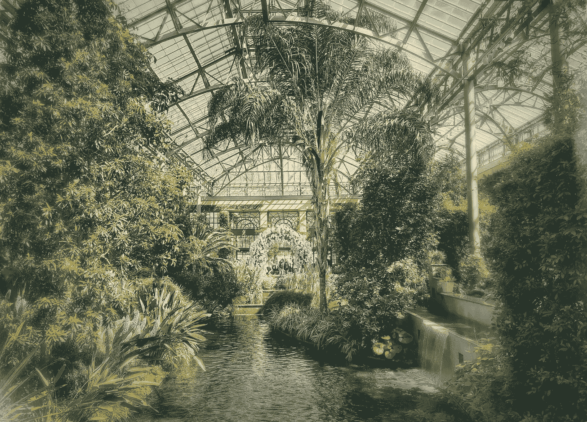

# “我现在能看清楚了”

> 原文：<https://medium.datadriveninvestor.com/i-can-see-clearly-now-531634bd7b97?source=collection_archive---------5----------------------->

## 几年后，我看到了我第一次去公园时错过的东西

Snow was on the ground outside, but the Longwood Gardens were tropical inside. Photo by Jim Katzaman

今年早些时候，随着冬末最后几英寸的雪慢慢融化，我第二次来到费城附近的[长木花园](https://en.wikipedia.org/wiki/Longwood_Gardens)，“美国首屈一指的园艺展园之一”。

我说技术上是因为很多年前我第一次旅行时视线受阻。

尽管户外仍然覆盖着白色，喷泉的最新翻新还要几周才能完成，但今年的花卉和植物在多层、多英亩的温室内招手。

当我从一个花园走到另一个花园时，潺潺的流水声从未远离过，我走过垂挂的绿荫，走过仙人掌，闪避着摇曳的兰花，凝视着一片完美的草坪。

一切都以这样或那样的方式回到了水中，正如我所看到和听到的那样，我不断听到我十多年前去世的妈妈的声音。从很小的时候起，她就给我讲了我第一次参观时没有看到的长木花园。

 [## 旅行在即，现在就制定计划吧

### 向前看，以避免金融陷阱，并有一个良好的旅行

medium.datadriveninvestor.com](/with-travel-on-the-horizon-make-plans-now-83e97b0fb269) 

很多次，她告诉我她和我爸爸是如何和他的父母一起去长木花园的。因为妈妈和爸爸很少旅行，这是一件大事。与我今年去的时候不同的是，当时的长木正在全面运营，尽管根据我对其历史的了解，可能只有今天占地 1000 英亩的一半大。即使是那个地区也是离大城市不远的一块相当大的土地。

妈妈告诉我这些花很漂亮，尽管她不能站在那里欣赏它们。附近总是有一个饮水机，每次她看到或听到水流声，她都要赶紧去洗手间。这样的旅行几次后，我奶奶对她说:“你怀孕了！”

果然，没几天妈妈的医生就确认她跟我很好。

# 老生常谈的故事

这就是为什么我第一次去长木花园时视线受阻，但我出生后很多年才听说。

几年后，妈妈回来了，没有带我去看花和喷泉。在我之后又有了一个男孩和三个女孩，现在已经过了生育年龄，她可能有机会看到更多的活水。

 [## 别让逃跑的人跑了

### 来自经验丰富的企业家和度假者的家庭旅行建议

medium.datadriveninvestor.com](/dont-let-the-getaway-get-away-6c83a6399c50) 

所以，现在我回来了，我现在可以清楚地看到所有的大惊小怪是什么。随着许多花园尚未被发现，今年夏天又有一日游在召唤着我们。

我确实了解到，不管是什么原因，当我最后一次回去的时候，喷泉对我的影响和对妈妈的影响不一样。然而，我一直在想，如果所有的瀑布瀑布不是一个无休止的怀孕测试流。如果另一个婴儿在船上，水会变成蓝色吗？

这个和其他的秘密等待着我的回归。

**关于作者**

吉姆·卡扎曼是[拉戈金融服务公司](http://largofinancialservices.com)的经理，曾在空军和联邦政府的公共事务部门工作。你可以在[推特](https://twitter.com/JKatzaman)、[脸书](https://www.facebook.com/jim.katzaman)和 [LinkedIn](https://www.linkedin.com/in/jim-katzaman-33641b21/) 上和他联系。