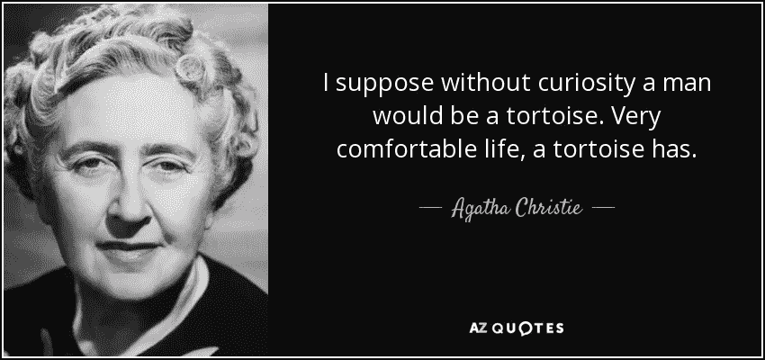
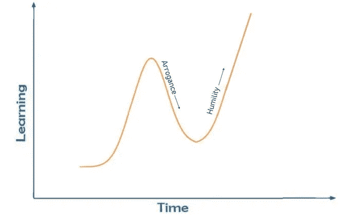

# 我不知道 sh**！

> 原文：<https://medium.datadriveninvestor.com/i-dont-know-shit-d5d53a76119f?source=collection_archive---------53----------------------->

> “我没有特别的天赋。我只是强烈地好奇”。—阿尔伯特·爱因斯坦

回到 2013 年，当我在大学一年级的时候，我对市场营销非常感兴趣，并开始学习一些基本概念。

这是我偶然看到一个在美国消费者新闻与商业频道播出的节目，名为 L.I.M.E-卓越营销课程。

source: [http://limeonline.org](http://limeonline.org)

长度 I.M.E 是一个非常受欢迎的节目，每年顶级商学院的学生都会参加一场营销案例研究比赛。

我发现学生们提出的策略不是很好，我想我可以做得更好！

快进到 2018 年，又看了一遍节目。这一次，我喜欢它！我发现所有的策略都令人惊讶，有趣，重要的是，我从每一次投球中学到了一些新东西。

这次是什么改变了？

我的态度。

当我学习营销的一些概念时，我想这就是了！我现在对营销了如指掌。我看到周围的一切，我看得像个专家。

学习带来的傲慢最终扼杀了我的好奇心。

当我改变了看待事物的方式时，事情就变了。

我从“我知道这个”变成了“我可能不知道”。

这引起了真正的好奇。

我遇到的每一个新的对话、视频、书籍和文章都变得更加有趣。

太神奇了！

回顾我这些年的学习，我绘制了上面的图表。随着时间的推移，我的知识越来越多，我达到了一个我认为自己无所不知的阶段。这就是衰落开始的时候——我想称之为“傲慢阶段”。

我认为，持续学习的关键是要警惕傲慢，以孩子般的好奇心对待事物。

-维沙克·艾扬格

下面我们连线-[**https://www.linkedin.com/in/vyshakiyengar**](https://www.linkedin.com/in/vyshakiyengar)