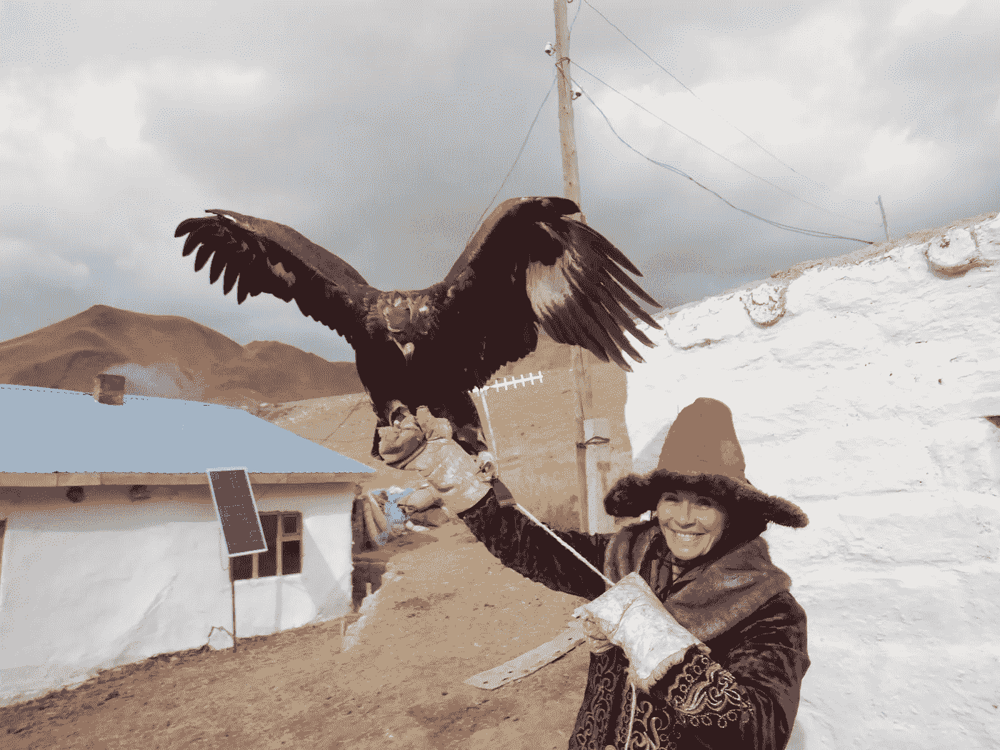
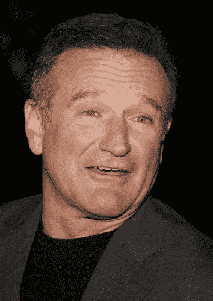

# 我已经不太在乎了

> 原文：<https://medium.datadriveninvestor.com/i-dont-much-care-anymore-65b250acd962?source=collection_archive---------7----------------------->

Deposit photos

## 这将使我真正擅长专业演讲(和写作)

好吧，听起来很奇怪，对吧？

我的意思是。

大约二十年前，我是全国演讲人协会本地分会的听众。舞台上的家伙穿着一双红色运动鞋和一双普通运动鞋。这是他的大事。他在台上解决他的个人问题，我们为此付出了代价。太可怕了。不舒服。他太饥渴了，把我们的精力都吸干了。

 [## 在创业之旅中，拥抱学习|数据驱动的投资者

### 好像建立一个数百万美元的公司还不够困难，企业家必须额外照顾他们的…

www.datadriveninvestor.com](https://www.datadriveninvestor.com/2018/10/16/on-the-entrepreneurial-trek-embrace-the-learning/) 

坐在我旁边的是——现在仍然是——业内最好的演讲者。我刚刚认识她。詹妮尔·巴洛博士非常受人尊敬，这是有原因的。她和我就我们所看到的交流了几句。这些话将开启一生的友谊。

从那以后，我一直记着她说的关于那位先生的话:

*“你不会在舞台上解决你的个人问题。”*

巴洛是世界上最好的之一。我见过她行动，读过她的书，有幸称她为我多年的朋友。像她这样的商界人士一样，这些年来，她既慷慨又友好地与我分享她的专业知识。几十年来，她经营的企业改变了大公司销售和提供服务的方式。76 岁时，这位精力充沛的女性继续为她热爱的行业开发程序和书籍。

Deposit photos

# 你不能在舞台上解决你的个人问题。

我可能会假设，在许多重要的方面，这也适用于我们写的东西。我读过一些由像[香农·阿什利、](https://medium.com/u/be08b013cc2a?source=post_page-----65b250acd962--------------------------------) [杰西卡·野火](https://medium.com/u/8016b9f8ffc8?source=post_page-----65b250acd962--------------------------------)、[克里斯·盖奇](https://medium.com/u/67d9cdce33af?source=post_page-----65b250acd962--------------------------------)和其他许多人写的媒体文章，他们都指出，是的，你可以肯定地写出你的真相，但不只是把其他人拖进你的痛苦中。我从 Wildfire 那里偷来的术语是“斗争色情”，这是对这种类型的最恰当的描述。

今天早上，我读了一篇很好的[文章](https://medium.com/better-marketing/your-golden-ticket-to-a-successful-writing-career-is-authenticity-6547312b2810)，作者是[吉莉安·西斯利](https://medium.com/u/d7d05607c38b?source=post_page-----65b250acd962--------------------------------)，它谈到了写作的真实性。如果你想寻找更好的写作思路，我推荐它。**事实是，我们所有人都有非常重要的事情要分享。重要的是我们如何去做。你和我讲述故事的方式可以改变一个人的一生——这是最重要的，但如果我们用自己的方式去讲述，就不会这样了。**

他们的观点是，我们有时都会在污水中游泳，我对此深表赞同。作为作家——正如本文所述，作为专业演讲者——让我们有影响力的是，我们不会把我们的观众描绘成和我们穿的一样的颜色。我们展示出路，让它变得有趣，提供见解和答案。这些使我们变得有用。把我们亲爱的读者拖进泥沼而没有出路是非常不合适的。这不仅是一种冒犯，也是一种侮辱。你和我出现是为了寻找答案，而我们带走的是更多的重量。

Deposit photos

舞台上的那个人正在给观众涂上和他穿的一样的颜色。他当众流血。

我不安地扭动身体。我们都是。他得到了礼貌的零星掌声。事情结束时，我们都很高兴。啊。

没有会议策划人会雇佣这样的人。谁会为一个让听众感觉比走进来时更糟糕的演讲者买单？你和我确实会付钱给那些鼓舞我们、让我们开怀大笑、开拓前进道路的演讲者和作家，或者更好的是，告诉我们如何为自己做到这一点。这是我们给观众的礼物。对我们许多人来说，这正是我们出现的目的。

如果可以的话，这个秘密就是在舞台上拿你的个人问题开玩笑是完全没问题的。这是喜剧的关键之一。能让我们发笑的演讲者(和作家)能赚钱。因为笑声可以治愈。

多年来，我一直想成为一名专业的演说家，我做到了。我开始是一名企业培训师，然后开始做主题演讲。我在这个领域投入的几十年得到了回报。通过失败、失败和踌躇，我变得擅长于此。我花钱请了一位非常好的教练——奥维尔·雷·威尔逊——他不仅帮我出版了几本获奖书籍，还磨练了我的舞台技巧。我慢慢地但肯定地能够在观众面前扔掉我随身携带的任何个人垃圾，以至于我可以发表一场精彩的演讲。

毫无疑问，我仍然带着很多私人的东西，但我学会了如何在舞台上把它们留在幕后。当我在舞台上的时候，就像现在一样，一切都是为了观众。客户。那个“我”会走开。当我真的非常非常幸运时，恩典会流过我的全身，我可以只是一个信使。尤其是当我自己花钱找乐子，允许自己和我的观众成为一个有深度的人，有缺陷，偶尔在生活中磕磕绊绊。因为我们都有。

听到别人是如何重新振作起来，拍拍屁股，吃吃地笑，然后重新开始的，这也是我们雇佣演讲者，阅读关于自助的文章和书籍的原因之一。

The author in Mongolia Julia Hubbel

自 2012 年以来，我一直在休假。虽然我一直在做企业工作，为非常大的公司提供销售、领导和管理项目，但我已经转向了我真正热爱的事情，那就是冒险旅行。那占据了我的大部分时间。训练和进行史诗般的旅行，把我推向极端，抹去我的界限。

天哪，这些经历改变了我的生活。我变得更加自信，我明白自己的极限，不再害怕任何东西，我也获得了一些宝贵的人生经验。我打算分享的经验教训。

Photo by [jesse orrico](https://unsplash.com/@jessedo81?utm_source=medium&utm_medium=referral) on [Unsplash](https://unsplash.com?utm_source=medium&utm_medium=referral)

换句话说，这些天来，比以往任何时候，我真的有一些有价值的东西提供给观众。生活、成熟、经验和在战壕里呆一段时间可以让一个作家和演说家做到这一点。

我不是，也永远不会说，你必须像我一样是个老怪人才能有话要说。一点也不。再说一次，诀窍在于告诉别人，一旦你在生活中变脏了一段时间(变脏是另一回事，但那是另一篇文章)。

我正在写另一本书，并准备一篇关于这些经历的新演讲。这需要一些时间，因为这本书是关于我现在正在进行的过程:巨大的个人转变成我的一件大事。这是非凡的工作。我打算谈谈这件事。最终。

事情是这样的:我不再像过去那样关心演讲了。至少，不是这样。这一次，它与我需要从观众那里得到的认可、确认或其他好处没有什么关系，这让我变成了一个情绪化的吸血鬼。

Deposit photos

在我生命中的某个时刻，我真的真的真的必须站在舞台上。我需要这种关注。我需要掌声。

如果你在一段伴侣是情绪吸血鬼的关系中度过了一段时间，你很可能会产生共鸣。可悲的是，我做了我的时间。糟透了(我道歉，糟糕的双关语)。

现在，*咩*。因此，我可能会变得更有吸引力、更有效率，并且能够发挥更大的作用。因为掌声不是重点，这个路障不再阻碍我实现真正价值的能力。

因为不像那个穿红鞋的人，这不再是我需要什么了。我试图从观众那里获得什么来支撑我脆弱的自我或自我价值感。

我可以走出自己的路。对我来说，这就像穿着 Lady Gaga 的鞋子走在舞台上。如果你曾经看过，那就像看一只诵读困难的骆驼喝伏特加。那应该是我。(不，我不会分享那个视频)。

我见过的最引人注目的演讲者，那些以这样或那样的方式震撼了我的世界的人，都有一个共同的特点。他们对自己完全放心。他们不使用诡计，没有特殊的服饰，没有狗屎把戏。它们完全包含在自身之中。

他们不必穿红色的鞋子或戴红色的帽子，也不必把头发染成十二种颜色或炫耀纹身。他们的信息足够了。他们话语的力量超越了一切，因为你知道那个人是在直接对你说话。

这些极具影响力的演讲者中，许多人对[舞台艺术](https://relationologyinternational.com/public-speaking-5/) *本身*一无所知。他们不知道如何走到舞台的不同部分来传达特定的意思。虽然舞台艺术有一定的价值，但我认为从全局来看，它相对来说毫无意义。因为如果你的信息没有说服力，如果你太专注于你需要什么，而不是你的观众和客户付钱让你接受什么，那么舞台艺术本身就只不过是一个红鞋噱头。

观众厌倦了噱头。他们想要令人信服的信息，让他们想从座位上跳起来。如果你需要一个噱头来获得一场演出，你还没有准备好上台。

Deposit photos

已故的伟大的罗宾·威廉姆斯与毒品和酒精进行了激烈的斗争。像我们很多最好的漫画一样，他把痛苦融入到日常生活中。这样做，他不仅允许自己嘲笑他的大便，也允许我们所有人嘲笑我们的大便。威廉姆斯是我最终能够治愈自己四十年饮食失调的主要原因。

有一天我选择通过他的漫画镜头来看我的故事。那天，我带着一种喜剧的倾向，改写了我一生中最糟糕的几天。我发现自己歇斯底里地躺在地板上。你不可能给这种自由定价。那一天，受到罗宾·威廉姆斯将个人痛苦扭曲成完美笑点的能力的启发，是四十年饮食失调结束的开始。

这就是精通。这就是观众想从你我身上得到的:一条脱离苦海的路。更好的是，我们一边走一边笑。想象一下，通过你的写作和演讲，你可以把这份礼物送给别人。*试想一下*。

这不是一朝一夕的事。对于许多发言者来说，这种情况根本不会发生。对于太多需要在公共场合流血的人来说，我们忽略了整个要点。*这与我们无关，也永远不会与我们有关*。只要我登上舞台的动力是填补构成我情感存在的黑洞，我就只会给负担过重的观众增加一个负担。

他们出现是为了获得自由。

deposit photos

如果你想成为一名真正有影响力的演讲者或作家，这就是你的挑战:去做工作，把你的想法付诸行动，获得成果。当你有了它们，你就不需要在舞台上流血了。当你不需要观众来支撑你的信心时，你会改变他们的生活。

换句话说，除非你移动了你的，否则你不能移动他们的。

不，你不必等到 76 岁，或者像我这样，67 岁，才能做到这一点。一点也不。*但是在你在舞台上变得有效、引人注目和有力量之前，你必须自己努力。*

当你做那项工作时，当你不再关心最重要的起立鼓掌时，你更有可能得到一个。

Deposit photos