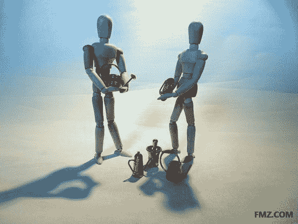
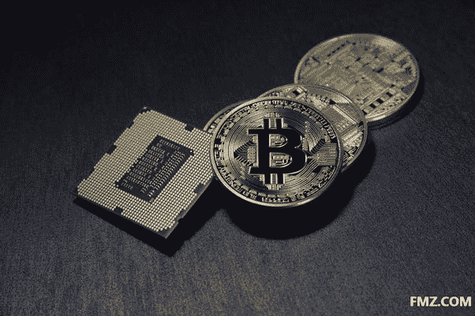
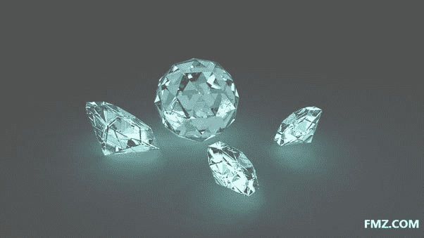

# 我终于弄明白了比特币

> 原文：<https://medium.datadriveninvestor.com/i-finally-figured-out-bitcoin-dd2abd1d7fd1?source=collection_archive---------10----------------------->

经济学家，
中尉，
实地代理人，

借我你的耳朵！

www.fmz.com

因为我终于弄明白了比特币！老实说，这是我最大的精神成就之一。希望通过我清晰地书写和解释事物的能力，我可以向我们所有人解释比特币。

我听过 Stefan Molyneux 关于比特币的[播客。这非常好，但没有完全回答我的问题，“为什么比特币有任何价值？”然而，播客所做的是将我的感知或“观察”提升到足够高的水平，以至于我最终可以看到并得出比特币实际上如何具有价值的结论。](https://www.youtube.com/watch?v=w4HGVJjqDVk)

要理解比特币为什么有价值，首先需要思考货币为什么会存在。

一堂经济学 202 课的答案是“避免物物交换”

物物交换的效率低得可怕。如果你是一个牧牛人，想要一品脱啤酒，那么，你就不走运了。因为你不能用一整头牛换一品脱啤酒。你也不能为了让交易更加公平而从活牛身上切下牛肉片。因此，如果要进行任何形式的经济贸易和进步，就需要一种货币。

从历史上看，这意味着从金银到盐和贝壳的任何东西。但不管哪种商品不可避免地成为当地经济的货币，它们都有一些共同的关键特征和品质。

**可分性**——你可以将黄金、白银或盐分成可测量的数量。磅、盎司、克等。这允许你将货币换算成你想要购买的物品的价值。

耐久性——货币不会随着时间的推移而腐烂或衰退。牛奶是一种劣币，因为 3 年后它将变得非常糟糕。黄金在 3 年时间内仍将是黄金。

**价值储存** —货币还必须随着时间的推移保持其价值和购买力。如果你像委内瑞拉一样，不断印刷更多的共产主义纸币，它将失去价值。但供应有限(金、银、钻石等)。)你可以假设，货币仍将拥有与过去大致相同的购买力。

最后， [FMZ](http://www.fmz.com/)

**内在价值** —货币必须有某种实际价值。黄金可以用来做首饰。银可用于电子产品。铜可用于管道工程。盐可以用于烹饪。换句话说，人们会把它当作一种货币，因为即使他们自己不使用它，他们也知道有人会使用它。它本身确实有内在的价值。

而正是在这里(内在价值)，大多数人在比特币上迷失了方向。

比特币符合好货币的所有其他特征和特质。它是可分的。它经久耐用(因为它是数字化的，所以是无限的)。而且不会衰减(还是那句话，二进制不会衰减)。

但是它到底有什么实际的、真实的应用呢？你不能用在电子产品上。你不能用它来做珠宝(又名——买春)。那么，为什么它有任何内在价值呢？

答案在于比较一种货币的“内在价值”和它作为货币的价值。

例如，看看在人类历史的大部分时间里作为主要货币的东西——黄金。

黄金为什么有内在价值？ [FMZ](http://www.fmz.com/)

经济学家会回答，“因为你可以把它用在珠宝上”，这是礼貌的说法，“男人可以用它来买性。”

但这有意义吗？你可以用黄金做的一件事就是“制作珠宝”,这就是为什么黄金在全球数千年来一直作为标准货币的原因？你很快就会意识到，是的，虽然黄金可以用来制作珠宝，但它作为一种货币对社会有着更重要的作用。换句话说，一件物品作为货币的价值实际上并不取决于它的内在价值。它只是需要一些内在价值，让人们对它有信心，并开始交易它。

盐可以用来调味和储存食物。这足以让它成为马里帝国的默认货币吗？

银可以用来制造珠宝和一些工业产品。这些理由足以让它成为狂野西部的货币吗？

在古玻利尼西亚，大蛤壳可以制作一些又臭又不舒服的胸罩。这足以让它成为南太平洋的默认货币吗？

显然是这样，因为它确实发生了。但不是因为珠宝制作潜力或食物储存潜力。这只是“足够”的内在价值。这是因为这些商品作为货币比作为珠宝制作材料或食品调料为经济提供了更多的价值。为了证明这一点，一个有趣的比较是比较实际用作珠宝的黄金(或白银)数量与货币、金条或投资的数量。我推测，随着时间的推移，90%的白银和黄金已被用作货币，而不是头饰。

理解到一种货币的大部分价值来自其非内在价值特征，只需要“少量”内在价值，这就把重点放在比特币如何获得其“少量”但必要的内在价值上。

答案很简单——稀缺。

考虑钻石。

它们为什么有价值？ [FMZ](http://www.fmz.com/)

除去珠宝和工业钻探用途，它们为什么还有价值？

答案是，他们没有。它们毫无用处。至少从实际或有目的的角度来看是这样。

但是因为它们非常稀有，人们会争相购买。但是当我们谈论“稀缺性”或“稀有性”时，请理解我们在谈论什么。它与其他事物相关。

www.fmz.com

在这个星球上有 9000 万兆吨的泥土和大约 10 万磅的钻石。泥土和钻石都没有真正的实际用途或价值，但钻石被认为价值无限。因此，当我们谈论稀缺性时，它仅仅是两个项目之间的比率，决定了它是否有价值。它只是地球上一种东西(铜)的供应量与另一种东西(铂)的供应量之比。

这就是为什么比特币有一丁点必要的内在价值。这很像钻石，因为它没有实际用途，但它是稀缺的。事实上，钻石、黄金、白银、稀土等。不断地从地下被挖掘出来。比特币的制造商已经将其供应量永远限制在 2100 万单位，使其更加稀缺。

最终，比特币实际上只不过是一种类似于数字钻石的私营部门货币。在我看来，你有一种比任何官方法定货币更好的货币，因为它不能被中央银行过度膨胀。然而，比特币也有一些缺点。

第一，它完全依赖于互联网的工作。任何后启示录事件，关闭它或切断电力，它的价值约为那些黄金交易所交易基金你有。第二，它还没有被人们普遍接受。随着时间的推移，这种情况可能会发生变化，但使用比特币的是一个独特的(尽管在不断增长)少数群体。第三，它对其它已确立的货币构成了如此大的威胁，我毫不怀疑各国政府会尽一切努力阻止它。第四，它可能会被另一种更受欢迎的数字货币削弱。

无论如何，比特币是否最终成为一种普遍接受的货币是另一回事。由此得出的关键经济学教训是，驱动一种货币价值的与其说是其内在价值，不如说是社会赋予它作为交换工具的价值。

[FMZ](http://www.fmz.com/)

*原载于 2018 年 9 月 11 日*[*【captaincapitalism.blogspot.com】*](http://captaincapitalism.blogspot.com/2013/11/i-finally-figured-out-bitcoin.html)*。*