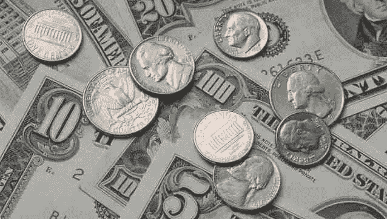
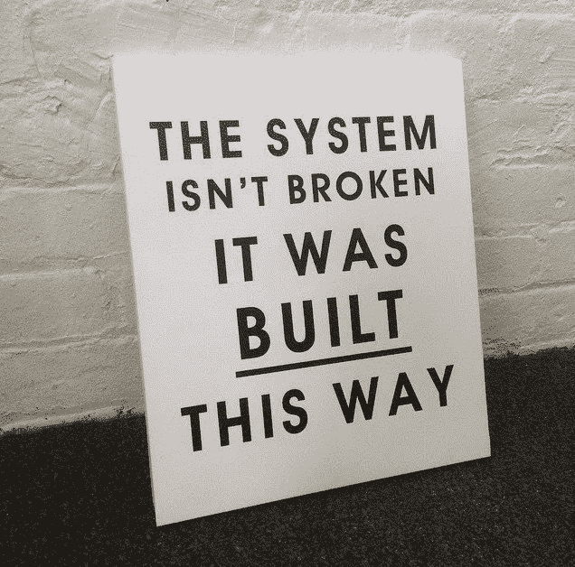

# 我他妈的爱钱的问题。

> 原文：<https://medium.datadriveninvestor.com/i-fucking-love-money-problems-f6e01542f3d0?source=collection_archive---------28----------------------->

## 我不富有。我有债务。我他妈的喜欢这个问题。

我从来没有用钱对*负责过*。有时候我受够了。当我有了，我花掉了，然后我就没有了，所以我又去拿了更多。这是我从大约八岁开始的基本财务计划。

有时我赢了这场比赛，有时我输了。我的信用评分上升，下降，然后又上升…然后下降。起泡，冲洗，重复。

我欠下了信用卡债务，拖欠还款，与债权人结算了大约 50%的余额，几年没有信用卡，然后他们又开始给我信用卡。

百思买仍然不会给我另一个，所以如果我需要从百思买买东西，我就用我的签证。他们的损失。他们可能会收回一部分他们注销的我的债务，但我猜他们不感兴趣。

有时候，我的信用卡上没有余额，我会把它们充作奖励，而不支付任何利息。有时他们有很大的余额，我用利息支付来偿还我的奖励。游戏继续。

军队支付了我工程学位的费用，但我仍然申请了学生贷款，所以我在学校不用做太多工作。我也买了一些西装。去了泰国。除了世界经验还有什么更好的教育？你也没指望我在没有任何白领的情况下得到一份白领工作吧？

我在经济上没有*自由。我有人们可能称之为金钱的问题，我他妈的爱他们。我也不是完全豁出去了。我记录财务状况、债务水平，并按时支付账单。当我 20 多岁的时候，我在透支费上花了很多钱，但我最终学会了如何停止透支。这是我观点的一部分。*

陷入钱的困境教会了我如何少陷入钱的困境，也教会了我如何陷入更大的钱的困境，以及更聪明的钱的困境。不负责任是伟大的老师。它迫使我们学习最难的课程。

我从未申请过破产，但我不怕申请。我知道很多人都这样过，他们都很好。现在白宫里甚至有一个橙色的混蛋，他的政治对手喜欢提醒每个人他已经申请破产多少次了。并不意味着他不再是亿万富翁，不再是总统，即使这让他有点像个混蛋。他似乎不介意做个混蛋。

毕竟…

那么，为什么我要吹嘘这种边缘的反社会的金钱观念，我只是从系统中得到我想要的，然后学习如何偿还(或不偿还)？因为我强烈建议在你自己的生活中采取这种观点。

现在，注意我没有建议你陷入财务困境，放弃，然后作为一个绝望的失败者走上街头。

绝望是傻瓜的结论
- [本杰明·迪斯雷利](http://www.bbc.co.uk/history/historic_figures/disraeli_benjamin.shtml)

我并不提倡疯狂地陷入绝望的深渊。我所提倡的是让自己陷入财务困境，把自己挖出来，然后让自己陷入稍微大一点的财务困境。吸取教训，然后重复这个过程。有一个微妙但至关重要的区别。

现在，我为什么要倡导这种自我强加的金融风险和回报学派呢？因为如果你能采取这种心态，一种冒险的心态，把艰难的情况强加给自己，想出如何解决你的问题，然后从一个更有经验的地方再做一次，那么你会开始看到你的回报随着你的风险而增加。

然后你会意识到我们中没有人有我们认为的那么多的金钱问题，我们真正有的是恐惧问题。“*我负担不起”*是我们告诉自己(和别人)的话，而我们真正的意思是“*我害怕靠自己的能力去冒险成功。我不相信自己，从长远来看，这也是其他人不相信我的原因。”*

我不是站在流动资产的立场上讲这些。我支付我的汽车，我的房子，我的教育，我的太阳能板。不同的是，我不认为这些债务是情感问题，它们只是需要解决的情况。

也许在多元宇宙的某个地方，有一个版本的我对待金钱更加恐惧和尊重，节俭地储蓄，通过从一开始就不承担债务来长期无债一身轻。但那不是生活在这个宇宙中的我的版本。

住在这里的我会冒险，有时会咬自己的屁股，想出如何反弹，然后走向更大的风险和更好的教训。这个系统对我有效，我感觉它对你也有效。