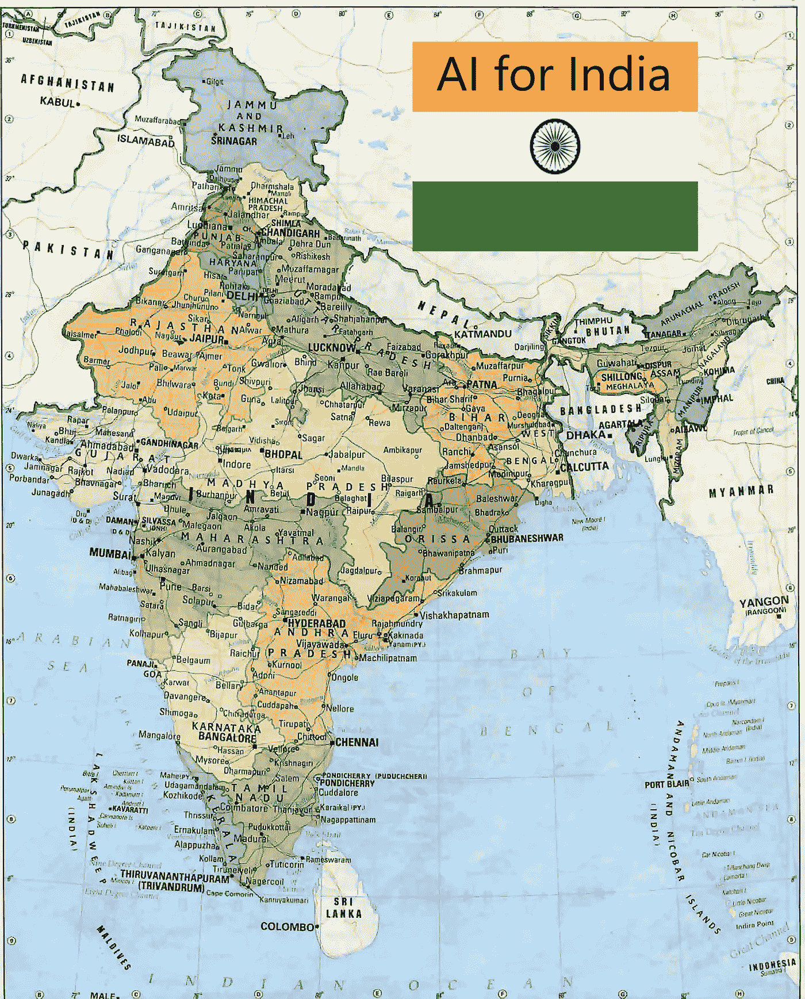

# 我对印度有一个人工智能梦想

> 原文：<https://medium.datadriveninvestor.com/i-have-an-ai-dream-for-india-edeab3b1f547?source=collection_archive---------29----------------------->

AI for Everyone in India

# 心的问题

我们大多数人都有孩子。有些人有一个，有些人有很多。我们对孩子的梦想是什么？首先也是最重要的是看到他们将来过上美好而成功的生活。我说好，是因为我们努力教导我们的孩子良好的人道主义价值观，以便他们能够做出正确的伦理和道德选择，成为好公民。我给他们的梦想带来成功的一面，因为我们希望他们在生活中出类拔萃，取得比我们作为他们的父母所能取得的更大的成就。我们为他们提供最好的食物和最好的教育，以确保他们实现我们的梦想。如果我看到孩子们手里拿着刀和枪，而不是书和笔，难道我不会心痛吗？可悲的是。这正是发生在我们国家印度数百万儿童身上的事情，如果我们只是静静地坐着，什么也不做，这真的会动摇我们良知的根基！

当我看到一个被洗脑的孩子追随对他或她自己国家的兄弟姐妹的暴力时，我深深地受到了伤害。我很遗憾地看到一些意识形态正在我国传播，其目的是把一个孩子变成他自己兄弟姐妹的敌人。一个孩子被训练去憎恨别人，因为他们不是他的宗教，种姓或地区！他或她在 8 岁时就接受了使用武器的训练！有些人被教导成为自杀炸弹手，有些人被训练成为纳萨尔派分子！如果你真的爱你的国家，看到这样的事情发生在你面前，你的心应该是碎的。我们不能假装无知，因为我们在印度的每一个印度教、穆斯林和基督教节日中都目睹了这些场景。我们在每个新年庆典和情人节都会看到这种情况。在几乎所有的选举中，无论是村委会主任选举还是议员选举，与选举相关的暴力事件在任何地方都是一样的。当这些孩子长大成为我们国家的青年时，他们会犯下各种严重的罪行，从欺凌弱小、戏弄夏娃、暴乱到抢劫、强奸和谋杀！一些同样精通 IT 的误入歧途的人甚至敢在推特和脸书上对女性活动家和她们的女儿发出强奸威胁！

我能为我国家的孩子们做些什么？怎样才能把他们从那些从小误导他们的犯罪分子和反民族分子的魔掌中带走？我能改变他们的命运吗？

答案是肯定的。

# 变革的动力

都说被爱是最强大的动力。被爱给了我们存在的意义。当我们真正被爱时，我们可以做任何事来回报这份爱。在圣经中，关于爱的最伟大的陈述是由主耶稣基督的一个门徒写的，他自称是“耶稣所爱的门徒”。耶稣所爱的门徒约翰所写的关于爱的最深刻的话是:"不爱的人不认识神，因为神就是爱"。

我相信，如果一个人确信某个重要的人爱他或她，他或她就有可能改变或走上正确的道路。如果有一个超然的目的，不受世界上物质事物或人类努力的影响，我相信，能给人们的生活带来所需变化的下一个最好的事情就是他们的技术参与。我们已经在无线电革命、电视革命、计算机革命以及最近由互联网驱动的移动或智能手机革命中看到了这种情况。广阔、有趣和未开发的技术世界有巨大的力量吸引各个层次和各个年龄组的人。正是在这种背景下，我认为人工智能技术的未触及世界在让我们的孩子从小参与人道主义公益方面具有重大意义。

# 每个人的人工智能

在《麻省理工科技评论》发表的一篇关于人工智能在中国的影响的文章中，我读到在中国，中国的年轻人在街角或茶馆聊天时都在谈论人工智能。他们最兴奋的是当地的人工智能挑战，如人工智能和他们的城市围棋冠军之间的围棋比赛。在印度，这就像孩子们谈论人工智能 IPL 比赛一样。如果像中国这样一个连民主都算不上的国家能让他们的孩子谈论人工智能，为什么我们印度这个世界上最大的民主国家不能呢？我能让人工智能与恰蒂斯加尔邦纳萨尔派地带某个偏远角落的政府学校的孩子相关吗？答案是肯定的，这是我的梦想。印度每个人的人工智能！

最近，我购买了域名 [www.aiforworld.in](http://www.aiforworld.in) ，我正满怀热情地朝着一个梦想努力，那就是建立一个平台，将人工智能带给我们国家的每一个在校学生和青少年。我相信上帝给了我这个梦想，让我通过技术参与来改变我们国家数百万儿童和青少年的生活。我对一个没有痛苦、苦难、不良情绪、眼泪、疾病、意外死亡和悲伤的世界充满希望。

我知道我一个人做不到，像你们这样的人的鼓励和支持可以帮助我把梦想变成现实。

我在执行任务。加入我吧。