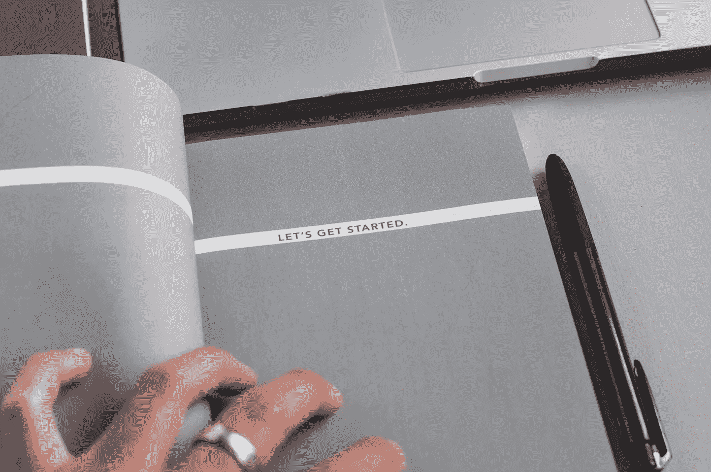
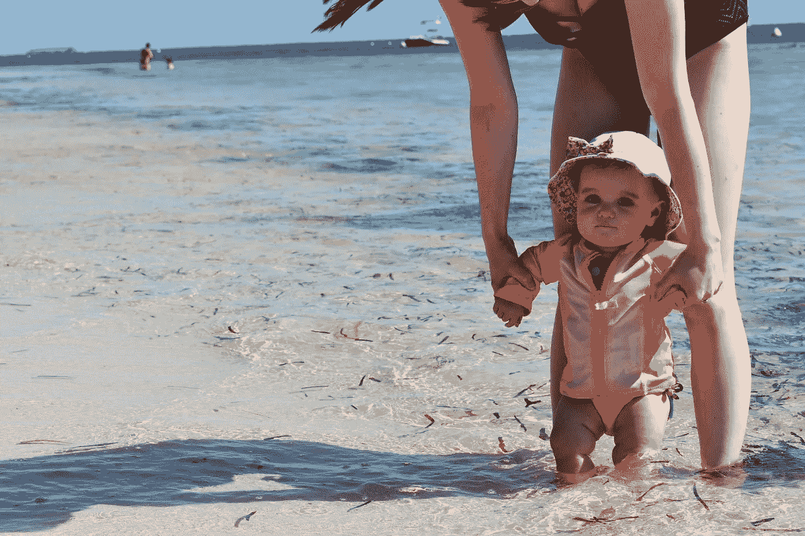

# 我不知道如何创造远程收入流。我如何开始？

> 原文：<https://medium.datadriveninvestor.com/i-have-no-idea-how-to-create-remote-streams-of-income-how-do-i-get-started-f7ccd0780ee0?source=collection_archive---------23----------------------->

这是一个很好的问题。这也是你们中的一些人希望我回答的问题。

不过，老实说，这并不是什么大惊喜。

这有点像学习一项新技能，不是吗？以你最近学到的一项技能为例。也许是滑雪或冲浪，写作或绘画。如果你想不出最近发生的事情，那就回想一下你在生活中的某个时刻学习新技能的时候。

什么都有可能。

游泳…

骑自行车…

写一本书…

烹饪…

或者坚持锻炼计划。

在你开始任何和/或所有这些事情之前，你不知道它会如何发生。见鬼，你可能甚至不知道从哪里开始。你肯定无法想象在它的另一边。

现在，你也在同样的位置。

你知道你想创造远程收入流，你想旅行…但有这么多的变量，这么多的未知。

如何在网上赚钱？

*你如何确保收入稳定且可预测？*

*你如何赚足够的钱来养活自己和家人？*

所有这些没有答案的问题都会产生奇迹，让你无所作为。这是你的第一步。

别让他们得逞。

怎么会？

通过找到你的“为什么？”

我知道这听起来很老套，但请坚持。

大多数人会告诉你他们知道自己想要什么，但是 99%的人不知道自己想要什么。他们只是喜欢某些事情的想法。问他们…

你想多去旅行吗？

*你想创造一个远程收入流吗？*

你愿意花更多的时间和家人在一起吗？

你想在工作中赚更多的钱吗？

他们会说，“是的，是的，是的！”

但是详细地问他们到底想要什么，他们可能会说一些大意如下的话，“我想赚更多的钱，可能会有更多的时间去旅行，可能会学习冲浪，花更多的时间和家人在一起。”

那些都是美好的愿望…

但是它们太模糊了。

以下是你如何避免成为 99%的人的方法:**设定真正的目标。**

首先，确定自己真正想要的是什么。与你的家人交谈，沉思，读一本好的小说——尽一切努力找出原因。你。想要。

确保你有野心和自私。

你的理想生活:去吧——现在就写下你的理想生活。

回答这些问题:在你的理想生活中…

你每月挣多少钱？

你住在哪里？

你一年中有几个月会去旅行？

你每天工作多少小时？

有哪些你从未花时间去学习的新闻技能，现在你已经是专家了？

花几分钟时间真正地*梦想，*弄清楚你的理想生活是什么样子的。

然后，把它们整理成更明确的目标。

回答这两个关键问题:

你打算在什么时候过上理想的生活？

*你打算怎么去那里？*

然后，列出你需要做的事情来保持积极和精力充沛。

毕竟，目标很难保持。如果你不健康，那就更难了。

这就是所有这些可能的样子。

**我的理想生活:**我和家人环游世界一年，在这一年结束时，决定我们是继续旅行还是在我们去过的地方定居。在那段时间里，我每天只需工作 2 小时，每月就能赚到 6000 美元。我学冲浪，吃美味的食物，不用担心账单。

**完成时间:**2019 年 8 月 15 日

游戏计划:在接下来的一年里，我将努力创造三个收入流，每个月给我 2000 美元，每周只工作 10 个小时。

这意味着: 1)我将每天晚上工作 2 小时来创造新的收入来源。2)我将每周锻炼 5 天，每次 30 分钟，以确保我有精力和健康的心态。3)我只在周末吃碳水化合物，以避免在工作日感到臃肿。

当然，这只是一个例子。你的“工作表”可能看起来非常不同。你甚至可能对环游世界不感兴趣，但只是有一点额外的钱比你现在做的更多。或者你只是想要一份远程全职工作，而不是自己的收入来源。

不管是什么，把它写下来，和你的家庭成员讨论一下。

也征求他们的意见。很有可能，你也会和他们一起旅行。所以确保每个人都在同一页上。

这是第一步。

我知道这可能不是你想听到的。

我几乎可以听到你说，“但我只是想开始创造一个新的收入来源！”

我知道。我明白了。

我将帮助你做到这一点——今天有无数不同的方式在网上赚钱。

不过现在，花一周时间来确定你的目标，并确定你到底想要什么。然后，你会更加致力于建立远程收入流，在你旅行时支持你，即使很困难。

而且它*会*变得坚硬。

但是你要做好准备。:-)

You shall never see anything more adorable than a baby standing in the ocean of an island on the Great Barrier Reef in Australia (Green Island).