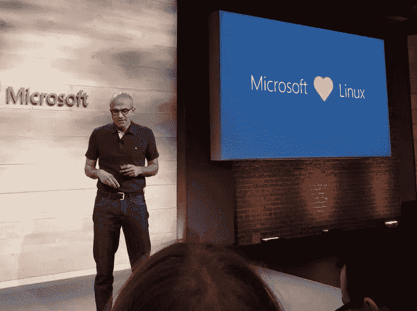
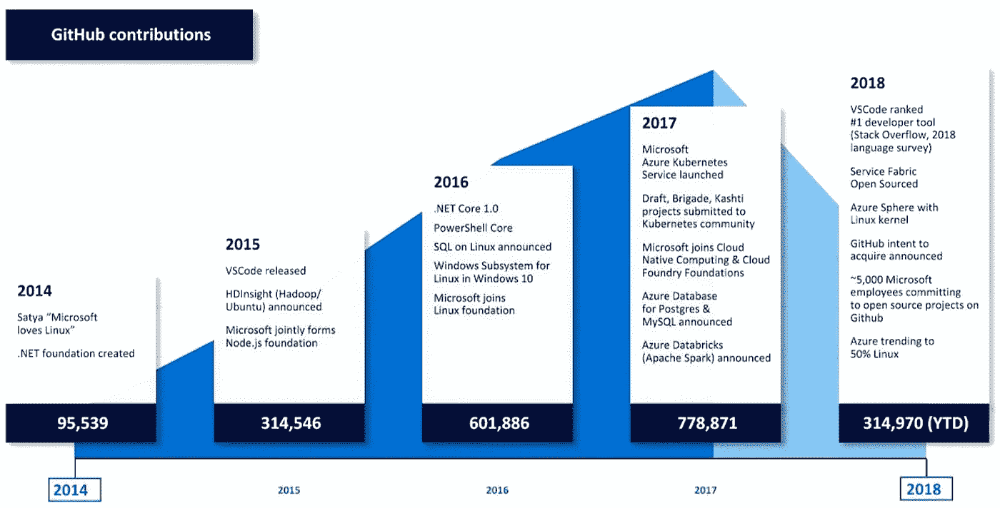

# 我有意见

> 原文：<https://medium.datadriveninvestor.com/i-have-opinions-61f878724402?source=collection_archive---------5----------------------->

## 在开源软件上赚钱

从前，计算机用户和计算机程序员是一回事。要完成任何事情，你必须知道如何改变一个程序的代码，让它 a)在你的机器上工作，b)按照你想要的方式工作。在互联网出现之前，程序包括源代码(供编码人员阅读和修改)和机器代码(供计算机阅读和执行)，因此程序的用户可以修改代码，使其满足自己的需求。然而，随着行业的成熟，商业利益决定这不是他们的商业模式，并对用户关闭了代码。

学者和业余爱好者，也就是那些自己开发程序的人，仍然可以自由地分享他们的代码，与任何有意愿和能力做出贡献的人合作，让软件变得更好。

Richard Stallman, 2010\. From [Victor Powell](https://commons.wikimedia.org/wiki/User:Vicapowell39), [CC BY-SA 3.0](https://creativecommons.org/licenses/by-sa/3.0/deed.en)

1984 年，理查德·斯托尔曼创立了自由软件基金会，以支持任何人都应该能够看到或修改他们的计算机运行的程序的想法。他们提出了“左版权”的概念:任何人都可以修改和/或重新发布软件的许可证，条件是任何衍生作品都保持同样的权利。([版权所有](https://creativecommons.org/tag/some-rights-reserved/)))这对个人用户来说很好，但是当你开始说“免费”这个词的时候，公司就有点紧张了。它需要重塑品牌。

> “给足眼球，所有的 bug 都是浅的。”
> 
> ——李纳斯定律，作者埃里克·s·雷蒙德，*大教堂和集市*

Eric S. Raymond, 2004\. By [Bilby](https://commons.wikimedia.org/wiki/User:Bilby), [CC BY-SA 2.0](https://creativecommons.org/licenses/by-sa/2.0/deed.en)

1997 年， [Eric S. Raymond](http://www.catb.org/~esr/) 发布了[*The Cathedral and The Bazaar*](http://www.catb.org/~esr/writings/cathedral-bazaar/)*，*一篇关于公共协同发展以及如何正确实现的论文。这启发了网景公司在 1998 年发布了 Netscape Communicator 作为自由软件，这反过来又启发了帕洛阿尔托的一个小组(包括 Raymond)成立了[开源倡议](https://opensource.org/history)，创造了术语“开源”来描述这种方法，并使其与“自由软件”的哲学和政治内涵截然不同。

## 一个简短的旁注:演讲中的免费和啤酒中的免费

我是英语的忠实粉丝，但有时会受到限制。用同一个词来表示“自由”和“无补偿”很容易引起混淆，尤其是在软件领域，两者并不一定是一脉相承的。所以:

> “自由软件”是指尊重用户自由和社区的软件。粗略地说，这意味着用户有运行、复制、分发、研究、修改和改进软件的自由。因此，“自由软件”是自由的问题，而不是价格的问题。为了理解这个概念，你应该把“免费”理解为“言论自由”，而不是“免费啤酒”。我们有时称之为“libre 软件”，借用法语或西班牙语中的“自由”一词，以表明我们并不意味着软件是免费的。
> 
> — [自由软件基金会，1996 年](https://www.gnu.org/philosophy/free-sw.html)

所以，免费不代表不用付费。

自由软件和开源软件经常被混为一谈，但它们是不同的概念。然而，它们是重叠的，因为它们共享被任何有兴趣的人修改的能力，并且这些修改可以被合并到发布到主下载的产品中。

# 现在我愿意回答大家的问题

> 所以，人们只是无偿地提供他们的工作？他们就这么放弃了？

是的，就是这样，但是没有讽刺。

> 我不明白。

编码很有趣。人们喜欢创造东西，他们喜欢成为社区的一部分。在某些圈子里，衡量成功的标准不是你拿了多少，而是你付出了多少。

> 但是…

我认为这是其中的一件事，如果你必须向你解释，你不会明白。

> 不，我明白这一点。

哦。抱歉。

> 那么，一家公司如何从开源软件中赚钱呢？

啊，我看到有人看字幕了。让我们开始吧。

## 1.它的一部分可以是开源的，而不是全部都是开源的。

软件许可的[开放核心](https://opencores.org/)模式提供了一个开源的营养中心，但是如果你想要杏仁焦糖或者巧克力涂层，你必须付费。一个例子是 IBM 的 [Linux 技术中心](https://www.ibm.com/support/knowledgecenter/en/linuxonibm/liaab/ibmlinuxintro.htm)，在这里，IBM 员工为 Linux 内核和其他开源项目做出贡献，但也出售企业需要的其他东西，如中间件或数据库系统。

## 2.企业级支持

Red Hat 在企业层面上发布他们的 Linux 版本。不过，你花钱买的不是代码本身，那都是开源的；你花钱买的是一个电话号码，当它坏了的时候你可以打电话给它。

## 3.计算机不能运行源代码。

计算机不能对一页代码做任何事情，直到它被编译(变成它可以读取的二进制文件)和打包(与它运行所依赖的其他东西放在一起)。这是红帽为企业做的另一件事。

## 4.商品销售！

Spaceballs (1987), dir. Mel Brooks

看着你，[维基百科](https://store.wikimedia.org/)。

## 5.得到 SaaS

这就是软件即服务。使用开源软件提供云服务，而不实际发布软件代码，符合大多数开源许可。[理查德·斯托尔曼不是粉丝:](https://gigaom.com/2013/08/06/hactivist-richard-stallman-takes-on-proprietary-software-saas-and-open-source/)

> “服务器有你的数据，它可能会显示给国家安全局”
> 
> —理查德·斯托尔曼，2013 年

不过，公司开源还有其他原因。这就把我们带到了微软。

从前，自由开源软件的最大敌人是微软首席执行官史蒂夫·鲍尔默。

> “Linux 是一个癌症，从知识产权的角度来看，它会附着在它接触到的所有东西上”
> 
> — [史蒂夫·鲍尔默，微软首席执行官，2001 年](https://www.theregister.co.uk/2001/06/02/ballmer_linux_is_a_cancer/)

鲍尔默有一种印象(或者他希望其他人有这种印象),即像 Linux 一样处于 GNU GPL 之下意味着任何与 Linux 有关的东西都必须处于 GPL 之下，在他看来这是一个缺陷。

那是当时。

Satya Nadella, Microsoft CEO, 2014\. By James Noccolai for [PCWorld](https://www.pcworld.com/article/3142345/microsoft-doubles-down-on-linux-love-joins-foundation.html)

Satya Nacella 于 2014 年接替鲍尔默担任首席执行官，自那以来，微软几乎一直是开源社区中最大的企业玩家。在微软的 Azure 上，[四分之一的虚拟机运行 Linux](https://azure.microsoft.com/en-us/overview/choose-azure-opensource/) 。Azure 不仅支持微软的 SQL 数据库，还支持 PostgreSQL 和 MySQL 等开源数据库。[Linux 的 Windows 子系统](https://docs.microsoft.com/en-us/windows/wsl/faq)让你在 Windows 10 下运行你喜欢的任何风格的 Linux。微软的开源 [Visual Studio 代码](https://github.com/microsoft/vscode)是[栈溢出成员最流行的开发环境](https://insights.stackoverflow.com/survey/2019?utm_source=Iterable&utm_medium=email&utm_campaign=dev-survey-2019#technology-_-most-popular-development-environments)，甚至超过了最初的 Visual Studio。[微软是世界上最大的开源社区 GitHub 的最大贡献者。](https://www.infoworld.com/article/3253948/who-really-contributes-to-open-source.html)

Microsoft Github commits since 2014\. Graphic taken from [here](https://rcpmag.com/articles/2018/09/17/microsoft-open-source-shift.aspx?m=1)

他们非常喜欢，就买下了这家公司。2018 年，微软收购了 Github。

这对微软来说没有明显的直接创收渠道；如果有什么我没看到的，请留下评论。如果不是为了钱，微软为什么要这么做？

这是因为他们是为了钱。让我解释一下。

世界运行在互联网上，互联网运行在 Linux 上。98.2%的公共服务器运行着某种形式的 Linux。对微软来说，这是一个“打不过他们，就加入他们”的局面；他们的用户群已经说话了，微软冒着被落在后面的风险。

> “很明显，如果我们不支持 Linux，我们将只能使用 Windows，这是不现实的。”
> 
> —[2015 年微软 Azure 首席技术官马克·鲁西诺维奇](https://www.zdnet.com/article/mark-russinovich-the-microsoft-azure-cloud-and-open-source/)

微软很早就看到了云计算的潜力，现在大约 20%的微软收入来自服务器和云服务，这些服务又一次运行在 Linux 上。这领先于游戏、MS Office 和 Windows。当你运行像 Azure 这样的云服务时，你需要两样东西:客户的信任，以及运行客户想要的东西的开放性。微软花了很长时间成为黑客社区认知中的坏人之一；也许他们是，也许不是，但不管怎样，黑客赢了，现在微软想成为好人之一。它的世界对它来说更好。